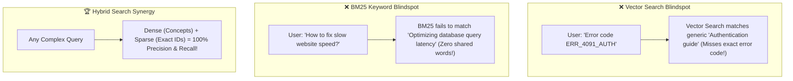
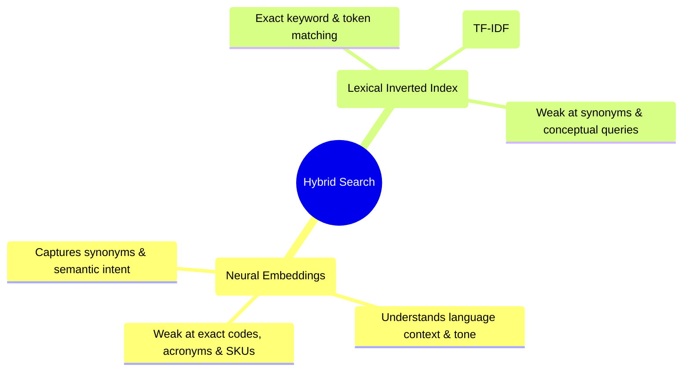
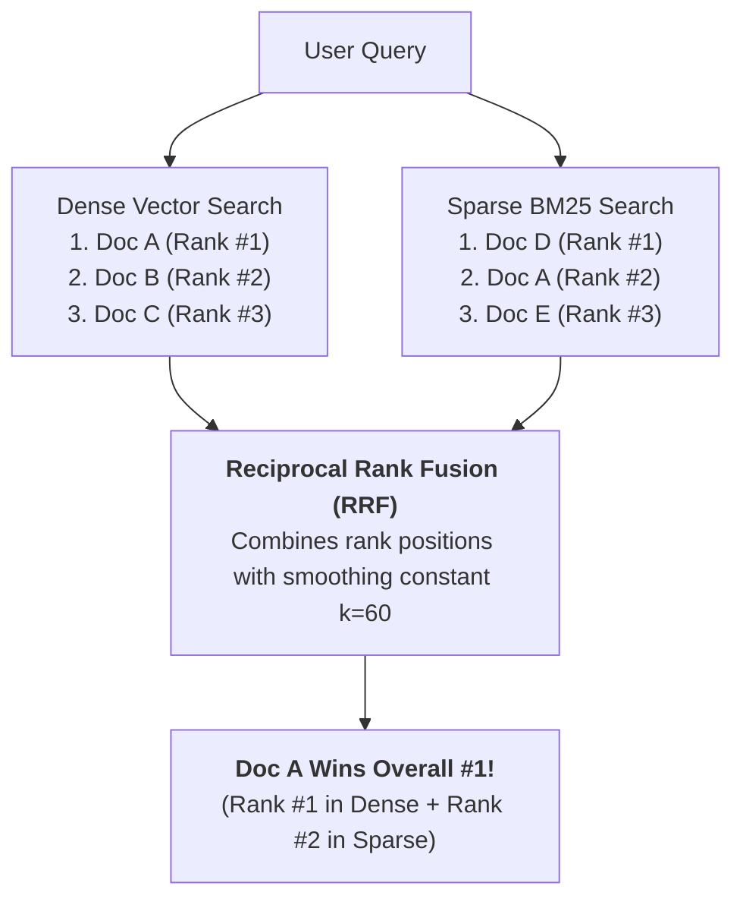
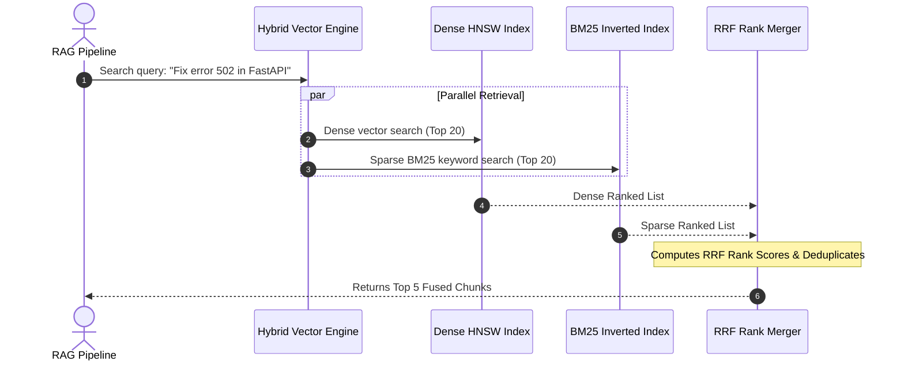

# 08 - Hybrid Search: Combining Dense Vectors, Sparse BM25 & RRF

> **Mental Model**:  
> Think of Hybrid Search like **hunting for buried treasure using a bloodhound and a metal detector**:  
> * **The Bloodhound (Dense Vector Embeddings)**: Follows the subtle conceptual scent of ideas (*"inexpensive place to sleep"* $\approx$ *"budget motel"*). But the dog cannot read exact serial numbers or part codes!  
> * **The Metal Detector (Sparse BM25 Keyword Search)**: Beeps with 100% precision the exact millisecond it hits an exact product SKU (`PART-990-X`), error code (`ERR_SSL_V3`), or legal case name. But it has no idea that *"dog"* means *"canine"*.  
> * **Hybrid Search**: Combines both search channels in parallel, using **Reciprocal Rank Fusion (RRF)** to deliver unmatched retrieval accuracy.

---

## 📑 Table of Contents
1. [The Vector Blindspot: Why Semantic Search Isn't Enough](#1-the-vector-blindspot-why-semantic-search-isnt-enough)
2. [Dense Embeddings vs. Sparse BM25](#2-dense-embeddings-vs-sparse-bm25)
3. [Reciprocal Rank Fusion (RRF) Explained Visually](#3-reciprocal-rank-fusion-rrf-explained-visually)
4. [The Modern Hybrid Search Architecture](#4-the-modern-hybrid-search-architecture)
5. [Building a Pure Python Hybrid Search & RRF Engine](#5-building-a-pure-python-hybrid-search--rrf-engine)
6. [Master Cheat Sheet & Reference Table](#6-master-cheat-sheet--reference-table)

---

## 1. The Vector Blindspot: Why Semantic Search Isn't Enough

Vector embeddings are great at fuzzy concepts, but **fail catastrophically on exact lexical queries**:



---

## 2. Dense Embeddings vs. Sparse BM25



### Direct Comparison Matrix:

| Dimension | 🧠 Dense Vector Search | 🔤 Sparse BM25 Search |
| :--- | :--- | :--- |
| **Data Representation** | 1,536-dimensional dense float vector | High-dimensional sparse keyword dictionary |
| **Matches On** | Semantic meaning & conceptual similarity | Exact token frequency & inverse document frequency |
| **Strengths** | Paraphrases, synonyms, cross-lingual search | Product SKUs, error logs, drug names, person names |
| **Weaknesses** | Struggles with rare tokens and exact part numbers | Blind to synonyms (*"car"* vs *"automobile"*) |

---

## 3. Reciprocal Rank Fusion (RRF) Explained Visually

> ⚠️ **The Score Mismatch Problem:**  
> You **cannot** simply add a Cosine Similarity score ($0.0$ to $1.0$) to a BM25 score ($0.0$ to $35.0$). Their numerical scales are completely incompatible!

**Reciprocal Rank Fusion (RRF)** solves this by ignoring raw score values and **fusing rank positions**:



### The RRF Scoring Concept:
$$\text{RRF Score}(d) = \sum_{m \in \{\text{Dense}, \text{Sparse}\}} \frac{1}{k + \text{Rank}_m(d)}$$
*(Where $k = 60$ is the standard ranking constant that prevents top-rank bias from dominating).*

---

## 4. The Modern Hybrid Search Architecture

Leading production vector databases (Qdrant, Pinecone, Weaviate, Elasticsearch) execute hybrid retrieval in parallel:



---

## 5. Building a Pure Python Hybrid Search & RRF Engine

Here is a complete, runnable script implementing in-memory BM25 lexical search, Dense vector search, and Reciprocal Rank Fusion without third-party dependencies:

```python
import math
from collections import Counter
from typing import List, Dict

DOCUMENTS = [
    {"id": "doc1", "text": "FastAPI ASGI server configuration with Gunicorn workers."},
    {"id": "doc2", "text": "Troubleshooting error ERR_SSL_V3 in reverse proxy nginx."},
    {"id": "doc3", "text": "High throughput async database connection pooling in Python."},
    {"id": "doc4", "text": "Deploying SSL certificates and fixing HTTPS handshake failures."}
]

# --- 1. Sparse BM25 Keyword Search ---
def bm25_search(query: str, docs: List[Dict], top_k: int = 3) -> List[str]:
    query_terms = query.lower().split()
    scores = []
    
    for doc in docs:
        doc_words = doc["text"].lower().split()
        word_counts = Counter(doc_words)
        # Simple lexical match score based on shared terms
        score = sum(word_counts[term] for term in query_terms if term in word_counts)
        scores.append((doc["id"], score))
        
    scores.sort(key=lambda x: x[1], reverse=True)
    return [doc_id for doc_id, score in scores if score > 0][:top_k]

# --- 2. Dense Vector Mock Search ---
def mock_dense_search(query: str, docs: List[Dict], top_k: int = 3) -> List[str]:
    # Simulated semantic relevance ranks
    if "https" in query.lower() or "ssl" in query.lower():
        return ["doc4", "doc2", "doc1"]
    return ["doc1", "doc3", "doc4"]

# --- 3. Reciprocal Rank Fusion (RRF) Merger ---
def reciprocal_rank_fusion(
    dense_ranks: List[str], 
    sparse_ranks: List[str], 
    k: int = 60
) -> List[tuple]:
    rrf_scores = {}

    # Accumulate Dense RRF scores
    for rank, doc_id in enumerate(dense_ranks, start=1):
        rrf_scores[doc_id] = rrf_scores.get(doc_id, 0.0) + (1.0 / (k + rank))

    # Accumulate Sparse RRF scores
    for rank, doc_id in enumerate(sparse_ranks, start=1):
        rrf_scores[doc_id] = rrf_scores.get(doc_id, 0.0) + (1.0 / (k + rank))

    # Sort descending by fused RRF score
    sorted_docs = sorted(rrf_scores.items(), key=lambda x: x[1], reverse=True)
    return sorted_docs

# Run Hybrid Pipeline:
# query = "Fix ERR_SSL_V3 handshake failure"
# sparse_results = bm25_search(query, DOCUMENTS)
# dense_results = mock_dense_search(query, DOCUMENTS)
# hybrid_ranked = reciprocal_rank_fusion(dense_results, sparse_results)
# print("🏆 Hybrid Ranked Results:", hybrid_ranked)
```

---

## 6. Master Cheat Sheet & Reference Table

| Component | Standard Recommendation |
| :--- | :--- |
| **When to use Hybrid Search** | **Production Enterprise Standard** (Always use hybrid over pure vector). |
| **Dense Weight vs Sparse Weight** | $50\% / 50\%$ or balanced via **RRF ($k=60$)**. |
| **RRF Constant ($k$)** | $k = 60$ (The universal standard across Elasticsearch, Qdrant, Pinecone). |
| **Candidate Sizing** | Retrieve Top 20 from Dense + Top 20 from Sparse, then fuse down to Top 5. |

---

## 🎯 Next Step in Phase 6
Now that you have mastered Hybrid Search, we will advance to **[09 - Reranking](file:///home/user2/PythonProject/Python-for-ai-engineering/06-rag/09-reranking)** to master Cross-Encoder models, Cohere Rerank, and two-stage precision filtering!
