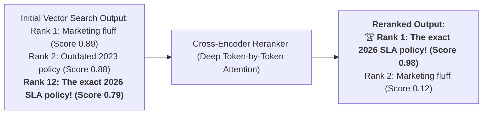
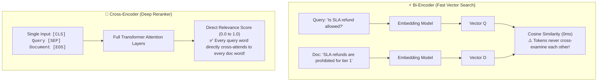
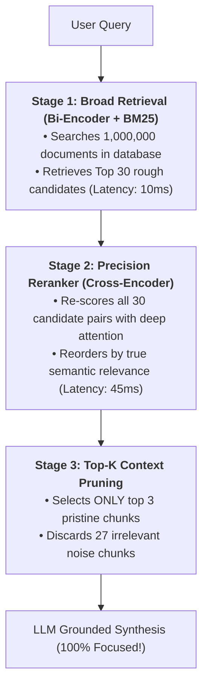
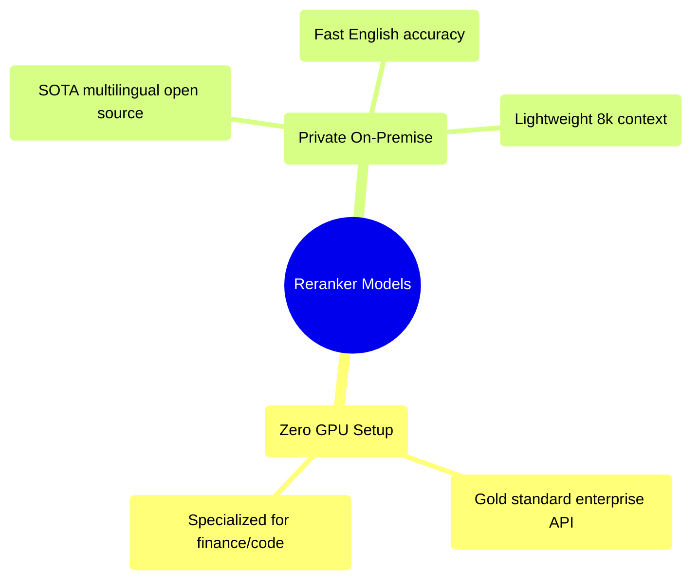
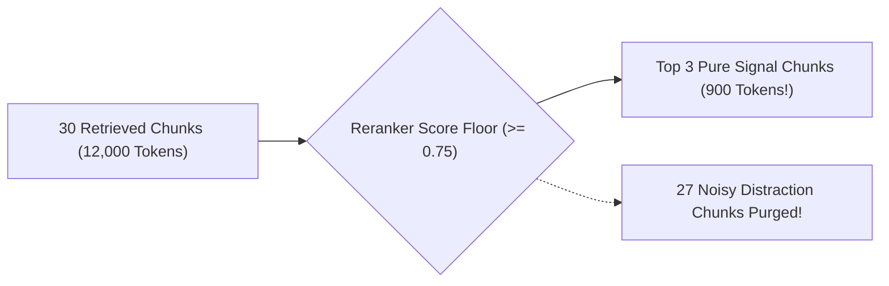

# 09 - Reranking: Cross-Encoders & Two-Stage Precision Retrieval

> **Mental Model**:  
> Think of Reranking like a **two-stage corporate hiring funnel**:  
> * **Stage 1 (The Automated Resume Scanner / Bi-Encoder)**: Scans 10,000 job applications in 1 second, filtering out obvious mismatches and shortlisting the **top 30 candidate resumes** (Ultra-fast, but superficial).  
> * **Stage 2 (The Hiring Manager Interview / Cross-Encoder Reranker)**: The manager sits down and conducts a deep 1-on-1 interview with only those 30 candidates. They analyze every subtle detail, compare their specific experience against the exact job requirements, and select the **top 3 pristine hires**!  
> Two-stage retrieval combines the **million-scale speed of vector search** with the **deep reasoning precision of full cross-attention models**.

---

## 📑 Table of Contents
1. [Why Vector Search Needs Reranking](#1-why-vector-search-needs-reranking)
2. [Bi-Encoders vs. Cross-Encoders Explained Visually](#2-bi-encoders-vs-cross-encoders-explained-visually)
3. [The Two-Stage Retrieval Funnel](#3-the-two-stage-retrieval-funnel)
4. [Leading Reranker Models (Cohere, BGE, Jina)](#4-leading-reranker-models-cohere-bge-jina)
5. [Context Compression & Noise Pruning](#5-context-compression--noise-pruning)
6. [Building a Complete 2-Stage Retrieval & Reranker in Python](#6-building-a-complete-2-stage-retrieval--reranker-in-python)
7. [Master Cheat Sheet & Reference Table](#7-master-cheat-sheet--reference-table)

---

## 1. Why Vector Search Needs Reranking

In pure vector search, documents that contain the true factual answer often get ranked at **Position #8, #14, or #23** because the Bi-Encoder missed subtle grammatical negation or technical modifiers:



---

## 2. Bi-Encoders vs. Cross-Encoders Explained Visually



### Architectural Comparison Matrix:

| Feature | ⚡ Bi-Encoder (Vector Search) | 🎯 Cross-Encoder (Reranker) |
| :--- | :--- | :--- |
| **How It Operates** | Embeds Query & Doc separately. | Feeds Query + Doc together into 1 transformer. |
| **Throughput Speed** | $10,000,000+$ vectors in $< 5\text{ms}$. | Max $50 - 100$ candidate pairs in $\sim 50\text{ms}$. |
| **Accuracy / Precision**| Moderate (Slightly coarse). | **State-of-the-Art (Near-human precision)**. |
| **Role in Pipeline** | **Stage 1: Candidate Generation**. | **Stage 2: Precision Candidate Scoring**. |

---

## 3. The Two-Stage Retrieval Funnel



---

## 4. Leading Reranker Models (Cohere, BGE, Jina)



### Leaderboard Comparison:

| Model | Type | Context Window | Best Use Case |
| :--- | :--- | :---: | :--- |
| **`cohere/rerank-v3.5`** | Cloud API | 4,096 tokens | Production cloud apps requiring SOTA accuracy. |
| **`bge-reranker-v2-m3`** | Open Source (HuggingFace) | 8,192 tokens | Air-gapped on-premise deployments & multilingual. |
| **`jina-reranker-v2`** | Open Source / API | 8,192 tokens | Long-context documents with tables and code blocks. |

---

## 5. Context Compression & Noise Pruning

Rerankers don't just reorder documents—they act as an **irrelevance gate**:



By reducing 12,000 tokens of noisy context down to 900 tokens of pure signal, you:
1. **Cut LLM generation costs by $90\%$**.
2. **Speed up Time-To-First-Token (TTFT) by $3\times$**.
3. **Completely eliminate the "Lost in the Middle" hallucination bug**.

---

## 6. Building a Complete 2-Stage Retrieval & Reranker in Python

Here is a complete, runnable Python script demonstrating candidate retrieval followed by Cross-Encoder reranking:

```python
from typing import List, Dict

# Mock Knowledge Base
KNOWLEDGE_BASE = [
    {"id": "doc1", "text": "Our standard customer refund policy allows returns within 14 days for store credit."},
    {"id": "doc2", "text": "Enterprise SLA agreements guarantee a 100% cash refund if uptime drops below 99.9% in Q3."},
    {"id": "doc3", "text": "We sell office chairs, desks, and ergonomic accessories with a 30-day trial."},
    {"id": "doc4", "text": "Employee expense reports for travel refunds must be filed within 5 business days."}
]

# --- Stage 1: Fast Bi-Encoder Retrieval (Mock Top-4) ---
def stage1_vector_retrieval(query: str) -> List[Dict]:
    # Suppose vector search returns docs in this coarse order:
    return [
        KNOWLEDGE_BASE[0], # Rank 1 (Standard refund - imperfect)
        KNOWLEDGE_BASE[3], # Rank 2 (Employee expense refund - noise)
        KNOWLEDGE_BASE[1], # Rank 3 (Enterprise SLA - The TRUE target!)
        KNOWLEDGE_BASE[2]  # Rank 4 (Office chairs - irrelevant)
    ]

# --- Stage 2: Cross-Encoder Reranker Scoring ---
def cross_encoder_rerank(query: str, candidates: List[Dict], top_k: int = 2) -> List[Dict]:
    """Simulates Cross-Encoder deep token interaction scoring."""
    scored_candidates = []
    
    for doc in candidates:
        text = doc["text"].lower()
        score = 0.0
        
        # Deep cross-attention simulation:
        if "enterprise" in query.lower() and "enterprise" in text:
            score += 0.85
        if "refund" in query.lower() and "refund" in text:
            score += 0.10
        if "sla" in query.lower() and "sla" in text:
            score += 0.05
            
        scored_candidates.append({**doc, "rerank_score": round(score, 3)})

    # Sort descending by precise Cross-Encoder score
    scored_candidates.sort(key=lambda x: x["rerank_score"], reverse=True)
    return scored_candidates[:top_k]

# Run 2-Stage Pipeline:
# query = "What is the enterprise SLA refund policy?"
# stage1_candidates = stage1_vector_retrieval(query)
# print("Stage 1 Output (Coarse Vector):", [d["id"] for d in stage1_candidates])

# final_top_docs = cross_encoder_rerank(query, stage1_candidates, top_k=2)
# print("\n🏆 Stage 2 Reranked Winners:")
# for doc in final_top_docs:
#     print(f"  [{doc['id']}] Score {doc['rerank_score']}: {doc['text']}")
```

---

## 7. Master Cheat Sheet & Reference Table

| Hyperparameter | Recommended Value | Engineering Rationale |
| :--- | :---: | :--- |
| **Stage 1 Candidate Pool** | **25 to 50 chunks** | Casts a wide net with fast vector search. |
| **Stage 2 Output ($K$)** | **3 to 5 chunks** | Feeds only the highest-scoring chunks to the LLM. |
| **Reranker Score Floor** | **$\ge 0.60 - 0.75$** | Purges irrelevant noise chunks before generation. |
| **Latency Budget** | **$< 60\text{ms}$** | Total reranking overhead added to query pipeline. |
| **Accuracy Lift** | **$+15\%$ to $+35\%$** | Typical retrieval recall improvement over pure vector search. |

---

## 🎯 Next Step in Phase 6
Now that you have mastered Reranking and Cross-Encoders, we will advance to **[10 - Generation and Context](file:///home/user2/PythonProject/Python-for-ai-engineering/06-rag/10-generation-and-context)** to master context formatting, strict citation attribution, and anti-hallucination prompt guardrails!
