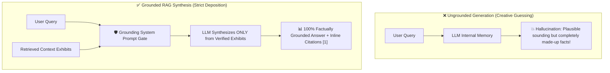
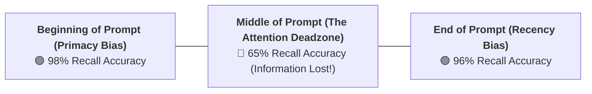
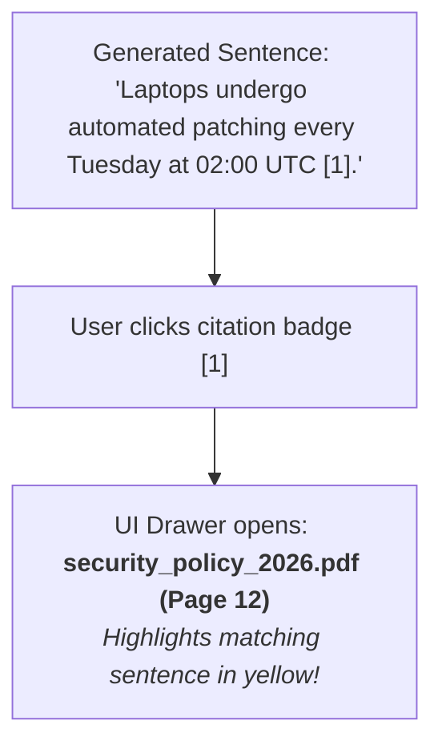

# 10 - Generation & Context Injection: Grounded Synthesis & Citations

> **Mental Model**:  
> Think of RAG Generation like a **witness testifying in a strict courtroom legal deposition**:  
> * **The Creative Novelist (Ungrounded Base LLM)**: When asked a question, a novelist invents compelling details, dates, and names out of thin air to sound convincing (Hallucination!).  
> * **The Sworn Witness (Grounded RAG Assistant)**: The witness is placed under oath and handed **Exhibits A, B, and C (The Retrieved Context Chunks)**.  
> * Every single statement they make must point directly to an exhibit (**`[Doc 1, Page 4]`**).  
> * If the exhibits do not mention the answer, the witness is legally required to answer: *"The provided exhibits do not contain this information."*

---

## 📑 Table of Contents
1. [The Grounded Synthesis Paradigm](#1-the-grounded-synthesis-paradigm)
2. [Defeating the 'Lost in the Middle' Attention Trap](#2-defeating-the-lost-in-the-middle-attention-trap)
3. [The Canonical Enterprise RAG Prompt Blueprint](#3-the-canonical-enterprise-rag-prompt-blueprint)
4. [Strict Citation & Source Attribution Protocols](#4-strict-citation--source-attribution-protocols)
5. [Graceful Refusal & Anti-Hallucination Guardrails](#5-graceful-refusal--anti-hallucination-guardrails)
6. [Building a Grounded Synthesis Engine in Python](#6-building-a-grounded-synthesis-engine-in-python)
7. [Master Cheat Sheet & Reference Table](#7-master-cheat-sheet--reference-table)

---

## 1. The Grounded Synthesis Paradigm

Generating an answer in RAG is **not an open-ended brainstorming task**—it is a **constrained reading comprehension synthesis**:



---

## 2. Defeating the 'Lost in the Middle' Attention Trap

In transformer language models, **attention is U-shaped**:



### The 3 Anti-Deadzone Engineering Rules:
1. **Never inject instructions at the top and context at the bottom**: Always place your critical task instructions **at the very end** right after the context!
2. **Re-order Chunks Strategically**: Put the #1 highest-relevance chunk at the **very top** of `<context>`, and the #2 highest-relevance chunk at the **very bottom**.
3. **Keep Context Trim**: Never dump 30 chunks into a prompt; prune aggressively down to the **top 3 to 5 chunks**.

---

## 3. The Canonical Enterprise RAG Prompt Blueprint

Here is the battle-tested system prompt architecture used by enterprise AI teams:

```text
You are a precise, factual enterprise knowledge assistant.

Your task is to answer the user's question STRICTLY and ONLY using the verified context documents provided inside the <context> tags below.

CRITICAL RULES:
1. Do NOT use any prior outside knowledge or assumptions.
2. If the answer cannot be directly determined from the provided context, you MUST state: "Based on the provided documents, I do not have enough information to answer this question."
3. Every factual assertion MUST include an inline citation pointing to the document index, e.g., [1] or [2].
4. Do not invent or extrapolate beyond what is explicitly written in the text.

<context>
<document index="1" source="security_policy_2026.pdf" page="12">
All employee laptops must use FileVault disk encryption and undergo automated vulnerability patching every Tuesday at 02:00 UTC.
</document>

<document index="2" source="onboarding_guide.md" page="3">
New engineers are granted standard repository access within 24 hours of completing compliance training.
</document>
</context>

<user_question>
When do laptop security patches get installed?
</user_question>

Synthesize your grounded response with exact citations:
```

---

## 4. Strict Citation & Source Attribution Protocols

Users only trust AI when they can click and verify the exact claim:



---

## 5. Graceful Refusal & Anti-Hallucination Guardrails

> ⚠️ **The Helpful Assistant Trap:**  
> By default, LLMs hate saying *"I don't know"*. If a question is half-covered in the context, they will happily invent the missing $50\%$ to be "helpful".

### Strict Refusal Enforcement:
```text
NEGATIVE CONSTRAINT:
If the text says "Engineers receive MacBooks", and the user asks "What color are the MacBooks?", you MUST REFUSE to answer the color because the context does not specify it, even if you know Apple MacBooks are typically silver!
```

---

## 6. Building a Grounded Synthesis Engine in Python

Here is a complete, runnable Python script using Pydantic Structured Outputs to enforce grounded synthesis, inline citations, and fallback refusal detection:

```python
from pydantic import BaseModel, Field
from openai import OpenAI
import os

client = OpenAI(api_key=os.getenv("OPENAI_API_KEY", "mock-key"))

# --- Structured Output Schema ---
class GroundedAnswer(BaseModel):
    answer: str = Field(description="The factual answer synthesized strictly from context.")
    citations: list[int] = Field(description="List of document index numbers cited in the answer.")
    has_sufficient_context: bool = Field(description="False if the documents did not contain enough info.")

def generate_grounded_response(
    query: str, 
    context_chunks: list[dict]
) -> GroundedAnswer:
    # 1. Format XML context container
    formatted_docs = []
    for i, doc in enumerate(context_chunks, start=1):
        formatted_docs.append(
            f'<document index="{i}" source="{doc["source"]}">\n{doc["text"]}\n</document>'
        )
    context_str = "\n\n".join(formatted_docs)

    # 2. Assemble Grounded Prompt
    prompt = f"""Answer the question strictly using the provided context. Include inline citations like [1].
If the context is insufficient, set has_sufficient_context to False.

<context>
{context_str}
</context>

<question>
{query}
</question>"""

    # 3. Call OpenAI with Structured Output Parse
    completion = client.beta.chat.completions.parse(
        model="gpt-4o-mini",
        messages=[
            {"role": "system", "content": "You are a strict legal-style grounded RAG assistant."},
            {"role": "user", "content": prompt}
        ],
        response_format=GroundedAnswer,
        temperature=0.0 # Deterministic grounding!
    )
    return completion.choices[0].message.parsed

# Test Case:
# sample_context = [
#     {"source": "sla.pdf", "text": "Enterprise clients receive a 100% refund within 30 days of contract signing."},
#     {"source": "faq.md", "text": "Support hours are 9am to 5pm EST Monday through Friday."}
# ]
# res = generate_grounded_response("What is the refund SLA for Enterprise?", sample_context)
# print("Answer:", res.answer)
# print("Citations:", res.citations)
# print("Sufficient Context:", res.has_sufficient_context)
```

---

## 7. Master Cheat Sheet & Reference Table

| Rule / Setting | Production Standard |
| :--- | :--- |
| **Temperature** | **`temperature = 0.0`** (Mandatory for deterministic factual grounding). |
| **Instructions Position** | Place critical negative constraints **after** `<context>` to exploit recency bias. |
| **Citation Format** | Standard bracketed indices `[1]`, `[2]` mapped to metadata dictionaries. |
| **Chunk Count ($K$)** | Keep $K \le 5$ to prevent falling into the "Lost in the Middle" deadzone. |
| **Refusal Protocol** | Explicit standard sentence: *"Based on the provided documents, I do not have enough information."* |

---

## 🎯 Next Step in Phase 6
Now that you have mastered grounded generation and context injection, we will advance to **[11 - RAG Quality Evaluation](file:///home/user2/PythonProject/Python-for-ai-engineering/06-rag/11-rag-quality)** to master the Ragas evaluation framework, Faithfulness, Context Precision, and Answer Relevance!
