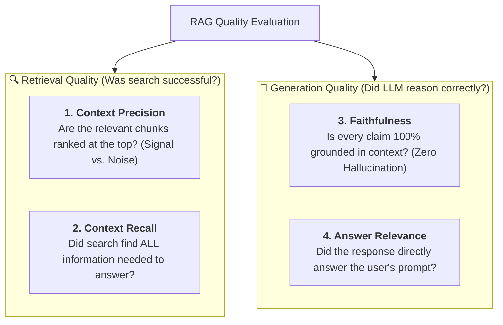
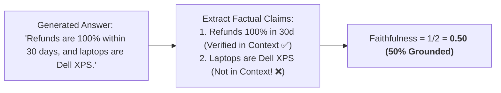
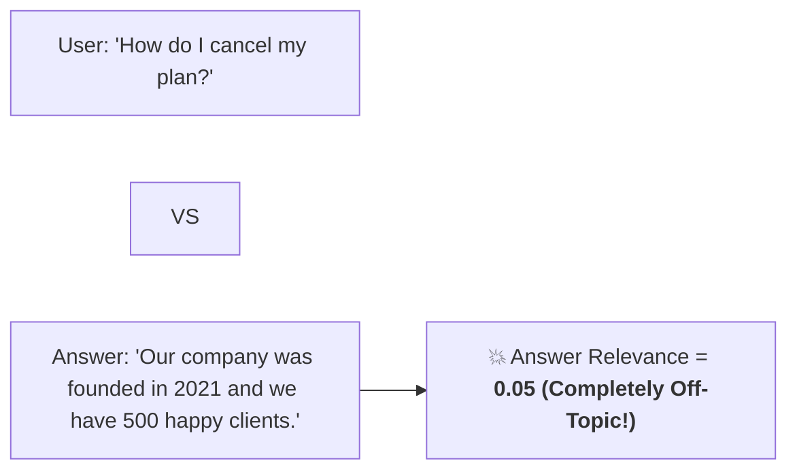
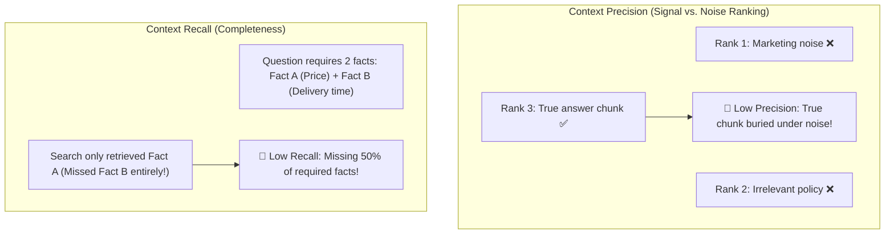
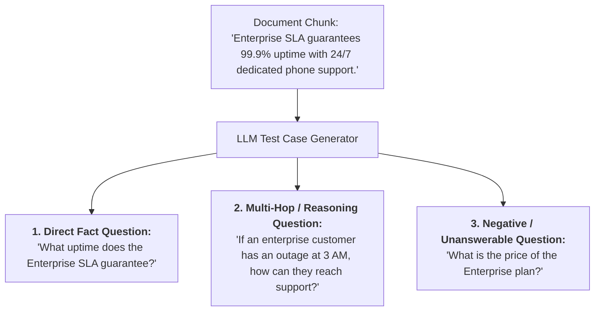

# 11 - RAG Quality & Evaluation: The Ragas Metrics Framework

> **Mental Model**:  
> Think of RAG Quality Evaluation like a **4-pillar aerospace inspection laboratory**:  
> * When an aircraft engine sputters, you don't just say *"the flight was bad"*—you isolate the fuel injectors, the turbine blades, the electrical sensors, and the cooling pumps independently.  
> * When a RAG system gives a bad answer, you must diagnose whether it was a **Retrieval failure** (bad search) or a **Generation failure** (LLM hallucination).  
> * The **Ragas Evaluation Framework** measures 4 independent pillars to pinpoint the exact failure point with scientific precision.

---

## 📑 Table of Contents
1. [The 4 Pillars of RAG Evaluation (The Ragas Framework)](#1-the-4-pillars-of-rag-evaluation-the-ragas-framework)
2. [Generation Metrics: Faithfulness & Answer Relevance](#2-generation-metrics-faithfulness--answer-relevance)
3. [Retrieval Metrics: Context Precision & Context Recall](#3-retrieval-metrics-context-precision--context-recall)
4. [Diagnostic Decision Matrix: Pinpointing Failure Roots](#4-diagnostic-decision-matrix-pinpointing-failure-roots)
5. [Generating Synthetic Golden Datasets](#5-generating-synthetic-golden-datasets)
6. [Building an Automated RAG Quality Evaluator in Python](#6-building-an-automated-rag-quality-evaluator-in-python)
7. [Master Cheat Sheet & Reference Table](#7-master-cheat-sheet--reference-table)

---

## 1. The 4 Pillars of RAG Evaluation (The Ragas Framework)



---

## 2. Generation Metrics: Faithfulness & Answer Relevance

### 1️⃣ Faithfulness (Anti-Hallucination Score):
Measures the relationship between the **Generated Answer** and the **Retrieved Context**:



### 2️⃣ Answer Relevance (Prompt Directness):
Measures whether the generated answer **directly addresses the user's question** without wandering off-topic:



---

## 3. Retrieval Metrics: Context Precision & Context Recall



---

## 4. Diagnostic Decision Matrix: Pinpointing Failure Roots

Use this matrix to identify the exact architectural component to fix:

| Symptom / Low Metric | Root Cause | Engineering Solution |
| :--- | :--- | :--- |
| **Low Context Recall** | Search missed the relevant document. | • Implement **Hybrid Search (BM25 + Dense)**.<br>• Use **Multi-Query Expansion** or **HyDE**.<br>• Increase chunk overlap ($15\% \rightarrow 25\%$). |
| **Low Context Precision** | Relevant document was retrieved, but ranked at #15. | • Add a **Cross-Encoder Reranker (Cohere/BGE)**.<br>• Tune HNSW index parameters. |
| **Low Faithfulness** | LLM hallucinated claims not in documents. | • Set `temperature = 0.0`.<br>• Enforce strict XML `<context>` prompt delimiters.<br>• Add explicit refusal instructions. |
| **Low Answer Relevance** | LLM gave a factual but unhelpful response. | • Refine system prompt instructions.<br>• Use Few-Shot exemplars for desired answer format. |

---

## 5. Generating Synthetic Golden Datasets

Creating 500 evaluation questions manually takes weeks of human effort.  
You can use an LLM to generate a **Synthetic Golden Dataset** from your document chunks:



---

## 6. Building an Automated RAG Quality Evaluator in Python

Here is a complete, runnable Python script implementing LLM-as-a-Judge evaluators for **Faithfulness** and **Answer Relevance**:

```python
from openai import OpenAI
from pydantic import BaseModel, Field
import os

client = OpenAI(api_key=os.getenv("OPENAI_API_KEY", "mock-key"))

# --- Schema for Faithfulness Evaluation ---
class FaithfulnessJudge(BaseModel):
    claims: list[str] = Field(description="Individual factual claims extracted from the answer.")
    supported_claims: list[str] = Field(description="Claims that are strictly supported by the context.")
    score: float = Field(description="Fraction of supported claims (0.0 to 1.0).")
    explanation: str

def evaluate_faithfulness(context: str, answer: str) -> FaithfulnessJudge:
    """Evaluates whether the generated answer contains hallucinations."""
    prompt = f"""You are an impartial evaluation judge. Analyze the provided Answer against the Context.
1. Extract all factual claims made in the Answer.
2. Check if each claim is directly supported by the Context.
3. Calculate the faithfulness score = (supported_claims / total_claims).

<context>
{context}
</context>

<answer>
{answer}
</answer>"""

    res = client.beta.chat.completions.parse(
        model="gpt-4o-mini",
        messages=[{"role": "user", "content": prompt}],
        response_format=FaithfulnessJudge,
        temperature=0.0
    )
    return res.choices[0].message.parsed

# Test Case:
# sample_context = "Enterprise contracts allow a full refund within 30 days of signing."
# sample_answer = "You get a 100% refund in 30 days, and our support team works from London."
#
# result = evaluate_faithfulness(sample_context, sample_answer)
# print("Faithfulness Score:", result.score)
# print("Supported:", result.supported_claims)
# print("Explanation:", result.explanation)
```

---

## 7. Master Cheat Sheet & Reference Table

| Ragas Metric | Target Production Threshold | Target Pipeline Stage |
| :--- | :---: | :--- |
| **Faithfulness** | **$\ge 0.95$** | Generation (Anti-Hallucination) |
| **Answer Relevance** | **$\ge 0.85$** | Generation (Prompt Alignment) |
| **Context Precision** | **$\ge 0.85$** | Retrieval (Reranking / Top-K) |
| **Context Recall** | **$\ge 0.90$** | Retrieval (Hybrid Search & Chunking) |

---

## 🎯 Next Step in Phase 6
Now that you have mastered RAG Quality and Evaluation metrics, we will advance to the final topic of Phase 6: **[12 - RAG Security](file:///home/user2/PythonProject/Python-for-ai-engineering/06-rag/12-rag-security)** to master Indirect Prompt Injections, Document Poisoning Defense, and Multi-Tenant Access Control!
