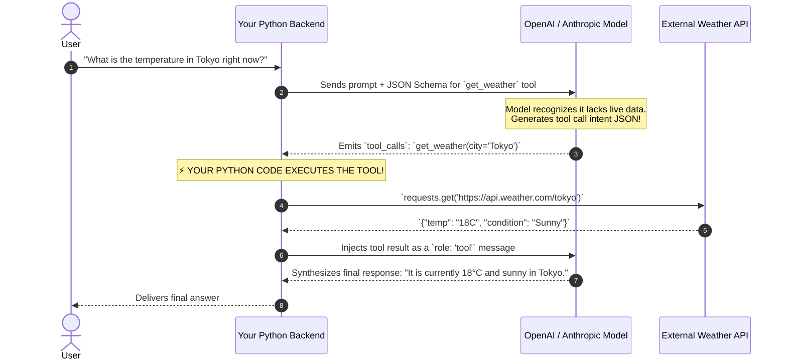
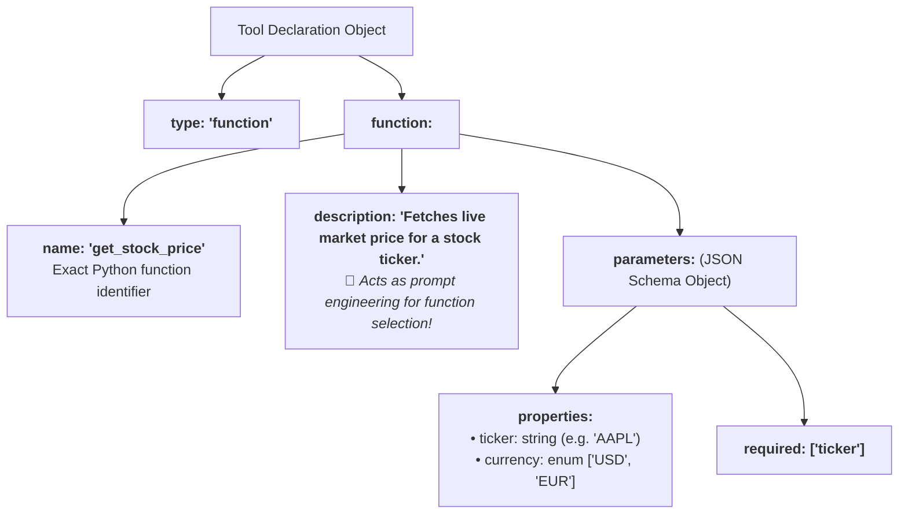
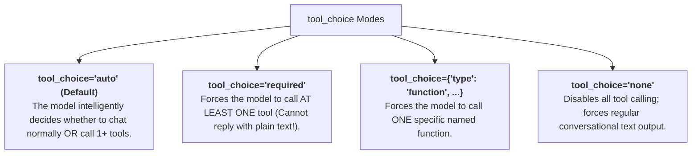
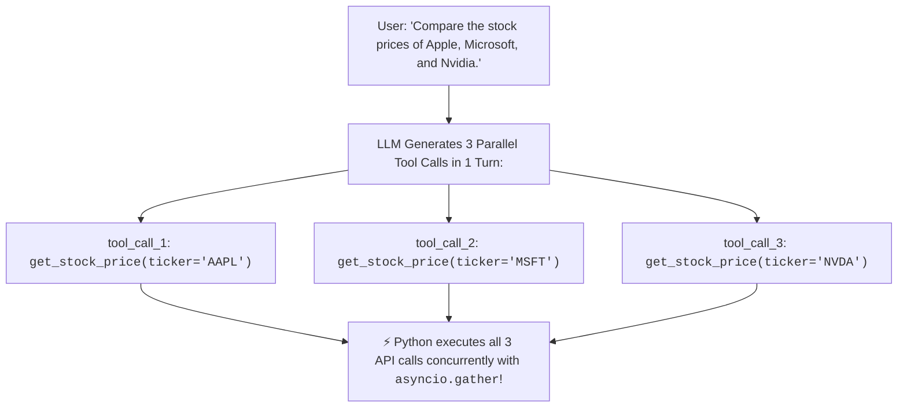

# 01 - Tool Calling Fundamentals: JSON Schemas & Model Intent

> **Welcome to Phase 7: Tools & Autonomous Agents!**  
> **Mental Model**:  
> Think of Tool Calling like a **brilliant strategist working with a robotic field assistant**:  
> * **The LLM (The Strategist)**: Has encyclopedic reasoning ability, but is physically trapped in a dark room with **no internet access, no database connection, and no calculator**.  
> * **The Big Myth**: The LLM *does NOT execute your Python code on its servers!*  
> * **The Reality (Tool Calling)**: When you provide a list of available tools, the LLM recognizes when it needs external information. It pauses text generation and outputs a **structured JSON blueprint** (*"Please execute `fetch_weather(city='Tokyo')`"*).  
> * **Your Python Runtime (The Robotic Hands)**: Reads the LLM's blueprint, executes the actual Python function, and feeds the results back to the LLM to synthesize the final answer.

---

## 📑 Table of Contents
1. [The Cardinal Law: LLMs Don't Run Code](#1-the-cardinal-law-llms-dont-run-code)
2. [The Anatomy of a JSON Schema Tool Declaration](#2-the-anatomy-of-a-json-schema-tool-declaration)
3. [Controlling Execution with tool_choice](#3-controlling-execution-with-tool_choice)
4. [Single vs. Parallel Tool Calling](#4-single-vs-parallel-tool-calling)
5. [Auto-Generating Tool Schemas from Pydantic in Python](#5-auto-generating-tool-schemas-from-pydantic-in-python)
6. [Master Cheat Sheet & Reference Table](#6-master-cheat-sheet--reference-table)

---

## 1. The Cardinal Law: LLMs Don't Run Code



---

## 2. The Anatomy of a JSON Schema Tool Declaration

To teach an LLM what tools it can call, you provide an array of **OpenAPI-compliant JSON Schema objects**:



### The JSON Schema Specification:
```python
TOOLS_SCHEMA = [
    {
        "type": "function",
        "function": {
            "name": "get_stock_price",
            "description": "Retrieves the real-time trading price and currency for a stock ticker.",
            "parameters": {
                "type": "object",
                "properties": {
                    "ticker": {
                        "type": "string",
                        "description": "The equity ticker symbol, e.g. AAPL, NVDA, TSLA."
                    },
                    "currency": {
                        "type": "string",
                        "enum": ["USD", "EUR", "GBP"],
                        "default": "USD",
                        "description": "Target fiat currency code."
                    }
                },
                "required": ["ticker"]
            }
        }
    }
]
```

---

## 3. Controlling Execution with `tool_choice`

You can control *if* and *how* the LLM selects tools using the **`tool_choice`** parameter:



### `tool_choice` Quick Reference:

| `tool_choice` Setting | Model Behavior | Best Use Case |
| :--- | :--- | :--- |
| **`"auto"`** | Model chooses between direct text reply or calling tools. | Standard conversational assistants. |
| **`"required"`** | Model **must** call a tool; cannot generate plain text. | Data extraction pipelines, agent step loops. |
| **`{"name": "func_name"}`** | Model **must** call this exact specific tool. | Forced single-step workflows (e.g. form filling). |
| **`"none"`** | Model ignores tools and only writes regular text. | Temporarily disabling tools during error states. |

---

## 4. Single vs. Parallel Tool Calling

Modern frontier models support **Parallel Tool Calling**, generating multiple independent tool invocations in a single response turn:



---

## 5. Auto-Generating Tool Schemas from Pydantic in Python

Writing JSON Schema dictionaries manually is tedious and error-prone. Use **Pydantic** to auto-generate schemas:

```python
from pydantic import BaseModel, Field
from openai import OpenAI
import json
import os

client = OpenAI(api_key=os.getenv("OPENAI_API_KEY", "mock-key"))

# 1. Define Tool Arguments Schema in Pydantic
class StockPriceArgs(BaseModel):
    ticker: str = Field(description="The stock ticker symbol, e.g. AAPL or MSFT.")
    include_volume: bool = Field(default=False, description="Whether to include daily trading volume.")

# 2. Convert to OpenAI Tool Definition
stock_tool = {
    "type": "function",
    "function": {
        "name": "get_stock_price",
        "description": "Fetch real-time stock valuation and pricing.",
        "parameters": StockPriceArgs.model_json_schema()
    }
}

# 3. Submit Request to LLM with Tool Definition
def test_tool_calling(user_prompt: str):
    response = client.chat.completions.create(
        model="gpt-4o-mini",
        messages=[{"role": "user", "content": user_prompt}],
        tools=[stock_tool],
        tool_choice="auto"
    )

    message = response.choices[0].message
    if message.tool_calls:
        print(f"🤖 LLM requested {len(message.tool_calls)} tool call(s):")
        for tool_call in message.tool_calls:
            print(f"  • Tool: {tool_call.function.name}")
            print(f"  • Arguments JSON: {tool_call.function.arguments}")
            args = json.loads(tool_call.function.arguments)
            print(f"  • Parsed Python dict: {args}")
    else:
        print(f"💬 Direct text reply: {message.content}")

# Test Tool Invocation:
# test_tool_calling("What is Apple's current stock price?")
```

---

## 6. Master Cheat Sheet & Reference Table

| Parameter / Object | Role in Tool Calling |
| :--- | :--- |
| **`tools=[...]`** | Array of available function schemas passed to the LLM. |
| **`tool_calls`** | Array of requested tool executions returned inside `response.choices[0].message`. |
| **`tool_call.id`** | Unique tracking ID (e.g. `call_abc123`) used to link tool outputs. |
| **`tool_call.function.arguments`**| Stringified JSON containing the validated arguments. |
| **`tool_choice="auto"`** | Allows the model to autonomously decide when to invoke tools. |

---

## 🎯 Next Step in Phase 7
Now that you understand tool declarations and JSON schemas, we will advance to **[02 - Tool Calling Flow](file:///home/user2/PythonProject/Python-for-ai-engineering/07-tools-agents/02-tool-calling-flow)** to master the multi-turn conversational loop, tool message roles, and roundtrip result injection!
