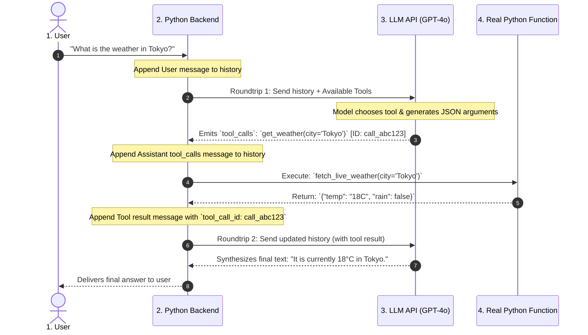
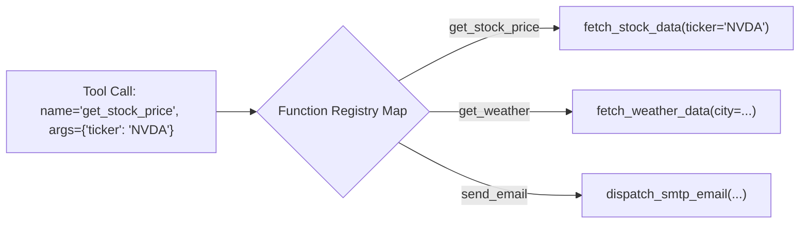
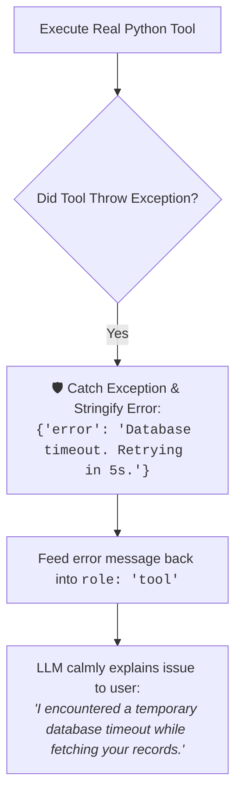

# 02 - Tool Calling Flow: The Multi-Turn Execution Protocol

> **Mental Model**:  
> Think of the Tool Calling Flow like a **4-step mission control radio protocol**:  
> * **Turn 1 (Astronaut / User)**: *"What is the solar panel angle and battery health?"*  
> * **Turn 2 (Flight Commander / LLM)**: Recognizes it needs live telemetry. Radios a specific command to the engineering station: *"Telemetry Sensor, execute `get_telemetry(subsystem='power')` under `call_id: 1042`."*  
> * **Turn 3 (Sensor / Your Python Code)**: Reads the physical voltage meters, formats the reading as JSON (`{"battery": "94%", "panel_angle": "42deg"}`), and radios it back to the commander tagged with `tool_call_id: 1042`.  
> * **Turn 4 (Flight Commander / LLM)**: Reads the telemetry reading and delivers the final spoken answer to the astronaut with complete clarity!

---

## 📑 Table of Contents
1. [The 4-Step Roundtrip Protocol](#1-the-4-step-roundtrip-protocol)
2. [The Message History Sequence (The 4 Roles)](#2-the-message-history-sequence-the-4-roles)
3. [The Tool Execution Dispatcher Pattern](#3-the-tool-execution-dispatcher-pattern)
4. [Handling Tool Failures Gracefully](#4-handling-tool-failures-gracefully)
5. [Building an End-to-End Multi-Turn Tool Runner in Python](#5-building-an-end-to-end-multi-turn-tool-runner-in-python)
6. [Master Cheat Sheet & Reference Table](#6-master-cheat-sheet--reference-table)

---

## 1. The 4-Step Roundtrip Protocol

Tool calling is **never a single API request**—it is a **2-roundtrip conversation**:



---

## 2. The Message History Sequence (The 4 Roles)

To execute a tool call successfully, your `messages` array must accumulate **all 4 turns in strict chronological order**:

```mermaid
flowchart TD
    M1["<b>Turn 1: role: 'user'</b><br><code>{'role': 'user', 'content': 'What is the stock price of Apple?'}</code>"]
    
    --> M2["<b>Turn 2: role: 'assistant' (with tool_calls)</b><br><code>{'role': 'assistant', 'content': None, 'tool_calls': [{'id': 'call_99', 'function': {'name': 'get_stock', 'arguments': '{\"ticker\": \"AAPL\"}'}}]}</code>"]
    
    --> M3["<b>Turn 3: role: 'tool' (The Result)</b><br><code>{'role': 'tool', 'tool_call_id': 'call_99', 'content': '{\"price\": 225.50, \"currency\": \"USD\"}'}</code>"]
    
    --> M4["<b>Turn 4: role: 'assistant' (Final Answer)</b><br><code>{'role': 'assistant', 'content': 'Apple (AAPL) is currently trading at $225.50 USD.'}</code>"]
```

> 🚨 **The Invariant Rule of Tool Messages:**  
> Every `tool_call` ID generated in Turn 2 **MUST have a matching `role: 'tool'` message with the exact same `tool_call_id` in Turn 3**! If you omit Turn 3 or miss an ID, the LLM API will immediately throw an HTTP 400 error.

---

## 3. The Tool Execution Dispatcher Pattern

Instead of giant `if/elif` chains, use a **Centralized Function Dispatch Registry**:



### The Clean Registry Pattern:
```python
import json

def get_stock_price(ticker: str) -> dict:
    return {"ticker": ticker, "price": 128.50, "status": "bullish"}

def get_weather(city: str) -> dict:
    return {"city": city, "temperature": "22C"}

# Centralized Dispatch Registry
TOOL_REGISTRY = {
    "get_stock_price": get_stock_price,
    "get_weather": get_weather
}

def execute_tool(tool_name: str, arguments_json: str) -> str:
    func = TOOL_REGISTRY.get(tool_name)
    if not func:
        return json.dumps({"error": f"Tool '{tool_name}' not found."})
    
    args = json.loads(arguments_json)
    result = func(**args)
    return json.dumps(result)
```

---

## 4. Handling Tool Failures Gracefully

What happens if your external database or weather API crashes during tool execution?

> ⚠️ **The Fatal Crash Anti-Pattern:**  
> Never let Python throw an uncaught exception that crashes the whole backend server!



---

## 5. Building an End-to-End Multi-Turn Tool Runner in Python

Here is a complete, runnable Python script that handles the entire 4-turn roundtrip loop autonomously:

```python
from openai import OpenAI
import json
import os

client = OpenAI(api_key=os.getenv("OPENAI_API_KEY", "mock-key"))

# --- 1. Define Python Functions ---
def get_user_balance(user_id: int) -> dict:
    """Mock database lookup for user balance."""
    mock_balances = {101: 540.00, 202: 1250.50}
    balance = mock_balances.get(user_id)
    if balance is not None:
        return {"user_id": user_id, "balance_usd": balance, "currency": "USD"}
    return {"error": f"User ID {user_id} not found."}

TOOL_REGISTRY = {
    "get_user_balance": get_user_balance
}

# --- 2. Tool Schema Declaration ---
TOOLS = [
    {
        "type": "function",
        "function": {
            "name": "get_user_balance",
            "description": "Look up account wallet balance by user ID.",
            "parameters": {
                "type": "object",
                "properties": {
                    "user_id": {"type": "integer", "description": "The customer account ID."}
                },
                "required": ["user_id"]
            }
        }
    }
]

# --- 3. The 4-Step Roundtrip Controller ---
def run_tool_calling_pipeline(user_query: str):
    messages = [{"role": "user", "content": user_query}]
    print(f"👤 User: {user_query}")

    # Roundtrip 1: LLM decides if it needs tools
    response_1 = client.chat.completions.create(
        model="gpt-4o-mini",
        messages=messages,
        tools=TOOLS,
        tool_choice="auto"
    )
    
    assistant_msg = response_1.choices[0].message
    messages.append(assistant_msg) # Turn 2 appended!

    # Check if tools were requested
    if assistant_msg.tool_calls:
        print(f"⚙️ Assistant requested {len(assistant_msg.tool_calls)} tool execution(s)...")

        for tool_call in assistant_msg.tool_calls:
            tool_name = tool_call.function.name
            args = json.loads(tool_call.function.arguments)
            print(f"  🔧 Executing `{tool_name}` with args: {args}")

            # Execute real Python function
            try:
                raw_result = TOOL_REGISTRY[tool_name](**args)
                result_str = json.dumps(raw_result)
            except Exception as e:
                result_str = json.dumps({"error": str(e)})

            # Turn 3: Append tool result message with matching tool_call_id
            messages.append({
                "role": "tool",
                "tool_call_id": tool_call.id,
                "content": result_str
            })

        # Roundtrip 2: LLM synthesizes final answer using tool results
        response_2 = client.chat.completions.create(
            model="gpt-4o-mini",
            messages=messages
        )
        final_answer = response_2.choices[0].message.content
        print(f"\n🤖 Assistant: {final_answer}")
        return final_answer
    else:
        print(f"\n🤖 Assistant: {assistant_msg.content}")
        return assistant_msg.content

# Run Pipeline:
# run_tool_calling_pipeline("What is the account balance for user 101?")
```

---

## 6. Master Cheat Sheet & Reference Table

| Turn # | Role | Content / Payload | Purpose |
| :-: | :--- | :--- | :--- |
| **1** | `user` | `"What is X?"` | Initial question from human user. |
| **2** | `assistant` | `tool_calls: [{id, function: {name, arguments}}]` | LLM requests execution of 1+ tools. |
| **3** | `tool` | `tool_call_id: id`, `content: "{JSON_STRING}"` | Python backend feeds execution return value. |
| **4** | `assistant` | `"Final plain text answer."` | LLM synthesizes answer using tool data. |

---

## 🎯 Next Step in Phase 7
Now that you have mastered the tool calling execution flow, we will advance to **[03 - Function Calling](file:///home/user2/PythonProject/Python-for-ai-engineering/07-tools-agents/03-function-calling)** to master advanced schema constraints, docstring parsers, and type safety!
