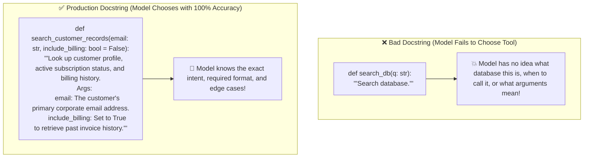
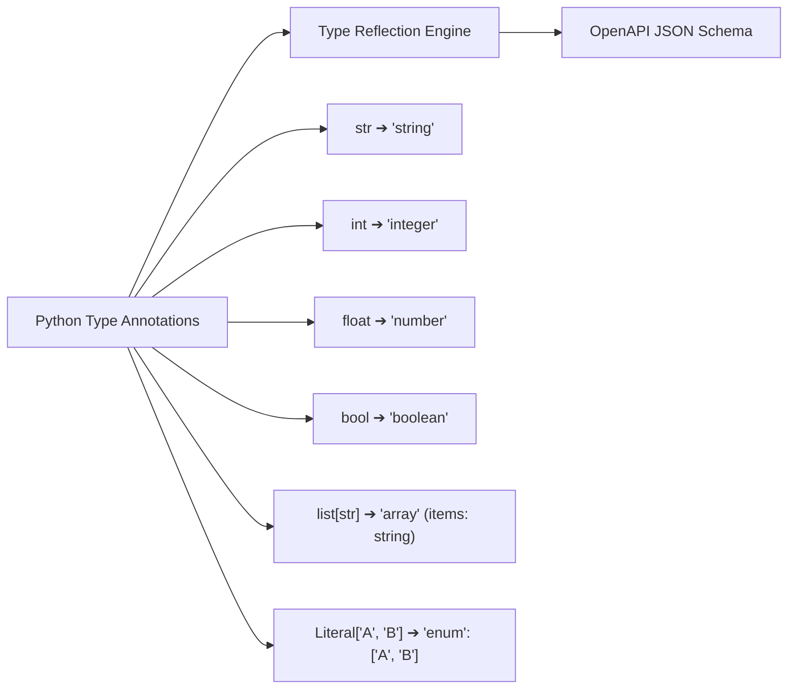
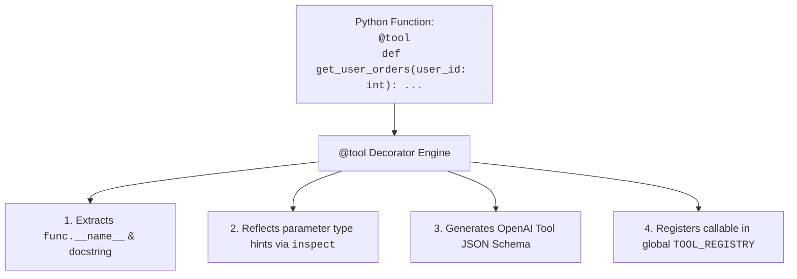
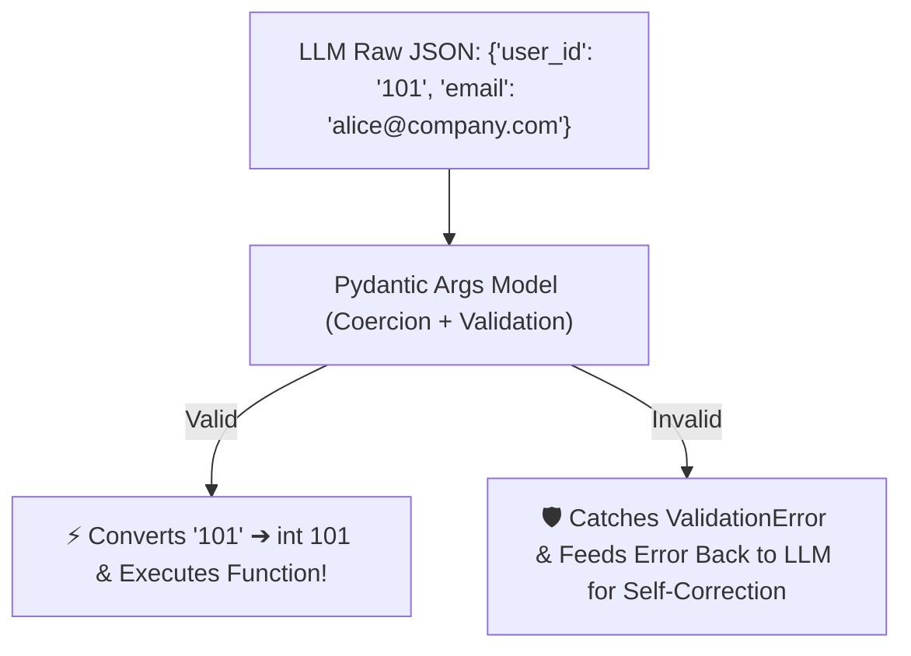

# 03 - Function Calling in Practice: Decorators, Docstrings & Type Safety

> **Mental Model**:  
> Think of Function Calling like a **universal plug-and-play adapter**:  
> * **The Raw Voltage (LLM Output)**: The LLM spits out raw stringified JSON text: `'{"user_id": "1042", "active": "true"}'`. Notice that numbers and booleans are often sent as strings!  
> * **The Adapter (Type Coercion & Validation Engine)**: The adapter intercepts the raw JSON string, validates types (converting `"1042"` $\rightarrow$ `int 1042`), checks bounds, and safely routes arguments into your native Python function.  
> * **The Contract (Docstrings as Prompts)**: In traditional code, docstrings are just comments for developers. In AI Engineering, **docstrings are prompt engineering**—they teach the model exactly *when*, *why*, and *how* to invoke each tool.

---

## 📑 Table of Contents
1. [The Power of Function Docstrings (Docstrings as Prompts)](#1-the-power-of-function-docstrings-docstrings-as-prompts)
2. [Python Types to JSON Schema Type Mapping](#2-python-types-to-json-schema-type-mapping)
3. [The Self-Registering @tool Decorator Pattern](#3-the-self-registering-tool-decorator-pattern)
4. [Parameter Coercion & Pydantic Argument Validation](#4-parameter-coercion--pydantic-argument-validation)
5. [Building a Production Function Calling Engine in Python](#5-building-a-production-function-calling-engine-in-python)
6. [Master Cheat Sheet & Reference Table](#6-master-cheat-sheet--reference-table)

---

## 1. The Power of Function Docstrings (Docstrings as Prompts)

When you pass a function to an LLM, the **docstring is the only manual the model has**:



---

## 2. Python Types to JSON Schema Type Mapping

FastAPI and OpenAI rely on a standard type conversion matrix:



---

## 3. The Self-Registering `@tool` Decorator Pattern

Instead of maintaining 100 lines of manual JSON Schema definitions, use a Python **`@tool` decorator** that inspects your functions dynamically:



---

## 4. Parameter Coercion & Pydantic Argument Validation

What happens if the LLM generates a slightly malformed argument (e.g. `age: "25"` as a string, or `email: "not-an-email"`)?



---

## 5. Building a Production Function Calling Engine in Python

Here is a complete, runnable script implementing a self-registering `@tool` decorator, automatic schema generation, and type-safe execution:

```python
import inspect
from typing import get_type_hints, Callable, Dict, Any
from pydantic import BaseModel, create_model
from openai import OpenAI
import json
import os

client = OpenAI(api_key=os.getenv("OPENAI_API_KEY", "mock-key"))

# --- Global Tool Registry ---
TOOL_REGISTRY: Dict[str, Callable] = {}
TOOL_SCHEMAS: list[dict] = []

def tool(func: Callable) -> Callable:
    """Decorator that converts a Python function into an OpenAI tool schema."""
    name = func.__name__
    doc = inspect.getdoc(func) or f"Execute {name}"
    
    # Extract type hints and parameters
    hints = get_type_hints(func)
    sig = inspect.signature(func)
    
    fields = {}
    for param_name, param in sig.parameters.items():
        param_type = hints.get(param_name, str)
        default = ... if param.default == inspect.Parameter.empty else param.default
        fields[param_name] = (param_type, default)

    # Dynamically build Pydantic model for parameter schema
    dynamic_model = create_model(f"{name}_args", **fields)
    json_schema = dynamic_model.model_json_schema()

    tool_def = {
        "type": "function",
        "function": {
            "name": name,
            "description": doc,
            "parameters": json_schema
        }
    }

    TOOL_REGISTRY[name] = func
    TOOL_SCHEMAS.append(tool_def)
    return func

# --- Declare Tools with Pythonic Syntax & Clean Docstrings ---
@tool
def calculate_compound_interest(principal: float, annual_rate: float, years: int) -> dict:
    """Calculates final compound investment balance.
    
    Args:
        principal: Starting initial investment in dollars.
        annual_rate: Annual interest rate as a decimal (e.g. 0.07 for 7%).
        years: Total investment duration in years.
    """
    total = principal * ((1 + annual_rate) ** years)
    return {
        "initial_investment": principal,
        "years": years,
        "final_balance": round(total, 2),
        "interest_earned": round(total - principal, 2)
    }

# --- Execute Function Calling with LLM ---
def run_finance_assistant(query: str):
    print(f"👤 User Query: {query}")
    
    response = client.chat.completions.create(
        model="gpt-4o-mini",
        messages=[{"role": "user", "content": query}],
        tools=TOOL_SCHEMAS,
        tool_choice="auto"
    )

    msg = response.choices[0].message
    if msg.tool_calls:
        for call in msg.tool_calls:
            func_name = call.function.name
            args = json.loads(call.function.arguments)
            print(f"⚙️ Calling tool: `{func_name}` with validated args: {args}")
            
            # Execute registered function
            result = TOOL_REGISTRY[func_name](**args)
            print(f"📊 Tool Output: {result}")

# Test Execution:
# run_finance_assistant("If I invest $10,000 at 8% annual return for 5 years, how much will I have?")
```

---

## 6. Master Cheat Sheet & Reference Table

| Python Type | JSON Schema Type | Pydantic Behavior |
| :--- | :--- | :--- |
| **`str`** | `{"type": "string"}` | Strips or preserves whitespace. |
| **`int`** | `{"type": "integer"}` | Automatically coerces `"42"` $\rightarrow$ `42`. |
| **`float`** | `{"type": "number"}` | Coerces integer `10` $\rightarrow$ `10.0`. |
| **`bool`** | `{"type": "boolean"}` | Coerces `"true"` / `"false"`. |
| **`Literal["A", "B"]`** | `{"enum": ["A", "B"]}` | Rejects any value outside the whitelist. |
| **Docstrings** | `function.description` | **Acts as prompt instructions for function selection.** |

---

## 🎯 Next Step in Phase 7
Now that you understand function calling and docstring schema generation, we will advance to **[04 - Tool Design](file:///home/user2/PythonProject/Python-for-ai-engineering/07-tools-agents/04-tool-design)** to master atomic tool design, parameter minimization, and deterministic return schemas!
