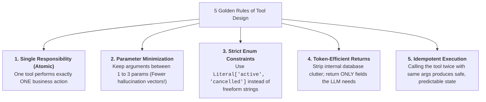
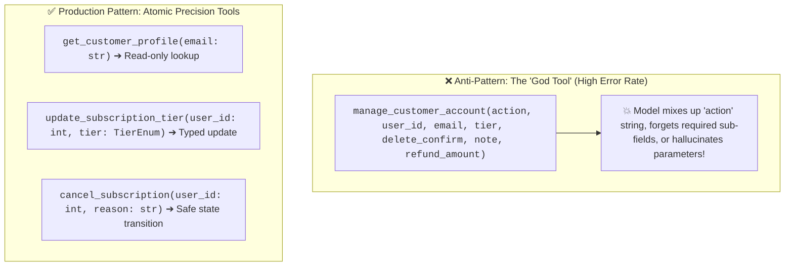
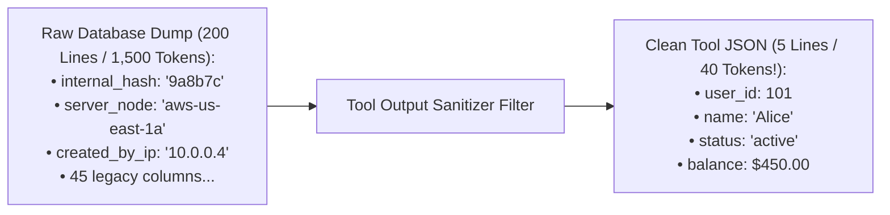
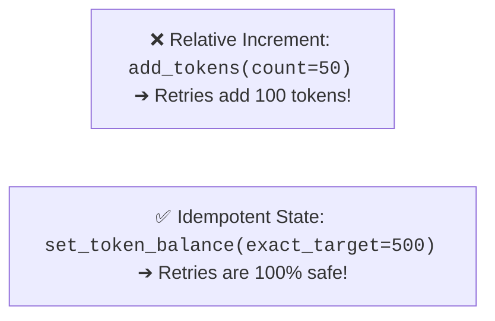

# 04 - Tool Design: Atomic Tools, Parameter Minimization & Idempotency

> **Mental Model**:  
> Think of Tool Design like **a surgical tray vs. a bulky Swiss Army knife**:  
> * **The 'God Tool' Anti-Pattern (The Swiss Army Knife)**: Creating one monstrous tool: `manage_everything(action="search_or_delete", target="user", data={...})`. The LLM gets confused by 15 optional parameters, chooses the wrong flags, and accidentally deletes a database table!  
> * **Atomic Precision Tools (The Surgical Tray)**: A clean tray of distinct, single-purpose instruments: Scalpel, Forceps, Hemostat.  
> * Each tool has **1 to 3 strict parameters**, an explicit descriptive docstring, and returns a **lean, token-efficient JSON payload**.

---

## 📑 Table of Contents
1. [The 5 Golden Rules of Tool Architecture](#1-the-5-golden-rules-of-tool-architecture)
2. [The Monolithic 'God Tool' vs. Atomic Precision Tools](#2-the-monolithic-god-tool-vs-atomic-precision-tools)
3. [Token-Efficient Return Payloads (Context Hygiene)](#3-token-efficient-return-payloads-context-hygiene)
4. [Read vs. Write Tool Separation](#4-read-vs-write-tool-separation)
5. [Idempotency & Reversible Tool Operations](#5-idempotency--reversible-tool-operations)
6. [Building an Enterprise Precision Tool Suite in Python](#6-building-an-enterprise-precision-tool-suite-in-python)
7. [Master Cheat Sheet & Reference Table](#7-master-cheat-sheet--reference-table)

---

## 1. The 5 Golden Rules of Tool Architecture



---

## 2. The Monolithic 'God Tool' vs. Atomic Precision Tools



---

## 3. Token-Efficient Return Payloads (Context Hygiene)

When your tool queries a database, **never return the raw SQL row directly**:



> 💡 **The Context Hygiene Rule:**  
> Every unnecessary token returned by a tool **burns money and degrades the model's reasoning capacity** on subsequent conversation turns!

---

## 4. Read vs. Write Tool Separation

Segregate tools into distinct safety tiers based on their impact:

| Tool Tier | Action Type | Example Tools | Safety / Approval Level |
| :--- | :--- | :--- | :--- |
| 🟢 **Tier 1: Read-Only** | Information gathering | `search_kb()`, `get_weather()`, `get_user_info()` | Auto-executed instantly. |
| 🟡 **Tier 2: Non-Destructive Write** | Reversible updates | `add_calendar_event()`, `create_support_ticket()` | Executed with user feedback. |
| 🔴 **Tier 3: Destructive Write** | Financial / Deletion | `refund_payment()`, `delete_user_account()`, `drop_table()` | **Requires Human-in-the-Loop (HITL) approval!** |

---

## 5. Idempotency & Reversible Tool Operations

> **Mental Model**:  
> If an agent experiences a network glitch and invokes `bill_customer(user_id=101, amount=50)` twice, the customer must **NOT be billed twice**!

Always require an **`idempotency_key`** or write tools that set explicit target states rather than relative increments:



---

## 6. Building an Enterprise Precision Tool Suite in Python

Here is a complete, production-grade suite of atomic, type-safe, token-efficient tools:

```python
from typing import Literal
from pydantic import BaseModel, Field
import json

# --- Strict Enum Types ---
SubscriptionTier = Literal["starter", "professional", "enterprise"]

# --- Mock In-Memory Database ---
CUSTOMERS_DB = {
    "alice@company.com": {
        "user_id": 101,
        "name": "Alice Smith",
        "email": "alice@company.com",
        "tier": "starter",
        "balance_usd": 250.00,
        "internal_server_ip": "10.0.4.12", # Secret / noisy field
        "legacy_crm_id": "CRM-9901-X"      # Useless noise field
    }
}

# --- Tool 1: Read-Only (Token-Efficient Filter) ---
def get_customer_by_email(email: str) -> str:
    """Retrieve customer subscription details and account balance by corporate email.
    
    Args:
        email: The customer's registered email address.
    """
    record = CUSTOMERS_DB.get(email.lower().strip())
    if not record:
        return json.dumps({"error": f"Customer '{email}' not found."})

    # Token-efficient filtering: Emit ONLY essential fields!
    lean_payload = {
        "user_id": record["user_id"],
        "name": record["name"],
        "tier": record["tier"],
        "balance": record["balance_usd"]
    }
    return json.dumps(lean_payload)

# --- Tool 2: Typed Non-Destructive Write (Enum Protected) ---
def update_subscription_tier(user_id: int, new_tier: SubscriptionTier) -> str:
    """Upgrade or downgrade a customer's subscription plan.
    
    Args:
        user_id: The unique integer ID of the customer.
        new_tier: The target plan. Must be 'starter', 'professional', or 'enterprise'.
    """
    for email, record in CUSTOMERS_DB.items():
        if record["user_id"] == user_id:
            old_tier = record["tier"]
            record["tier"] = new_tier
            return json.dumps({
                "status": "SUCCESS",
                "user_id": user_id,
                "previous_tier": old_tier,
                "active_tier": new_tier
            })
    return json.dumps({"error": f"User ID {user_id} not found."})

# --- Tool 3: Idempotent Write Operation ---
def apply_promo_credit(user_id: int, credit_code: str) -> str:
    """Apply a one-time promotional credit code to an account idempotently.
    
    Args:
        user_id: Target customer ID.
        credit_code: Promotional voucher code, e.g. 'WELCOME50'.
    """
    if credit_code.upper() != "WELCOME50":
        return json.dumps({"error": "Invalid or expired promo code."})

    for email, record in CUSTOMERS_DB.items():
        if record["user_id"] == user_id:
            # Idempotency check
            if record.get("promo_applied") == credit_code.upper():
                return json.dumps({"status": "ALREADY_APPLIED", "message": "Code already credited to this account."})

            record["balance_usd"] += 50.00
            record["promo_applied"] = credit_code.upper()
            return json.dumps({"status": "CREDITED", "new_balance": record["balance_usd"]})

    return json.dumps({"error": f"User ID {user_id} not found."})
```

---

## 7. Master Cheat Sheet & Reference Table

| Principle | Best Practice Standard |
| :--- | :--- |
| **Tool Granularity** | **Atomic**: 1 tool per 1 action (Never build multi-action "God Tools"). |
| **Argument Count** | Aim for **1 to 3 arguments** per function. |
| **String Constraints** | Always use **`Literal[...]` (enums)** instead of free-form strings. |
| **Payload Size** | Strip internal database columns; return **$< 100\text{ tokens}$ of clean JSON**. |
| **Safety Guard** | Tag destructive actions (billing, deleting) for **Human-in-the-Loop confirmation**. |

---

## 🎯 Next Step in Phase 7
Now that you have mastered atomic tool design and context hygiene, we will advance to **[05 - Tool Execution Safety](file:///home/user2/PythonProject/Python-for-ai-engineering/07-tools-agents/05-tool-execution-safety)** to master sandboxing, Human-in-the-Loop (HITL) confirmation gates, and destructive action blast-radius shields!
