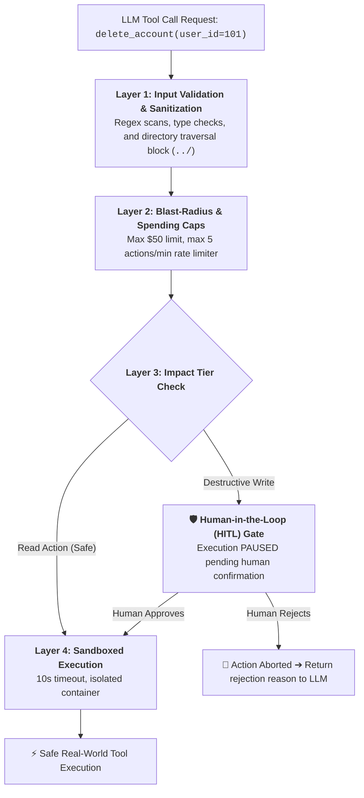
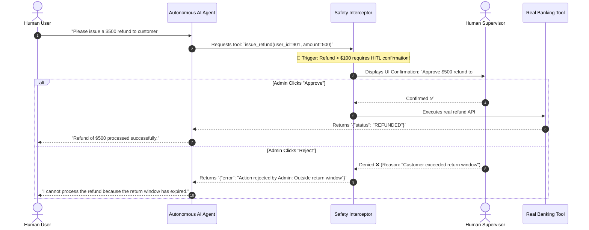
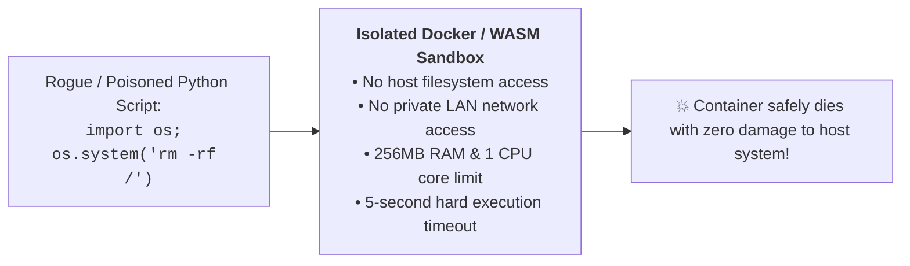
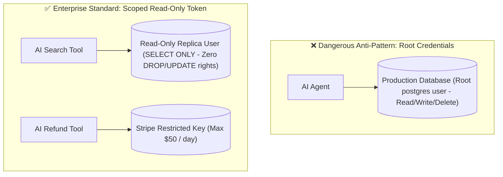

# 05 - Tool Execution Safety: Sandboxing & Human-in-the-Loop Gates

> **Mental Model**:  
> Think of Tool Execution Safety like the **dual-key launch protocol in a submarine**:  
> * **The Danger**: When you equip an LLM with tool calling, it gains the power to alter the physical world—charging real credit cards, sending emails to real clients, and running SQL queries on production databases!  
> * **The Dual-Key Protocol (Human-in-the-Loop)**: The AI agent turns Key #1 by generating the proposed action blueprint (*"Refund $450 to User 1042"*). But the execution engine pauses and **demands a human operator turn Key #2** (clicking "Approve") before the money is actually wired!  
> * **The Sandbox Containment Zone**: Code-running tools are isolated inside ephemeral, network-restricted containers so that even a rogue script cannot touch host files or internal corporate servers.

---

## 📑 Table of Contents
1. [The 4-Layer Tool Defense Funnel](#1-the-4-layer-tool-defense-funnel)
2. [Human-in-the-Loop (HITL) Confirmation Gates](#2-human-in-the-loop-hitl-confirmation-gates)
3. [Blast-Radius Limits & Hard Spending Caps](#3-blast-radius-limits--hard-spending-caps)
4. [Code Execution Sandboxing (Docker, WASM, gVisor)](#4-code-execution-sandboxing-docker-wasm-gvisor)
5. [The Principle of Least Privilege (Scoped Permissions)](#5-the-principle-of-least-privilege-scoped-permissions)
6. [Building a Safe Tool Execution Engine with HITL in Python](#6-building-a-safe-tool-execution-engine-with-hitl-in-python)
7. [Master Cheat Sheet & Reference Table](#7-master-cheat-sheet--reference-table)

---

## 1. The 4-Layer Tool Defense Funnel

Never allow an LLM to execute tools directly without passing through a **multi-stage security funnel**:



---

## 2. Human-in-the-Loop (HITL) Confirmation Gates

When an agent attempts a **destructive or financial action**, the execution loop must pause and request human authorization:



---

## 3. Blast-Radius Limits & Hard Spending Caps

> 💡 **The Financial Shield:**  
> Never rely on prompt instructions to limit spending (*"Please do not spend more than $50"*).  
> You must enforce **hard programmatic ceilings in Python**:

```python
MAX_SINGLE_REFUND_LIMIT = 100.00
MAX_DAILY_AGENT_BUDGET = 1000.00

def issue_refund(amount: float, user_id: int) -> dict:
    # Hard programmatic gate (LLM cannot bypass this!)
    if amount > MAX_SINGLE_REFUND_LIMIT:
        return {
            "error": f"Security violation: Requested ${amount} exceeds the $100 single-action maximum."
        }
    # Execute refund...
```

---

## 4. Code Execution Sandboxing (Docker, WASM, gVisor)

If you allow an agent to write and execute Python or Bash code, running `exec()` on your host server is **fatal suicide**:



### Sandbox Comparison:

| Technology | Isolation Level | Startup Latency | Best Use Case |
| :--- | :--- | :---: | :--- |
| **WASM (WebAssembly)** | Process-level sandbox | $< 5\text{ms}$ | Fast, lightweight math and text transformation scripts. |
| **Docker Containers** | Linux cgroups & namespaces | $\sim 300\text{ms}$ | Full Python data science & library execution. |
| **gVisor / Firecracker** | Virtualized MicroVM | $\sim 50\text{ms}$ | Multi-tenant untrusted user code execution in cloud. |

---

## 5. The Principle of Least Privilege (Scoped Permissions)



---

## 6. Building a Safe Tool Execution Engine with HITL in Python

Here is a complete, runnable script demonstrating safety decorators, spending caps, and simulated Human-in-the-Loop approval:

```python
from typing import Callable, Dict, Any
from functools import wraps
import json

# --- Safety Configuration ---
CRITICAL_TOOLS = ["wire_funds", "delete_account"]

def requires_human_approval(func: Callable) -> Callable:
    """Decorator that pauses execution and prompts for human confirmation."""
    @wraps(func)
    def wrapper(*args, **kwargs):
        print("\n" + "="*50)
        print(f"🚨 [SAFETY INTERCEPTOR] Destructive action requested: `{func.__name__}`")
        print(f"   Parameters: {kwargs}")
        
        # Simulate Human-in-the-Loop approval prompt
        approval = input("   👉 Approve this execution? (yes/no): ").strip().lower()
        print("="*50 + "\n")

        if approval == "yes":
            return func(*args, **kwargs)
        else:
            return {
                "status": "REJECTED_BY_HUMAN",
                "error": "The human supervisor reviewed and explicitly rejected this action."
            }
    return wrapper

# --- Tools with Built-In Safety Shields ---
def search_knowledge_base(query: str) -> dict:
    """Safe read-only tool (Auto-approved)."""
    return {"query": query, "results": ["Article 1", "Article 2"]}

@requires_human_approval
def wire_funds(recipient: str, amount: float) -> dict:
    """Critical financial tool (Requires HITL approval & hard spending cap)."""
    # Hard spending limit check
    if amount > 500.00:
        return {"error": f"Security ceiling exceeded: ${amount} is above the $500 maximum."}

    return {
        "status": "EXECUTED",
        "recipient": recipient,
        "amount_usd": amount,
        "transaction_id": "TX_9901"
    }

# --- Dispatcher Engine ---
SAFE_TOOL_REGISTRY = {
    "search_knowledge_base": search_knowledge_base,
    "wire_funds": wire_funds
}

def execute_safe_tool(tool_name: str, args: dict) -> str:
    target_func = SAFE_TOOL_REGISTRY.get(tool_name)
    if not target_func:
        return json.dumps({"error": f"Tool '{tool_name}' not permitted."})
    
    result = target_func(**args)
    return json.dumps(result)

# Test Safe Execution:
# print("Test 1 (Read Action):", execute_safe_tool("search_knowledge_base", {"query": "pricing"}))
# print("Test 2 (Destructive Action):", execute_safe_tool("wire_funds", {"recipient": "VendorCorp", "amount": 250.00}))
```

---

## 7. Master Cheat Sheet & Reference Table

| Safety Mechanism | Implementation Strategy | Target Risk |
| :--- | :--- | :--- |
| **Human-in-the-Loop** | `@requires_human_approval` modal pause. | Unintended deletions & financial loss. |
| **Hard Programmatic Caps**| Hardcoded `if amount > MAX: return error` in Python. | Runaway spending / credit card exhaustion. |
| **Sandboxing** | Docker / WASM ephemeral containers with 5s timeout. | Host server compromise via arbitrary code execution. |
| **Least Privilege** | Dedicated read-only DB users (`SELECT` only). | Accidental table drops (`DROP TABLE`). |
| **Directory Jail** | `os.path.abspath` validation preventing `../` traversal. | Secret file leakage (`/etc/passwd`). |

---

## 🎯 Next Step in Phase 7
Now that you have mastered tool safety, sandboxing, and HITL guardrails, we will advance to **[06 - Agent Fundamentals](file:///home/user2/PythonProject/Python-for-ai-engineering/07-tools-agents/06-agent-fundamentals)** to master autonomous agent architectures, goal decomposition, and the ReAct execution paradigm!
