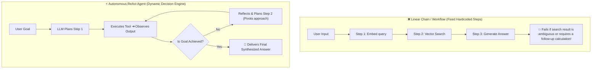
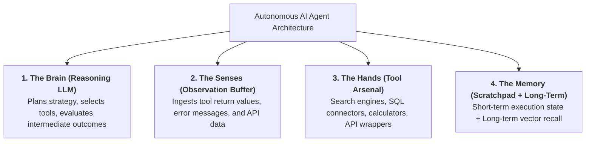
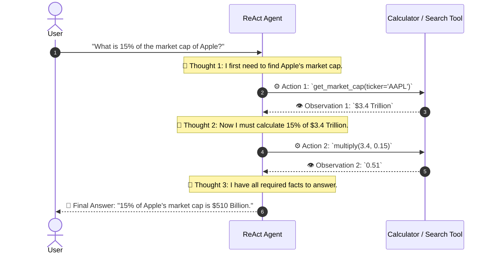
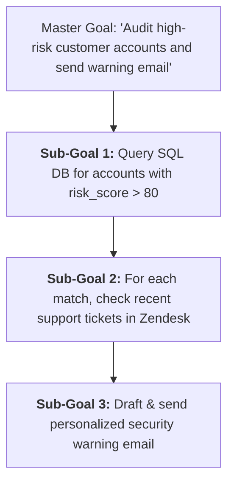
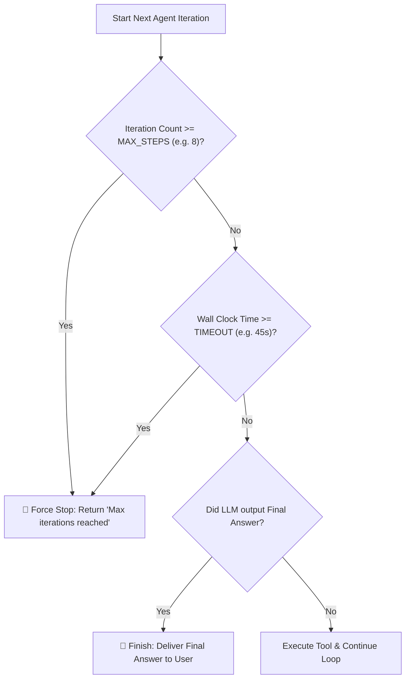

# 06 - Agent Fundamentals: The ReAct Paradigm & Autonomous Loops

> **Mental Model**:  
> Think of an AI Agent like an **autonomous Mars Rover vs. a fixed railway train**:  
> * **Chains / Workflows (The Railway Train)**: A rigid, hardcoded track: Step A $\rightarrow$ Step B $\rightarrow$ Step C. If an unexpected rock blocks Step B, the train crashes and halts.  
> * **Autonomous Agents (The Mars Rover)**: You give the rover a high-level destination (*"Navigate to the crater and sample soil"*). The rover plans its route, encounters a boulder, reasons about the obstacle, pivots right, chooses the drill tool, evaluates the mineral sensor data, and **stops only when the goal is achieved**.  
> Agents replace rigid hardcoded pipelines with **dynamic, self-directed reasoning loops**.

---

## 📑 Table of Contents
1. [Chains vs. Autonomous Agents](#1-chains-vs-autonomous-agents)
2. [The 4 Biological Organs of an AI Agent](#2-the-4-biological-organs-of-an-ai-agent)
3. [The ReAct (Reason + Act) Execution Loop](#3-the-react-reason--act-execution-loop)
4. [Goal Decomposition & Dynamic Planning](#4-goal-decomposition--dynamic-planning)
5. [Stopping Conditions (Preventing Infinite Death Loops)](#5-stopping-conditions-preventing-infinite-death-loops)
6. [Building a Pure Python ReAct Agent Engine](#6-building-a-pure-python-react-agent-engine)
7. [Master Cheat Sheet & Reference Table](#7-master-cheat-sheet--reference-table)

---

## 1. Chains vs. Autonomous Agents



### Key Differences:

| Dimension | 🚂 Linear Chains | 🤖 Autonomous Agents |
| :--- | :--- | :--- |
| **Control Flow** | Hardcoded in Python (`step_1() -> step_2()`). | Decided dynamically by LLM on every step. |
| **Tool Invocations** | Fixed sequence. | Variable ($0$ to $N$ tools chosen autonomously). |
| **Error Recovery** | Crashes on unexpected tool output. | Reads error and attempts alternative strategy. |
| **Best Use Case** | Predictable pipelines (e.g. Standard RAG). | Multi-step research, debugging, customer support. |

---

## 2. The 4 Biological Organs of an AI Agent

Every autonomous agent is composed of **4 integrated subsystems**:



---

## 3. The ReAct (Reason + Act) Execution Loop

The **ReAct paradigm** interleaves reasoning thoughts with physical tool actions:



---

## 4. Goal Decomposition & Dynamic Planning

When given a complex prompt, an agent slices the master goal into **ordered sub-tasks**:



If Sub-Goal 1 returns 0 accounts, the agent intelligently skips Sub-Goals 2 and 3!

---

## 5. Stopping Conditions (Preventing Infinite Death Loops)

> ⚠️ **The Infinite Spin Disaster:**  
> An agent calls `search("revenue 2026")` $\rightarrow$ receives empty list $\rightarrow$ calls `search("revenue 2026")` again $\rightarrow$ **loops 1,000 times, burning $500 in API tokens!**

To prevent runaway costs, every agent loop must enforce **3 Hard Stopping Guards**:



---

## 6. Building a Pure Python ReAct Agent Engine

Here is a complete, runnable Autonomous Agent implemented in pure Python without third-party frameworks:

```python
from openai import OpenAI
import json
import os

client = OpenAI(api_key=os.getenv("OPENAI_API_KEY", "mock-key"))

# --- 1. Tool Arsenal ---
def calculate_math(expression: str) -> dict:
    """Evaluates mathematical arithmetic expressions."""
    try:
        result = eval(expression, {"__builtins__": None}, {})
        return {"result": result}
    except Exception as e:
        return {"error": str(e)}

def search_company_database(query: str) -> dict:
    """Mock corporate knowledge base."""
    data = {
        "headcount": "Our company has 450 full-time employees.",
        "revenue": "Q2 revenue was $12.5 Million USD.",
        "ceo": "The CEO is Jane Doe."
    }
    for key, val in data.items():
        if key in query.lower():
            return {"match": val}
    return {"error": "No records found."}

TOOL_REGISTRY = {
    "calculate_math": calculate_math,
    "search_company_database": search_company_database
}

TOOL_SCHEMAS = [
    {
        "type": "function",
        "function": {
            "name": "calculate_math",
            "description": "Calculate math expressions, e.g. '450 * 0.20'",
            "parameters": {
                "type": "object",
                "properties": {"expression": {"type": "string"}},
                "required": ["expression"]
            }
        }
    },
    {
        "type": "function",
        "function": {
            "name": "search_company_database",
            "description": "Look up company headcount, revenue, or executive leadership.",
            "parameters": {
                "type": "object",
                "properties": {"query": {"type": "string"}},
                "required": ["query"]
            }
        }
    }
]

# --- 2. The Autonomous ReAct Agent Loop ---
def run_autonomous_agent(user_goal: str, max_iterations: int = 5):
    messages = [
        {"role": "system", "content": "You are an autonomous ReAct agent. Reason step-by-step and use tools to achieve the user's goal."},
        {"role": "user", "content": user_goal}
    ]
    
    print(f"🎯 Goal: {user_goal}\n" + "="*50)

    for iteration in range(1, max_iterations + 1):
        print(f"\n🔄 [Iteration {iteration}/{max_iterations}] Thinking...")

        response = client.chat.completions.create(
            model="gpt-4o-mini",
            messages=messages,
            tools=TOOL_SCHEMAS,
            tool_choice="auto"
        )
        
        msg = response.choices[0].message
        messages.append(msg)

        # Stopping Condition 1: Goal Complete (No tools requested)
        if not msg.tool_calls:
            print(f"\n🏆 Final Answer:\n{msg.content}")
            return msg.content

        # Execute Tools
        for call in msg.tool_calls:
            func_name = call.function.name
            args = json.loads(call.function.arguments)
            print(f"  ⚙️ Action: `{func_name}` with args: {args}")

            tool_func = TOOL_REGISTRY.get(func_name)
            tool_output = tool_func(**args) if tool_func else {"error": "Tool not found"}
            print(f"  👁️ Observation: {tool_output}")

            messages.append({
                "role": "tool",
                "tool_call_id": call.id,
                "content": json.dumps(tool_output)
            })

    print("⚠️ Max iterations reached without completing goal.")
    return "Error: Reached iteration limit."

# Test Multi-Step Agent:
# run_autonomous_agent("How many employees would we have if our current headcount grew by 20%?")
```

---

## 7. Master Cheat Sheet & Reference Table

| Concept | Production Standard | Purpose |
| :--- | :---: | :--- |
| **Max Iterations** | **5 to 10 loops max** | Prevents infinite loops and runaway token costs. |
| **Execution Timeout** | **30 to 60 seconds** | Hard deadline for entire multi-step agent workflow. |
| **ReAct Loop** | Thought $\rightarrow$ Action $\rightarrow$ Observation | The fundamental cognitive cycle of autonomous agents. |
| **Final Answer Trigger** | `not message.tool_calls` | Detects when the model has resolved the goal. |

---

## 🎯 Next Step in Phase 7
Now that you understand autonomous agent loops and the ReAct paradigm, we will advance to **[07 - Agent Loops](file:///home/user2/PythonProject/Python-for-ai-engineering/07-tools-agents/07-agent-loops)** to master state machines, loop recursion limits, cycle detection, and self-correction strategies!
