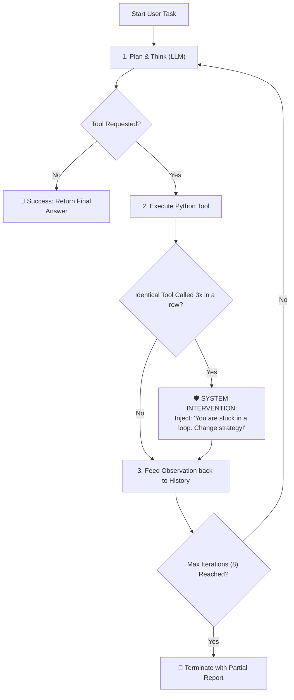
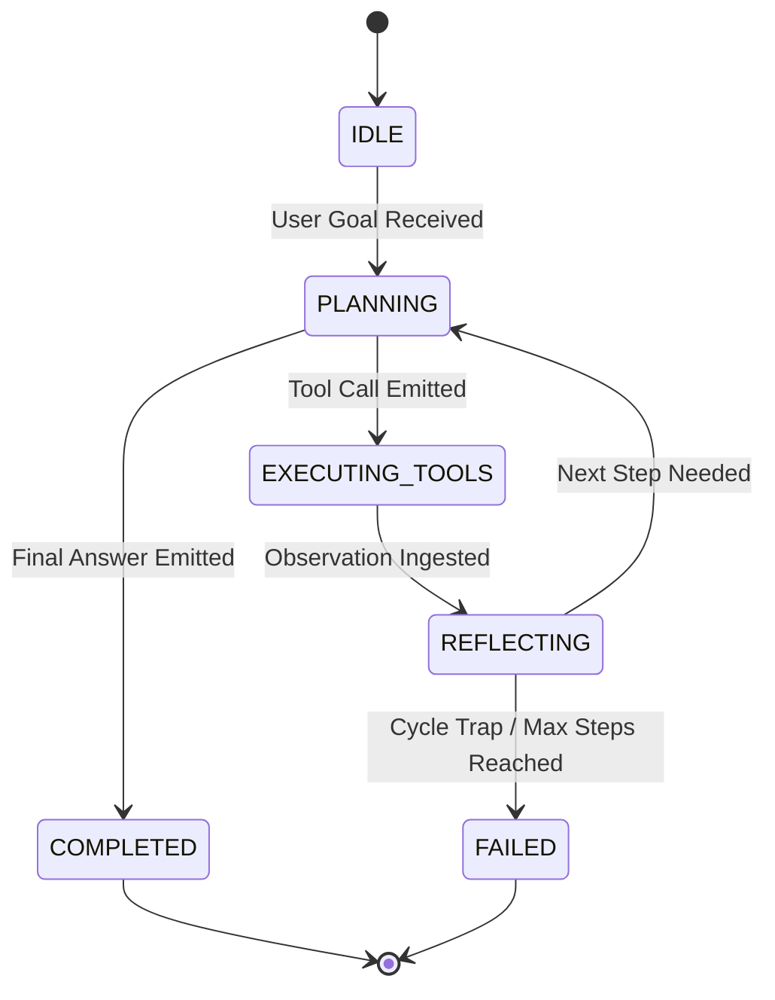
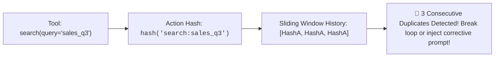
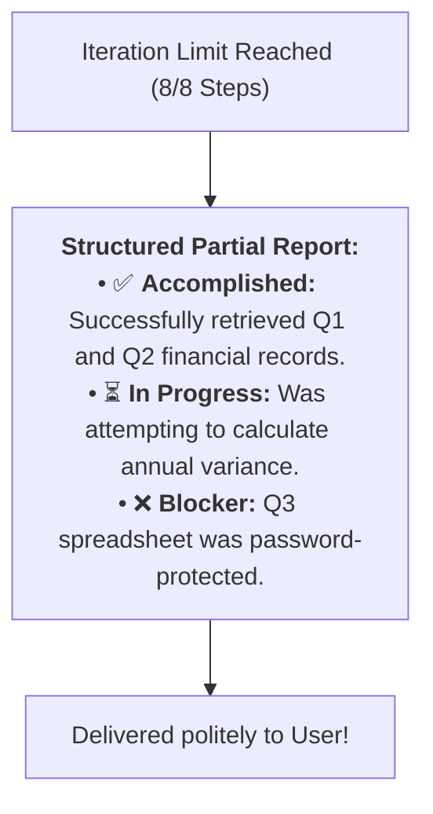

# 07 - Agent Loops: Finite State Machines, Cycle Detection & Termination

> **Mental Model**:  
> Think of Agent Loop Control like **a maze explorer leaving a chalk breadcrumb trail**:  
> * **The Repetition Vortex (The Infinite Death Loop)**: Without tracking, an AI agent can get stuck in a mental loop: it runs `search("invoice_2026.pdf")`, gets `"Not Found"`, reasons that it really needs the file, and runs `search("invoice_2026.pdf")` again... forever!  
> * **The Breadcrumb Trail (Cycle Detection)**: Every tool name and argument combination is hashed and recorded on a scratchpad.  
> * If the explorer encounters the **same chalk mark 3 times in a row**, it detects a circular trap, forces an immediate strategic pivot, and tries an entirely new path.

---

## 📑 Table of Contents
1. [The Anatomy of an Agent Execution Loop](#1-the-anatomy-of-an-agent-execution-loop)
2. [The Agent as a Finite State Machine (FSM)](#2-the-agent-as-a-finite-state-machine-fsm)
3. [Cycle Detection: Stopping the Repetition Vortex](#3-cycle-detection-stopping-the-repetition-vortex)
4. [The 4 Mandatory Termination Protocols](#4-the-4-mandatory-termination-protocols)
5. [Graceful Partial Failure Reporting](#5-graceful-partial-failure-reporting)
6. [Building a Resilient FSM Agent Loop in Python](#6-building-a-resilient-fsm-agent-loop-in-python)
7. [Master Cheat Sheet & Reference Table](#7-master-cheat-sheet--reference-table)

---

## 1. The Anatomy of an Agent Execution Loop

At its core, every autonomous agent is a **controlled `while` loop**:



---

## 2. The Agent as a Finite State Machine (FSM)

To prevent chaotic, unpredictable agent behaviors, model your agent as an **explicit State Machine**:



### The 5 Core FSM States:
1. **`IDLE`**: Awaiting incoming user prompt.
2. **`PLANNING`**: Model generates reasoning thought and decides whether to act.
3. **`EXECUTING_TOOLS`**: Python backend executes real external APIs.
4. **`REFLECTING`**: Model evaluates whether observation satisfied the sub-goal.
5. **`COMPLETED` / `FAILED`**: Terminal states that deliver the response and release memory.

---

## 3. Cycle Detection: Stopping the Repetition Vortex

Agents frequently get stuck calling the **same failed tool repeatedly with identical parameters**.  
Solve this by tracking an **Action Fingerprint History**:



### Self-Correction Injection:
When a cycle is detected, do not crash. Inject a **High-Priority System Correction**:
```text
[SYSTEM WARNING]: You have executed `search(query="sales_q3")` 3 times with the exact same arguments and received no results. 
DO NOT call this tool with these arguments again. You must change your keywords, try a different tool, or inform the user that the file is missing.
```

---

## 4. The 4 Mandatory Termination Protocols

Every production agent loop must enforce **4 distinct circuit breakers**:

| Termination Protocol | Trigger Condition | Outcome / Action |
| :--- | :--- | :--- |
| **1. Goal Resolution** | LLM emits final text without `tool_calls`. | 🟢 Normal clean exit; deliver answer. |
| **2. Max Iterations** | Loop count exceeds limit (e.g. $8$ steps). | 🔴 Abort loop; deliver partial progress summary. |
| **3. Wall-Clock Timeout** | Total elapsed time exceeds deadline (e.g. $45\text{s}$). | 🔴 Cancel running tasks; prevent gateway timeout. |
| **4. Repetition Trap** | Exact action fingerprint repeated $\ge 3$ times. | 🟡 Inject corrective system alert or fail safely. |

---

## 5. Graceful Partial Failure Reporting

When an agent hits its iteration limit, **never output a generic `"Error 500"` crash message**.  
Deliver a **Structured Partial Progress Report**:



---

## 6. Building a Resilient FSM Agent Loop in Python

Here is a complete, runnable script implementing a Finite State Machine agent loop with cycle detection and graceful termination:

```python
from enum import Enum
from openai import OpenAI
import hashlib
import json
import time
import os

client = OpenAI(api_key=os.getenv("OPENAI_API_KEY", "mock-key"))

# --- 1. Define FSM States ---
class AgentState(Enum):
    PLANNING = "PLANNING"
    EXECUTING = "EXECUTING"
    COMPLETED = "COMPLETED"
    FAILED = "FAILED"

# --- 2. Mock Tools ---
def lookup_file(filename: str) -> dict:
    """Mock file search tool."""
    if filename == "valid_contract.txt":
        return {"content": "Contract signed on August 2026. Value: $50,000."}
    return {"error": f"File '{filename}' not found."}

TOOL_REGISTRY = {"lookup_file": lookup_file}
TOOLS = [{
    "type": "function",
    "function": {
        "name": "lookup_file",
        "description": "Look up document text by filename.",
        "parameters": {
            "type": "object",
            "properties": {"filename": {"type": "string"}},
            "required": ["filename"]
        }
    }
}]

# --- 3. The Resilient Agent Engine ---
def run_resilient_agent(goal: str, max_steps: int = 5, timeout_sec: float = 30.0):
    messages = [
        {"role": "system", "content": "You are a helpful autonomous agent. Find documents and answer the user's question."},
        {"role": "user", "content": goal}
    ]
    
    state = AgentState.PLANNING
    action_history = []
    start_time = time.time()

    for step in range(1, max_steps + 1):
        # Circuit Breaker: Timeout check
        if time.time() - start_time > timeout_sec:
            print("⏱️ [TIMEOUT] Execution exceeded deadline!")
            state = AgentState.FAILED
            break

        print(f"\n[{state.value}] Step {step}/{max_steps}...")

        response = client.chat.completions.create(
            model="gpt-4o-mini",
            messages=messages,
            tools=TOOLS,
            tool_choice="auto"
        )
        
        msg = response.choices[0].message
        messages.append(msg)

        # Check for goal completion
        if not msg.tool_calls:
            state = AgentState.COMPLETED
            print(f"\n🏆 Final Answer:\n{msg.content}")
            return msg.content

        # State: EXECUTING
        state = AgentState.EXECUTING
        for call in msg.tool_calls:
            func_name = call.function.name
            args_str = call.function.arguments
            
            # --- Cycle Detection ---
            fingerprint = hashlib.md5(f"{func_name}:{args_str}".encode()).hexdigest()
            action_history.append(fingerprint)

            # Check if same action was repeated 3 times in a row
            if len(action_history) >= 3 and action_history[-1] == action_history[-2] == action_history[-3]:
                print(f"🚨 [CYCLE DETECTED] Repetition trap on `{func_name}`!")
                messages.append({
                    "role": "system",
                    "content": f"[WARNING]: You called `{func_name}` 3 times with identical arguments. Pivot your strategy immediately!"
                })

            # Execute tool
            tool_func = TOOL_REGISTRY.get(func_name)
            output = tool_func(**json.loads(args_str)) if tool_func else {"error": "Unknown tool"}
            print(f"  🔧 Executed `{func_name}` ➔ Result: {output}")

            messages.append({
                "role": "tool",
                "tool_call_id": call.id,
                "content": json.dumps(output)
            })

        state = AgentState.PLANNING

    return "Agent terminated: Max iterations reached."

# Test Execution:
# run_resilient_agent("Find the value in valid_contract.txt")
```

---

## 7. Master Cheat Sheet & Reference Table

| Mechanism | Configuration | Engineering Role |
| :--- | :---: | :--- |
| **Max Steps Cap** | **6 to 8 iterations** | Hard stop for infinite loop protection. |
| **Wall-Clock Timeout** | **30 to 45 seconds** | Prevents HTTP reverse-proxy timeouts. |
| **Cycle Window** | **3 identical action hashes** | Identifies repetitive hallucinatory loops. |
| **Corrective Prompt** | High-priority system message | Forces agent to rethink strategy instead of repeating failure. |

---

## 🎯 Next Step in Phase 7
Now that you have mastered agent execution loops and cycle detection, we will advance to **[08 - Agent Memory & State](file:///home/user2/PythonProject/Python-for-ai-engineering/07-tools-agents/08-agent-memory-state)** to master Short-Term Scratchpads, Message Summarization, Long-Term Vector Memory, and Session Persistence!
