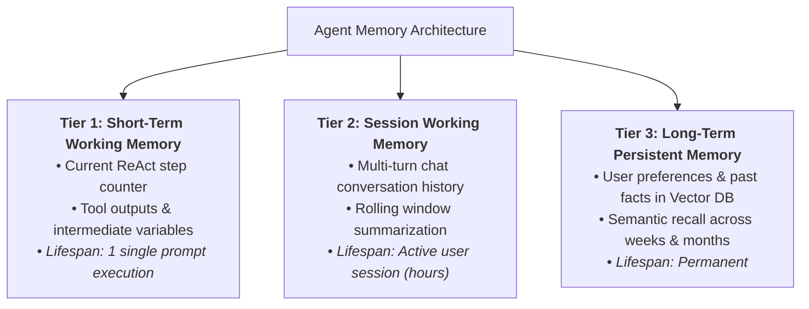
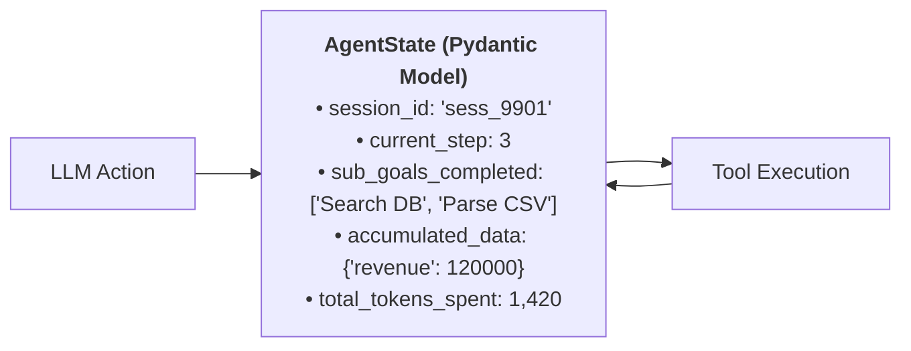
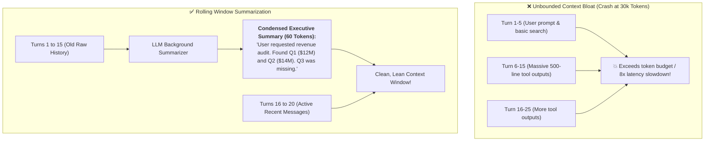

# 08 - Agent Memory & State Management: Scratchpads & Long-Term Recall

> **Mental Model**:  
> Think of Agent Memory like **the 3 tiers of an executive's desk**:  
> * **Tier 1: The Sticky Note (Short-Term Scratchpad)**: Tracks what the agent is doing *right now* on Step 3 of 5. Thrown away the moment the task is completed.  
> * **Tier 2: The Office Whiteboard (Rolling Conversation Summary)**: When a conversation reaches 20 turns, you don't keep reading every word from turn #1. An assistant erases the top half and writes a **3-sentence executive summary** to keep the context window clean.  
> * **Tier 3: The Filing Cabinet (Long-Term Vector Memory)**: Permanent storage in a database. Remembers user preferences, project background, and past mistakes across multiple weeks and sessions.

---

## 📑 Table of Contents
1. [The 3 Tiers of Agent Memory](#1-the-3-tiers-of-agent-memory)
2. [Short-Term State: The Pydantic Execution Scratchpad](#2-short-term-state-the-pydantic-execution-scratchpad)
3. [Context Pruning & Rolling Window Summarization](#3-context-pruning--rolling-window-summarization)
4. [Long-Term Semantic Memory (Cross-Session Recall)](#4-long-term-semantic-memory-cross-session-recall)
5. [Building a Multi-Tier Memory Engine in Python](#5-building-a-multi-tier-memory-engine-in-python)
6. [Master Cheat Sheet & Reference Table](#6-master-cheat-sheet--reference-table)

---

## 1. The 3 Tiers of Agent Memory



---

## 2. Short-Term State: The Pydantic Execution Scratchpad

Instead of passing messy, unvalidated lists of dictionaries through your agent loop, maintain an **explicit Pydantic State Object**:



### The State Contract:
```python
from pydantic import BaseModel, Field
from typing import Dict, Any, List

class AgentExecutionState(BaseModel):
    session_id: str
    user_id: int
    current_step: int = 1
    max_steps: int = 8
    completed_tasks: List[str] = Field(default_factory=list)
    pending_tasks: List[str] = Field(default_factory=list)
    scratchpad_variables: Dict[str, Any] = Field(default_factory=dict)
    total_tokens_used: int = 0
```

---

## 3. Context Pruning & Rolling Window Summarization

As an agent executes tools, raw JSON responses fill up the context window rapidly:



---

## 4. Long-Term Semantic Memory (Cross-Session Recall)

When a user mentions a personal fact or preference, store it into a **Long-Term Vector Memory Index**:

```mermaid
sequenceDiagram
    autonumber
    actor User as User
    participant Agent as Agent
    participant VectorDB as ChromaDB (User Memory)

    User->>Agent: "Session 1: I prefer Python code and my timezone is Tokyo."
    Agent->>VectorDB: Ingests memory: `{"fact": "Prefers Python, TZ: Tokyo", "user_id": 101}`
    
    Note over User,VectorDB: --- 2 Weeks Later (New Session) ---
    
    User->>Agent: "Session 2: Write me a script to schedule a report."
    Agent->>VectorDB: Semantic query: "user preferences for scheduling script"
    VectorDB-->>Agent: Retrieves: `Prefers Python, Timezone: Tokyo`
    Agent-->>User: Outputs Python script calibrated for JST timezone automatically!
```



---

## 5. Building a Multi-Tier Memory Engine in Python

Here is a complete, runnable script implementing short-term state tracking, rolling window summarization, and long-term memory recall:

```python
from pydantic import BaseModel, Field
from openai import OpenAI
import json
import os

client = OpenAI(api_key=os.getenv("OPENAI_API_KEY", "mock-key"))

# --- 1. Long-Term Vector Memory (Simulated) ---
LONG_TERM_MEMORIES = {
    101: ["User prefers Python code.", "User timezone is UTC+9 (Tokyo).", "User company is AcmeCorp."]
}

def recall_user_memories(user_id: int, query: str) -> list[str]:
    """Simulates retrieving relevant long-term memories for a user."""
    return LONG_TERM_MEMORIES.get(user_id, [])

# --- 2. Rolling Window Summarizer ---
def summarize_conversation_history(old_messages: list[dict]) -> str:
    """Condenses old conversation turns into a brief executive summary."""
    transcript = "\n".join(f"{m['role']}: {m.get('content', '')}" for m in old_messages)
    prompt = f"Summarize the key facts and decisions from this transcript in 2 sentences:\n\n{transcript}"
    
    res = client.chat.completions.create(
        model="gpt-4o-mini",
        messages=[{"role": "user", "content": prompt}],
        temperature=0.0
    )
    return res.choices[0].message.content

# --- 3. Multi-Tier Conversation Manager ---
class ConversationMemoryManager:
    def __init__(self, user_id: int, max_raw_turns: int = 4):
        self.user_id = user_id
        self.max_raw_turns = max_raw_turns
        self.raw_messages: list[dict] = []
        self.running_summary: str = ""

    def add_message(self, role: str, content: str):
        self.raw_messages.append({"role": role, "content": content})
        
        # If raw history exceeds threshold, compress oldest turns
        if len(self.raw_messages) > self.max_raw_turns:
            to_summarize = self.raw_messages[:-self.max_raw_turns]
            self.running_summary = summarize_conversation_history(to_summarize)
            # Keep only the most recent turns
            self.raw_messages = self.raw_messages[-self.max_raw_turns:]
            print(f"📝 [Memory Compressed] New Summary: '{self.running_summary}'")

    def build_prompt_messages(self) -> list[dict]:
        # 1. Fetch long-term persistent memories
        user_facts = recall_user_memories(self.user_id, "")
        memory_str = "\n".join(f"• {fact}" for fact in user_facts)

        system_content = f"You are an AI assistant.\n\n<user_preferences>\n{memory_str}\n</user_preferences>"
        if self.running_summary:
            system_content += f"\n\n<earlier_conversation_summary>\n{self.running_summary}\n</earlier_conversation_summary>"

        # 2. Combine system prompt with active recent turns
        return [{"role": "system", "content": system_content}] + self.raw_messages

# Test Memory Manager:
# memory = ConversationMemoryManager(user_id=101)
# memory.add_message("user", "Hello! What timezone am I in?")
# memory.add_message("assistant", "You are in Tokyo (UTC+9).")
# memory.add_message("user", "Can you write a backup script for me?")
# memory.add_message("assistant", "Sure, I will write a Python script for your backup.")
# memory.add_message("user", "Make sure it runs at midnight.") # Triggers compression!

# print("\nFinal Assembled Prompt Payload:")
# print(json.dumps(memory.build_prompt_messages(), indent=2))
```

---

## 6. Master Cheat Sheet & Reference Table

| Memory Tier | Storage Medium | Compression Strategy | Lifespan |
| :--- | :--- | :--- | :--- |
| **Short-Term Scratchpad** | Pydantic State Object in RAM | Replaced on each step | 1 prompt run |
| **Session Memory** | Rolling window in cache (Redis) | Summarize oldest turns when $> 6$ messages | Active session |
| **Long-Term Recall** | Vector DB (ChromaDB / Pinecone) | Semantic similarity retrieval against query | Permanent |

---

## 🎯 Next Step in Phase 7
Now that you have mastered agent memory and state management, we will advance to **[09 - Multi-Tool Agents](file:///home/user2/PythonProject/Python-for-ai-engineering/07-tools-agents/09-multi-tool-agents)** to master routing across 10+ tools, tool selection disambiguation, and tool call chains!
