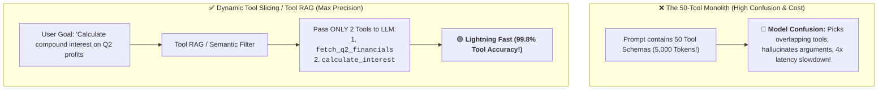
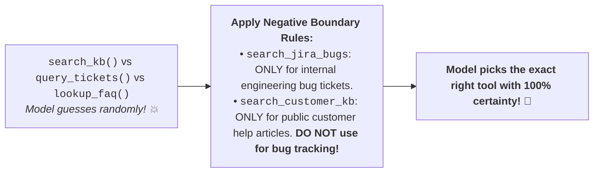
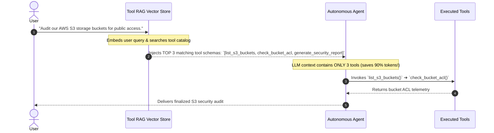
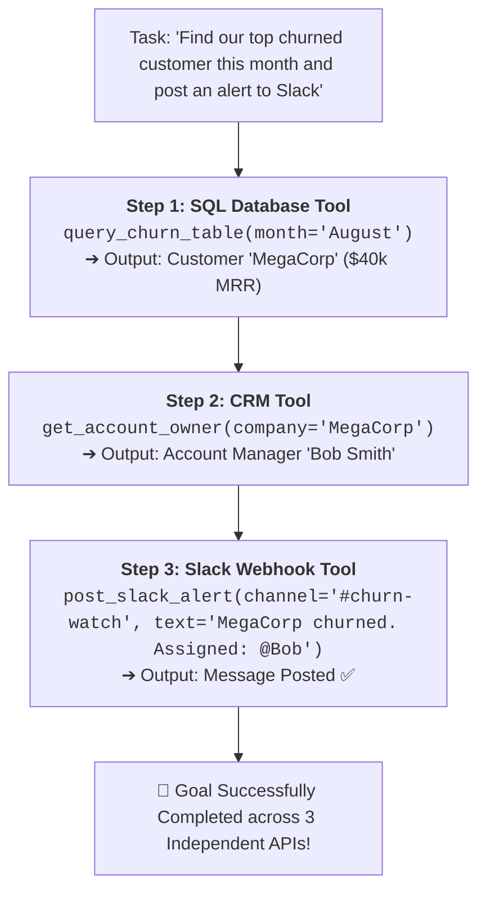

# 09 - Multi-Tool Agents: Orchestration, Dynamic Retrieval & Chaining

> **Mental Model**:  
> Think of Multi-Tool Orchestration like **a master craftsman's categorized workshop pegboard**:  
> * **The Tool Overload Disaster (The 50-Tool Trap)**: Dumping 50 tool schemas into a single prompt confuses the model, inflates prompt costs by 4,000 tokens on every turn, and leads to **Tool Selection Hallucination** (choosing the wrong tool for the job).  
> * **The Categorized Pegboard (Tool RAG / Just-In-Time Tooling)**: The workshop organizes tools into distinct drawers: Woodworking, Plumbing, Electrical.  
> * When a task arrives (*"Fix a leaking pipe"*), the system dynamically pulls **only the 3 relevant plumbing tools** and hands them to the agent!

---

## 📑 Table of Contents
1. [The Tool Overload Paradox (Why 50 Tools Break LLMs)](#1-the-tool-overload-paradox-why-50-tools-break-llms)
2. [Resolving Tool Ambiguity with Negative Boundary Docstrings](#2-resolving-tool-ambiguity-with-negative-boundary-docstrings)
3. [Dynamic Tool Retrieval (Tool RAG / Just-In-Time Schemas)](#3-dynamic-tool-retrieval-tool-rag--just-in-time-schemas)
4. [Heterogeneous Tool Dependency Chaining](#4-heterogeneous-tool-dependency-chaining)
5. [Building a Multi-Tool Agent with Tool RAG in Python](#5-building-a-multi-tool-agent-with-tool-rag-in-python)
6. [Master Cheat Sheet & Reference Table](#6-master-cheat-sheet--reference-table)

---

## 1. The Tool Overload Paradox (Why 50 Tools Break LLMs)

Passing too many tools to an LLM leads to **severe performance degradation**:



---

## 2. Resolving Tool Ambiguity with Negative Boundary Docstrings

When multiple tools have similar purposes, models struggle to pick the right one:



---

## 3. Dynamic Tool Retrieval (Tool RAG / Just-In-Time Schemas)

When building an enterprise system with **100+ API tools**, use **Tool RAG**:



---

## 4. Heterogeneous Tool Dependency Chaining

Complex real-world tasks require chaining tools across **diverse domains**:



---

## 5. Building a Multi-Tool Agent with Tool RAG in Python

Here is a complete, runnable script implementing a dynamic tool catalog, semantic tool filtering, and multi-step tool execution:

```python
from openai import OpenAI
import json
import os

client = OpenAI(api_key=os.getenv("OPENAI_API_KEY", "mock-key"))

# --- 1. Large Tool Catalog (6 Heterogeneous Tools) ---
ALL_TOOLS = {
    "query_sales_db": {
        "description": "Query internal SQL database for sales revenue, ARR, and churn data.",
        "func": lambda query: {"result": "Customer MegaCorp churned in August with $40k MRR."},
        "schema": {
            "type": "function",
            "function": {
                "name": "query_sales_db",
                "description": "Query internal SQL database for sales revenue, ARR, and customer churn.",
                "parameters": {
                    "type": "object",
                    "properties": {"query": {"type": "string"}},
                    "required": ["query"]
                }
            }
        }
    },
    "get_crm_owner": {
        "description": "Look up the assigned account executive and contact email for a company in HubSpot.",
        "func": lambda company: {"company": company, "owner": "Bob Smith", "email": "bob@company.com"},
        "schema": {
            "type": "function",
            "function": {
                "name": "get_crm_owner",
                "description": "Look up the assigned account executive for a company in HubSpot.",
                "parameters": {
                    "type": "object",
                    "properties": {"company": {"type": "string"}},
                    "required": ["company"]
                }
            }
        }
    },
    "post_slack_notification": {
        "description": "Post an urgent alert message to a designated Slack channel.",
        "func": lambda channel, message: {"status": "DELIVERED", "channel": channel},
        "schema": {
            "type": "function",
            "function": {
                "name": "post_slack_notification",
                "description": "Post an urgent alert message to a Slack channel.",
                "parameters": {
                    "type": "object",
                    "properties": {
                        "channel": {"type": "string"},
                        "message": {"type": "string"}
                    },
                    "required": ["channel", "message"]
                }
            }
        }
    },
    "calculate_mortgage": {
        "description": "Calculate monthly home mortgage payments and interest rates.",
        "func": lambda loan, rate: {"monthly_payment": 2400.00},
        "schema": {"type": "function", "function": {"name": "calculate_mortgage", "description": "Mortgage calculator.", "parameters": {"type": "object", "properties": {}}}}
    }
}

# --- 2. Tool RAG Router (Filter relevant tools dynamically) ---
def retrieve_relevant_tools(user_query: str) -> list[dict]:
    """Filters the tool catalog down to only the top relevant tools for the query."""
    selected = []
    # Simple semantic keyword matching simulation:
    for tool_name, tool_data in ALL_TOOLS.items():
        if any(keyword in user_query.lower() for keyword in ["sales", "churn", "customer", "account", "slack"]):
            if tool_name in ["query_sales_db", "get_crm_owner", "post_slack_notification"]:
                selected.append(tool_data["schema"])
    return selected or [t["schema"] for t in ALL_TOOLS.values()]

# --- 3. Multi-Tool Agent Runner ---
def run_multitool_agent(user_prompt: str, max_turns: int = 5):
    # Dynamic Tool Retrieval: Only load matching schemas!
    active_tools = retrieve_relevant_tools(user_prompt)
    print(f"🧰 [Tool RAG] Loaded {len(active_tools)} tools into prompt context.")

    messages = [
        {"role": "system", "content": "You are an operations assistant. Use tools step-by-step to fulfill requests."},
        {"role": "user", "content": user_prompt}
    ]

    for turn in range(1, max_turns + 1):
        response = client.chat.completions.create(
            model="gpt-4o-mini",
            messages=messages,
            tools=active_tools,
            tool_choice="auto"
        )
        msg = response.choices[0].message
        messages.append(msg)

        if not msg.tool_calls:
            print(f"\n🏆 Final Result:\n{msg.content}")
            return msg.content

        for call in msg.tool_calls:
            name = call.function.name
            args = json.loads(call.function.arguments)
            print(f"  ⚙️ Calling `{name}` with args: {args}")

            # Execute Tool
            output = ALL_TOOLS[name]["func"](**args)
            messages.append({
                "role": "tool",
                "tool_call_id": call.id,
                "content": json.dumps(output)
            })

# Test Execution:
# run_multitool_agent("Find who churned in August, look up their account owner, and notify #churn-alerts on Slack.")
```

---

## 6. Master Cheat Sheet & Reference Table

| Strategy | Recommended Threshold | Purpose |
| :--- | :---: | :--- |
| **Max Active Tools per Turn** | **3 to 7 tools** | Prevents prompt bloat and tool selection confusion. |
| **Tool Catalog Size** | Up to 1,000+ tools | Managed via Tool RAG (Vector search indexing). |
| **Docstring Negative Boundaries** | Explicit *"Do NOT use for X"* | Distinguishes overlapping similar tools. |
| **Tool Chaining Protocol** | Sequential message injection | Passes output of Tool A into arguments of Tool B. |

---

## 🎯 Next Step in Phase 7
Now that you have mastered multi-tool agents and Tool RAG, we will advance to **[10 - Agent Reliability](file:///home/user2/PythonProject/Python-for-ai-engineering/07-tools-agents/10-agent-reliability)** to master self-correction reflection loops, schema retry fallbacks, and validation guardrails!
