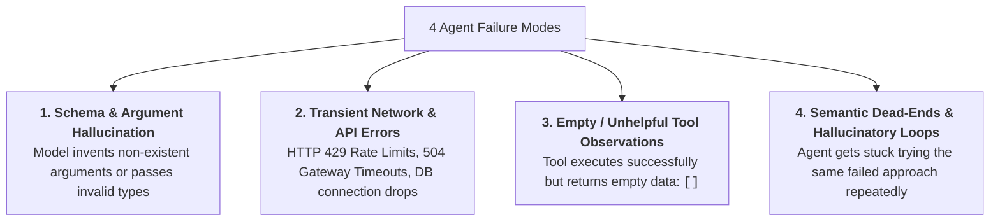
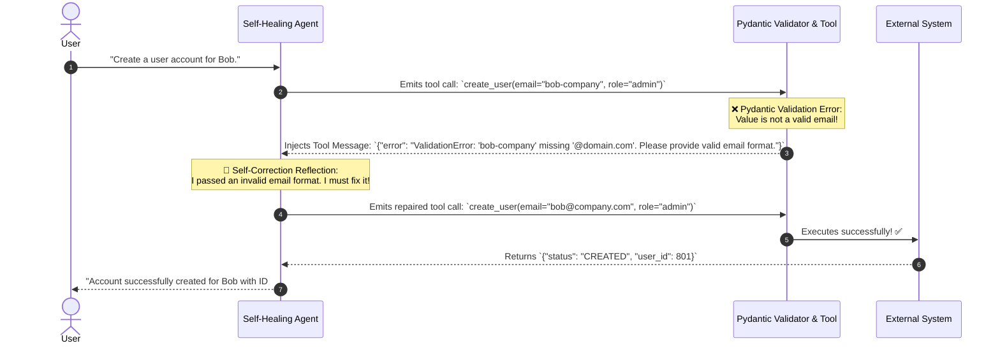
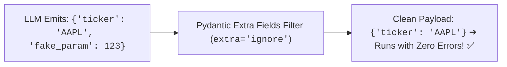
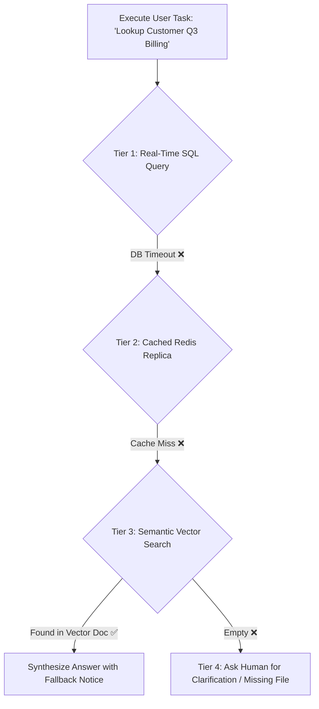

# 10 - Agent Reliability: Self-Correction, Error Recovery & Fallbacks

> **Mental Model**:  
> Think of Agent Reliability like **a commercial aircraft's resilient autopilot**:  
> * **The Fragile Prototype (The Naive Agent)**: If an external API glitches or an argument has a slight typo, the program crashes immediately, killing the session and throwing a fatal `500 Internal Server Error`.  
> * **The Resilient Autopilot (The Self-Healing Agent)**: When the autopilot encounters sudden turbulence, bad sensor readings, or a temporary engine sputter, it doesn't crash the plane!  
> * It catches the error, isolates the faulty sensor, executes a **self-correction reflection loop**, switches to backup navigational instruments, and safely completes the journey.

---

## 📑 Table of Contents
1. [The 4 Common Failure Modes of Agent Systems](#1-the-4-common-failure-modes-of-agent-systems)
2. [The Self-Correction Reflection Loop](#2-the-self-correction-reflection-loop)
3. [Recovering from Hallucinated & Malformed Arguments](#3-recovering-from-hallucinated--malformed-arguments)
4. [The Tiered Fallback Ladder (Graceful Degradation)](#4-the-tiered-fallback-ladder-graceful-degradation)
5. [Building a Self-Healing Resilient Agent in Python](#5-building-a-self-healing-resilient-agent-in-python)
6. [Master Cheat Sheet & Reference Table](#6-master-cheat-sheet--reference-table)

---

## 1. The 4 Common Failure Modes of Agent Systems



---

## 2. The Self-Correction Reflection Loop

Instead of crashing when Python validation fails, **feed the error back to the model as a learning signal**:



---

## 3. Recovering from Hallucinated & Malformed Arguments

When an LLM invents an argument that doesn't exist in your function signature, sanitize it before calling Python:



---

## 4. The Tiered Fallback Ladder (Graceful Degradation)

When a critical tool fails permanently, an agent should **gracefully degrade down a fallback ladder**:



---

## 5. Building a Self-Healing Resilient Agent in Python

Here is a complete, runnable script implementing automatic Pydantic argument validation trapping, self-correction retries, and fallback tool routing:

```python
from pydantic import BaseModel, Field, EmailStr, ValidationError
from openai import OpenAI
import json
import os

client = OpenAI(api_key=os.getenv("OPENAI_API_KEY", "mock-key"))

# --- 1. Tool Arguments Schema with Strict Email Validation ---
class CreateUserArgs(BaseModel):
    name: str = Field(description="Full name of the employee.")
    email: EmailStr = Field(description="Valid corporate email address containing @ and domain.")
    role: str = Field(default="viewer", description="Role: viewer, editor, admin.")

def create_user_record(name: str, email: str, role: str) -> dict:
    """Mock database write function."""
    return {"status": "SUCCESS", "user_id": 9042, "email": email, "role": role}

TOOLS = [{
    "type": "function",
    "function": {
        "name": "create_user_record",
        "description": "Create a new employee user account.",
        "parameters": CreateUserArgs.model_json_schema()
    }
}]

# --- 2. The Self-Healing Execution Controller ---
def run_self_healing_agent(prompt: str, max_turns: int = 5):
    messages = [
        {"role": "system", "content": "You are a reliable administrative assistant. If tool calls fail, analyze the error and self-correct your parameters."},
        {"role": "user", "content": prompt}
    ]
    
    print(f"👤 User Request: {prompt}\n" + "="*50)

    for turn in range(1, max_turns + 1):
        response = client.chat.completions.create(
            model="gpt-4o-mini",
            messages=messages,
            tools=TOOLS,
            tool_choice="auto"
        )
        msg = response.choices[0].message
        messages.append(msg)

        if not msg.tool_calls:
            print(f"\n🏆 Final Response:\n{msg.content}")
            return msg.content

        for call in msg.tool_calls:
            func_name = call.function.name
            raw_args_str = call.function.arguments
            print(f"⚙️ [Turn {turn}] Model requested `{func_name}` with args: {raw_args_str}")

            try:
                # Step 1: Validate with Pydantic
                args_dict = json.loads(raw_args_str)
                validated_args = CreateUserArgs(**args_dict)
                
                # Step 2: Execute Tool
                result = create_user_record(**validated_args.model_dump())
                tool_output_str = json.dumps(result)
                print(f"  ✅ Tool execution successful!")

            except ValidationError as ve:
                # Intercept validation failure and feed back clean instructions
                clean_error = f"Validation Error in tool arguments: {ve.errors()[0]['msg']}. Please fix this parameter and retry."
                tool_output_str = json.dumps({"error": clean_error})
                print(f"  🛡️ [SELF-HEALING TRAP] Intercepted invalid args. Prompting model to self-correct...")

            except Exception as e:
                tool_output_str = json.dumps({"error": f"Execution failed: {str(e)}"})

            # Append tool feedback
            messages.append({
                "role": "tool",
                "tool_call_id": call.id,
                "content": tool_output_str
            })

# Test Self-Healing: Passing an invalid email to observe automatic reflection & repair!
# run_self_healing_agent("Please create an admin account for Alice with email alice-at-work")
```

---

## 6. Master Cheat Sheet & Reference Table

| Failure Type | Self-Healing Mechanism | Retry Budget |
| :--- | :--- | :---: |
| **Validation Error** | Feed Pydantic error description back into `role: 'tool'`. | **2 retries max** |
| **Transient 500/429** | Exponential backoff jitter retry before alerting LLM. | **3 retries max** |
| **Empty Search Results** | Suggest query generalization / broader synonyms in system note. | **1 retry** |
| **Unrecoverable Failure**| Graceful degradation to secondary tool or human escalation. | **Immediate fallback** |

---

## 🎯 Next Step in Phase 7
Now that you have mastered agent reliability, self-correction loops, and fallback strategies, we will advance to the final topic of Phase 7: **[11 - Agent Architecture](file:///home/user2/PythonProject/Python-for-ai-engineering/07-tools-agents/11-agent-architecture)** to master Plan-and-Solve patterns, Multi-Agent Supervisor trees, and production orchestration frameworks!
