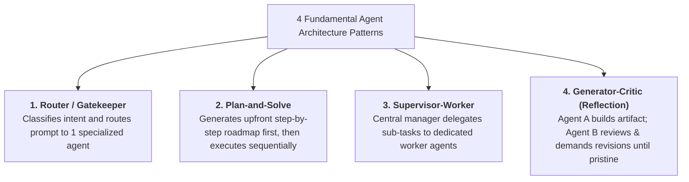
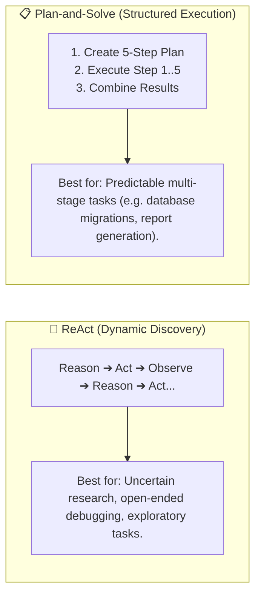
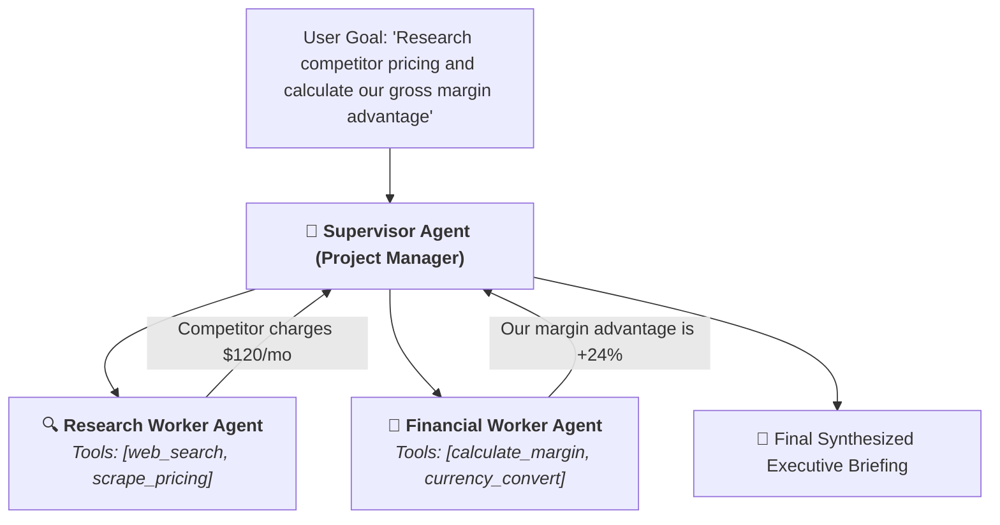
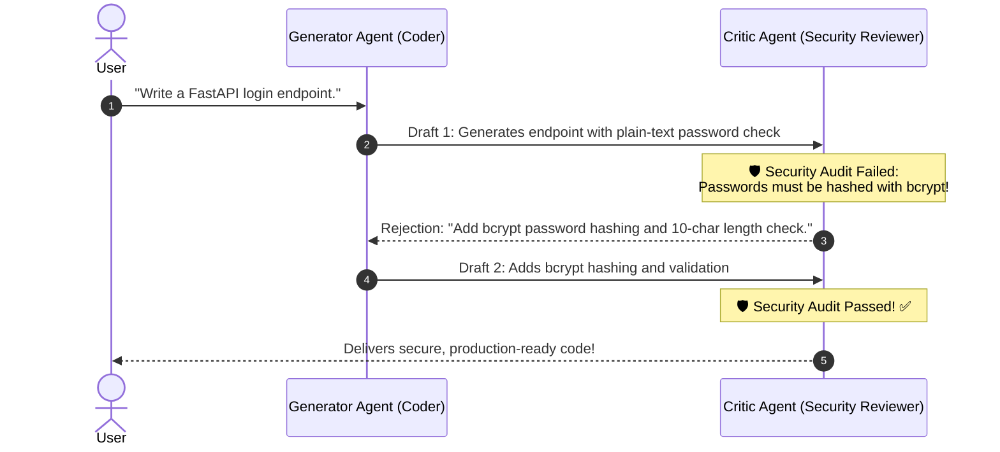

# 11 - Agent Architecture: Supervisor-Worker, Plan-and-Solve & Patterns

> **Mental Model**:  
> Think of Agent Architecture like **a Hollywood film production studio vs. a solo freelancer**:  
> * **The Solo Freelancer (Single Monolithic Agent)**: One person trying to write the script, shoot the video, compose the musical score, and edit the visual effects. They quickly get overwhelmed, lose focus, and deliver a mediocre film.  
> * **The Studio Hierarchy (Supervisor-Worker Architecture)**:  
>   * **The Executive Producer (Supervisor Agent)**: Breaks the master project into department milestones and delegates tasks.  
>   * **The Screenwriter (Specialized Worker Agent)**: Equipped *only* with creative writing tools.  
>   * **The Financial Auditor (Specialized Worker Agent)**: Equipped *only* with spreadsheet calculators.  
>   * **The Film Critic (Evaluator Agent)**: Reviews the draft, flags plot holes, and requests revisions before the movie hits theaters!

---

## 📑 Table of Contents
1. [The 4 Fundamental Agent Design Patterns](#1-the-4-fundamental-agent-design-patterns)
2. [Plan-and-Solve vs. ReAct: Architectural Comparison](#2-plan-and-solve-vs-react-architectural-comparison)
3. [The Supervisor-Worker Hierarchical Pattern](#3-the-supervisor-worker-hierarchical-pattern)
4. [The Generator-Critic (Reflection & Review) Pattern](#4-the-generator-critic-reflection--review-pattern)
5. [Building a Multi-Agent Supervisor-Worker System in Python](#5-building-a-multi-agent-supervisor-worker-system-in-python)
6. [Master Cheat Sheet & Reference Table](#6-master-cheat-sheet--reference-table)

---

## 1. The 4 Fundamental Agent Design Patterns



---

## 2. Plan-and-Solve vs. ReAct: Architectural Comparison



### Architectural Trade-Offs:

| Feature | 🔄 ReAct Pattern | 📋 Plan-and-Solve Pattern |
| :--- | :--- | :--- |
| **Planning Horizon** | 1 step ahead (Opportunistic). | Entire task mapped upfront. |
| **Token Cost** | Higher (Reasoning on every turn). | Lower (Single upfront plan + fast tool calls). |
| **Handling Obstacles** | **Exceptional** (Adapts immediately). | Requires replanning if a step fails. |
| **Best Used When** | Environment state is unknown. | Steps are clear and deterministic. |

---

## 3. The Supervisor-Worker Hierarchical Pattern

In production multi-agent systems, a **Supervisor Agent** coordinates specialized worker agents:



---

## 4. The Generator-Critic (Reflection & Review) Pattern

Never let an agent ship critical code or documents without an **independent critic review loop**:



---

## 5. Building a Multi-Agent Supervisor-Worker System in Python

Here is a complete, runnable Hierarchical Multi-Agent system implemented in pure Python:

```python
from openai import OpenAI
import json
import os

client = OpenAI(api_key=os.getenv("OPENAI_API_KEY", "mock-key"))

# --- 1. Specialized Worker Agents ---
def research_worker(topic: str) -> str:
    """Specialized worker for factual lookup."""
    print(f"  🔍 [ResearchWorker] Investigating: '{topic}'")
    # Simulated search
    if "pricing" in topic.lower():
        return "Competitor SaaS charges $100/user/month with annual discounts."
    return "No public data found."

def math_worker(expression: str) -> str:
    """Specialized worker for financial calculations."""
    print(f"  🧮 [MathWorker] Calculating: '{expression}'")
    try:
        val = eval(expression, {"__builtins__": None}, {})
        return str(round(val, 2))
    except Exception as e:
        return f"Error: {e}"

# --- 2. Supervisor Tools (Delegation Blueprints) ---
SUPERVISOR_TOOLS = [
    {
        "type": "function",
        "function": {
            "name": "delegate_to_researcher",
            "description": "Delegate a factual research or market analysis question to the Research Agent.",
            "parameters": {
                "type": "object",
                "properties": {"topic": {"type": "string"}},
                "required": ["topic"]
            }
        }
    },
    {
        "type": "function",
        "function": {
            "name": "delegate_to_mathematician",
            "description": "Delegate a complex mathematical or financial calculation to the Math Agent.",
            "parameters": {
                "type": "object",
                "properties": {"expression": {"type": "string"}},
                "required": ["expression"]
            }
        }
    }
]

# --- 3. Supervisor Orchestration Engine ---
def run_supervisor_orchestrator(master_goal: str, max_turns: int = 5):
    print(f"👑 [Supervisor] Received Goal: '{master_goal}'\n" + "="*60)
    
    messages = [
        {"role": "system", "content": "You are the Executive Supervisor. Decompose the goal, delegate sub-tasks to your specialized workers, and synthesize the final answer."},
        {"role": "user", "content": master_goal}
    ]

    for turn in range(1, max_turns + 1):
        response = client.chat.completions.create(
            model="gpt-4o-mini",
            messages=messages,
            tools=SUPERVISOR_TOOLS,
            tool_choice="auto"
        )
        msg = response.choices[0].message
        messages.append(msg)

        # If supervisor is ready with final answer
        if not msg.tool_calls:
            print(f"\n🏆 Final Executive Report:\n{msg.content}")
            return msg.content

        # Route delegations to worker agents
        for call in msg.tool_calls:
            func_name = call.function.name
            args = json.loads(call.function.arguments)

            if func_name == "delegate_to_researcher":
                worker_result = research_worker(args["topic"])
            elif func_name == "delegate_to_mathematician":
                worker_result = math_worker(args["expression"])
            else:
                worker_result = "Unknown worker"

            messages.append({
                "role": "tool",
                "tool_call_id": call.id,
                "content": json.dumps({"worker_output": worker_result})
            })

# Test Multi-Agent System:
# run_supervisor_orchestrator("Find competitor pricing for SaaS and calculate the annual cost for 50 employees.")
```

---

## 6. Master Cheat Sheet & Reference Table

| Pattern | Best Use Case | Key Strength |
| :--- | :--- | :--- |
| **Router Pattern** | Multi-topic chatbots / Customer support triage. | Fast single-hop delegation to domain expert. |
| **Plan-and-Solve** | Long-form report writing / Data migrations. | Predictable structured execution roadmap. |
| **Supervisor-Worker**| Complex operations requiring multiple skills. | Context isolation; workers only see their tools. |
| **Generator-Critic** | Automated code generation / Legal compliance. | Built-in quality verification and iterative refinement. |

---

## 🏁 Phase 7 Complete!
Congratulations! You have mastered all 11 core topics of **Phase 7: Tools & Autonomous Agents**:
1. [01 - Tool Calling Fundamentals](file:///home/user2/PythonProject/Python-for-ai-engineering/07-tools-agents/01-tool-calling-fundamentals/README.md)
2. [02 - Tool Calling Flow](file:///home/user2/PythonProject/Python-for-ai-engineering/07-tools-agents/02-tool-calling-flow/README.md)
3. [03 - Function Calling in Practice](file:///home/user2/PythonProject/Python-for-ai-engineering/07-tools-agents/03-function-calling/README.md)
4. [04 - Tool Design & Best Practices](file:///home/user2/PythonProject/Python-for-ai-engineering/07-tools-agents/04-tool-design/README.md)
5. [05 - Tool Execution Safety & Guardrails](file:///home/user2/PythonProject/Python-for-ai-engineering/07-tools-agents/05-tool-execution-safety/README.md)
6. [06 - Agent Fundamentals](file:///home/user2/PythonProject/Python-for-ai-engineering/07-tools-agents/06-agent-fundamentals/README.md)
7. [07 - Agent Loops & Termination](file:///home/user2/PythonProject/Python-for-ai-engineering/07-tools-agents/07-agent-loops/README.md)
8. [08 - Agent Memory & State](file:///home/user2/PythonProject/Python-for-ai-engineering/07-tools-agents/08-agent-memory-state/README.md)
9. [09 - Multi-Tool Agents](file:///home/user2/PythonProject/Python-for-ai-engineering/07-tools-agents/09-multi-tool-agents/README.md)
10. [10 - Agent Reliability](file:///home/user2/PythonProject/Python-for-ai-engineering/07-tools-agents/10-agent-reliability/README.md)
11. [11 - Agent Architecture & Patterns](file:///home/user2/PythonProject/Python-for-ai-engineering/07-tools-agents/11-agent-architecture/README.md)
