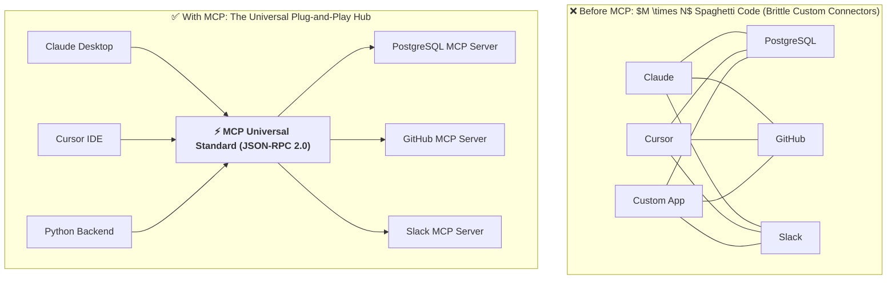
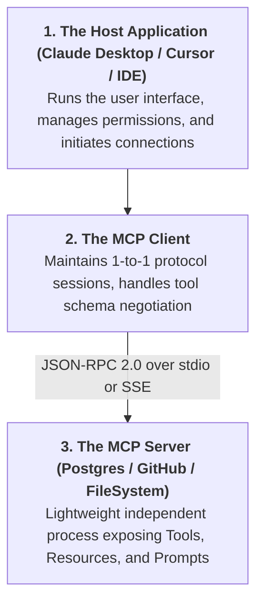
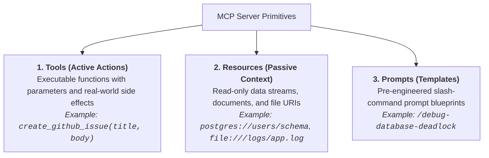
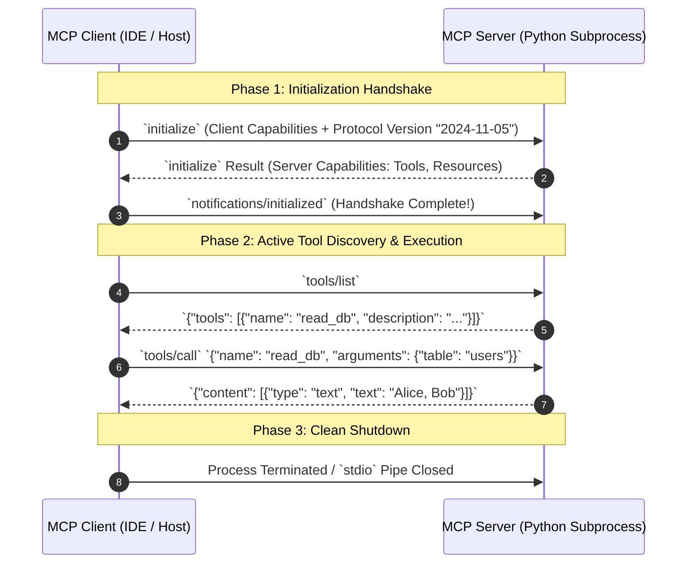
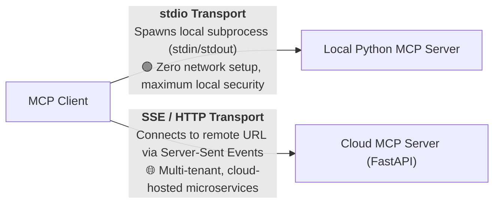

# 01 - MCP Fundamentals: The Universal USB-C Standard for AI

> **Welcome to Phase 8: Model Context Protocol (MCP) & Agent-to-Agent (A2A) Systems!**  
> **Mental Model**:  
> Think of MCP like the **USB-C universal hardware standard for AI**:  
> * **The $M \times N$ Integration Nightmare (Before MCP)**: If you had 5 AI clients (Claude Desktop, Cursor, OpenAI, Antigravity, Custom App) and 5 data sources (Postgres, GitHub, Slack, Notion, Jira), developers had to build **25 custom proprietary integrations**!  
> * **The Universal Standard (With MCP)**: Any tool author builds **ONE single MCP Server**. Any AI client connects to it instantly using a standardized **JSON-RPC protocol**!  
> MCP transforms messy proprietary integrations into a clean, plug-and-play ecosystem.

---

## 📑 Table of Contents
1. [The $M \times N$ Problem vs. The MCP Universal Standard](#1-the-m-x-n-problem-vs-the-mcp-universal-standard)
2. [The 3 Core Actors: Host, Client & Server](#2-the-3-core-actors-host-client--server)
3. [The 3 Primitives of MCP: Tools, Resources & Prompts](#3-the-3-primitives-of-mcp-tools-resources--prompts)
4. [JSON-RPC 2.0 Protocol & The Lifecycle Handshake](#4-json-rpc-20-protocol--the-lifecycle-handshake)
5. [Transports: stdio (Local Subprocess) vs. SSE / HTTP (Remote Cloud)](#5-transports-stdio-local-subprocess-vs-sse--http-remote-cloud)
6. [Building a FastMCP Server in Python](#6-building-a-fastmcp-server-in-python)
7. [Master Cheat Sheet & Reference Table](#7-master-cheat-sheet--reference-table)

---

## 1. The $M \times N$ Problem vs. The MCP Universal Standard



---

## 2. The 3 Core Actors: Host, Client & Server

MCP defines a clean **tri-tier separation of concerns**:



---

## 3. The 3 Primitives of MCP: Tools, Resources & Prompts

An MCP server can expose **3 fundamental capabilities**:



### Primitive Comparison Matrix:

| Primitive | Nature | Can Modify State? | Read by LLM As |
| :--- | :--- | :---: | :--- |
| **`Tools`** | Executable function | **Yes** (Writes DB, creates files) | Function Calling Tool Schema |
| **`Resources`** | Read-only data | **No** (Safe passive context) | Document Attachment / Context |
| **`Prompts`** | Prompt Blueprint | **No** (Template generator) | Formatted User / System Prompt |

---

## 4. JSON-RPC 2.0 Protocol & The Lifecycle Handshake

All communication between MCP Client and Server uses **JSON-RPC 2.0**:



---

## 5. Transports: `stdio` (Local) vs. `SSE / HTTP` (Remote)



### Transport Trade-Offs:

| Transport | Connection Medium | Latency | Deployment Complexity | Security Boundary |
| :--- | :--- | :---: | :--- | :--- |
| **`stdio`** | Local Standard In/Out Pipes | $< 1\text{ms}$ | **Trivial** (Spawned as child process) | Isolated to local machine OS user. |
| **`SSE / HTTP`** | Server-Sent Events + HTTP POST | $\sim 50\text{ms}$ | Requires hosting, TLS, and Auth tokens | Needs API key auth and CORS configuration. |

---

## 6. Building a FastMCP Server in Python

The official **FastMCP** framework allows building production MCP servers in seconds:

```python
from mcp.server.fastmcp import FastMCP
import os

# 1. Initialize FastMCP Server
mcp = FastMCP("enterprise_tools_server")

# 2. Expose a Tool (Active Function)
@mcp.tool()
def calculate_vat_tax(amount: float, country_code: str = "US") -> float:
    """Calculate value-added tax for a purchase amount based on country code.
    
    Args:
        amount: Purchase subtotal in dollars.
        country_code: 2-letter ISO country code, e.g. US, UK, DE.
    """
    tax_rates = {"US": 0.08, "UK": 0.20, "DE": 0.19}
    rate = tax_rates.get(country_code.upper(), 0.10)
    return round(amount * rate, 2)

# 3. Expose a Resource (Passive Context URI)
@mcp.resource("config://app-settings")
def get_app_settings() -> str:
    """Provides read-only access to system configuration."""
    return "ENVIRONMENT=production\nDATABASE_REGION=us-east-1\nMAX_WORKERS=8"

# 4. Expose a Prompt Template
@mcp.prompt()
def review_tax_invoice(invoice_id: str) -> str:
    """Generates an audit prompt for verifying invoice tax calculations."""
    return f"Please audit invoice #{invoice_id}, verify all VAT tax calculations using `calculate_vat_tax`, and flag discrepancies."

# 5. Run Server over stdio
if __name__ == "__main__":
    mcp.run(transport="stdio")
```

---

## 7. Master Cheat Sheet & Reference Table

| Concept | Definition |
| :--- | :--- |
| **MCP** | Model Context Protocol — open standard for connecting LLMs to data and tools. |
| **Host** | The UI/App running the LLM (e.g. Claude Desktop, Cursor, Antigravity, custom app). |
| **Server** | Standalone process implementing the MCP protocol to provide tools and resources. |
| **`tools/list`** | JSON-RPC method to discover all callable functions exposed by the server. |
| **`tools/call`** | JSON-RPC method to execute a named tool with validated arguments. |
| **`stdio`** | Default transport using standard input/output streams for zero-latency local execution. |

---

## 🎯 Next Step in Phase 8
Now that you understand MCP fundamentals and the Host-Client-Server model, we will advance to **[02 - MCP Tools](file:///home/user2/PythonProject/Python-for-ai-engineering/08-mcp-a2a/02-mcp-tools)** to master building production MCP tools, error reporting formats, and binary asset streaming!
