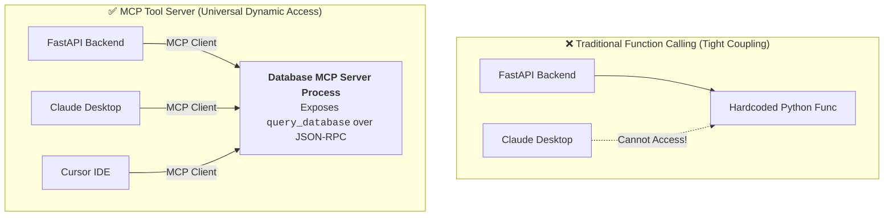
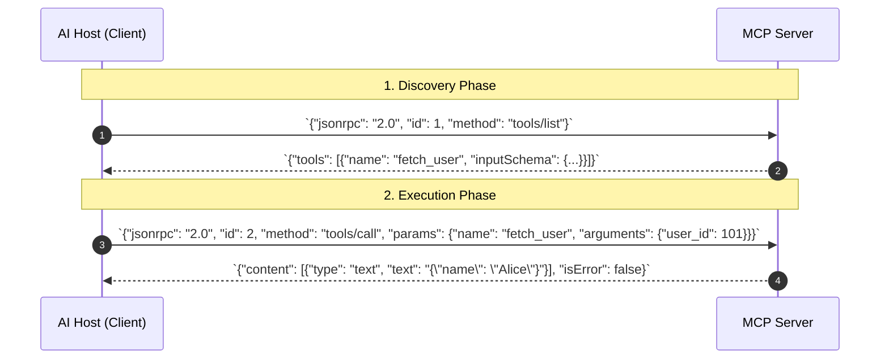
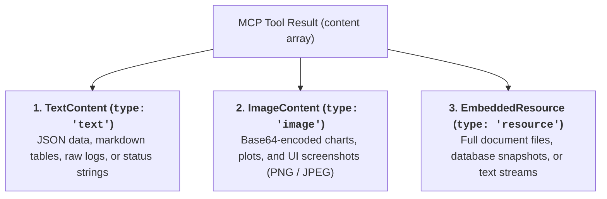
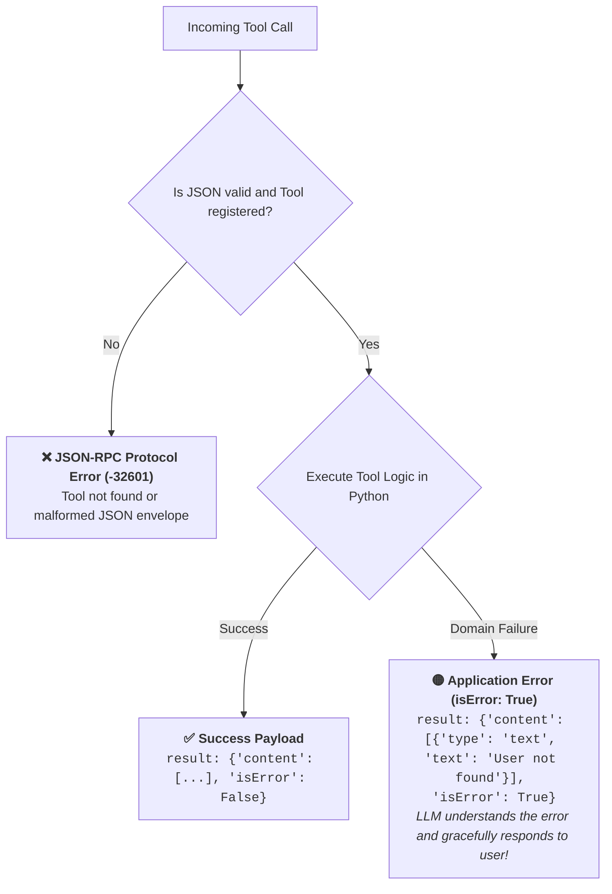

# 02 - MCP Tools: Dynamic Function Exposure & Execution Handlers

> **Mental Model**:  
> Think of MCP Tools like **smart home appliances plugging into a universal wall socket**:  
> * **Standard Function Calling (Hardcoded Coupling)**: Your Python backend must write, import, and execute the function in the same codebase. If you want to share that function with Claude Desktop or Cursor, you have to rewrite the connector from scratch!  
> * **MCP Tools (Decoupled Micro-Servers)**: The tool runs inside an independent process. It announces its name, parameters, and return types over **`tools/list`**.  
> * Any MCP-compliant AI client plugs into the socket, discovers the tool dynamically, and triggers execution over **`tools/call`** with zero code duplication!

---

## 📑 Table of Contents
1. [Monolithic Function Calling vs. MCP Micro-Tools](#1-monolithic-function-calling-vs-mcp-micro-tools)
2. [The JSON-RPC Wire Protocol: tools/list & tools/call](#2-the-json-rpc-wire-protocol-toolslist--toolscall)
3. [Multi-Modal Return Content (Text, Images & Binary)](#3-multi-modal-return-content-text-images--binary)
4. [Error Reporting: isError Flags vs. JSON-RPC Protocol Errors](#4-error-reporting-iserror-flags-vs-json-rpc-protocol-errors)
5. [Building a Production Multi-Modal MCP Tool Server in Python](#5-building-a-production-multi-modal-mcp-tool-server-in-python)
6. [Master Cheat Sheet & Reference Table](#6-master-cheat-sheet--reference-table)

---

## 1. Monolithic Function Calling vs. MCP Micro-Tools



---

## 2. The JSON-RPC Wire Protocol: `tools/list` & `tools/call`

Under the hood, all MCP tool interactions use two primary JSON-RPC 2.0 methods:



### 1️⃣ `tools/list` Schema Specification:
```json
{
  "name": "generate_report",
  "description": "Generates a quarterly financial revenue report.",
  "inputSchema": {
    "type": "object",
    "properties": {
      "quarter": { "type": "string", "enum": ["Q1", "Q2", "Q3", "Q4"] },
      "year": { "type": "integer", "default": 2026 }
    },
    "required": ["quarter"]
  }
}
```

---

## 3. Multi-Modal Return Content (Text, Images & Binary)

MCP tool returns are **not restricted to plain strings**—they return an array of **Content Blocks**:



---

## 4. Error Reporting: `isError` Flags vs. JSON-RPC Protocol Errors

MCP strictly separates **Protocol Failures** from **Tool Business Logic Failures**:



### Error Comparison:

| Error Type | Transport Level | `isError` Flag | Example Trigger |
| :--- | :--- | :---: | :--- |
| **Protocol Error** | JSON-RPC Level (`error: {...}`) | N/A | Unknown tool name, invalid JSON-RPC version. |
| **Tool Execution Error** | Application Level (`result: {...}`) | **`isError: true`** | Invalid database ID, insufficient balance, API timeout. |

---

## 5. Building a Production Multi-Modal MCP Tool Server in Python

Here is a complete, runnable script using the official **FastMCP** framework exposing text and image tools:

```python
from mcp.server.fastmcp import FastMCP, Image
from typing import Literal
import base64
import io

# 1. Initialize FastMCP Server
mcp = FastMCP("enterprise_tools_hub")

# --- Tool 1: Text & Database Query Tool ---
@mcp.tool()
def query_user_account(user_id: int) -> dict:
    """Fetch user profile, subscription status, and billing balance.
    
    Args:
        user_id: The unique customer identification integer.
    """
    # Mock database
    database = {
        101: {"name": "Alice Johnson", "tier": "Enterprise", "balance": 150.00},
        102: {"name": "Bob Smith", "tier": "Starter", "balance": 0.00}
    }
    
    user = database.get(user_id)
    if not user:
        raise ValueError(f"Customer ID {user_id} does not exist in our records.")
    
    return user

# --- Tool 2: Multi-Modal Image Generation Tool ---
@mcp.tool()
def render_status_badge(status: Literal["healthy", "degraded", "down"]) -> Image:
    """Renders a visual status indicator badge as an image.
    
    Args:
        status: The server health state ('healthy', 'degraded', 'down').
    """
    # Create a 1x1 mock PNG image byte buffer (Simulated chart/badge)
    mock_png_bytes = (
        b'\x89PNG\r\n\x1a\n\x00\x00\x00\rIHDR\x00\x00\x00\x01\x00\x00\x00\x01'
        b'\x08\x06\x00\x00\x00\x1f\x15c4\x00\x00\x00\nIDATx\x9cc\x00\x01'
        b'\x00\x00\x05\x00\x01\r\n-\xb4\x00\x00\x00\x00IEND\xaeB`\x82'
    )
    return Image(data=mock_png_bytes, format="png")

# --- Run FastMCP over stdio ---
if __name__ == "__main__":
    mcp.run(transport="stdio")
```

---

## 6. Master Cheat Sheet & Reference Table

| Feature | Specification | Role |
| :--- | :--- | :--- |
| **`tools/list`** | JSON-RPC method | Returns all tool definitions and `inputSchema` objects. |
| **`tools/call`** | JSON-RPC method | Invokes a specific tool with `arguments` dictionary. |
| **`TextContent`** | `{"type": "text", "text": "..."}` | Standard text or stringified JSON payload. |
| **`ImageContent`** | `{"type": "image", "data": "base64", "mimeType": "..."}` | Visual charts, screenshots, and plots for vision models. |
| **`isError: true`** | Boolean in `result` | Informs client that tool experienced a recoverable application error. |

---

## 🎯 Next Step in Phase 8
Now that you have mastered MCP tools and multi-modal execution returns, we will advance to **[03 - MCP Resources](file:///home/user2/PythonProject/Python-for-ai-engineering/08-mcp-a2a/03-mcp-resources)** to master URI schemes (`file://`, `postgres://`), passive context streaming, and real-time resource subscriptions!
