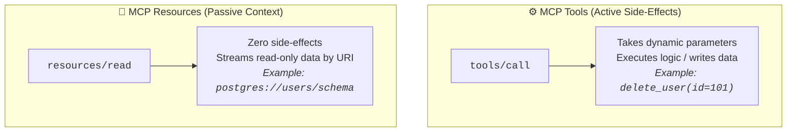
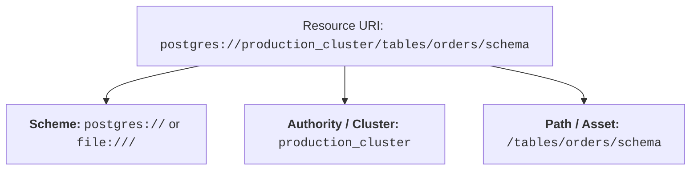
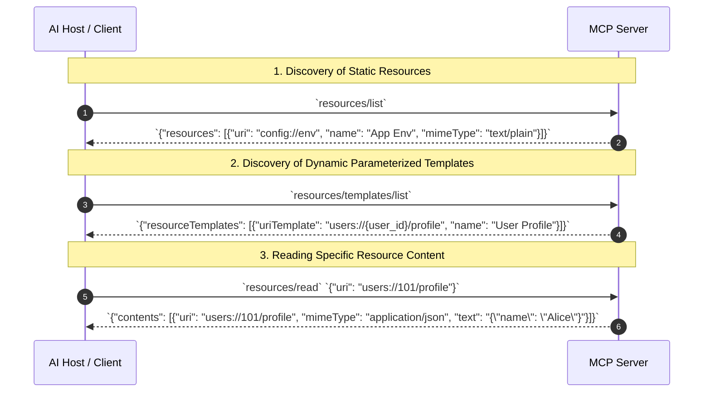
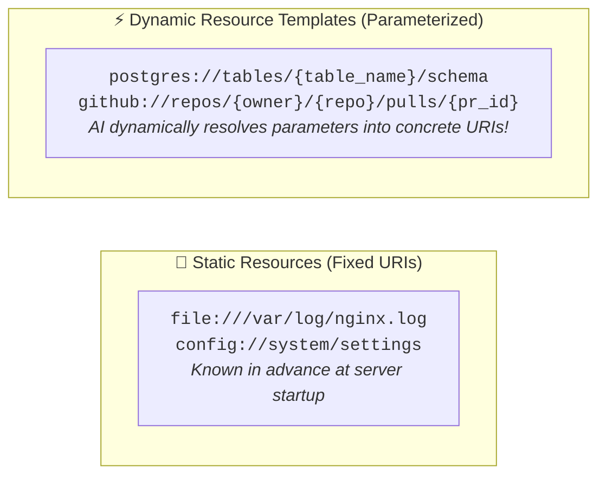
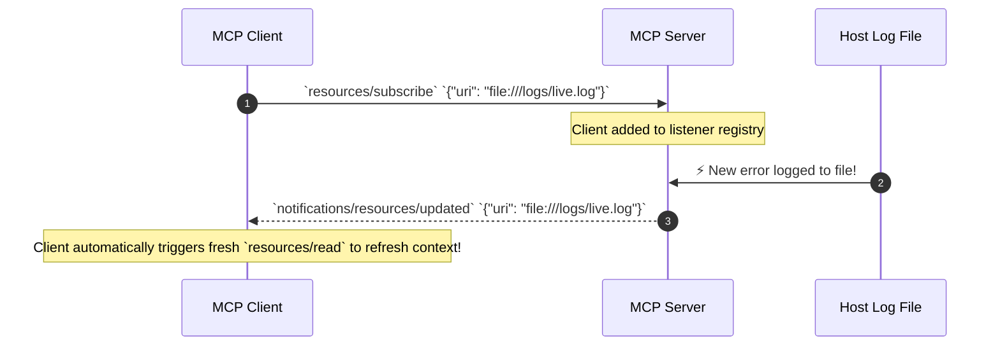

# 03 - MCP Resources: Passive Context, URI Schemes & Subscriptions

> **Mental Model**:  
> Think of MCP Resources like **a reference library desk vs. an active chemistry laboratory**:  
> * **Tools (The Laboratory Power Tools)**: Active functions that take parameters and produce side effects (*"Run SQL query"*, *"Send Email"*).  
> * **Resources (The Reference Library Shelves)**: Passive, read-only data documents identified by unique **URI addresses** (`postgres://prod/schema`, `file:///logs/today.log`).  
> * An AI assistant looks up the catalog card (URI), pulls the book off the shelf via **`resources/read`**, and injects the raw text into its prompt as verified background context!

---

## 📑 Table of Contents
1. [Tools vs. Resources: The Active / Passive Divide](#1-tools-vs-resources-the-active--passive-divide)
2. [The Resource URI Hierarchy & Protocol Methods](#2-the-resource-uri-hierarchy--protocol-methods)
3. [Static Resources vs. Dynamic Resource Templates](#3-static-resources-vs-dynamic-resource-templates)
4. [Real-Time Subscriptions & Live Update Notifications](#4-real-time-subscriptions--live-update-notifications)
5. [Building a Production FastMCP Resource Server in Python](#5-building-a-production-fastmcp-resource-server-in-python)
6. [Master Cheat Sheet & Reference Table](#6-master-cheat-sheet--reference-table)

---

## 1. Tools vs. Resources: The Active / Passive Divide



---

## 2. The Resource URI Hierarchy & Protocol Methods

Every MCP resource is uniquely addressed using a standard **Uniform Resource Identifier (URI)**:



### The 3 Core Resource Protocol Methods:



---

## 3. Static Resources vs. Dynamic Resource Templates



### Direct Comparison:

| Dimension | 📌 Static Resources | ⚡ Resource Templates |
| :--- | :--- | :--- |
| **Discovery Method** | `resources/list` | `resources/templates/list` |
| **URI Format** | Fixed string (`config://app`) | RFC 6570 URI Template (`db://{table}`) |
| **Parameters** | None | Dynamically resolved by client |
| **Best Use Case** | System logs, application configs, API docs. | Database tables, user records, GitHub PRs. |

---

## 4. Real-Time Subscriptions & Live Update Notifications

When a database table or log file changes on the server, the server can **notify subscribed clients in real time**:



---

## 5. Building a Production FastMCP Resource Server in Python

Here is a complete, runnable script using **FastMCP** exposing static configurations, live log streams, and dynamic parameterized user templates:

```python
from mcp.server.fastmcp import FastMCP
import json

# 1. Initialize Server
mcp = FastMCP("enterprise_knowledge_hub")

# --- 2. Expose a Static System Config Resource ---
@mcp.resource("config://app/settings")
def get_system_config() -> str:
    """Provides read-only access to runtime application environment settings."""
    settings = {
        "environment": "production",
        "region": "us-east-1",
        "max_concurrency": 64,
        "logging_level": "INFO"
    }
    return json.dumps(settings, indent=2)

# --- 3. Expose a Static File / Log Stream Resource ---
@mcp.resource("file:///logs/server.log", mime_type="text/plain")
def get_live_server_logs() -> str:
    """Reads latest server operational telemetry log lines."""
    return "[2026-08-25 12:00:01] INFO: Health check 200 OK\n[2026-08-25 12:00:04] WARN: High CPU usage (78%)"

# --- 4. Expose a Dynamic Resource Template ({user_id}) ---
@mcp.resource("users://{user_id}/audit", mime_type="application/json")
def get_user_audit_trail(user_id: str) -> str:
    """Fetches historical security audit records for any customer ID.
    
    Args:
        user_id: The customer account identifier.
    """
    mock_audit = {
        "user_id": user_id,
        "last_login": "2026-08-25 10:14 UTC",
        "ip_address": "192.168.1.50",
        "mfa_enabled": True
    }
    return json.dumps(mock_audit)

# --- Run FastMCP Server ---
if __name__ == "__main__":
    mcp.run(transport="stdio")
```

---

## 6. Master Cheat Sheet & Reference Table

| Protocol Method | Direction | Purpose |
| :--- | :--- | :--- |
| **`resources/list`** | Client $\rightarrow$ Server | Discover all static read-only resource URIs. |
| **`resources/templates/list`** | Client $\rightarrow$ Server | Discover parameterized URI templates (e.g. `users://{id}`). |
| **`resources/read`** | Client $\rightarrow$ Server | Fetch the textual content and MIME type for a concrete URI. |
| **`resources/subscribe`** | Client $\rightarrow$ Server | Register client for real-time push update notifications. |
| **`notifications/resources/updated`**| Server $\rightarrow$ Client | Event emitted when a subscribed resource undergoes a change. |

---

## 🎯 Next Step in Phase 8
Now that you have mastered MCP resources and URI templates, we will advance to **[04 - MCP Prompts](file:///home/user2/PythonProject/Python-for-ai-engineering/08-mcp-a2a/04-mcp-prompts)** to master reusable server-side prompt blueprints, slash command integrations, and parameter injection!
