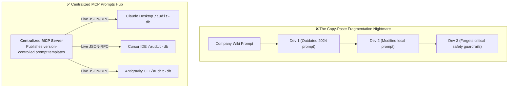
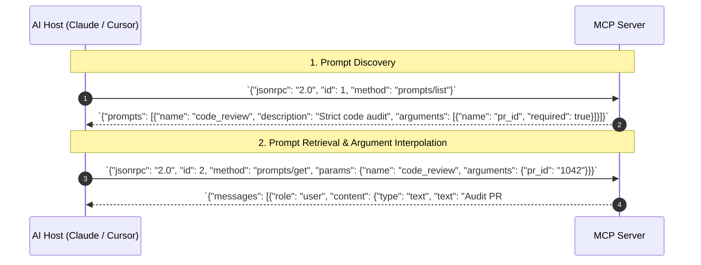
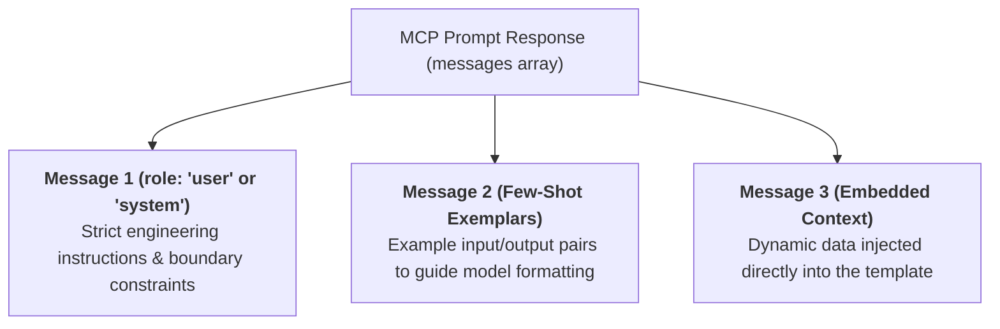
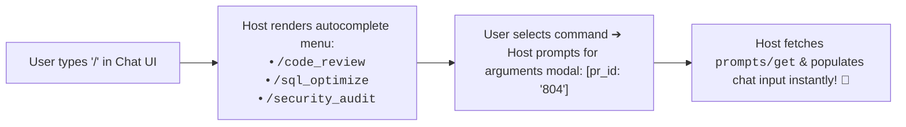

# 04 - MCP Prompts: Pre-Engineered Checklists & Slash Commands

> **Mental Model**:  
> Think of MCP Prompts like **pre-engineered airline flight checklists**:  
> * **The Copy-Paste Chaos (Without MCP)**: A team creates an amazing prompt for auditing database deadlocks. To share it, they copy-paste text into Slack or Wiki pages. Soon, 10 developers are using 10 outdated, slightly different versions of the prompt!  
> * **The Standardized Flight Operations Hub (With MCP Prompts)**: The server publishes standardized, tested prompt blueprints.  
> * When a developer opens Claude Desktop or Cursor and types **`/` (Slash Command)**, the UI queries **`prompts/list`** and displays a clean checklist menu (*"/audit-security"*, *"/optimize-sql"*). The server dynamically renders the prompt with verified system constraints and parameter bindings!

---

## 📑 Table of Contents
1. [Why Server-Side Prompts Outperform Copy-Paste Templates](#1-why-server-side-prompts-outperform-copy-paste-templates)
2. [The JSON-RPC Wire Protocol: prompts/list & prompts/get](#2-the-json-rpc-wire-protocol-promptslist--promptsget)
3. [Anatomy of an MCP Prompt (Arguments & Multi-Turn Roles)](#3-anatomy-of-an-mcp-prompt-arguments--multi-turn-roles)
4. [How MCP Prompts Power Host Slash Commands](#4-how-mcp-prompts-power-host-slash-commands)
5. [Building a Production FastMCP Prompts Server in Python](#5-building-a-production-fastmcp-prompts-server-in-python)
6. [Master Cheat Sheet & Reference Table](#6-master-cheat-sheet--reference-table)

---

## 1. Why Server-Side Prompts Outperform Copy-Paste Templates



---

## 2. The JSON-RPC Wire Protocol: `prompts/list` & `prompts/get`

MCP clients interact with server prompts through two standard JSON-RPC 2.0 methods:



---

## 3. Anatomy of an MCP Prompt (Arguments & Multi-Turn Roles)

An MCP Prompt is **not just a simple text string**—it returns an array of structured **Message Objects**:



### Argument Schema Declaration:
```json
{
  "name": "refactor_endpoint",
  "description": "Guides the LLM through refactoring a legacy API endpoint into FastAPI.",
  "arguments": [
    {
      "name": "endpoint_path",
      "description": "The URL route to refactor, e.g. /api/v1/orders",
      "required": true
    },
    {
      "name": "target_framework",
      "description": "Destination framework",
      "required": false
    }
  ]
}
```

---

## 4. How MCP Prompts Power Host Slash Commands

When an AI host connects to an MCP server, it transforms server prompts into **interactive UI Slash Commands**:



---

## 5. Building a Production FastMCP Prompts Server in Python

Here is a complete, runnable script using **FastMCP** exposing parameterized prompt templates:

```python
from mcp.server.fastmcp import FastMCP
from typing import Literal

# 1. Initialize Server
mcp = FastMCP("enterprise_prompts_hub")

# --- Prompt 1: Parameterized Security Code Audit ---
@mcp.prompt()
def security_code_audit(
    language: str, 
    strictness: Literal["standard", "military_grade"] = "standard"
) -> str:
    """Generates a rigorous security auditing prompt for source code.
    
    Args:
        language: Programming language of the target file (e.g. 'python', 'rust').
        strictness: Audit thoroughness level ('standard' or 'military_grade').
    """
    rules = [
        "1. Check for SQL / command injection vulnerabilities.",
        "2. Verify all user inputs pass cryptographic sanitization.",
        "3. Check for hardcoded API keys, passwords, or tokens."
    ]
    if strictness == "military_grade":
        rules.append("4. Enforce memory-safety invariants and constant-time crypto comparisons.")

    rules_str = "\n".join(rules)
    return f"""You are a Principal Security Auditor analyzing a {language.upper()} codebase.

Review the attached code against these mandatory security invariants:
{rules_str}

Provide a structured remediation report listing severity (CRITICAL/HIGH/MEDIUM) for every violation."""

# --- Prompt 2: SQL Performance Tuning Blueprint ---
@mcp.prompt()
def sql_performance_tuning(table_name: str, query_type: str = "SELECT") -> str:
    """Generates an optimization prompt for slow database queries.
    
    Args:
        table_name: Database table being analyzed.
        query_type: SQL operation type, e.g. SELECT, JOIN, UPDATE.
    """
    return f"""You are a Senior PostgreSQL Database Administrator.

Analyze the performance bottleneck in `{table_name}` for this {query_type} operation:
1. Propose optimal B-tree or BRIN indexes.
2. Analyze potential Sequential Scan traps.
3. Suggest EXPLAIN (ANALYZE, BUFFERS) inspection steps."""

# --- Run FastMCP Server ---
if __name__ == "__main__":
    mcp.run(transport="stdio")
```

---

## 6. Master Cheat Sheet & Reference Table

| Protocol Method | Direction | Purpose |
| :--- | :--- | :--- |
| **`prompts/list`** | Client $\rightarrow$ Server | Discover all prompt blueprints and their argument schemas. |
| **`prompts/get`** | Client $\rightarrow$ Server | Fetch the interpolated multi-role message array for a named prompt. |
| **`arguments`** | Schema array | Declares parameter names, descriptions, and `required` booleans. |
| **`messages`** | Return array | Array of `{"role": "...", "content": {"type": "text", "text": "..."}}` objects. |

---

## 🎯 Next Step in Phase 8
Now that you have mastered MCP prompts and slash command blueprints, we will advance to **[05 - MCP Server](file:///home/user2/PythonProject/Python-for-ai-engineering/08-mcp-a2a/05-mcp-server)** to master low-level server architecture, lifecycle hooks, error handling, and production stdio/SSE server deployment!
