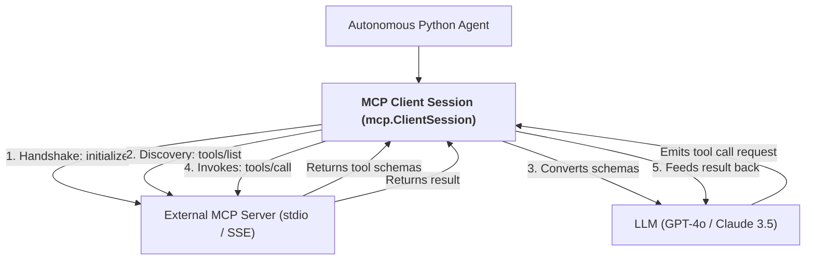
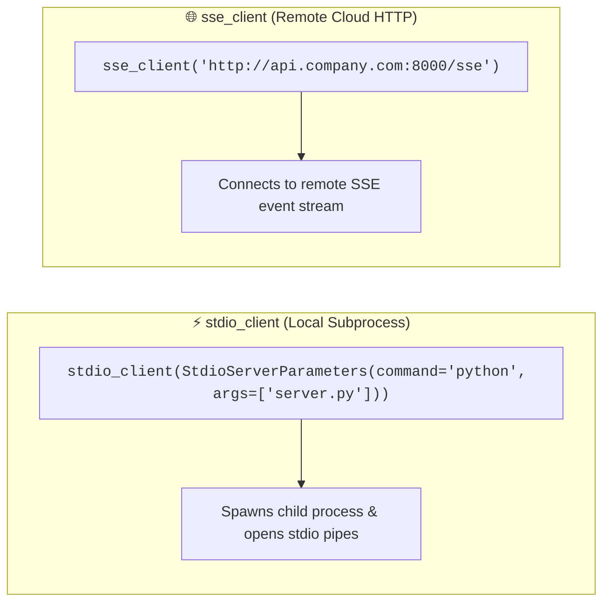
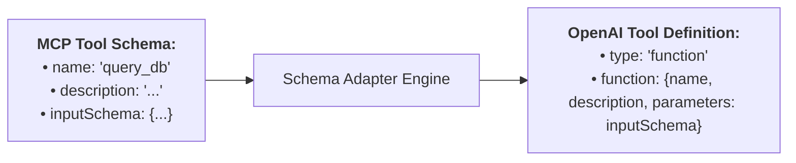
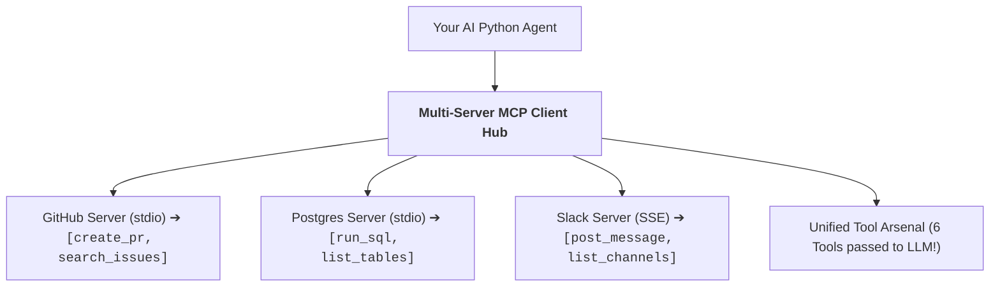

# 06 - MCP Client Implementation: Connecting Agents to MCP Servers

> **Mental Model**:  
> Think of an MCP Client like a **universal game console plugging into modular expansion cartridges**:  
> * **The Universal Console (Your AI Agent Backend)**: Doesn't hardcode any specific game or tool. Instead, it features a standardized cartridge slot.  
> * **Plugging in Cartridges (Client Connections)**: The client spawns or connects to multiple MCP servers (e.g. GitHub Cartridge, Postgres Cartridge, Slack Cartridge).  
> * **Dynamic Capability Ingestion**: The client queries **`tools/list`**, converts those schemas into OpenAI/Anthropic tool formats, and gives the LLM instant superpowers over all connected servers simultaneously!

---

## 📑 Table of Contents
1. [The MCP Client Architecture & Session Lifecycle](#1-the-mcp-client-architecture--session-lifecycle)
2. [Connecting via stdio Subprocess vs. Remote SSE Streams](#2-connecting-via-stdio-subprocess-vs-remote-sse-streams)
3. [Bridging MCP Tools to OpenAI / Anthropic Tool Formats](#3-bridging-mcp-tools-to-openai--anthropic-tool-formats)
4. [Multi-Server Client Aggregation (The Multi-Cartridge Hub)](#4-multi-server-client-aggregation-the-multi-cartridge-hub)
5. [Building a Complete Autonomous MCP Client in Python](#5-building-a-complete-autonomous-mcp-client-in-python)
6. [Master Cheat Sheet & Reference Table](#6-master-cheat-sheet--reference-table)

---

## 1. The MCP Client Architecture & Session Lifecycle

The MCP Client acts as the **bridge between the LLM and external MCP servers**:



---

## 2. Connecting via `stdio` Subprocess vs. Remote SSE Streams

The Python MCP SDK provides two async context managers for initiating client sessions:



---

## 3. Bridging MCP Tools to OpenAI / Anthropic Tool Formats

MCP tool definitions and OpenAI tool definitions are almost identical, but require **clean schema conversion**:



### Conversion Function:
```python
def mcp_to_openai_tool(mcp_tool) -> dict:
    """Converts an MCP tool object into standard OpenAI tools schema format."""
    return {
        "type": "function",
        "function": {
            "name": mcp_tool.name,
            "description": mcp_tool.description or "",
            "parameters": mcp_tool.inputSchema
        }
    }
```

---

## 4. Multi-Server Client Aggregation (The Multi-Cartridge Hub)

A single agent client can connect to **multiple independent MCP servers at once**:



---

## 5. Building a Complete Autonomous MCP Client in Python

Here is a complete, runnable script demonstrating how to connect to an MCP server, discover its tools, convert them for OpenAI, and execute an autonomous tool calling loop:

```python
import asyncio
from mcp import ClientSession, StdioServerParameters
from mcp.client.stdio import stdio_client
from openai import OpenAI
import json
import os

openai_client = OpenAI(api_key=os.getenv("OPENAI_API_KEY", "mock-key"))

# --- 1. Define Server Launch Parameters ---
server_params = StdioServerParameters(
    command="python",
    args=["/home/user2/PythonProject/Python-for-ai-engineering/08-mcp-a2a/05-mcp-server/server.py"],
    env=dict(os.environ)
)

async def run_mcp_agent(user_query: str):
    print(f"🚀 [CLIENT] Connecting to MCP Server via stdio...")
    
    # 2. Open stdio pipe & initialize session
    async with stdio_client(server_params) as (read_stream, write_stream):
        async with ClientSession(read_stream, write_stream) as session:
            # Handshake
            await session.initialize()
            print("✅ [CLIENT] Handshake completed successfully!")

            # 3. Discover available tools
            tool_list_response = await session.list_tools()
            print(f"🧰 [CLIENT] Discovered {len(tool_list_response.tools)} tool(s) from server:")
            
            openai_tools = []
            for t in tool_list_response.tools:
                print(f"  • {t.name}: {t.description}")
                openai_tools.append({
                    "type": "function",
                    "function": {
                        "name": t.name,
                        "description": t.description or "",
                        "parameters": t.inputSchema
                    }
                })

            # 4. Prompt LLM with discovered tools
            messages = [
                {"role": "system", "content": "You are a cloud operations assistant. Use MCP tools to answer requests."},
                {"role": "user", "content": user_query}
            ]

            response = openai_client.chat.completions.create(
                model="gpt-4o-mini",
                messages=messages,
                tools=openai_tools,
                tool_choice="auto"
            )
            msg = response.choices[0].message
            messages.append(msg)

            # 5. Handle Tool Invocations via MCP session.call_tool()
            if msg.tool_calls:
                for call in msg.tool_calls:
                    tool_name = call.function.name
                    tool_args = json.loads(call.function.arguments)
                    print(f"⚙️ [CLIENT] Calling MCP tool `{tool_name}` with args: {tool_args}")

                    # Execute over MCP wire!
                    mcp_result = await session.call_tool(name=tool_name, arguments=tool_args)
                    
                    # Extract text content from content blocks
                    output_text = "\n".join(c.text for c in mcp_result.content if hasattr(c, "text"))
                    print(f"  👁️ [CLIENT] Tool Result: {output_text}")

                    messages.append({
                        "role": "tool",
                        "tool_call_id": call.id,
                        "content": output_text
                    })

                # Final synthesis
                final_res = openai_client.chat.completions.create(
                    model="gpt-4o-mini",
                    messages=messages
                )
                print(f"\n🏆 Final Answer:\n{final_res.choices[0].message.content}")
                return final_res.choices[0].message.content

# Run Async Agent Loop:
# asyncio.run(run_mcp_agent("What is the health status of our cluster?"))
```

---

## 6. Master Cheat Sheet & Reference Table

| Client Method | Role in Execution |
| :--- | :--- |
| **`session.initialize()`** | Performs protocol version and capability handshake. |
| **`session.list_tools()`** | Fetches all available tools and `inputSchema` definitions. |
| **`session.call_tool(name, arguments)`** | Executes tool on server and returns `CallToolResult`. |
| **`session.read_resource(uri)`** | Fetches raw text or binary payload for a specific URI. |
| **`session.get_prompt(name, arguments)`** | Retrieves interpolated prompt messages for slash command templates. |

---

## 🎯 Next Step in Phase 8
Now that you have mastered programmatic MCP client implementations, we will advance to **[07 - MCP Security](file:///home/user2/PythonProject/Python-for-ai-engineering/08-mcp-a2a/07-mcp-security)** to master command injection defense, transport authentication, file path sandboxing, and Least Privilege permission policies!
