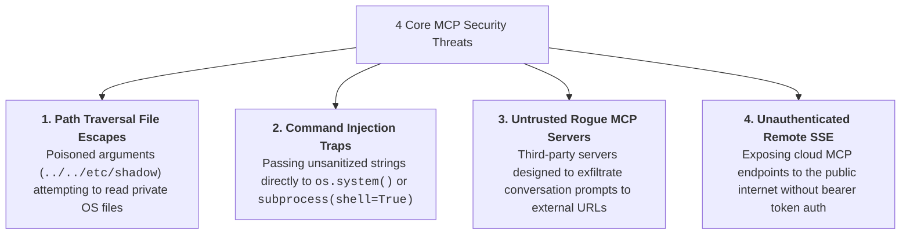
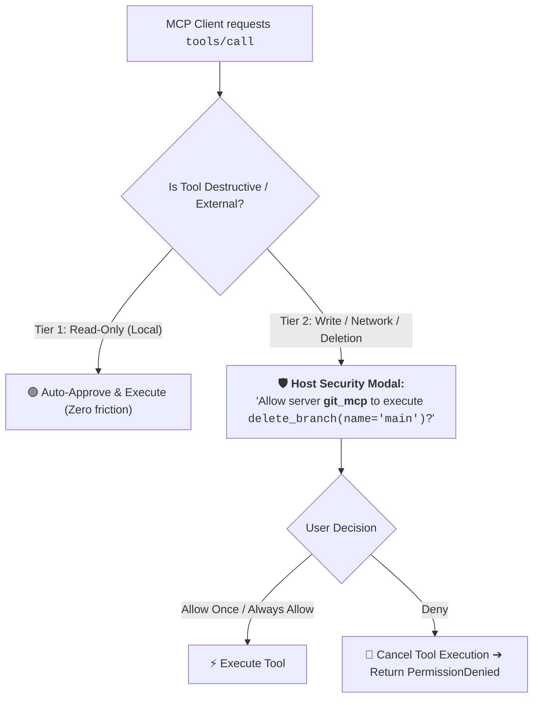
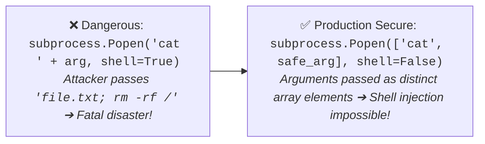
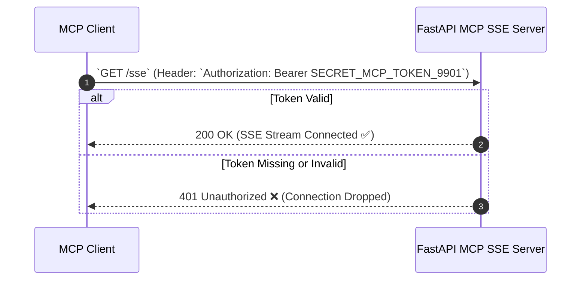

# 07 - MCP Security: Permission Boundaries & Threat Defenses

> **Mental Model**:  
> Think of MCP Security like a **guarded embassy airlock and diplomatic clearance checkpoint**:  
> * **The Threat**: When an AI client connects to an MCP server, it creates a physical execution bridge to your filesystem, databases, and internal APIs. A prompt injection or malicious parameter could attempt to read **`../../etc/passwd`** or drop database tables!  
> * **The Host Clearance Gate (User Authorization)**: The Host application (Claude Desktop / Cursor) inspects tool calls before execution. Safe read tools are auto-approved, while destructive write actions trigger an explicit human authorization modal.  
> * **The Jailed Chamber (Path & Command Sandboxing)**: MCP servers enforce strict filesystem chroot jails and parameterized SQL to make escapes mathematically impossible.

---

## 📑 Table of Contents
1. [The 4 Primary MCP Threat Vectors](#1-the-4-primary-mcp-threat-vectors)
2. [Host-Level User Authorization Prompts](#2-host-level-user-authorization-prompts)
3. [Filesystem Path Traversal Defense (The Chroot Jail)](#3-filesystem-path-traversal-defense-the-chroot-jail)
4. [Subprocess & Command Injection Defenses](#4-subprocess--command-injection-defenses)
5. [Securing Remote SSE Transports (Bearer Token Auth)](#5-securing-remote-sse-transports-bearer-token-auth)
6. [Building a Hardened, Secure MCP Server in Python](#6-building-a-hardened-secure-mcp-server-in-python)
7. [Master Cheat Sheet & Reference Table](#7-master-cheat-sheet--reference-table)

---

## 1. The 4 Primary MCP Threat Vectors



---

## 2. Host-Level User Authorization Prompts

Host applications must implement **Permission Clearance Tiers**:



---

## 3. Filesystem Path Traversal Defense (The Chroot Jail)

> 🚨 **The Deadly Path Traversal Vulnerability:**  
> If an MCP server naively does `open(user_path)`, an attacker passes `"../../.ssh/id_rsa"` and steals your SSH private keys!

### The Immutable Python Path Jail:
```python
import os

ALLOWED_ROOT_DIR = "/home/user2/PythonProject/Python-for-ai-engineering/safe_workspace"

def validate_safe_path(user_supplied_path: str) -> str:
    """Ensures the resolved path strictly resides inside ALLOWED_ROOT_DIR."""
    # Resolve absolute path and normalize symlinks
    resolved_path = os.path.realpath(os.path.join(ALLOWED_ROOT_DIR, user_supplied_path))
    
    # Verify that resolved path starts with the allowed root
    if not resolved_path.startswith(os.path.realpath(ALLOWED_ROOT_DIR) + os.sep) and resolved_path != os.path.realpath(ALLOWED_ROOT_DIR):
        raise PermissionError(f"Security Alert: Path '{user_supplied_path}' attempts directory traversal outside jail!")
    
    return resolved_path
```

---

## 4. Subprocess & Command Injection Defenses



---

## 5. Securing Remote SSE Transports (Bearer Token Auth)

When exposing an MCP server over the network via SSE/HTTP, **never run without authentication**:



---

## 6. Building a Hardened, Secure MCP Server in Python

Here is a complete, runnable script implementing path jailing, argument regex validation, and least-privilege security guards:

```python
from mcp.server.fastmcp import FastMCP
import os
import re

mcp = FastMCP("hardened_security_server")

# Define strict isolation jail
SAFE_JAIL_DIR = "/tmp/mcp_isolated_sandbox"
os.makedirs(SAFE_JAIL_DIR, exist_ok=True)

# Write a dummy test file
with open(os.path.join(SAFE_JAIL_DIR, "report.txt"), "w") as f:
    f.write("Quarterly financial report data: 100% verified.")

# --- Secure Jailed File Reader Tool ---
@mcp.tool()
def read_jailed_file(file_name: str) -> str:
    """Safely reads a text file strictly confined inside the isolated sandbox directory.
    
    Args:
        file_name: Name of the file inside the sandbox (e.g. 'report.txt').
    """
    # 1. Regex check for dangerous shell characters
    if not re.match(r"^[a-zA-Z0-9_\-\.]+$", file_name):
        raise ValueError("Invalid filename: Contains prohibited characters.")

    # 2. Strict Path Traversal Chroot Verification
    target_abs = os.path.realpath(os.path.join(SAFE_JAIL_DIR, file_name))
    jail_abs = os.path.realpath(SAFE_JAIL_DIR)

    if not target_abs.startswith(jail_abs + os.sep) and target_abs != jail_abs:
        raise PermissionError("Access Denied: Attempted path escape detected!")

    if not os.path.exists(target_abs):
        raise FileNotFoundError(f"File '{file_name}' does not exist inside sandbox.")

    # 3. Safe read
    with open(target_abs, "r", encoding="utf-8") as f:
        return f.read()

# --- Run FastMCP over stdio ---
if __name__ == "__main__":
    mcp.run(transport="stdio")
```

---

## 7. Master Cheat Sheet & Reference Table

| Security Concern | Defense Mechanism | Layer |
| :--- | :--- | :--- |
| **Directory Traversal (`../`)** | `os.path.realpath()` prefix matching against jail root. | Tool Code |
| **Shell Injection** | `shell=False` + argument list array `['git', 'status']`. | Subprocess |
| **Unauthorized Cloud Access** | HTTP `Authorization: Bearer <TOKEN>` validation on `/sse`. | Network Gateway |
| **Destructive Execution** | Host UI confirmation modal for Tier 2/3 tools. | Host Client |
| **Stdio Stream Poisoning** | Send all logs to `sys.stderr` (Never use `print()` in stdio). | Logging Engine |

---

## 🎯 Next Step in Phase 8
Now that you have mastered MCP security and permission boundaries, we will advance to **[08 - A2A Fundamentals](file:///home/user2/PythonProject/Python-for-ai-engineering/08-mcp-a2a/08-a2a-fundamentals)** to enter the world of Agent-to-Agent communication, multi-agent topologies, and autonomous peer protocols!
