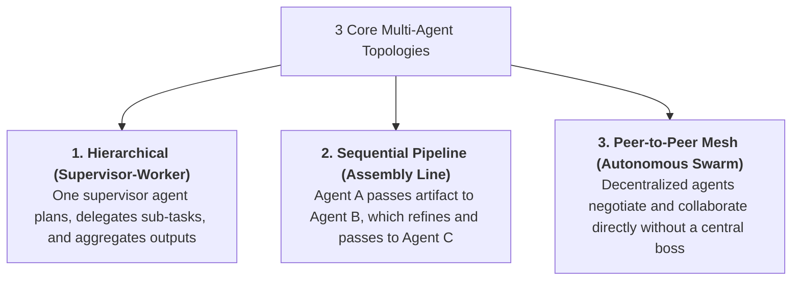
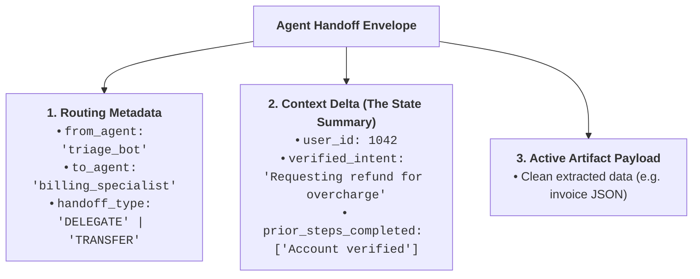
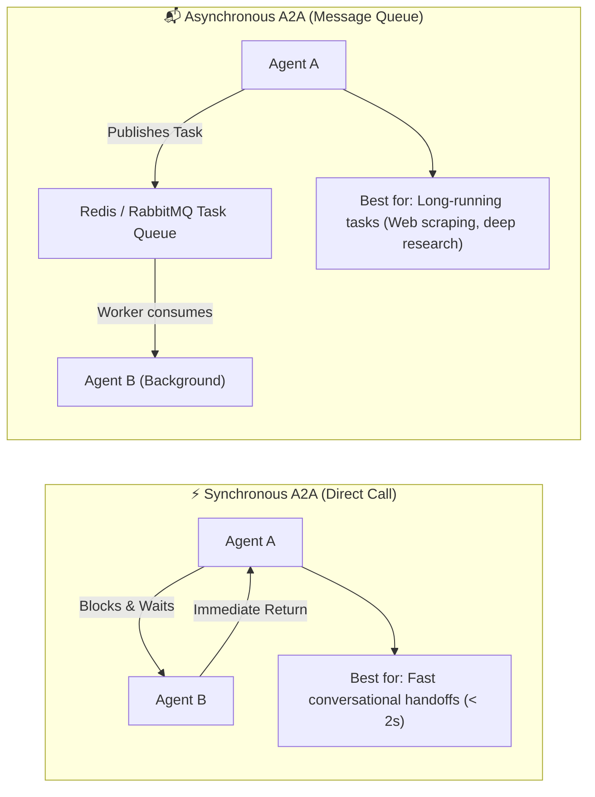
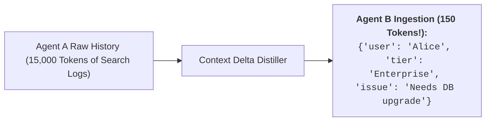

# 08 - Agent-to-Agent (A2A) Fundamentals: Topologies & Handoff Protocols

> **Mental Model**:  
> Think of Agent-to-Agent (A2A) Systems like a **specialized surgical operating room**:  
> * **The Solo General Practitioner (Monolithic Agent)**: Trying to perform brain surgery, heart surgery, radiology, and anesthesia all alone. They suffer cognitive overload, mix up instruments, and make fatal mistakes.  
> * **The Specialized Surgical Team (A2A Network)**:  
>   * **The Triage Specialist**: Diagnoses the patient and performs a structured **Agent Handoff** to the Surgeon.  
>   * **The Anesthesiologist Agent**: Monitors vital telemetry and reports anomalies.  
>   * **The Lead Surgeon Agent**: Focuses *only* on the surgical incision.  
> * Agents communicate using **structured handoff envelopes**, passing clean context deltas rather than messy raw conversation histories.

---

## 📑 Table of Contents
1. [The 3 Fundamental Multi-Agent Topologies](#1-the-3-fundamental-multi-agent-topologies)
2. [The Anatomy of an Agent Handoff Envelope](#2-the-anatomy-of-an-agent-handoff-envelope)
3. [Communication Modes: Synchronous RPC vs. Asynchronous Queues](#3-communication-modes-synchronous-rpc-vs-asynchronous-queues)
4. [Preventing Context Bloat in Multi-Agent Handoffs](#4-preventing-context-bloat-in-multi-agent-handoffs)
5. [Building an Autonomous Multi-Agent Handoff Pipeline in Python](#5-building-an-autonomous-multi-agent-handoff-pipeline-in-python)
6. [Master Cheat Sheet & Reference Table](#6-master-cheat-sheet--reference-table)

---

## 1. The 3 Fundamental Multi-Agent Topologies



### Topology Comparison Matrix:

| Topology | Coordination Overhead | Failure Resilience | Best Use Case |
| :--- | :---: | :---: | :--- |
| **Hierarchical (Supervisor)** | Low | Moderate (Supervisor is single point) | General enterprise workflows & project management. |
| **Sequential Pipeline** | Minimal | Low (Any broken step halts pipeline) | Document generation, ETL, code compile & test. |
| **Peer-to-Peer Mesh** | High | **Exceptional** (Self-healing network) | Market simulations, collaborative problem solving. |

---

## 2. The Anatomy of an Agent Handoff Envelope

When Agent A transfers control or requests help from Agent B, it emits a structured **Handoff Envelope**:



---

## 3. Communication Modes: Synchronous RPC vs. Asynchronous Queues



---

## 4. Preventing Context Bloat in Multi-Agent Handoffs

> ⚠️ **The Multi-Agent Context Bloat Disaster:**  
> If Agent A dumps its entire 20,000-token conversation history into Agent B, Agent B burns money and gets confused by irrelevant chatter from previous steps!

### The Context Isolation Rule:


---

## 5. Building an Autonomous Multi-Agent Handoff Pipeline in Python

Here is a complete, runnable script implementing structured multi-agent handoffs between a **Triage Agent**, a **Billing Specialist**, and a **Technical Support Specialist**:

```python
from pydantic import BaseModel, Field
from typing import Literal, Optional
from openai import OpenAI
import json
import os

client = OpenAI(api_key=os.getenv("OPENAI_API_KEY", "mock-key"))

# --- 1. Structured Handoff Schema ---
class AgentHandoff(BaseModel):
    target_agent: Literal["billing_specialist", "tech_support", "final_answer"]
    reason: str = Field(description="Why this specialized agent is being assigned the task.")
    context_summary: str = Field(description="Condensed, clean summary of facts discovered so far.")
    direct_response: Optional[str] = Field(default=None, description="Final answer if goal is already solved.")

# --- 2. Specialized Worker Logic ---
def run_billing_specialist(context_summary: str) -> str:
    print(f"  💳 [Billing Specialist] Handling case with context: '{context_summary}'")
    return "Billing verified: Refund of $45.00 has been credited to the customer's Mastercard."

def run_tech_support(context_summary: str) -> str:
    print(f"  🔧 [Tech Support] Investigating technical issue: '{context_summary}'")
    return "Tech diagnosis: Customer's API rate limit was temporarily throttled due to high concurrency."

# --- 3. Triage Router Agent ---
def run_a2a_triage(user_inquiry: str):
    print(f"👤 User: '{user_inquiry}'\n" + "="*60)
    print("🏥 [Triage Agent] Classifying inquiry and evaluating agent handoff...")

    prompt = f"""You are the Front-Desk Triage Agent.
Analyze the user's message and determine which specialized agent must handle it:
- 'billing_specialist': Invoices, refunds, subscription charges.
- 'tech_support': API errors, timeouts, bug reports.
- 'final_answer': Simple greetings or general company info.

User Inquiry:
"{user_inquiry}"
"""

    completion = client.beta.chat.completions.parse(
        model="gpt-4o-mini",
        messages=[{"role": "user", "content": prompt}],
        response_format=AgentHandoff,
        temperature=0.0
    )
    handoff = completion.choices[0].message.parsed

    print(f"📋 [Handoff Emitted] Target: `{handoff.target_agent}` | Reason: {handoff.reason}")

    # Route Handoff
    if handoff.target_agent == "billing_specialist":
        result = run_billing_specialist(handoff.context_summary)
    elif handoff.target_agent == "tech_support":
        result = run_tech_support(handoff.context_summary)
    else:
        result = handoff.direct_response

    print(f"\n🎯 Final Response to User:\n{result}")
    return result

# Test Execution:
# run_a2a_triage("I was charged twice on my credit card for invoice #9042!")
```

---

## 6. Master Cheat Sheet & Reference Table

| Handoff Component | Role in A2A Pipeline | Best Practice |
| :--- | :--- | :--- |
| **`target_agent`** | Destination routing identifier. | Strict enum (`Literal["agent_a", "agent_b"]`). |
| **`context_summary`** | Distilled state delta. | **Never pass raw chat logs; pass clean JSON facts.** |
| **`handoff_type`** | Transfer vs Delegation vs Query. | Explicitly define whether caller expects a return value. |
| **Topology Choice** | Architectural network layout. | Supervisor for workflows; Mesh for swarms. |

---

## 🎯 Next Step in Phase 8
Now that you have mastered A2A fundamentals and handoff protocols, we will advance to **[09 - Agent Communication](file:///home/user2/PythonProject/Python-for-ai-engineering/08-mcp-a2a/09-agent-communication)** to master conversational negotiation, peer voting consensus, shared blackboards, and conflict resolution!
