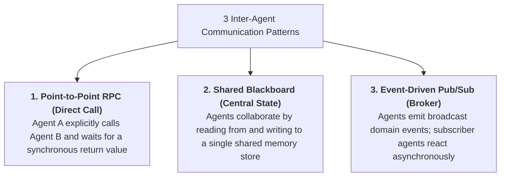
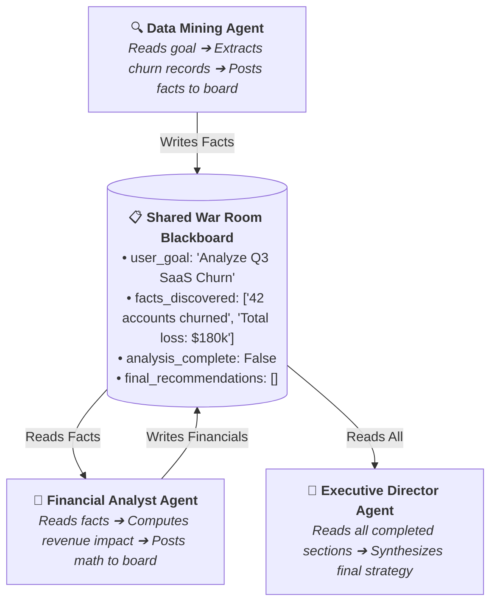
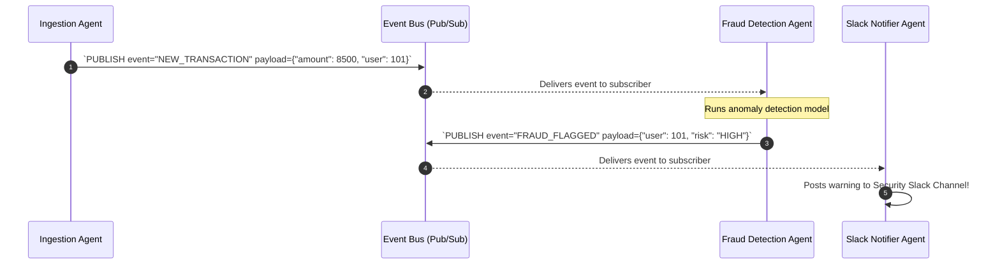
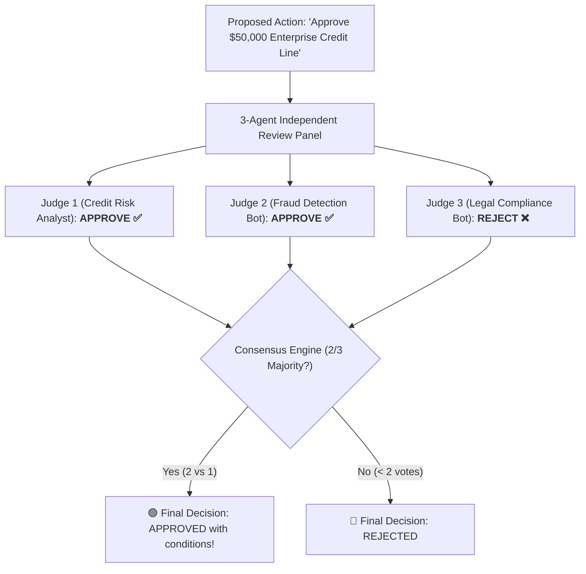

# 09 - Agent Communication Protocols: Blackboards, Pub/Sub & Consensus

> **Mental Model**:  
> Think of Inter-Agent Communication like a **crisis management war room with a central operations blackboard**:  
> * **The Information Silo Trap (Point-to-Point Spaghetti)**: If Agent A whispers to Agent B, Agent C remains completely in the dark. Misunderstandings multiply and coordination breaks down.  
> * **The Central War Room Blackboard (Shared State Pattern)**: All specialized agents stand around a single large operations board.  
> * When the **Recon Agent** discovers fresh intelligence, it posts it to the board.  
> * The **Logistics Agent** and **Tactical Agent** read the new facts, calculate their actions, and update the board in real time.  
> * The **Commander Agent** observes the board and issues the final executive directive!

---

## 📑 Table of Contents
1. [The 3 Core Inter-Agent Communication Patterns](#1-the-3-core-inter-agent-communication-patterns)
2. [The Shared Blackboard Architecture](#2-the-shared-blackboard-architecture)
3. [Event-Driven Pub/Sub Messaging (Asynchronous Agents)](#3-event-driven-pubsub-messaging-asynchronous-agents)
4. [Consensus Protocols & Multi-Agent Majority Voting](#4-consensus-protocols--multi-agent-majority-voting)
5. [Deadlock Prevention & Message TTLs](#5-deadlock-prevention--message-ttls)
6. [Building a Shared Blackboard Multi-Agent System in Python](#6-building-a-shared-blackboard-multi-agent-system-in-python)
7. [Master Cheat Sheet & Reference Table](#7-master-cheat-sheet--reference-table)

---

## 1. The 3 Core Inter-Agent Communication Patterns



### Pattern Selection Matrix:

| Pattern | Coupling Level | Scalability | Best Use Case |
| :--- | :---: | :---: | :--- |
| **Point-to-Point (RPC)** | High | Moderate | Sequential step handoffs (Triage $\rightarrow$ Billing). |
| **Shared Blackboard** | Moderate | High | Collaborative research, code synthesis, iterative refinement. |
| **Event Pub/Sub** | **Zero (Decoupled)** | **Massive** | Enterprise background workflows, distributed microservices. |

---

## 2. The Shared Blackboard Architecture

In a Blackboard architecture, agents do not need to know about each other—they only interact with the **Shared Board**:



---

## 3. Event-Driven Pub/Sub Messaging (Asynchronous Agents)

For microservice architectures, agents communicate over an **Event Bus (Redis / Kafka)**:



---

## 4. Consensus Protocols & Multi-Agent Majority Voting

When an action carries high financial or safety risk, use a **3-Agent Majority Voting Panel**:



---

## 5. Deadlock Prevention & Message TTLs

> ⚠️ **The Circular Dependency Deadlock:**  
> Agent A waits for Agent B to provide pricing data, while Agent B waits for Agent A to provide customer volume data $\rightarrow$ **Infinite Deadlock!**

### The 2 Deadlock Circuit Breakers:
1. **Time-To-Live (TTL / Max Hops)**: Every message carries `hop_count = 0`. If `hop_count > 5`, the message is automatically dropped.
2. **Supervisor Arbitration**: A supervisor process detects when no blackboard updates have occurred for 15 seconds and forcefully re-assigns tasks.

---

## 6. Building a Shared Blackboard Multi-Agent System in Python

Here is a complete, runnable script implementing a thread-safe Shared Blackboard with 3 collaborating agents:

```python
from pydantic import BaseModel, Field
from typing import Dict, Any, List
import time

# --- 1. The Central Shared Blackboard ---
class SharedBlackboard(BaseModel):
    user_goal: str
    discovered_facts: List[str] = Field(default_factory=list)
    calculated_metrics: Dict[str, float] = Field(default_factory=dict)
    executive_summary: str = ""
    is_complete: bool = False

# --- 2. Specialized Collaborating Agents ---
class DataCollectionAgent:
    def execute(self, board: SharedBlackboard):
        print("🔍 [DataAgent] Scanning logs and mining facts...")
        time.sleep(0.1)
        board.discovered_facts.append("Total customer accounts: 1,200")
        board.discovered_facts.append("Churned accounts in Q3: 36")
        print("  ✅ [DataAgent] Posted facts to Blackboard.")

class AnalyticsAgent:
    def execute(self, board: SharedBlackboard):
        print("🧮 [AnalyticsAgent] Reading facts and computing KPIs...")
        time.sleep(0.1)
        # Calculate Churn Rate: (36 / 1200) * 100
        churn_rate = (36 / 1200) * 100
        board.calculated_metrics["churn_rate_pct"] = round(churn_rate, 2)
        board.calculated_metrics["estimated_revenue_loss_usd"] = 36 * 1200.00
        print(f"  ✅ [AnalyticsAgent] Computed Churn Rate: {churn_rate}%")

class ExecutiveSynthesizerAgent:
    def execute(self, board: SharedBlackboard):
        print("👑 [ExecutiveAgent] Reviewing entire Blackboard to draft final strategy...")
        time.sleep(0.1)
        board.executive_summary = (
            f"EXECUTIVE BRIEFING:\n"
            f"• Facts: {', '.join(board.discovered_facts)}\n"
            f"• Churn Rate: {board.calculated_metrics['churn_rate_pct']}%\n"
            f"• Revenue Loss: ${board.calculated_metrics['estimated_revenue_loss_usd']:,.2f}\n"
            f"• Directive: Launch immediate customer retention campaign for at-risk tiers."
        )
        board.is_complete = True
        print("  🏆 [ExecutiveAgent] Final briefing published!")

# --- 3. War Room Orchestration ---
def run_war_room_pipeline(goal: str):
    print(f"🎯 Mission Goal: '{goal}'\n" + "="*60)
    
    # Initialize Blackboard
    board = SharedBlackboard(user_goal=goal)
    
    # Agents execute against the shared state
    data_agent = DataCollectionAgent()
    analytics_agent = AnalyticsAgent()
    exec_agent = ExecutiveSynthesizerAgent()

    data_agent.execute(board)
    analytics_agent.execute(board)
    exec_agent.execute(board)

    print("\n" + "="*60)
    print(board.executive_summary)
    return board.executive_summary

# Run Pipeline:
# run_war_room_pipeline("Analyze Q3 churn metrics and draft executive recommendations.")
```

---

## 7. Master Cheat Sheet & Reference Table

| Pattern | Core Mechanism | Key Advantage |
| :--- | :--- | :--- |
| **Shared Blackboard** | Central state object read/written by all agents. | Eliminates point-to-point communication silos. |
| **Pub/Sub Messaging** | Event broker broadcasting messages to subscribers. | Zero coupling between independent microservices. |
| **Majority Consensus** | $N$ independent judges voting on critical proposals. | Shields against rogue hallucinations and biased decisions. |
| **Message TTL** | `hop_count <= 5` limit on inter-agent messages. | Prevents circular dependency deadlocks. |

---

## 🎯 Next Step in Phase 8
Now that you have mastered agent communication protocols and shared blackboards, we will advance to the final topic of Phase 8: **[10 - MCP vs A2A](file:///home/user2/PythonProject/Python-for-ai-engineering/08-mcp-a2a/10-mcp-vs-a2a)** to master the architectural decision framework comparing Model Context Protocol (Agent-to-Tool) vs Agent-to-Agent (Agent-to-Peer) systems!
