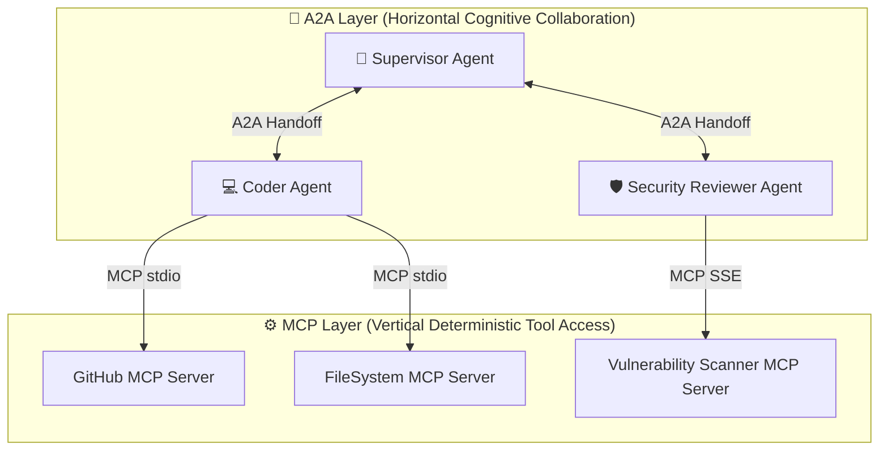
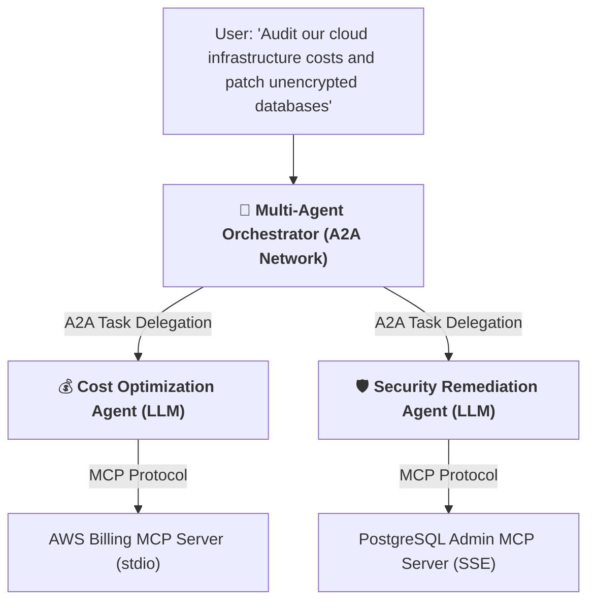
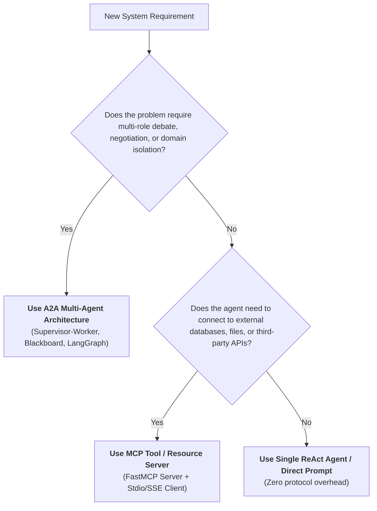

# 10 - MCP vs. A2A: The Architectural Decision Framework

> **Mental Model**:  
> Think of MCP vs. A2A like **a master mechanic's toolbox vs. a corporate board of directors**:  
> * **MCP (Model Context Protocol / Vertical Integration)**: An agent reaching down into its toolbox to use a wrench, a voltmeter, or a diagnostic scanner (**Agent-to-Tool / Deterministic API Execution**).  
> * **A2A (Agent-to-Agent / Horizontal Collaboration)**: Multiple autonomous experts (CEO, CFO, Legal Counsel) debating strategy, negotiating trade-offs, and delegating milestones (**Agent-to-Agent / Cognitive Reasoning Networks**).  
> * **The Golden Truth**: MCP and A2A are **not competitors—they are complementary layers** of modern enterprise AI systems!

---

## 📑 Table of Contents
1. [The Fundamental Difference: Vertical vs. Horizontal Integration](#1-the-fundamental-difference-vertical-vs-horizontal-integration)
2. [The Comprehensive Comparison Matrix](#2-the-comprehensive-comparison-matrix)
3. [The Hybrid Enterprise Pattern: A2A at the Top, MCP at the Bottom](#3-the-hybrid-enterprise-pattern-a2a-at-the-top-mcp-at-the-bottom)
4. [The Architectural Decision Flowchart](#4-the-architectural-decision-flowchart)
5. [Building a Hybrid A2A + MCP Architecture in Python](#5-building-a-hybrid-a2a--mcp-architecture-in-python)
6. [Master Cheat Sheet & Reference Table](#6-master-cheat-sheet--reference-table)

---

## 1. The Fundamental Difference: Vertical vs. Horizontal Integration



---

## 2. The Comprehensive Comparison Matrix

| Architectural Dimension | ⚙️ Model Context Protocol (MCP) | 🤝 Agent-to-Agent (A2A) |
| :--- | :--- | :--- |
| **Primary Focus** | **Agent-to-Tool & Agent-to-Data** | **Agent-to-Agent Collaboration** |
| **Target Autonomy** | **Passive Server** (No reasoning; deterministic code) | **Autonomous Agent** (Runs its own LLM reasoning loop) |
| **Protocol Standard** | **JSON-RPC 2.0** (`tools/call`, `resources/read`) | **Natural Language + Structured State Envelopes** |
| **Execution Latency** | Ultra-Fast ($< 50\text{ms}$) | Slower ($1\text{s} - 10\text{s}$ per LLM turn) |
| **State Management** | Stateless or URI-based | Stateful memory, scratchpads, and execution state |
| **Failure Modes** | Network timeouts, schema errors | Reasoning failures, misalignment, hallucinations |
| **Typical Protocols** | FastMCP, official Anthropic MCP SDK | LangGraph, AutoGen, CrewAI, OpenAI Swarm |

---

## 3. The Hybrid Enterprise Pattern: A2A at the Top, MCP at the Bottom

In enterprise production environments, frontier architectures combine both paradigms:



---

## 4. The Architectural Decision Flowchart

Use this decision tree to select the right approach for your project:



---

## 5. Building a Hybrid A2A + MCP Architecture in Python

Here is a complete, runnable script illustrating how a **Supervisor-Worker A2A Network** orchestrates specialized worker agents that query **MCP Tools**:

```python
from pydantic import BaseModel, Field
from typing import Literal
import json

# --- 1. Mock MCP Servers (Vertical Tool Layer) ---
class DatabaseMCPServer:
    """Simulates an independent Database MCP Server."""
    def call_tool(self, name: str, args: dict) -> str:
        if name == "get_unencrypted_tables":
            return json.dumps(["users_legacy", "credit_cards_raw"])
        elif name == "enable_encryption":
            return json.dumps({"status": "ENCRYPTED", "table": args["table"]})
        return json.dumps({"error": "Unknown tool"})

class BillingMCPServer:
    """Simulates an independent Billing MCP Server."""
    def call_tool(self, name: str, args: dict) -> str:
        if name == "get_monthly_cloud_spend":
            return json.dumps({"spend_usd": 18450.00, "idle_nodes": 4})
        return json.dumps({"error": "Unknown tool"})

# --- 2. Worker Agents Equipped with MCP Clients ---
class SecurityWorkerAgent:
    def __init__(self, mcp_server: DatabaseMCPServer):
        self.mcp = mcp_server

    def audit_and_remediate(self) -> str:
        print("  🛡️ [SecurityWorker] Querying Database MCP Server...")
        raw_tables = self.mcp.call_tool("get_unencrypted_tables", {})
        tables = json.loads(raw_tables)
        
        remediated = []
        for t in tables:
            print(f"    ⚙️ [MCP Tool Call] Encrypting table `{t}`...")
            self.mcp.call_tool("enable_encryption", {"table": t})
            remediated.append(t)
            
        return f"Encrypted {len(remediated)} tables: {', '.join(remediated)}"

class FinOpsWorkerAgent:
    def __init__(self, mcp_server: BillingMCPServer):
        self.mcp = mcp_server

    def audit_spend(self) -> str:
        print("  💰 [FinOpsWorker] Querying Billing MCP Server...")
        res = json.loads(self.mcp.call_tool("get_monthly_cloud_spend", {}))
        return f"Monthly Spend: ${res['spend_usd']:,.2f} | Found {res['idle_nodes']} idle nodes to decommission."

# --- 3. A2A Supervisor Orchestrator (Horizontal Reasoning Layer) ---
class EnterpriseA2ASupervisor:
    def __init__(self):
        self.sec_worker = SecurityWorkerAgent(DatabaseMCPServer())
        self.fin_worker = FinOpsWorkerAgent(BillingMCPServer())

    def execute_company_audit(self, directive: str) -> str:
        print(f"👑 [A2A Supervisor] Received Executive Directive: '{directive}'\n" + "="*65)
        
        # 1. Delegate to Security Worker (A2A Handoff)
        sec_report = self.sec_worker.audit_and_remediate()
        
        # 2. Delegate to FinOps Worker (A2A Handoff)
        fin_report = self.fin_worker.audit_spend()
        
        # 3. Synthesize Final Executive Briefing
        summary = (
            f"EXECUTIVE AUDIT SUMMARY:\n"
            f"1. Security Operations: {sec_report}\n"
            f"2. Financial Operations: {fin_report}\n"
            f"3. All systems compliant with Q4 compliance standards."
        )
        return summary

# Run Hybrid Pipeline:
# supervisor = EnterpriseA2ASupervisor()
# final_briefing = supervisor.execute_company_audit("Perform comprehensive infrastructure security & cost audit.")
# print("\n" + "="*65 + "\n" + final_briefing)
```

---

## 6. Master Cheat Sheet & Reference Table

| Requirement | Preferred Architecture | Implementation Standard |
| :--- | :--- | :--- |
| **Expose a DB or API to any AI tool** | **MCP Server** | FastMCP over `stdio` or `sse`. |
| **Connect Cursor/Claude to custom tools**| **MCP Client** | Add entry in `claude_desktop_config.json`. |
| **Complex task with specialized sub-roles**| **A2A Network** | Supervisor-Worker with LangGraph or Pydantic handoffs. |
| **Enterprise AI Platform** | **Hybrid A2A + MCP** | A2A reasoning layer calling MCP tool microservices. |

---

## 🏁 Phase 8 Complete!
Congratulations! You have mastered all 10 core topics of **Phase 8: Model Context Protocol (MCP) & Agent-to-Agent (A2A)**:
1. [01 - MCP Fundamentals](file:///home/user2/PythonProject/Python-for-ai-engineering/08-mcp-a2a/01-mcp-fundamentals/README.md)
2. [02 - MCP Tools](file:///home/user2/PythonProject/Python-for-ai-engineering/08-mcp-a2a/02-mcp-tools/README.md)
3. [03 - MCP Resources](file:///home/user2/PythonProject/Python-for-ai-engineering/08-mcp-a2a/03-mcp-resources/README.md)
4. [04 - MCP Prompts](file:///home/user2/PythonProject/Python-for-ai-engineering/08-mcp-a2a/04-mcp-prompts/README.md)
5. [05 - MCP Server Implementation](file:///home/user2/PythonProject/Python-for-ai-engineering/08-mcp-a2a/05-mcp-server/README.md)
6. [06 - MCP Client Implementation](file:///home/user2/PythonProject/Python-for-ai-engineering/08-mcp-a2a/06-mcp-client/README.md)
7. [07 - MCP Security & Permissions](file:///home/user2/PythonProject/Python-for-ai-engineering/08-mcp-a2a/07-mcp-security/README.md)
8. [08 - A2A Fundamentals](file:///home/user2/PythonProject/Python-for-ai-engineering/08-mcp-a2a/08-a2a-fundamentals/README.md)
9. [09 - Agent Communication Protocols](file:///home/user2/PythonProject/Python-for-ai-engineering/08-mcp-a2a/09-agent-communication/README.md)
10. [10 - MCP vs. A2A Comparison](file:///home/user2/PythonProject/Python-for-ai-engineering/08-mcp-a2a/10-mcp-vs-a2a/README.md)
