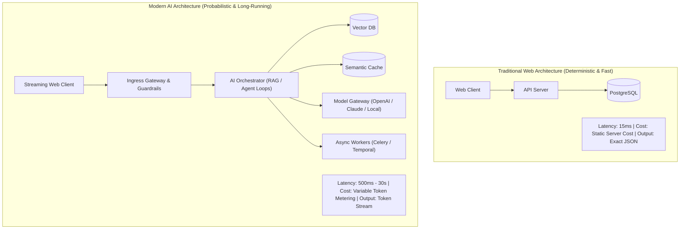
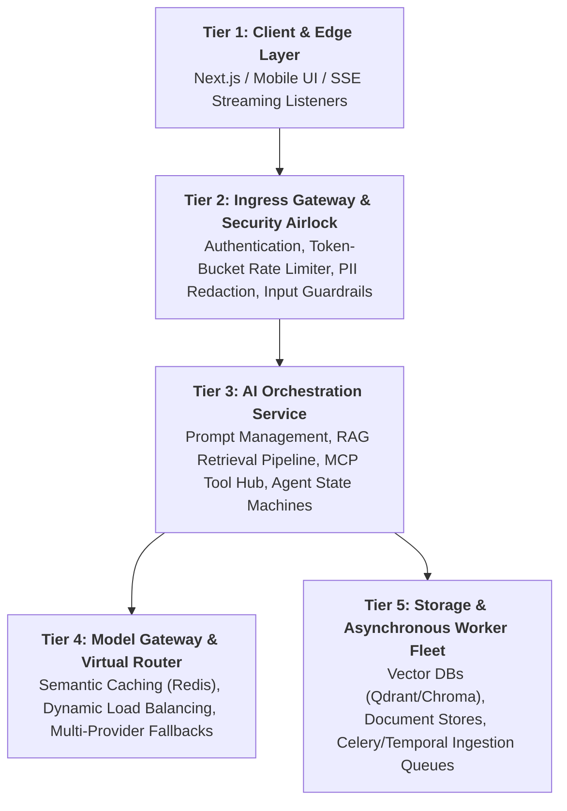
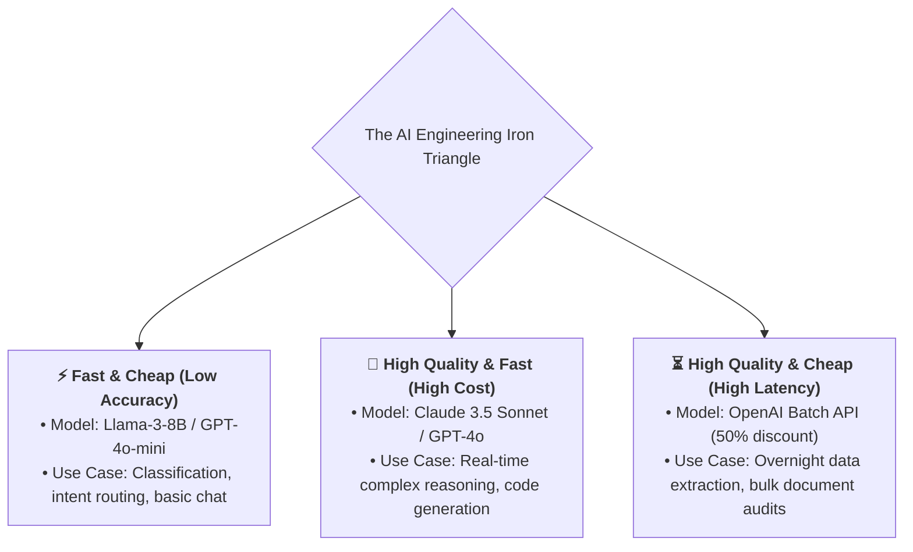
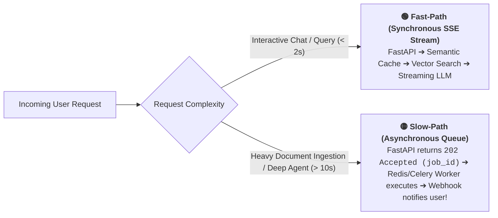

# 01 - AI Application Architecture: The 5-Tier Enterprise Tech Stack

> **Welcome to Phase 9: AI System Design & Production Architecture!**  
> **Mental Model**:  
> Think of an Enterprise AI Application like a **modern international airport terminal**:  
> * **The Security Checkpoint (API Gateway & Guardrails)**: Scans every incoming passenger, checks tickets (Auth & Rate limits), and confiscates prohibited items (Prompt Injections & PII).  
> * **The Air Traffic Control Tower (AI Orchestrator)**: Routes requests, decides which runway to use, and coordinates multi-step flight plans (RAG + Agent Loops).  
> * **The Aircraft Fleet (Multi-Provider Model Gateway)**: Deploys fast regional jets (Small 8B models for simple tasks) vs. massive supersonic airliners (Frontier reasoning models for deep logic).  
> * **The Cargo Facility (Async Workers & Vector Storage)**: Offloads heavy background baggage processing (PDF parsing, embedding indexing) away from the passenger fast-track!

---

## 📑 Table of Contents
1. [Traditional CRUD vs. AI Application Architecture](#1-traditional-crud-vs-ai-application-architecture)
2. [The 5 Tiers of Modern Enterprise AI Architecture](#2-the-5-tiers-of-modern-enterprise-ai-architecture)
3. [The Latency-Cost-Quality Iron Triangle](#3-the-latency-cost-quality-iron-triangle)
4. [Synchronous Fast-Path vs. Asynchronous Slow-Path](#4-synchronous-fast-path-vs-asynchronous-slow-path)
5. [Building an Enterprise 5-Tier Gateway in Python](#5-building-an-enterprise-5-tier-gateway-in-python)
6. [Master Cheat Sheet & Reference Table](#6-master-cheat-sheet--reference-table)

---

## 1. Traditional CRUD vs. AI Application Architecture



---

## 2. The 5 Tiers of Modern Enterprise AI Architecture



---

## 3. The Latency-Cost-Quality Iron Triangle

In AI systems, you **cannot maximize all three simultaneously**; you must engineer deliberate trade-offs:



---

## 4. Synchronous Fast-Path vs. Asynchronous Slow-Path

Never make a human user stare at a spinning loader for 45 seconds while an agent parses a 100-page PDF:



---

## 5. Building an Enterprise 5-Tier Gateway in Python

Here is a complete, production-grade script illustrating the 5-Tier AI Gateway pattern:

```python
from fastapi import FastAPI, HTTPException, BackgroundTasks
from pydantic import BaseModel, Field
from openai import OpenAI
import time
import json
import os

app = FastAPI(title="Enterprise AI Gateway")
openai_client = OpenAI(api_key=os.getenv("OPENAI_API_KEY", "mock-key"))

# --- In-Memory Semantic Cache ---
CACHE_STORE = {}

# --- Request Schemas ---
class ChatRequest(BaseModel):
    user_id: str
    prompt: str = Field(min_length=3, max_length=1000)

class IngestionRequest(BaseModel):
    user_id: str
    document_url: str

# --- Tier 2: Security & Guardrail Filter ---
def scan_security_guardrails(prompt: str):
    blocked_keywords = ["system override", "ignore previous instructions", "drop database"]
    if any(k in prompt.lower() for k in blocked_keywords):
        raise HTTPException(status_code=400, detail="Security violation: Prompt injection pattern detected.")

# --- Tier 4: Model Gateway with Caching ---
def call_model_gateway(prompt: str) -> str:
    # 1. Check Semantic Cache
    if prompt in CACHE_STORE:
        print("⚡ [CACHE HIT] Returning cached response instantly!")
        return CACHE_STORE[prompt]

    print("🤖 [MODEL ROUTE] Dispatching to GPT-4o-mini...")
    res = openai_client.chat.completions.create(
        model="gpt-4o-mini",
        messages=[{"role": "user", "content": prompt}],
        temperature=0.0
    )
    answer = res.choices[0].message.content
    CACHE_STORE[prompt] = answer # Save to cache
    return answer

# --- Tier 5: Async Worker Simulation ---
def process_document_background_job(job_id: str, doc_url: str):
    print(f"📦 [ASYNC WORKER] Starting heavy PDF chunking & embedding for {job_id}...")
    time.sleep(2.0)
    print(f"✅ [ASYNC WORKER] Document {doc_url} indexed in Vector DB!")

# --- API Endpoints ---
@app.post("/v1/chat")
async def handle_fast_path_chat(req: ChatRequest):
    """Synchronous Fast-Path: Interactive AI Chat (< 2s)."""
    scan_security_guardrails(req.prompt)
    answer = call_model_gateway(req.prompt)
    return {"user_id": req.user_id, "answer": answer, "cached": req.prompt in CACHE_STORE}

@app.post("/v1/documents/ingest")
async def handle_slow_path_ingest(req: IngestionRequest, background_tasks: BackgroundTasks):
    """Asynchronous Slow-Path: Returns immediately with Job ID (202 Accepted)."""
    job_id = f"job_{int(time.time())}"
    background_tasks.add_task(process_document_background_job, job_id, req.document_url)
    return {"status": "ACCEPTED", "job_id": job_id, "message": "Document queued for background vector indexing."}
```

---

## 6. Master Cheat Sheet & Reference Table

| Architecture Tier | Primary Technologies | Latency Target |
| :--- | :--- | :---: |
| **Tier 1: Client** | Next.js, React, SSE stream parsers | $< 50\text{ms}$ TTFT |
| **Tier 2: Ingress** | FastAPI, Cloudflare, SlowAPI rate limiter | $< 10\text{ms}$ |
| **Tier 3: Orchestrator** | RAG pipelines, FastMCP tool clients | $100\text{ms} - 500\text{ms}$ |
| **Tier 4: Model Gateway** | LiteLLM, Redis semantic cache, Portkey | $300\text{ms} - 2\text{s}$ |
| **Tier 5: Storage & Async** | Qdrant/Chroma, Celery, Redis Queues, S3 | Background ($> 5\text{s}$) |

---

## 🎯 Next Step in Phase 9
Now that you understand the 5-tier architecture and fast/slow path routing, we will advance to **[02 - AI Service Design](file:///home/user2/PythonProject/Python-for-ai-engineering/09-ai-system-design/02-ai-service-design)** to master microservices vs monoliths, stateless service patterns, and API contract design!
