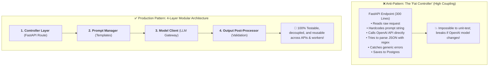
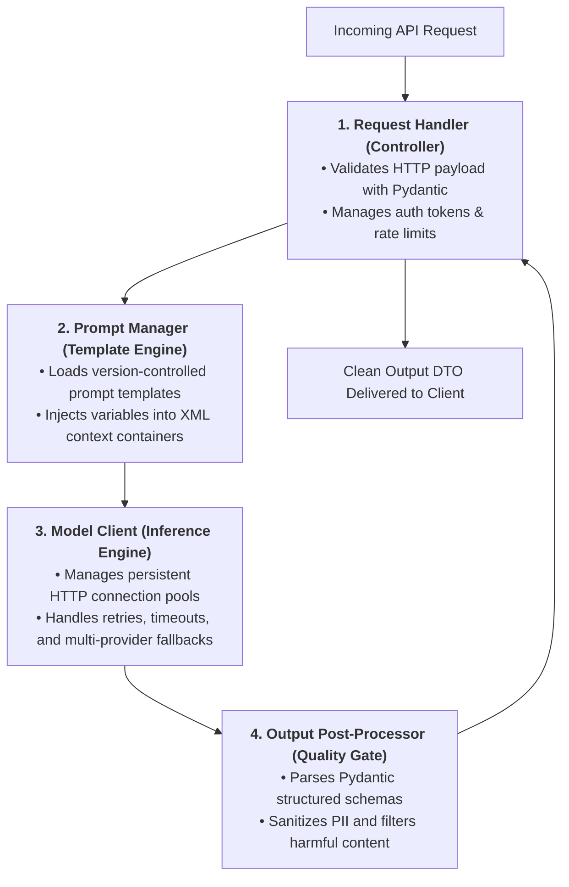
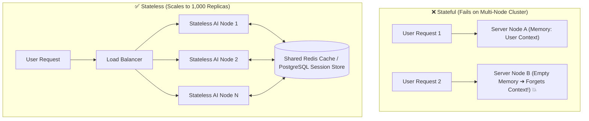

# 02 - AI Service Design: Modular Layers & Stateless Architecture

> **Mental Model**:  
> Think of an AI Service like a **gourmet restaurant kitchen with dedicated stations**:  
> * **The 'Fat Controller' Anti-Pattern**: Cramming prompt formatting, OpenAI API calls, retry loops, database updates, and JSON regex cleanup into one single 300-line FastAPI endpoint handler (Brittle, un-testable spaghetti code!).  
> * **The 4 Kitchen Stations (Modular Service Layer)**:  
>   * **The Waiter (Request Handler / Controller)**: Validates incoming customer orders and returns status codes.  
>   * **The Sous Chef (Prompt Manager)**: Prepares the recipe and injects dynamic variables into verified templates.  
>   * **The Master Cook (Model Client)**: Manages oven connections (LLM APIs) with connection pooling and retry fallbacks.  
>   * **The Quality Inspector (Post-Processor)**: Inspects the dish, validates JSON schemas, and strips hallucinations before serving!

---

## 📑 Table of Contents
1. [The 'Fat Controller' Anti-Pattern vs. Clean Service Architecture](#1-the-fat-controller-anti-pattern-vs-clean-service-architecture)
2. [The 4 Core Subsystems of an AI Service](#2-the-4-core-subsystems-of-an-ai-service)
3. [Statelessness: The Secret to Infinite Horizontal Scaling](#3-statelessness-the-secret-to-infinite-horizontal-scaling)
4. [Decoupling API Contracts: Request & Response DTOs](#4-decoupling-api-contracts-request--response-dtos)
5. [Building a Modular Production AI Service in Python](#5-building-a-modular-production-ai-service-in-python)
6. [Master Cheat Sheet & Reference Table](#6-master-cheat-sheet--reference-table)

---

## 1. The 'Fat Controller' Anti-Pattern vs. Clean Service Architecture



---

## 2. The 4 Core Subsystems of an AI Service



---

## 3. Statelessness: The Secret to Infinite Horizontal Scaling

> 🚨 **The In-Memory Trap:**  
> If an AI service stores conversation history in a global Python variable (`CONVERSATIONS = {}`), scaling from 1 to 50 server instances will cause users to lose their chat history on every load-balanced request!



---

## 4. Decoupling API Contracts: Request & Response DTOs

Never expose raw OpenAI response objects (`openai.types.chat.ChatCompletion`) to external frontend clients:

| Public REST Response (DTO) | Raw LLM API Payload (Internal) |
| :--- | :--- |
| `{"answer": "...", "confidence": 0.95}` | `{"id": "chatcmpl-99", "object": "chat.completion", "usage": {...}}` |
| Stable, versioned public contract. | Brittle, vendor-specific internal payload. |
| Zero leaked provider implementation details. | Exposes model names, token counts, and internal IDs. |

---

## 5. Building a Modular Production AI Service in Python

Here is a complete, production-grade implementation of a clean 4-tier AI Service:

```python
from fastapi import FastAPI, Depends, HTTPException
from pydantic import BaseModel, Field
from openai import OpenAI
import json
import os

# --- 1. Public DTO Contracts ---
class SummarizeRequest(BaseModel):
    user_id: str
    text_to_summarize: str = Field(min_length=10, max_length=10000)
    target_bullets: int = Field(default=3, ge=1, le=10)

class SummarizeResponse(BaseModel):
    summary_bullets: list[str]
    word_count: int
    processing_time_ms: float

# --- 2. Subsystem: Prompt Manager ---
class PromptManager:
    @staticmethod
    def build_summary_prompt(text: str, num_bullets: int) -> str:
        return f"""You are a professional executive editor.
Summarize the text below into exactly {num_bullets} concise, high-impact bullet points.
Return your answer strictly as a JSON list of strings: ["bullet 1", "bullet 2", ...].

<text>
{text}
</text>"""

# --- 3. Subsystem: Model Client ---
class ModelClient:
    def __init__(self):
        self.client = OpenAI(api_key=os.getenv("OPENAI_API_KEY", "mock-key"))

    def generate(self, prompt: str) -> str:
        res = self.client.chat.completions.create(
            model="gpt-4o-mini",
            messages=[{"role": "user", "content": prompt}],
            temperature=0.0
        )
        return res.choices[0].message.content

# --- 4. Subsystem: Output Post-Processor ---
class OutputPostProcessor:
    @staticmethod
    def parse_bullet_list(raw_output: str) -> list[str]:
        try:
            # Clean markdown codeblocks if present
            cleaned = raw_output.strip().replace("```json", "").replace("```", "").strip()
            data = json.loads(cleaned)
            if isinstance(data, list):
                return [str(b).strip() for b in data]
            return [cleaned]
        except Exception:
            return [line.strip("- ") for line in raw_output.split("\n") if line.strip()]

# --- 5. Domain Service Layer (Orchestrator) ---
class DocumentSummaryService:
    def __init__(self, prompt_mgr: PromptManager, model_client: ModelClient, post_proc: OutputPostProcessor):
        self.prompt_mgr = prompt_mgr
        self.model_client = model_client
        self.post_proc = post_proc

    def summarize_document(self, req: SummarizeRequest) -> SummarizeResponse:
        import time
        start_time = time.time()

        # Step 1: Format Prompt
        prompt = self.prompt_mgr.build_summary_prompt(req.text_to_summarize, req.target_bullets)

        # Step 2: Model Inference
        raw_output = self.model_client.generate(prompt)

        # Step 3: Post-Process & Validate
        bullets = self.post_proc.parse_bullet_list(raw_output)
        elapsed_ms = round((time.time() - start_time) * 1000, 2)

        return SummarizeResponse(
            summary_bullets=bullets,
            word_count=len(req.text_to_summarize.split()),
            processing_time_ms=elapsed_ms
        )

# --- 6. FastAPI Controller Layer ---
app = FastAPI(title="Modular AI Service")

# Dependency Injection Provider
def get_summary_service() -> DocumentSummaryService:
    return DocumentSummaryService(
        prompt_mgr=PromptManager(),
        model_client=ModelClient(),
        post_proc=OutputPostProcessor()
    )

@app.post("/v1/summarize", response_model=SummarizeResponse)
async def handle_summarize(
    req: SummarizeRequest,
    service: DocumentSummaryService = Depends(get_summary_service)
):
    try:
        return service.summarize_document(req)
    except Exception as e:
        raise HTTPException(status_code=500, detail=f"Summary service error: {str(e)}")
```

---

## 6. Master Cheat Sheet & Reference Table

| Subsystem Layer | Responsibility | Isolation Benefit |
| :--- | :--- | :--- |
| **Controller** | HTTP routing, status codes, auth headers. | Keeps network logic out of business code. |
| **Prompt Manager** | Template interpolation, system guards, XML tags. | Allows prompt changes without touching APIs. |
| **Model Client** | Connection pooling, retries, multi-model routing. | Switch from OpenAI to Anthropic in 1 file. |
| **Post-Processor** | Schema validation, PII redaction, markdown stripping.| Protects frontend clients from hallucinations. |
| **Stateless Rule** | Store session state in Redis/PostgreSQL. | Enables infinite horizontal autoscaling. |

---

## 🎯 Next Step in Phase 9
Now that you have mastered modular AI service design and stateless architecture, we will advance to **[03 - Model Provider Management](file:///home/user2/PythonProject/Python-for-ai-engineering/09-ai-system-design/03-model-provider-management)** to master Multi-Provider Gateways (LiteLLM, Portkey), load balancing, and provider-agnostic fallbacks!
