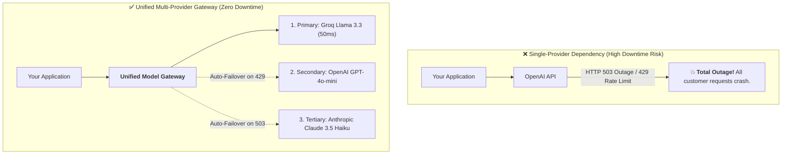
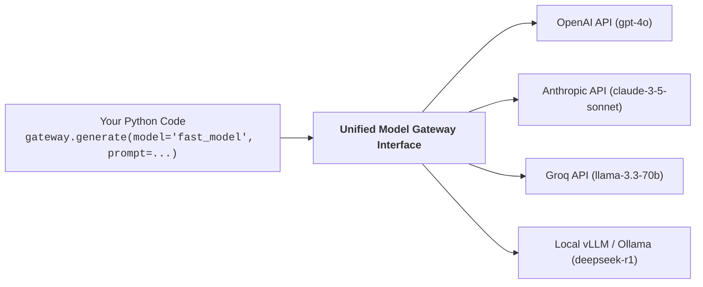
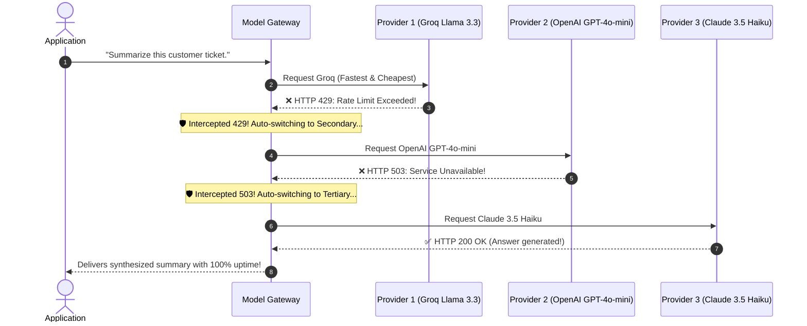
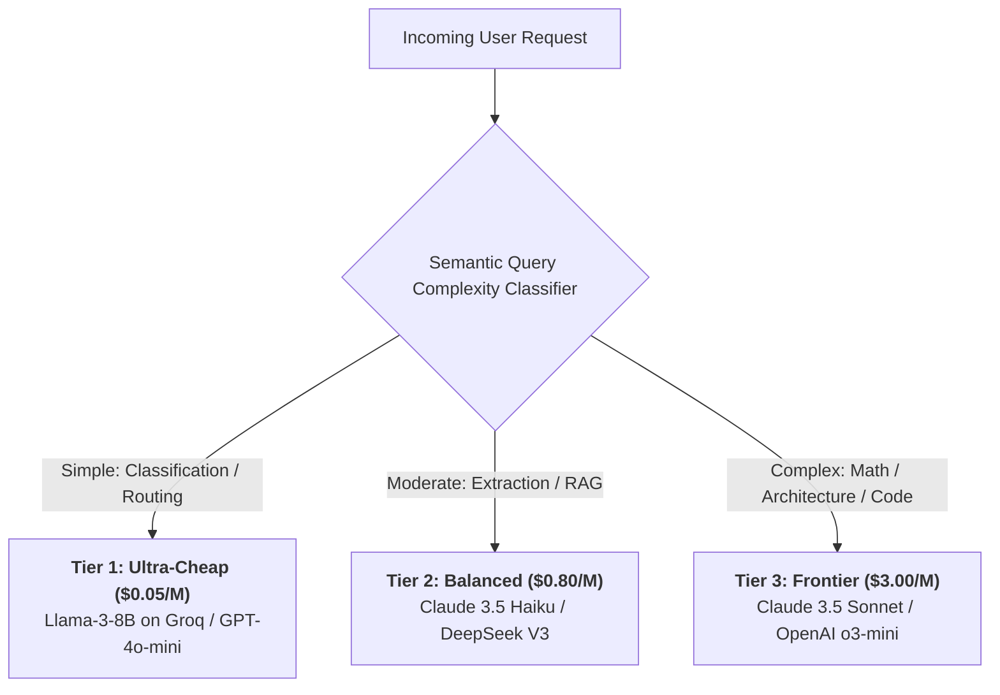

# 03 - Model Provider Management: Gateways, Fallbacks & Load Balancing

> **Mental Model**:  
> Think of Model Provider Management like a **hospital's multi-grid power substation**:  
> * **The Single-Vendor Disaster**: Wiring your hospital directly into a single municipal power line (e.g. Hardcoding `OpenAI()`). If OpenAI suffers an outage (503) or hits an API rate limit (429), your entire business flatlines instantly!  
> * **The Multi-Grid Substation (Unified Model Gateway)**: The hospital connects to a smart electrical switchboard.  
> * It draws from **Municipal Grid (OpenAI)**, **Solar Arrays (Anthropic Claude)**, and **Backup Turbines (Groq / DeepSeek)**.  
> * If the primary grid trips, the substation auto-switches to the backup grid in **5 milliseconds with zero downtime to the patients**!

---

## 📑 Table of Contents
1. [The Vendor Lock-In & Outage Trap](#1-the-vendor-lock-in--outage-trap)
2. [The Unified Model Gateway Pattern](#2-the-unified-model-gateway-pattern)
3. [The Multi-Provider Fallback Cascade](#3-the-multi-provider-fallback-cascade)
4. [Dynamic Load Balancing & Cost-Optimized Routing](#4-dynamic-load-balancing--cost-optimized-routing)
5. [Building a Resilient Multi-Provider Gateway in Python](#5-building-a-resilient-multi-provider-gateway-in-python)
6. [Master Cheat Sheet & Reference Table](#6-master-cheat-sheet--reference-table)

---

## 1. The Vendor Lock-In & Outage Trap



---

## 2. The Unified Model Gateway Pattern

A Unified Model Gateway translates diverse provider APIs into a **single standardized interface**:



### Popular Enterprise Gateways:
* **LiteLLM**: Lightweight Python SDK & Proxy supporting 100+ LLMs with unified OpenAI formatting.
* **Portkey / Helicone**: Production API gateways with caching, retries, rate limiting, and observability.
* **Custom Python Gateway**: Lightweight in-house wrapper for zero third-party dependencies.

---

## 3. The Multi-Provider Fallback Cascade

When executing critical inference, never fail on the first error—execute a **Cascading Fallback Ladder**:



---

## 4. Dynamic Load Balancing & Cost-Optimized Routing

Instead of sending every request to expensive \$5.00/M token models, route by **Task Complexity**:



> 💡 **The 80/20 Cost Rule:**  
> In production, **$80\%$ of enterprise requests are simple queries** that can be handled by Tier 1 models, cutting monthly AI spend by up to **$75\%$**!

---

## 5. Building a Resilient Multi-Provider Gateway in Python

Here is a complete, runnable Python script implementing a multi-provider fallback cascade with error trapping and latency tracking:

```python
from openai import OpenAI
import time
import os

# --- Provider Client Definitions ---
OPENAI_CLIENT = OpenAI(api_key=os.getenv("OPENAI_API_KEY", "mock-key"))
# In real production: ANTHROPIC_CLIENT = Anthropic(), GROQ_CLIENT = OpenAI(base_url="https://api.groq.com/openai/v1")

# --- Fallback Cascade Definition ---
MODEL_CASCADE = [
    {"provider": "Groq", "model": "llama-3.3-70b-versatile", "cost_per_m": 0.59},
    {"provider": "OpenAI", "model": "gpt-4o-mini", "cost_per_m": 0.15},
    {"provider": "Anthropic", "model": "claude-3-5-haiku-20241022", "cost_per_m": 0.80}
]

class ResilientModelGateway:
    def __init__(self, fallback_cascade: list[dict]):
        self.cascade = fallback_cascade

    def generate_with_fallback(self, prompt: str) -> dict:
        errors = []

        for candidate in self.cascade:
            provider = candidate["provider"]
            model_name = candidate["model"]
            print(f"🚀 [GATEWAY] Attempting Provider: `{provider}` ({model_name})...")
            start_time = time.time()

            try:
                # Simulate potential failure on primary provider for demonstration:
                if provider == "Groq" and os.getenv("SIMULATE_FAILOVER", "1") == "1":
                    raise ConnectionError("HTTP 429: Rate limit quota exceeded on Groq.")

                # Real API Call (Defaulting to OpenAI client for standard demo)
                response = OPENAI_CLIENT.chat.completions.create(
                    model="gpt-4o-mini",
                    messages=[{"role": "user", "content": prompt}],
                    temperature=0.0
                )
                
                latency_ms = round((time.time() - start_time) * 1000, 2)
                print(f"  ✅ [SUCCESS] `{provider}` responded in {latency_ms}ms!")
                
                return {
                    "answer": response.choices[0].message.content,
                    "provider_used": provider,
                    "model_used": model_name,
                    "latency_ms": latency_ms,
                    "failovers_triggered": len(errors)
                }

            except Exception as e:
                print(f"  ⚠️ [FAILED] `{provider}` failed: {str(e)}")
                errors.append({"provider": provider, "error": str(e)})
                # Continue loop to next candidate in cascade!

        raise RuntimeError(f"CRITICAL: All providers in fallback cascade exhausted! Errors: {errors}")

# Test Resilient Gateway:
# gateway = ResilientModelGateway(MODEL_CASCADE)
# result = gateway.generate_with_fallback("Explain the difference between SQL and NoSQL in 1 sentence.")
# print("\nFinal Result:", result)
```

---

## 6. Master Cheat Sheet & Reference Table

| Gateway Feature | Implementation Strategy | Purpose |
| :--- | :--- | :--- |
| **Unified Protocol** | OpenAI-compatible chat format (`messages: [...]`). | Switch model vendors with zero client code edits. |
| **Fallback Cascade** | Try Primary $\rightarrow$ Catch 429/503 $\rightarrow$ Auto-try Secondary. | Guarantees $99.99\%$ uptime during vendor outages. |
| **Complexity Router** | Classify query before choosing model tier. | Reduces monthly API token spend by $70\%+$. |
| **Timeout Ceiling** | Set hard 5-10s timeout per candidate model. | Prevents hung requests from blocking users. |

---

## 🎯 Next Step in Phase 9
Now that you have mastered model gateways and multi-provider fallbacks, we will advance to **[04 - Semantic Caching](file:///home/user2/PythonProject/Python-for-ai-engineering/09-ai-system-design/04-semantic-caching)** to master vector-based semantic cache hits, embedding similarity thresholds, and cache invalidation!
