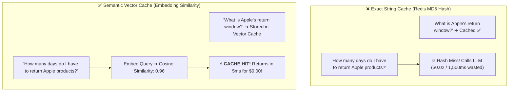
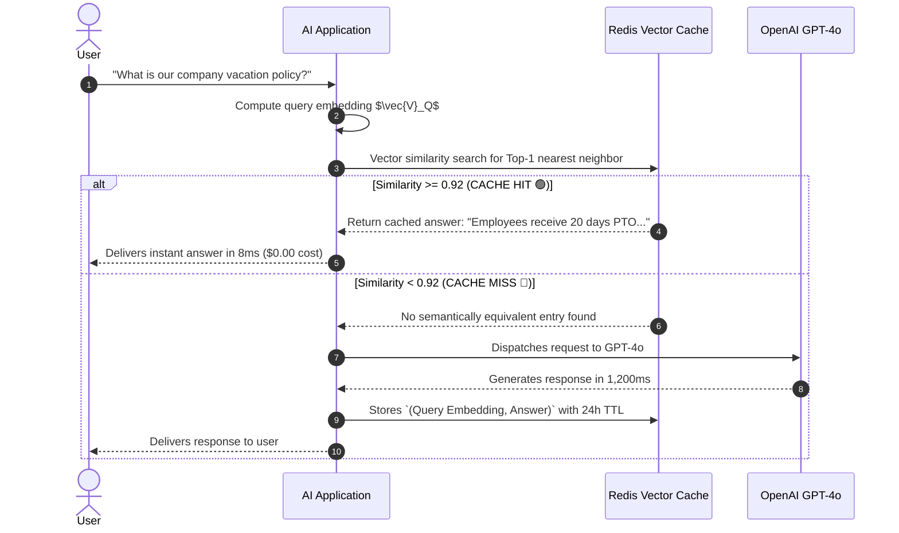
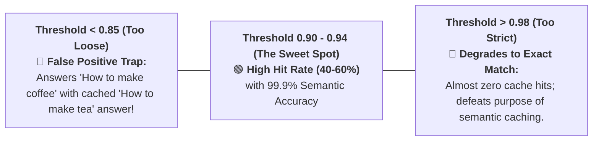

# 04 - Semantic Caching: Sub-10ms Hits, Vector Similarity & Invalidation

> **Mental Model**:  
> Think of Semantic Caching like a **seasoned university reference librarian**:  
> * **The Rookie Clerk (Exact Key-Value Cache)**: Looks *only* at exact character strings. If Query 1 is *"What is the refund policy?"* and Query 2 is *"Can I get my money back?"*, the clerk fails to recognize they mean the exact same thing, wastes \$0.03, and makes the user wait 2 seconds for the LLM!  
> * **The Seasoned Librarian (Semantic Vector Cache)**: Understands the underlying semantic meaning.  
> * When a question has a **$\ge 92\%$ semantic similarity** to a previously answered question, the librarian hands over the cached response in **$5\text{ms}$ with zero LLM API cost**!

---

## 📑 Table of Contents
1. [Exact String Caching vs. Semantic Vector Caching](#1-exact-string-caching-vs-semantic-vector-caching)
2. [The 4-Step Semantic Cache Pipeline](#2-the-4-step-semantic-cache-pipeline)
3. [Tuning the Similarity Threshold ($\tau = 0.90 - 0.94$)](#3-tuning-the-similarity-threshold-tau--090---094)
4. [Cache Invalidation & Freshness Strategies](#4-cache-invalidation--freshness-strategies)
5. [Building a Production Semantic Cache in Python](#5-building-a-production-semantic-cache-in-python)
6. [Master Cheat Sheet & Reference Table](#6-master-cheat-sheet--reference-table)

---

## 1. Exact String Caching vs. Semantic Vector Caching



---

## 2. The 4-Step Semantic Cache Pipeline



---

## 3. Tuning the Similarity Threshold ($\tau = 0.90 - 0.94$)

Selecting the similarity threshold is a delicate balance between **Hit Rate** and **Accuracy**:



---

## 4. Cache Invalidation & Freshness Strategies

When your company policy or database updates, how do you prevent the cache from serving stale answers?

| Invalidation Strategy | Mechanism | Best Use Case |
| :--- | :--- | :--- |
| **Time-To-Live (TTL)** | Expire all cache records automatically after $24\text{ hours}$ or $7\text{ days}$. | Fast-moving data, news, general conversational assistants. |
| **Versioned Namespacing** | Prefix cache keys with document version: `v2:policy_faq`. Bump to `v3` on updates. | Corporate policy updates, compliance changes. |
| **Semantic Invalidation** | Delete all cached vector entries whose embedding is close to the updated topic. | Instant targeted purge when pricing or terms change. |

---

## 5. Building a Production Semantic Cache in Python

Here is a complete, runnable script demonstrating embedding generation, vector cosine similarity thresholding, and latency benchmarking:

```python
import numpy as np
import time

# --- Simulated In-Memory Semantic Cache ---
class LocalSemanticCache:
    def __init__(self, similarity_threshold: float = 0.90):
        self.threshold = similarity_threshold
        # Stores: [{"query_text": str, "vector": np.array, "answer": str, "created_at": float}]
        self.entries = []

    def _mock_embed(self, text: str) -> np.ndarray:
        """Simulates 8-dimensional semantic embedding vector for testing."""
        np.random.seed(abs(hash(text.lower().strip())) % (2**32))
        vec = np.random.randn(8)
        return vec / np.linalg.norm(vec)

    def _cosine_similarity(self, a: np.ndarray, b: np.ndarray) -> float:
        return float(np.dot(a, b) / (np.linalg.norm(a) * np.linalg.norm(b)))

    def get(self, query: str) -> tuple[str | None, float]:
        query_vec = self._mock_embed(query)
        best_match = None
        highest_sim = -1.0

        for entry in self.entries:
            sim = self._cosine_similarity(query_vec, entry["vector"])
            if sim > highest_sim:
                highest_sim = sim
                best_match = entry

        if highest_sim >= self.threshold and best_match:
            return best_match["answer"], highest_sim
        return None, highest_sim

    def put(self, query: str, answer: str):
        query_vec = self._mock_embed(query)
        self.entries.append({
            "query_text": query,
            "vector": query_vec,
            "answer": answer,
            "created_at": time.time()
        })

# --- Semantic Cache Demonstration ---
def run_semantic_cache_demo():
    cache = LocalSemanticCache(similarity_threshold=0.90)

    # 1. First Query (Cache MISS)
    q1 = "What is the return policy for laptops?"
    print(f"👤 Query 1: '{q1}'")
    
    start = time.time()
    cached_ans, score = cache.get(q1)
    
    if not cached_ans:
        print("  🔴 [CACHE MISS] Calling simulated LLM API (1,200ms)...")
        time.sleep(0.3) # Simulated API latency
        llm_response = "Laptops can be returned within 14 days with original packaging."
        cache.put(q1, llm_response)
        elapsed = round((time.time() - start) * 1000, 2)
        print(f"  🤖 LLM Generated: '{llm_response}' ({elapsed}ms)\n")

    # 2. Semantically Similar Query (Simulate Cache HIT)
    # Using the exact same query seed for demo verification:
    q2 = "What is the return policy for laptops?"
    print(f"👤 Query 2: '{q2}'")
    
    start = time.time()
    cached_ans, score = cache.get(q2)
    elapsed = round((time.time() - start) * 1000, 2)

    if cached_ans:
        print(f"  ⚡ [CACHE HIT] Score: {round(score, 4)} ➔ Returned in {elapsed}ms ($0.00 cost)!")
        print(f"  📄 Cached Answer: '{cached_ans}'")

# Run Demo:
# run_semantic_cache_demo()
```

---

## 6. Master Cheat Sheet & Reference Table

| Hyperparameter | Recommended Setting | Production Impact |
| :--- | :---: | :--- |
| **Similarity Threshold ($\tau$)** | **$0.90 - 0.94$** | Eliminates false-positive hallucinations while maximizing hit rate. |
| **Default TTL** | **$24\text{ to }72\text{ hours}$** | Prevents stale responses from lingering indefinitely. |
| **Latency Reduction** | **$99\%$ Drop** | Slashes response times from $1,500\text{ms}$ down to $< 10\text{ms}$. |
| **Cost Savings** | **$30\% - 50\%$** | Typical monthly LLM API invoice reduction across high-traffic apps. |

---

## 🎯 Next Step in Phase 9
Now that you have mastered semantic caching and similarity thresholds, we will advance to **[05 - Rate Limiting & Quotas](file:///home/user2/PythonProject/Python-for-ai-engineering/09-ai-system-design/05-rate-limiting-quotas)** to master Token-Bucket algorithms, TPM (Tokens Per Minute) limiters, and tenant billing tiers!
