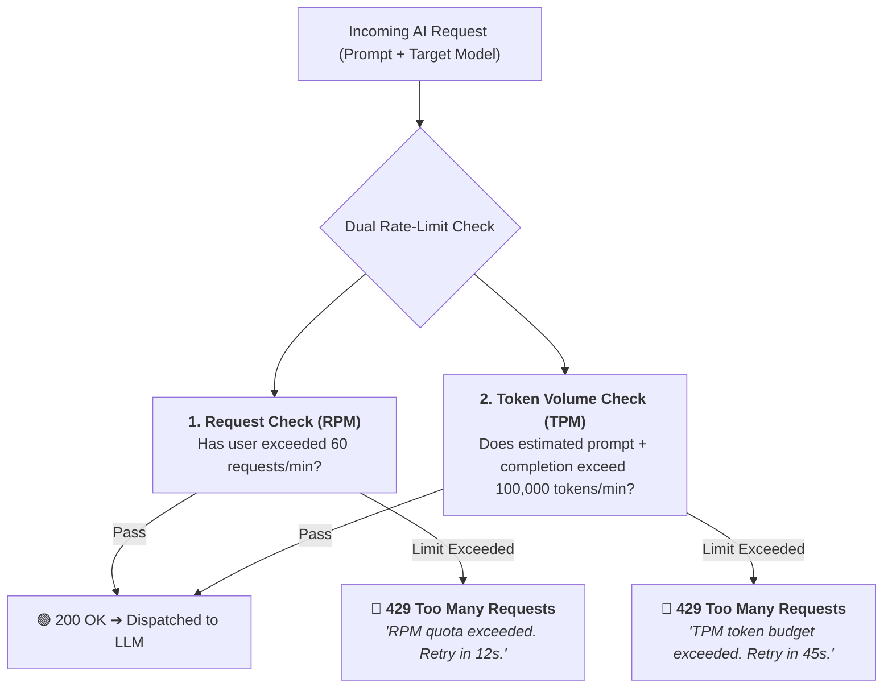
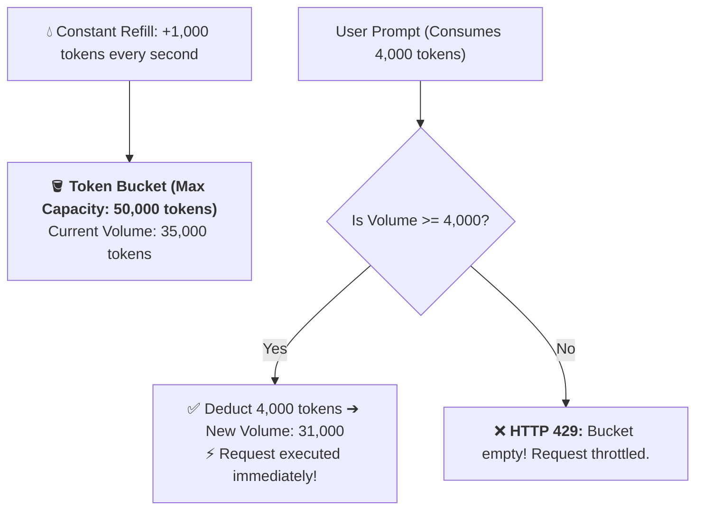
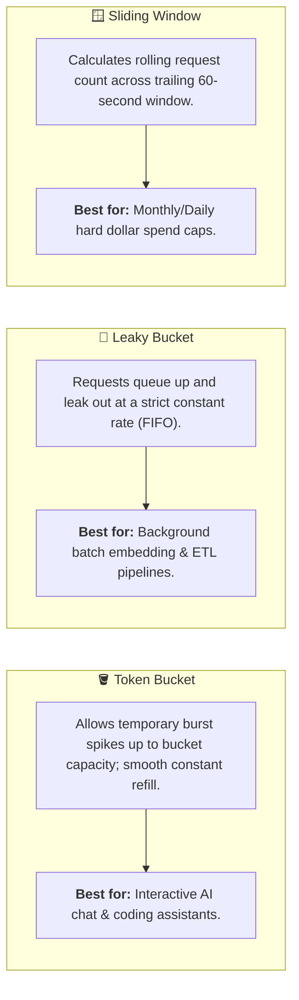
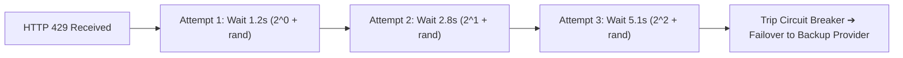

# 05 - Rate Limiting & Quotas: RPM, TPM & The Token Bucket Algorithm

> **Mental Model**:  
> Think of AI Rate Limiting like **a highway toll booth equipped with a heavy cargo weight scale**:  
> * **Traditional Rate Limiting (RPM - Requests Per Minute)**: Only counts the *number of vehicles* crossing the gate.  
> * **The AI Rate Limiting Crisis**: In traditional APIs, every request is a tiny 1KB JSON payload. In AI, **Request 1 is 10 words ($15$ tokens)** while **Request 2 is a 100-page legal PDF ($80,000$ tokens)**!  
> * If you only measure RPM, a single user uploading 5 PDFs will exhaust your company's entire enterprise token quota in 3 seconds!  
> * Production AI Gateways enforce **Dual-Metered Rate Limiting: RPM (Traffic flow) + TPM (Token volume)**.

---

## 📑 Table of Contents
1. [The Dual-Metering Imperative: RPM vs. TPM](#1-the-dual-metering-imperative-rpm-vs-tpm)
2. [The Token Bucket Algorithm Explained Visually](#2-the-token-bucket-algorithm-explained-visually)
3. [Token Bucket vs. Leaky Bucket vs. Sliding Window](#3-token-bucket-vs-leaky-bucket-vs-sliding-window)
4. [Tiered Multi-Tenant Quotas (Free vs. Pro vs. Enterprise)](#4-tiered-multi-tenant-quotas-free-vs-pro-vs-enterprise)
5. [Handling Upstream 429s (Exponential Backoff with Jitter)](#5-handling-upstream-429s-exponential-backoff-with-jitter)
6. [Building a Dual RPM + TPM Token Bucket Limiter in Python](#6-building-a-dual-rpm--tpm-token-bucket-limiter-in-python)
7. [Master Cheat Sheet & Reference Table](#7-master-cheat-sheet--reference-table)

---

## 1. The Dual-Metering Imperative: RPM vs. TPM



---

## 2. The Token Bucket Algorithm Explained Visually

The **Token Bucket** is the gold-standard algorithm for handling bursty AI workloads:



---

## 3. Token Bucket vs. Leaky Bucket vs. Sliding Window



---

## 4. Tiered Multi-Tenant Quotas (Free vs. Pro vs. Enterprise)

| Plan Tier | RPM Ceiling | TPM (Tokens / Min) | Daily Dollar Cap | Priority Queue |
| :--- | :---: | :---: | :---: | :---: |
| 🥉 **Free Tier** | $5\text{ RPM}$ | $15,000\text{ TPM}$ | $\$1.00 / \text{day}$ | Low (Throttled during peaks) |
| 🥈 **Pro Tier** | $60\text{ RPM}$ | $150,000\text{ TPM}$ | $\$25.00 / \text{day}$ | Standard |
| 🥇 **Enterprise** | $600\text{ RPM}$ | $2,000,000\text{ TPM}$ | Custom SLA | High (Dedicated Provider Keys) |

---

## 5. Handling Upstream 429s (Exponential Backoff with Jitter)

When a model provider returns an HTTP 429, naive retries cause a **Thundering Herd** crash.  
Always use **Exponential Backoff with Full Randomized Jitter**:



---

## 6. Building a Dual RPM + TPM Token Bucket Limiter in Python

Here is a complete, runnable script implementing thread-safe Dual-Metered (RPM + TPM) rate limiting in Python:

```python
import time
import math

class DualTokenBucketLimiter:
    def __init__(self, rpm_limit: int, tpm_limit: int):
        self.rpm_limit = rpm_limit
        self.tpm_limit = tpm_limit

        # Buckets and refill rates
        self.requests_capacity = float(rpm_limit)
        self.tokens_capacity = float(tpm_limit)
        
        self.current_requests = self.requests_capacity
        self.current_tokens = self.tokens_capacity
        
        self.rpm_refill_rate = self.requests_capacity / 60.0  # requests per second
        self.tpm_refill_rate = self.tokens_capacity / 60.0    # tokens per second
        
        self.last_update = time.time()

    def _refill(self):
        now = time.time()
        elapsed = now - self.last_update
        self.last_update = now

        # Add newly accrued tokens/requests
        self.current_requests = min(self.requests_capacity, self.current_requests + elapsed * self.rpm_refill_rate)
        self.current_tokens = min(self.tokens_capacity, self.current_tokens + elapsed * self.tpm_refill_rate)

    def acquire(self, estimated_tokens: int) -> tuple[bool, str, int]:
        """Attempts to consume 1 request and N tokens.
        
        Returns:
            (allowed: bool, reason: str, retry_after_seconds: int)
        """
        self._refill()

        # Check RPM
        if self.current_requests < 1.0:
            deficit = 1.0 - self.current_requests
            retry_after = math.ceil(deficit / self.rpm_refill_rate)
            return False, "RPM limit exceeded", retry_after

        # Check TPM
        if self.current_tokens < estimated_tokens:
            deficit = estimated_tokens - self.current_tokens
            retry_after = math.ceil(deficit / self.tpm_refill_rate)
            return False, "TPM token budget exceeded", retry_after

        # Consume capacity
        self.current_requests -= 1.0
        self.current_tokens -= float(estimated_tokens)
        return True, "OK", 0

# --- Test Rate Limiting Engine ---
def test_limiter():
    # Setup Limiter: 2 RPM and 1,000 TPM
    limiter = DualTokenBucketLimiter(rpm_limit=2, tpm_limit=1000)

    print("🚀 [TEST 1] Small Request (200 tokens):")
    allowed, reason, wait = limiter.acquire(estimated_tokens=200)
    print(f"  Result: {allowed} | Reason: {reason} | Wait: {wait}s")

    print("\n🚀 [TEST 2] Second Small Request (300 tokens):")
    allowed, reason, wait = limiter.acquire(estimated_tokens=300)
    print(f"  Result: {allowed} | Reason: {reason} | Wait: {wait}s")

    print("\n🚀 [TEST 3] Third Request (RPM Burst Exceeded):")
    allowed, reason, wait = limiter.acquire(estimated_tokens=100)
    print(f"  Result: {allowed} | Reason: {reason} | 🛑 Retry-After: {wait}s")

# Run Test:
# test_limiter()
```

---

## 7. Master Cheat Sheet & Reference Table

| Metric / Header | Standard | Purpose |
| :--- | :--- | :--- |
| **`RPM`** | Requests Per Minute | Controls raw traffic velocity and HTTP concurrency. |
| **`TPM`** | Tokens Per Minute | Controls raw compute volume and provider billing quotas. |
| **`HTTP 429`** | Status Code | Standard error returned when either RPM or TPM is exceeded. |
| **`Retry-After: N`** | HTTP Header | Informs client how many seconds to pause before retrying. |
| **Jitter Formula** | $t = 2^{\text{attempt}} + \text{rand}(0, 1)$ | Prevents synchronized thundering herd retries. |

---

## 🎯 Next Step in Phase 9
Now that you have mastered rate limiting, token buckets, and TPM quotas, we will advance to **[06 - AI Guardrails](file:///home/user2/PythonProject/Python-for-ai-engineering/09-ai-system-design/06-ai-guardrails)** to master input/output safety airlocks, PII masking, jailbreak defense, and NeMo / Llama Guard!
