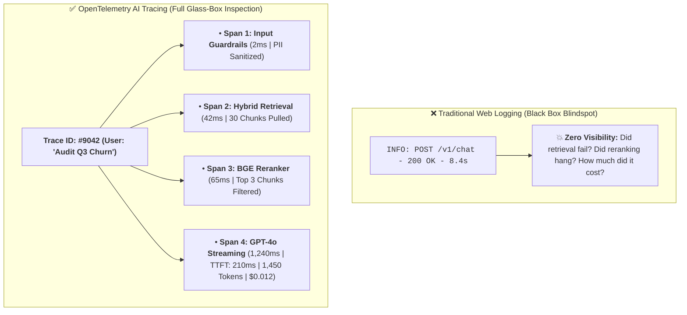
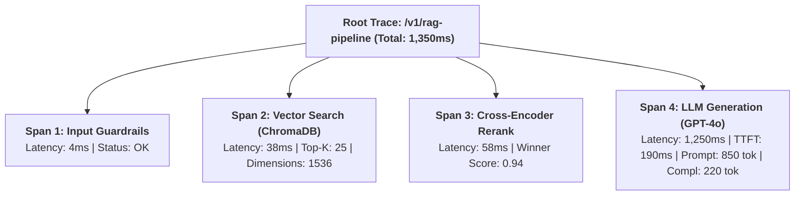
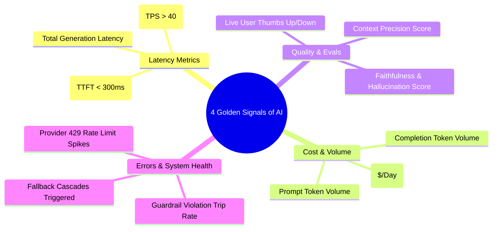

# 07 - AI Observability: OpenTelemetry, Traces & LLM Telemetry

> **Mental Model**:  
> Think of AI Observability like a **medical MRI machine and black box flight recorder**:  
> * **The Traditional Logging Blindspot (Shallow 200 OK Logs)**: When an AI agent takes 8 seconds and gives a hallucinated answer, traditional logs only show `HTTP 200 OK (8,200ms)`. You have no idea which vector chunk was retrieved, what tools were called, or where the latency exploded!  
> * **The Deep MRI Scan (Distributed AI Tracing)**: Every prompt generates a **Trace ID** broken into nested **Spans** (Guardrails $\rightarrow$ Retrieval $\rightarrow$ Reranking $\rightarrow$ LLM Streaming).  
> * It records the exact millisecond duration, token count, cost in dollars, and intermediate data at every single hop in the pipeline.

---

## 📑 Table of Contents
1. [Shallow Web Logs vs. Deep AI Observability](#1-shallow-web-logs-vs-deep-ai-observability)
2. [The OpenTelemetry GenAI Span Waterfall](#2-the-opentelemetry-genai-span-waterfall)
3. [The 4 Golden Signals of AI Telemetry](#3-the-4-golden-signals-of-ai-telemetry)
4. [The Observability Tech Stack (Langfuse, Phoenix, Helicone)](#4-the-observability-tech-stack-langfuse-phoenix-helicone)
5. [Building a Production AI Tracer & Span Engine in Python](#5-building-a-production-ai-tracer--span-engine-in-python)
6. [Master Cheat Sheet & Reference Table](#6-master-cheat-sheet--reference-table)

---

## 1. Shallow Web Logs vs. Deep AI Observability



---

## 2. The OpenTelemetry GenAI Span Waterfall

The OpenTelemetry standard structures AI traces into a **hierarchical span tree**:



---

## 3. The 4 Golden Signals of AI Telemetry



---

## 4. The Observability Tech Stack (Langfuse, Phoenix, Helicone)

| Platform | Deployment Model | Open Source? | Best Architectural Fit |
| :--- | :--- | :---: | :--- |
| **Langfuse** | Self-Hosted (Docker) or Cloud | **Yes (MIT)** | Production tracing, prompt management, cost dashboards. |
| **Arize Phoenix** | Python In-Memory / Cloud | **Yes** | Embedding drift, RAG evaluation, clustering failure modes. |
| **Helicone / Portkey**| Managed Cloud Proxy Gateway | Hybrid | Zero-code proxy instrumentation with rate limiting. |

---

## 5. Building a Production AI Tracer & Span Engine in Python

Here is a complete, runnable script implementing a structured OpenTelemetry-style AI Span Tracer in pure Python:

```python
import time
from contextlib import contextmanager
from typing import List, Dict, Any
import json

class AISpan:
    def __init__(self, name: str, parent_id: str = None):
        self.name = name
        self.parent_id = parent_id
        self.start_time = 0.0
        self.duration_ms = 0.0
        self.attributes: Dict[str, Any] = {}

class AITraceLogger:
    def __init__(self, trace_id: str):
        self.trace_id = trace_id
        self.spans: List[AISpan] = []

    @contextmanager
    def span(self, name: str):
        span = AISpan(name)
        span.start_time = time.time()
        self.spans.append(span)
        try:
            yield span
        finally:
            span.duration_ms = round((time.time() - span.start_time) * 1000, 2)

    def print_waterfall(self):
        total_time = sum(s.duration_ms for s in self.spans)
        print("\n" + "="*65)
        print(f"📊 [TRACE REPORT] ID: #{self.trace_id} | Total Time: {round(total_time, 2)}ms")
        print("="*65)

        for s in self.spans:
            bar_length = int(s.duration_ms / 20) + 1
            bar = "█" * min(bar_length, 25)
            print(f"  • {s.name:<25} | {s.duration_ms:>7.2f}ms | {bar}")
            for k, v in s.attributes.items():
                print(f"      ↳ {k}: {v}")
        print("="*65 + "\n")

# --- Run Traced RAG Pipeline Demonstration ---
def run_traced_ai_pipeline(user_query: str):
    tracer = AITraceLogger(trace_id="req_9042_enterprise")

    # 1. Guardrail Span
    with tracer.span("input_guardrail_airlock") as s:
        time.sleep(0.02) # Simulated regex scan
        s.attributes["pii_redacted"] = True
        s.attributes["injection_detected"] = False

    # 2. Vector Search Span
    with tracer.span("vector_database_search") as s:
        time.sleep(0.08) # Simulated HNSW search
        s.attributes["db_engine"] = "ChromaDB"
        s.attributes["top_k_retrieved"] = 25
        s.attributes["dimensions"] = 1536

    # 3. Cross-Encoder Reranker Span
    with tracer.span("cross_encoder_rerank") as s:
        time.sleep(0.12) # Simulated reranker scoring
        s.attributes["model"] = "bge-reranker-large"
        s.attributes["candidates_rescored"] = 25
        s.attributes["top_finalists"] = 3

    # 4. LLM Generation Span
    with tracer.span("llm_grounded_generation") as s:
        time.sleep(0.45) # Simulated generation
        s.attributes["gen_ai.system"] = "OpenAI"
        s.attributes["gen_ai.request.model"] = "gpt-4o-mini"
        s.attributes["gen_ai.usage.prompt_tokens"] = 840
        s.attributes["gen_ai.usage.completion_tokens"] = 160
        s.attributes["gen_ai.usage.cost_usd"] = "$0.00015"
        s.attributes["time_to_first_token_ms"] = 180.0

    # Print Trace Waterfall Report
    tracer.print_waterfall()

# Run Pipeline:
# run_traced_ai_pipeline("What is our enterprise SLA guarantee?")
```

---

## 6. Master Cheat Sheet & Reference Table

| OpenTelemetry Attribute | Standard Format | Role |
| :--- | :--- | :--- |
| **`gen_ai.system`** | `"openai"` / `"anthropic"` | The backend LLM provider name. |
| **`gen_ai.request.model`** | `"gpt-4o-mini"` / `"claude-3-5-sonnet"` | The exact model identifier invoked. |
| **`gen_ai.usage.prompt_tokens`** | `int` (e.g. `850`) | Ingested input prompt tokens. |
| **`gen_ai.usage.completion_tokens`**| `int` (e.g. `190`) | Generated output response tokens. |
| **`time_to_first_token_ms`** | `float` (Target $< 300\text{ms}$) | Critical metric for user perceived streaming speed. |

---

## 🎯 Next Step in Phase 9
Now that you have mastered AI observability, OpenTelemetry spans, and TTFT tracking, we will advance to **[08 - Cost Management](file:///home/user2/PythonProject/Python-for-ai-engineering/09-ai-system-design/08-cost-management)** to master Token Accounting, Prompt Compression, Batch Inference (50% discounts), and Dollar Budget Caps!
