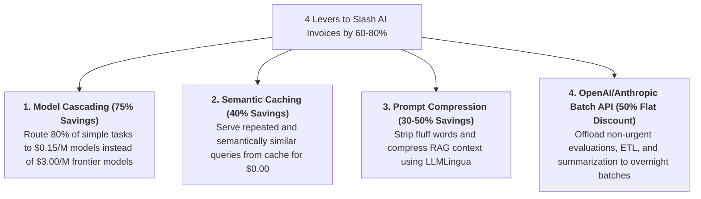
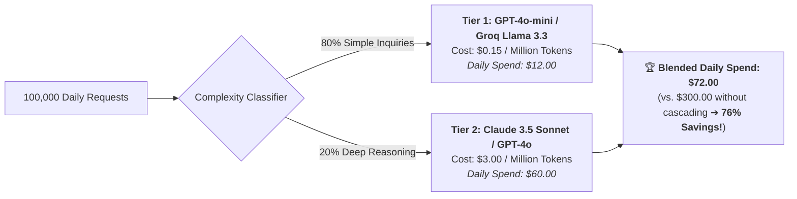
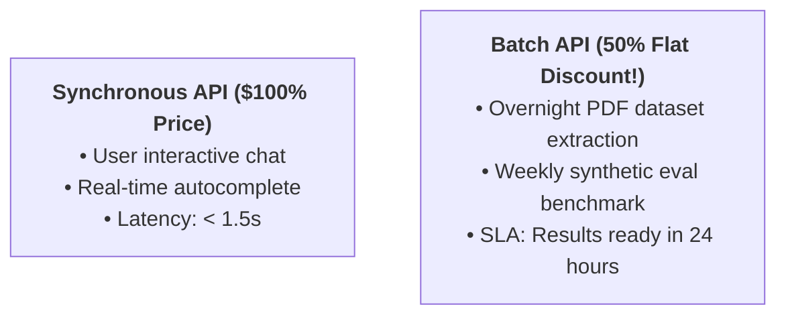
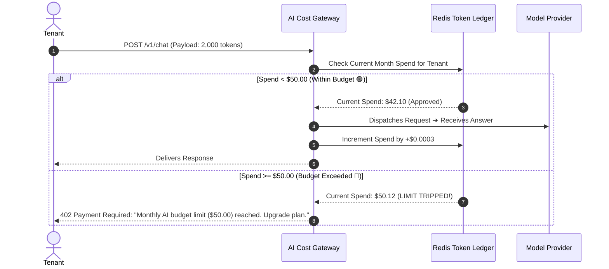

# 08 - AI Cost Management: Token Economics, Budget Caps & Discounts

> **Mental Model**:  
> Think of AI Cost Management like a **high-precision water utility sub-metering system and electrical circuit breaker**:  
> * **The SaaS Billing Shock (Unbounded AI Invoices)**: In traditional web apps, servers cost a fixed \$500/month. In AI apps, compute is variable and infinite! A runaway agent loop or a few users uploading giant PDF contracts can rack up a **\$10,000 OpenAI bill over a single weekend**!  
> * **The Multi-Tenant Sub-Meter (Cost Attribution)**: Every tenant, user, and feature has an individual sub-meter tracking input/output tokens down to the fractional cent.  
> * **The Hard Dollar Circuit Breaker**: If Tenant A reaches their \$50.00 monthly budget ceiling, their API line trips automatically, preventing catastrophic enterprise billing disasters!

---

## 📑 Table of Contents
1. [The 4 Levers of AI Cost Optimization](#1-the-4-levers-of-ai-cost-optimization)
2. [Model Cascading & The 80/20 Cost Rule](#2-model-cascading--the-8020-cost-rule)
3. [Prompt Compression & Context Pruning (LLMLingua)](#3-prompt-compression--context-pruning-llmlingua)
4. [The Batch API: 50% Guaranteed Cloud Discount](#4-the-batch-api-50-guaranteed-cloud-discount)
5. [Multi-Tenant Cost Attribution & Hard Budget Caps](#5-multi-tenant-cost-attribution--hard-budget-caps)
6. [Building a Multi-Tenant Token Budget Guard in Python](#6-building-a-multi-tenant-token-budget-guard-in-python)
7. [Master Cheat Sheet & Reference Table](#7-master-cheat-sheet--reference-table)

---

## 1. The 4 Levers of AI Cost Optimization



---

## 2. Model Cascading & The 80/20 Cost Rule

Never pay frontier pricing for junior-level classification or extraction tasks:



---

## 3. Prompt Compression & Context Pruning (LLMLingua)

System prompts and RAG contexts are often packed with polite conversational filler:

| Raw Prompt (Unoptimized) | Compressed Prompt (LLMLingua) | Savings |
| :--- | :--- | :---: |
| *"Could you please be kind enough to review the attached quarterly earnings report and summarize the three most critical financial takeaways for the executive board?"* (32 tokens) | *"Summarize 3 critical financial takeaways from quarterly report for executive board:"* (13 tokens) | **$59\%$ Token Reduction** |
| Verbose multi-shot RAG context with repeated boilerplate headers. | Pruned key-value tuples and condensed factual extracts. | **$45\%$ Token Reduction** |

---

## 4. The Batch API: 50% Guaranteed Cloud Discount

For background jobs where answers aren't needed in $<2\text{ seconds}$ (e.g. Daily data extraction, nightly evaluation suites, bulk document translation):



---

## 5. Multi-Tenant Cost Attribution & Hard Budget Caps



---

## 6. Building a Multi-Tenant Token Budget Guard in Python

Here is a complete, runnable script implementing tenant-level token accounting, price calculation, soft alerts, and hard budget caps:

```python
from dataclasses import dataclass, field
from typing import Dict

# --- Model Pricing Constants (Cost per 1M tokens) ---
MODEL_PRICING = {
    "gpt-4o-mini": {"prompt": 0.15, "completion": 0.60},
    "gpt-4o": {"prompt": 2.50, "completion": 10.00},
    "claude-3-5-sonnet": {"prompt": 3.00, "completion": 15.00}
}

@dataclass
class TenantBudget:
    tenant_id: str
    monthly_budget_usd: float
    current_spend_usd: float = 0.0
    total_prompt_tokens: int = 0
    total_completion_tokens: int = 0

class TokenBudgetGuard:
    def __init__(self):
        self.tenants: Dict[str, TenantBudget] = {}

    def register_tenant(self, tenant_id: str, monthly_budget_usd: float):
        self.tenants[tenant_id] = TenantBudget(tenant_id, monthly_budget_usd)

    def calculate_cost(self, model: str, prompt_tokens: int, completion_tokens: int) -> float:
        rates = MODEL_PRICING.get(model, {"prompt": 2.0, "completion": 8.0})
        prompt_cost = (prompt_tokens / 1_000_000.0) * rates["prompt"]
        completion_cost = (completion_tokens / 1_000_000.0) * rates["completion"]
        return prompt_cost + completion_cost

    def check_and_charge(self, tenant_id: str, model: str, prompt_tokens: int, completion_tokens: int) -> tuple[bool, str]:
        tenant = self.tenants.get(tenant_id)
        if not tenant:
            return False, "Tenant not registered"

        cost = self.calculate_cost(model, prompt_tokens, completion_tokens)

        # Hard Circuit Breaker Check
        if tenant.current_spend_usd + cost > tenant.monthly_budget_usd:
            return False, f"HTTP 402: Monthly budget cap (${tenant.monthly_budget_usd:.2f}) exceeded!"

        # Charge Tenant
        tenant.current_spend_usd += cost
        tenant.total_prompt_tokens += prompt_tokens
        tenant.total_completion_tokens += completion_tokens

        # Soft Alert Check (80% warning)
        if tenant.current_spend_usd >= (tenant.monthly_budget_usd * 0.80):
            print(f"  ⚠️ [WARNING] Tenant `{tenant_id}` has consumed >80% of monthly budget (${tenant.current_spend_usd:.4f} / ${tenant.monthly_budget_usd:.2f})")

        return True, f"Charged ${cost:.6f} (New Balance: ${tenant.current_spend_usd:.4f})"

# --- Test Multi-Tenant Budget Engine ---
def test_budget_guard():
    guard = TokenBudgetGuard()
    
    # Register Startup Tenant ($0.005 budget for demonstration)
    guard.register_tenant("tenant_startup_alpha", monthly_budget_usd=0.005)

    print("🚀 [CALL 1] Executing standard GPT-4o-mini request (1,000 prompt, 200 completion):")
    allowed, msg = guard.check_and_charge("tenant_startup_alpha", "gpt-4o-mini", 1000, 200)
    print(f"  • Allowed: {allowed} | {msg}")

    print("\n🚀 [CALL 2] Heavy GPT-4o Frontier Request (5,000 prompt, 1,000 completion):")
    allowed, msg = guard.check_and_charge("tenant_startup_alpha", "gpt-4o", 5000, 1000)
    print(f"  • Allowed: {allowed} | {msg}")

    print("\n🚀 [CALL 3] Attempting Another Heavy Request (Exceeds Budget):")
    allowed, msg = guard.check_and_charge("tenant_startup_alpha", "gpt-4o", 5000, 1000)
    print(f"  • Allowed: {allowed} | 🛑 {msg}")

# Run Test:
# test_budget_guard()
```

---

## 7. Master Cheat Sheet & Reference Table

| Optimization Technique | Typical Savings | Trade-off / Consideration |
| :--- | :---: | :--- |
| **Model Cascading** | **$70\% - 80\%$** | Requires query complexity router. |
| **Batch API (OpenAI / Anthropic)** | **$50\%$ Flat** | 24-hour asynchronous SLA (Not for live chat). |
| **Prompt Compression** | **$30\% - 50\%$** | Lightweight preprocessing overhead ($< 10\text{ms}$). |
| **Hard Budget Caps** | **$100\%$ Loss Protection** | Prevents rogue agent loops from exhausting funds. |

---

## 🎯 Next Step in Phase 9
Now that you have mastered AI cost management, token accounting, and budget guards, we will advance to **[09 - Latency Management](file:///home/user2/PythonProject/Python-for-ai-engineering/09-ai-system-design/09-latency-management)** to master Time-To-First-Token (TTFT) optimization, speculative decoding, and streaming chunk management!
