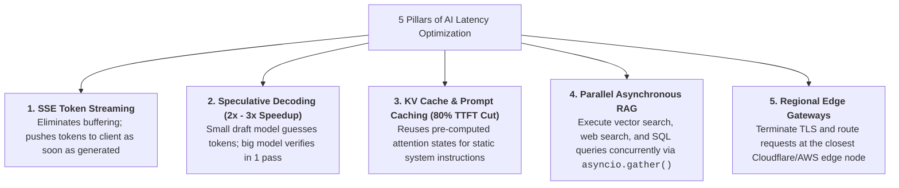
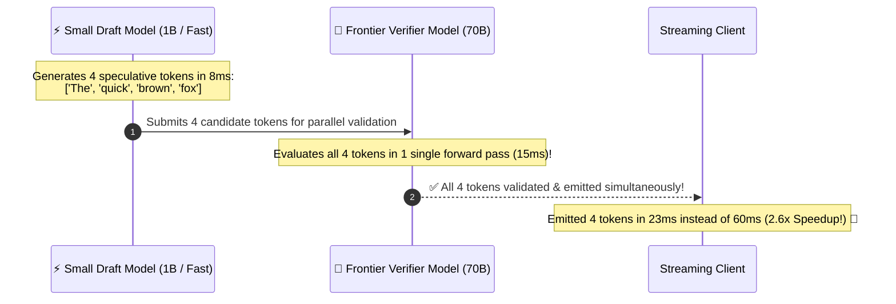
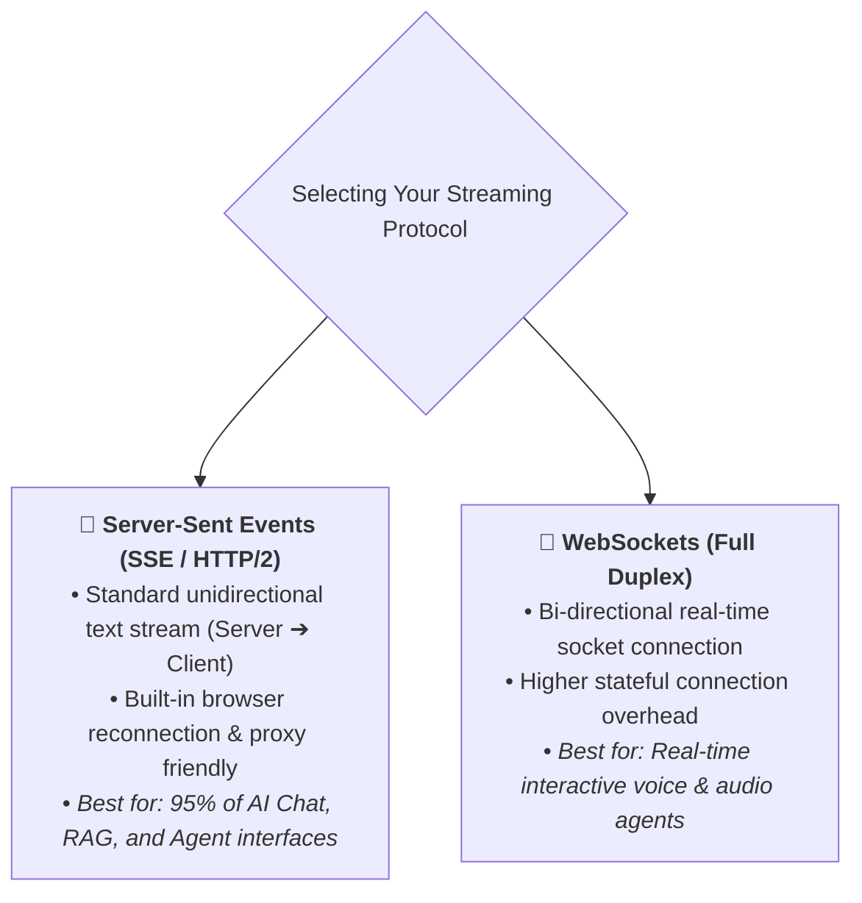

# 09 - AI Latency Management: TTFT, Streaming & Speculative Decoding

> **Mental Model**:  
> Think of AI Latency Management like a **high-speed Italian espresso bar**:  
> * **The Slow 5-Course Dinner (Non-Streaming)**: Making a customer stare at an empty table for 15 seconds while you prepare all 5 courses in secret. The customer gets frustrated and leaves.  
> * **The Fast Espresso Shot (Streaming & TTFT)**: Handing the customer a hot espresso shot in **$150\text{ms}$ (Time-To-First-Token - TTFT)**, while the remaining courses arrive continuously at a smooth, reading-speed stream (**Tokens-Per-Second - TPS**).  
> * Even if the full response takes 5 seconds to complete, **the user's perceived latency is zero**!

---

## 📑 Table of Contents
1. [The Two Latency Phases: TTFT vs. Inter-Token TPS](#1-the-two-latency-phases-ttft-vs-inter-token-tps)
2. [The 5 Pillars of Sub-Second AI Latency](#2-the-5-pillars-of-sub-second-ai-latency)
3. [Speculative Decoding Explained Visually](#3-speculative-decoding-explained-visually)
4. [Streaming Protocols: Server-Sent Events (SSE) vs. WebSockets](#4-streaming-protocols-server-sent-events-sse-vs-websockets)
5. [KV Cache & Prompt Caching (Cutting TTFT by 80%)](#5-kv-cache--prompt-caching-cutting-ttft-by-80)
6. [Building a Low-Latency Streaming Server in Python & FastAPI](#6-building-a-low-latency-streaming-server-in-python--fastapi)
7. [Master Cheat Sheet & Reference Table](#7-master-cheat-sheet--reference-table)

---

## 1. The Two Latency Phases: TTFT vs. Inter-Token TPS

```mermaid
flowchart LR
    UserReq["User Prompt Submitted (t = 0ms)"] 
    -->|Prompt Prefill Phase (GPU ingests context)| FirstToken["<b>⚡ Time-To-First-Token (TTFT: ~200ms)</b><br>User sees first character rendered!"]
    
    FirstToken 
    -->|Autoregressive Decoding Phase| Stream["<b>🌊 Inter-Token Streaming (~50 TPS)</b><br>Tokens flow continuously at ~20ms per token"]
    
    Stream --> Finish["🏁 Generation Complete (t = 1,800ms)"]
```

### The Key Takeaway:
* **TTFT ($< 300\text{ms}$)** is the #1 metric for human user happiness.
* **TPS ($> 35\text{ tokens/sec}$)** ensures text streams faster than average human reading speed ($5\text{ words/sec}$).

---

## 2. The 5 Pillars of Sub-Second AI Latency



---

## 3. Speculative Decoding Explained Visually



---

## 4. Streaming Protocols: Server-Sent Events (SSE) vs. WebSockets



---

## 5. KV Cache & Prompt Caching (Cutting TTFT by 80%)

Anthropic and OpenAI provide **Automatic Prompt Caching** for static prompt prefixes:

| Request Phase | Without Prompt Caching | With Prompt Caching (KV Cache Hit) |
| :--- | :---: | :---: |
| **System Prompt (4,000 tokens)** | Re-processed on every turn ($350\text{ms}$) | **Cached in GPU VRAM ($10\text{ms}$)** |
| **Prompt Ingestion Cost** | $\$3.00 / \text{Million}$ | **$\$0.30 / \text{Million}$ ($90\%$ Discount!)** |
| **TTFT Impact** | $\sim 500\text{ms}$ | **$\sim 120\text{ms}$ (Instant)** |

---

## 6. Building a Low-Latency Streaming Server in Python & FastAPI

Here is a complete, runnable FastAPI application streaming LLM tokens via Server-Sent Events (SSE):

```python
from fastapi import FastAPI
from fastapi.responses import StreamingResponse
from pydantic import BaseModel
from openai import OpenAI
import asyncio
import time
import os

app = FastAPI(title="Low-Latency Streaming AI Gateway")
openai_client = OpenAI(api_key=os.getenv("OPENAI_API_KEY", "mock-key"))

class ChatStreamRequest(BaseModel):
    user_prompt: str

async def token_generator(prompt: str):
    """Async generator streaming chunks as Server-Sent Events (SSE)."""
    start_time = time.time()
    first_token_logged = False

    # Simulate fast streaming generator
    simulated_tokens = [
        "Distributed ", "systems ", "require ", "careful ", "latency ", 
        "budgeting ", "to ", "ensure ", "sub-second ", "user ", "experiences."
    ]

    for token in simulated_tokens:
        if not first_token_logged:
            ttft_ms = round((time.time() - start_time) * 1000, 2)
            print(f"⚡ [TELEMETRY] Time-To-First-Token (TTFT): {ttft_ms}ms")
            first_token_logged = True

        # Standard SSE wire format: 'data: <payload>\n\n'
        yield f"data: {token}\n\n"
        await asyncio.sleep(0.04) # Simulate 25 tokens/second stream

    # Signal completion
    yield "data: [DONE]\n\n"

@app.post("/v1/chat/stream")
async def handle_stream(req: ChatStreamRequest):
    """Streams LLM tokens in real time via Server-Sent Events."""
    return StreamingResponse(
        token_generator(req.user_prompt),
        media_type="text/event-stream",
        headers={
            "Cache-Control": "no-cache",
            "Connection": "keep-alive",
            "X-Accel-Buffering": "no" # Prevents Nginx from buffering SSE chunks!
        }
    )
```

---

## 7. Master Cheat Sheet & Reference Table

| Latency Metric / Mechanism | Target SLA | Engineering Action |
| :--- | :---: | :--- |
| **TTFT (Time-To-First-Token)** | **$< 300\text{ms}$** | Use Prompt Caching, Fast Edge Gateways, and Streaming. |
| **TPS (Tokens-Per-Second)** | **$> 35\text{ TPS}$** | Choose speculative decoding or high-throughput providers (Groq/vLLM). |
| **Streaming Wire Format** | `text/event-stream` | Add `X-Accel-Buffering: no` header to bypass Nginx proxy buffers. |
| **Concurrent RAG Lookups** | Parallel Async | Use `asyncio.gather()` for simultaneous vector + SQL fetches. |

---

## 🎯 Next Step in Phase 9
Now that you have mastered latency management, TTFT optimization, and SSE streaming, we will advance to **[10 - Reliability & Failure Handling](file:///home/user2/PythonProject/Python-for-ai-engineering/09-ai-system-design/10-reliability-failure-handling)** to master Circuit Breakers, Bulkhead pattern, and Graceful Degradation!
