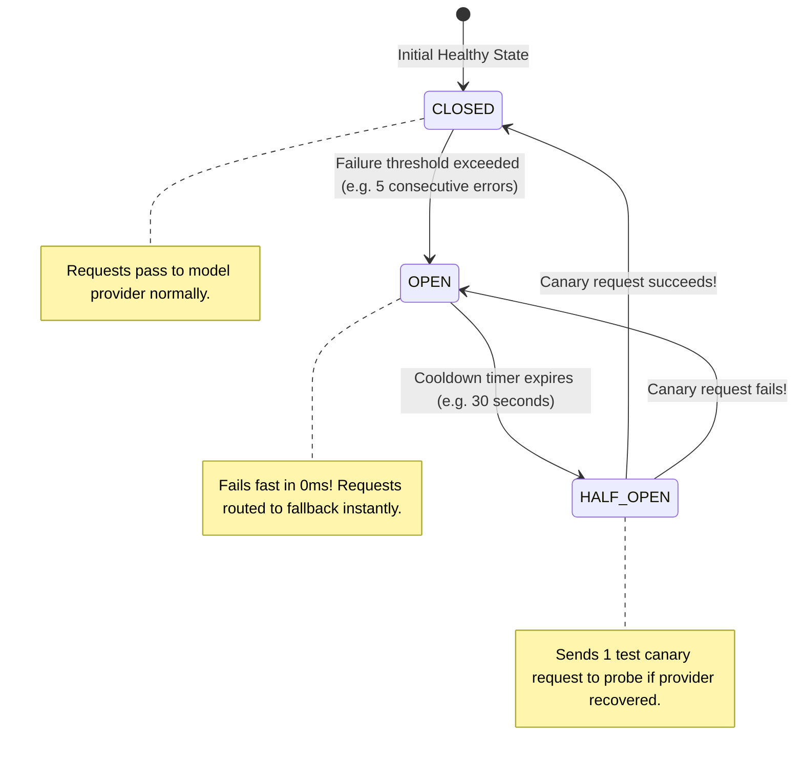
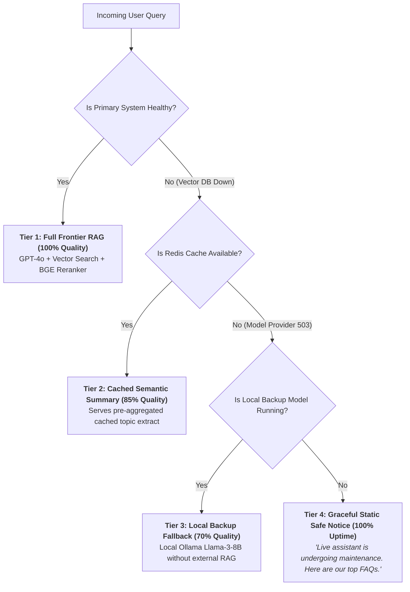
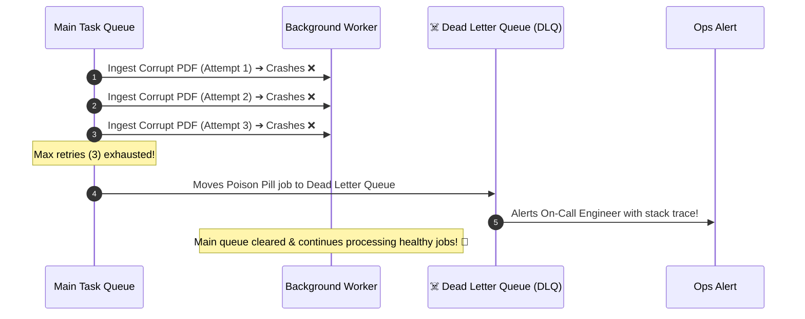

# 10 - AI Reliability & Failure Handling: Circuit Breakers & Graceful Degradation

> **Mental Model**:  
> Think of AI Reliability like **a submarine's watertight bulkhead compartments**:  
> * **The Cascading Freeze Catastrophe**: When an external model provider (OpenAI / Anthropic) hangs or returns 503 errors, all 200 of your web worker threads freeze waiting for a reply. Within 10 seconds, your entire application gateway crashes!  
> * **The Submarine Bulkhead Doors (Circuit Breakers & Graceful Degradation)**: When a hull breach occurs in Compartment 3 (e.g. Vector DB down), heavy steel bulkheads seal that chamber in **0.1 seconds**.  
> * The system steps down the **Graceful Degradation Ladder** (Falling back to Semantic Cache or Small Local Models), ensuring **your customers never see a 500 Server Error**!

---

## 📑 Table of Contents
1. [The Cascading Failure Trap in AI Systems](#1-the-cascading-failure-trap-in-ai-systems)
2. [The 3 States of the Circuit Breaker Pattern](#2-the-3-states-of-the-circuit-breaker-pattern)
3. [The 4-Tier Graceful Degradation Ladder](#3-the-4-tier-graceful-degradation-ladder)
4. [Dead Letter Queues (DLQ) & Poison Pill Isolation](#4-dead-letter-queues-dlq--poison-pill-isolation)
5. [Building a Production Circuit Breaker & Fallback in Python](#5-building-a-production-circuit-breaker--fallback-in-python)
6. [Master Cheat Sheet & Reference Table](#6-master-cheat-sheet--reference-table)

---

## 1. The Cascading Failure Trap in AI Systems

```mermaid
flowchart TD
    subgraph Fragile["❌ Unprotected AI Architecture (Cascading Total Crash)"]
        User["100 Users"] --> Gateway["FastAPI Server (50 Workers)"]
        Gateway --> Outage["OpenAI API (Experiencing 30s Hang / 503 Outage)"]
        Outage --> Blocked["💥 All 50 FastAPI workers blocked waiting!"]
        Blocked --> TotalCrash["🚨 <b>Total System Crash:</b> Entire website goes 504 Gateway Timeout!"]
    end

    subgraph Resilient["✅ Circuit Breaker & Bulkhead Architecture"]
        User2["100 Users"] --> Gateway2["FastAPI Server"]
        Gateway2 --> CB["🛡️ <b>Circuit Breaker:</b> TRIPPED to OPEN!"]
        CB -- "Fails fast in 0ms!" --> Fallback["⚡ <b>Graceful Fallback:</b> Serves cached answer or backup model in 25ms!"]
    end
```



---

## 2. The 3 States of the Circuit Breaker Pattern



---

## 3. The 4-Tier Graceful Degradation Ladder

When primary subsystems fail, step down the **Degradation Staircase**:



---

## 4. Dead Letter Queues (DLQ) & Poison Pill Isolation

> ⚠️ **The Poison Pill Request:**  
> A user uploads a corrupt PDF that causes the embedding parser to crash with `ZeroDivisionError`. If the background worker retries infinitely, the queue clogs forever!



---

## 5. Building a Production Circuit Breaker & Fallback in Python

Here is a complete, runnable script implementing a 3-State Circuit Breaker with graceful degradation:

```python
import time
from enum import Enum

class CircuitState(Enum):
    CLOSED = "CLOSED"
    OPEN = "OPEN"
    HALF_OPEN = "HALF_OPEN"

class CircuitBreaker:
    def __init__(self, failure_threshold: int = 3, recovery_timeout: float = 5.0):
        self.failure_threshold = failure_threshold
        self.recovery_timeout = recovery_timeout
        self.state = CircuitState.CLOSED
        self.consecutive_failures = 0
        self.last_state_change = time.time()

    def allow_request(self) -> bool:
        now = time.time()

        if self.state == CircuitState.OPEN:
            if now - self.last_state_change > self.recovery_timeout:
                print("  🟡 [CIRCUIT BREAKER] Cooldown elapsed ➔ Transitioning to HALF_OPEN (Canary Test)...")
                self.state = CircuitState.HALF_OPEN
                self.last_state_change = now
                return True
            return False # Fail fast in 0ms!

        return True # CLOSED or HALF_OPEN

    def record_success(self):
        if self.state == CircuitState.HALF_OPEN:
            print("  🟢 [CIRCUIT BREAKER] Canary succeeded! ➔ Transitioning to CLOSED (Healthy).")
        self.state = CircuitState.CLOSED
        self.consecutive_failures = 0

    def record_failure(self):
        self.consecutive_failures += 1
        print(f"  ⚠️ [CIRCUIT BREAKER] Recorded failure #{self.consecutive_failures}")

        if self.consecutive_failures >= self.failure_threshold or self.state == CircuitState.HALF_OPEN:
            print("  🔴 [CIRCUIT BREAKER] Failure threshold reached! ➔ TRIPPING CIRCUIT TO OPEN!")
            self.state = CircuitState.OPEN
            self.last_state_change = time.time()

# --- Resilient AI Service with Fallback ---
class ResilientAIService:
    def __init__(self):
        self.cb = CircuitBreaker(failure_threshold=2, recovery_timeout=2.0)

    def _call_primary_provider(self, prompt: str) -> str:
        # Simulated provider outage
        raise ConnectionError("HTTP 503: Service Unavailable on Primary Provider")

    def _call_graceful_fallback(self, prompt: str) -> str:
        return "⚡ [FALLBACK RESPONSE] Cached knowledge base summary: Our services operate at 99.9% uptime."

    def execute_query(self, prompt: str) -> str:
        if not self.cb.allow_request():
            print("  🛡️ [CIRCUIT OPEN] Failing fast (0ms) ➔ Routing directly to Fallback...")
            return self._call_graceful_fallback(prompt)

        try:
            res = self._call_primary_provider(prompt)
            self.cb.record_success()
            return res
        except Exception as e:
            self.cb.record_failure()
            print("  ↳ Executing graceful fallback after primary failure...")
            return self._call_graceful_fallback(prompt)

# --- Test Circuit Breaker Resilience ---
def test_resilience():
    service = ResilientAIService()

    print("🚀 [CALL 1] Primary Provider Fails:")
    print("Result:", service.execute_query("What is our SLA?"), "\n")

    print("🚀 [CALL 2] Primary Provider Fails Again (Trips Circuit):")
    print("Result:", service.execute_query("What is our SLA?"), "\n")

    print("🚀 [CALL 3] Circuit is now OPEN (Fails fast in 0ms without hitting provider):")
    print("Result:", service.execute_query("What is our SLA?"), "\n")

    print("⏳ Waiting 2.5s for Circuit Breaker recovery timeout...")
    time.sleep(2.5)

    print("🚀 [CALL 4] Canary Request in HALF_OPEN state:")
    print("Result:", service.execute_query("What is our SLA?"))

# Run Test:
# test_resilience()
```

---

## 6. Master Cheat Sheet & Reference Table

| Reliability Mechanism | Trigger Condition | System Action |
| :--- | :--- | :--- |
| **Circuit Breaker (OPEN)** | $N$ consecutive 500/503/Timeout errors. | Fails fast in $0\text{ms}$; routes immediately to fallback. |
| **Circuit Breaker (HALF-OPEN)**| Cooldown timer (e.g. $30\text{s}$) expires. | Dispatches 1 canary request to probe health. |
| **Degradation Ladder** | Upstream component outage. | Steps down from Frontier RAG $\rightarrow$ Cache $\rightarrow$ Static notice. |
| **Dead Letter Queue (DLQ)** | Max retries ($3$) exhausted on job. | Isolates poison-pill message and triggers on-call alert. |

---

## 🎯 Next Step in Phase 9
Now that you have mastered reliability, circuit breakers, and graceful degradation, we will advance to **[11 - Scaling AI Applications](file:///home/user2/PythonProject/Python-for-ai-engineering/09-ai-system-design/11-scaling-ai-applications)** to master Async Queues (Celery/Temporal), Distributed Vector Sharding, and GPU Autoscaling!
