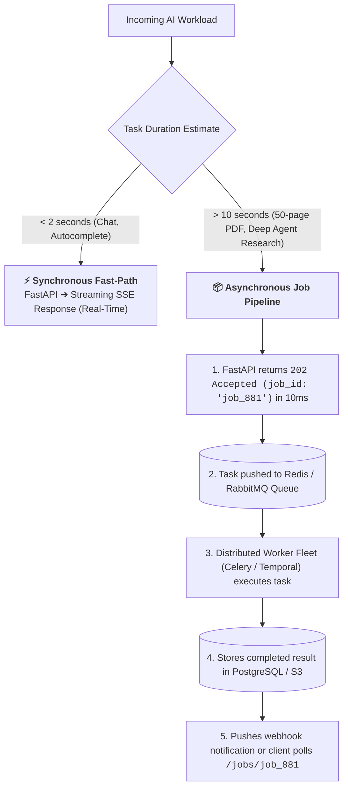
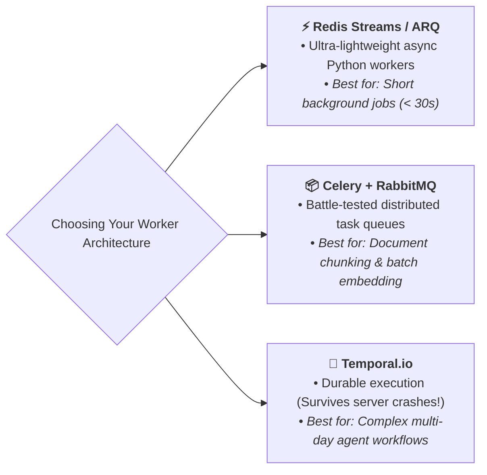
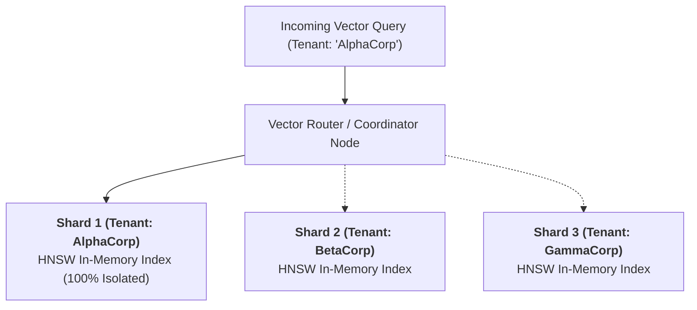
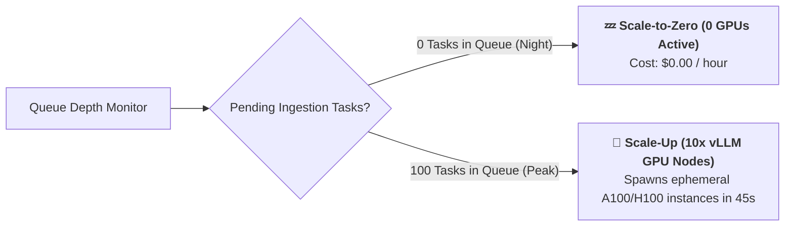

# 11 - Scaling AI Applications: Async Queues, Workers & Vector Shards

> **Mental Model**:  
> Think of Scaling AI Applications like a **fast-food drive-through window backed by a massive industrial bakery**:  
> * **The Synchronous Bottleneck Trap**: If the drive-through cashier insisted on personally baking every customer's 10-layer cake while they waited at the window, the line of cars would stretch 5 miles down the highway!  
> * **The Decoupled Asynchronous Engine**:  
>   * **The Drive-Through Cashier (Stateless FastAPI Ingress)**: Takes the order, charges the customer, hands them a claim ticket (**`202 Accepted - job_id: #9042`**), and tells them to park in the pickup bay.  
>   * **The Industrial Bakery Fleet (Celery / Temporal Worker Fleet)**: A fleet of 100 background worker processes chunks PDFs, generates vector embeddings, and executes LLM agent loops in parallel!  
>   * When complete, the worker notifies the client via **Webhooks or WebSockets**!

---

## 📑 Table of Contents
1. [Synchronous vs. Asynchronous Job Processing](#1-synchronous-vs-asynchronous-job-processing)
2. [Task Queue Frameworks: Redis Streams vs. Celery vs. Temporal](#2-task-queue-frameworks-redis-streams-vs-celery-vs-temporal)
3. [Scaling Vector Databases: Multi-Tenant Sharding & Quantization](#3-scaling-vector-databases-multi-tenant-sharding--quantization)
4. [GPU Autoscaling & Scale-to-Zero (vLLM / Modal / Ray)](#4-gpu-autoscaling--scale-to-zero-vllm--modal--ray)
5. [Building an Asynchronous AI Job Processing Pipeline in Python](#5-building-an-asynchronous-ai-job-processing-pipeline-in-python)
6. [Master Cheat Sheet & Reference Table](#6-master-cheat-sheet--reference-table)

---

## 1. Synchronous vs. Asynchronous Job Processing



---

## 2. Task Queue Frameworks: Redis Streams vs. Celery vs. Temporal



---

## 3. Scaling Vector Databases: Multi-Tenant Sharding & Quantization

When your vector collection grows from $10,000$ to $50,000,000$ embeddings, naive single-node search runs out of RAM:



### Memory Reduction with Scalar Quantization (SQ):
* **Raw float32 Vectors**: $1536 \text{ dimensions} \times 4 \text{ bytes} = 6.1\text{ KB per vector}$ (Exhausts RAM quickly).
* **Scalar Quantization (int8)**: Reduces vector size to **$1.5\text{ KB}$ ($75\%$ RAM reduction)** with $>99\%$ retrieval accuracy!

---

## 4. GPU Autoscaling & Scale-to-Zero (vLLM / Modal / Ray)

For self-hosted open-source models (DeepSeek / Llama 3.3), idle GPUs burn thousands of dollars per month:



---

## 5. Building an Asynchronous AI Job Processing Pipeline in Python

Here is a complete, runnable script implementing a decoupled asynchronous job ticketing system with status polling:

```python
import uuid
import time
from typing import Dict
from dataclasses import dataclass, field
from enum import Enum

class JobStatus(Enum):
    QUEUED = "QUEUED"
    PROCESSING = "PROCESSING"
    COMPLETED = "COMPLETED"
    FAILED = "FAILED"

@dataclass
class BackgroundAIJob:
    job_id: str
    user_id: str
    document_name: str
    status: JobStatus = JobStatus.QUEUED
    result_summary: str = ""
    created_at: float = field(default_factory=time.time)

# --- Shared Job State (Simulating Redis / PostgreSQL) ---
JOB_STORE: Dict[str, BackgroundAIJob] = {}

class AsyncJobDispatcher:
    @staticmethod
    def submit_job(user_id: str, document_name: str) -> str:
        """Ingress Gateway: Issues immediate job ticket (202 Accepted)."""
        job_id = f"job_{uuid.uuid4().hex[:8]}"
        JOB_STORE[job_id] = BackgroundAIJob(job_id=job_id, user_id=user_id, document_name=document_name)
        print(f"🎫 [INGRESS] Issued Job Ticket: `{job_id}` for document '{document_name}'")
        return job_id

    @staticmethod
    def worker_process_job(job_id: str):
        """Worker Fleet: Executes heavy LLM parsing in background."""
        job = JOB_STORE.get(job_id)
        if not job:
            return

        print(f"⚙️ [WORKER] Picking up `{job_id}` for background chunking & embedding...")
        job.status = JobStatus.PROCESSING
        
        # Simulate heavy processing (e.g. 50-page PDF parsing)
        time.sleep(0.5)

        # Complete Job
        job.result_summary = f"Successfully parsed '{job.document_name}'. Extracted 142 chunks and indexed into Qdrant."
        job.status = JobStatus.COMPLETED
        print(f"✅ [WORKER] Completed `{job_id}` successfully!")

    @staticmethod
    def get_job_status(job_id: str) -> dict:
        """Client Polling Endpoint: Checks progress of background job."""
        job = JOB_STORE.get(job_id)
        if not job:
            return {"error": "Job not found"}
        return {
            "job_id": job.job_id,
            "status": job.status.value,
            "result": job.result_summary if job.status == JobStatus.COMPLETED else None
        }

# --- Test Asynchronous Pipeline ---
def test_async_pipeline():
    dispatcher = AsyncJobDispatcher()

    # 1. User submits heavy PDF (FastAPI returns 202 Accepted in 5ms)
    ticket_id = dispatcher.submit_job(user_id="user_alpha", document_name="quarterly_sec_10k.pdf")

    # 2. Client immediately polls status
    print("\n🔍 Client Polling (Immediate):", dispatcher.get_job_status(ticket_id))

    # 3. Worker fleet processes job in background
    dispatcher.worker_process_job(ticket_id)

    # 4. Client polls status again
    print("\n🔍 Client Polling (After Processing):", dispatcher.get_job_status(ticket_id))

# Run Test:
# test_async_pipeline()
```

---

## 6. Master Cheat Sheet & Reference Table

| Workload Type | Processing Pattern | Framework |
| :--- | :--- | :--- |
| **Interactive Chat / Autocomplete** | Synchronous Fast-Path | FastAPI + SSE Streaming |
| **Document Chunking & Vector ETL** | Asynchronous Background Queue | Celery + RabbitMQ / Redis |
| **Multi-Day Autonomous Agents** | Durable Orchestration Workflow | Temporal.io |
| **Vector DB Scaling ($>10\text{M}$ vectors)** | Multi-Tenant Shards + Quantization | Qdrant / Milvus |
| **Self-Hosted LLM GPUs** | Scale-to-Zero Autoscaling | vLLM + Ray / Modal / RunPod |

---

## 🎯 Next Step in Phase 9
Now that you have mastered asynchronous scaling, worker queues, and vector sharding, we will advance to **[12 - Multi-Tenant AI](file:///home/user2/PythonProject/Python-for-ai-engineering/09-ai-system-design/12-multi-tenant-ai)** to master strict tenant data isolation, metadata filtering in vector stores, and custom per-tenant fine-tuning!
