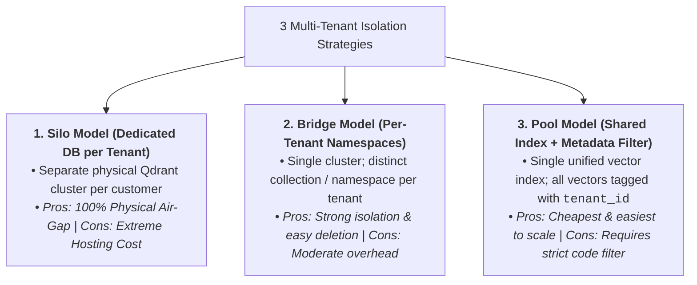
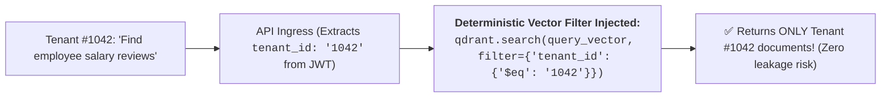
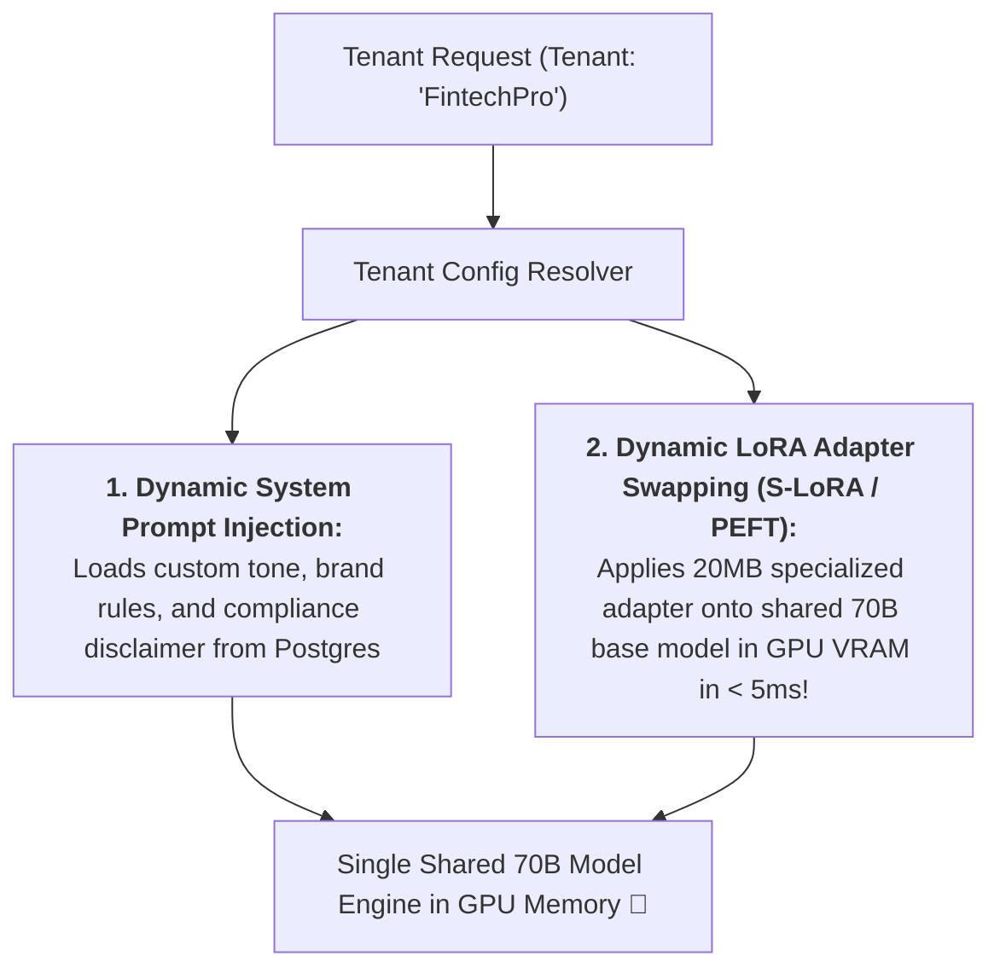
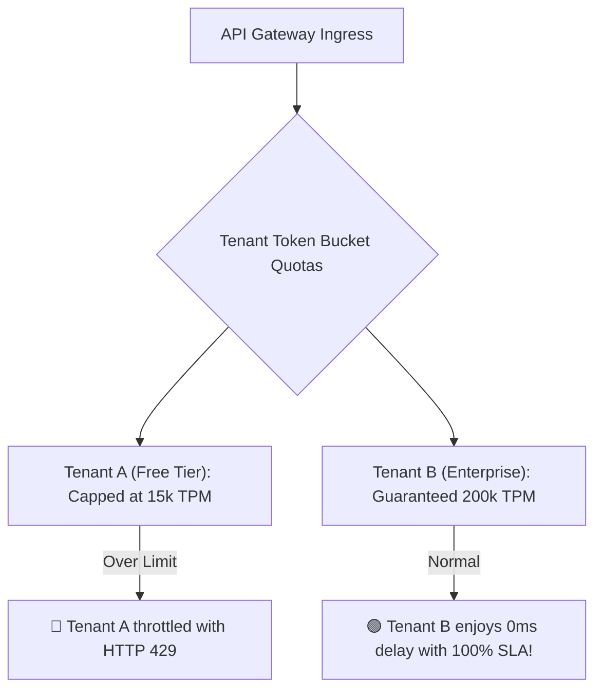

# 12 - Multi-Tenant AI Systems: Data Isolation, Namespaces & LoRA

> **Mental Model**:  
> Think of Multi-Tenant AI like a **high-security luxury apartment building**:  
> * **The Shared Infrastructure (Common Core)**: All tenants share the central foundation, water pipes, and high-speed elevators (FastAPI Gateway, GPU inference nodes, Redis cache).  
> * **The Cryptographic Deadbolt (Zero-Leakage Isolation)**: No resident can ever peek into another resident's apartment. If **Tenant A (Hospital Alpha)** searches clinical records, the vector engine guarantees that **Tenant B (Hospital Beta's)** patient charts are **cryptographically inaccessible**!  
> * **Custom Interior Design (Dynamic Tenant Customization)**: Each apartment is styled differently (Custom System Prompts, Brand Personas, and Dynamic LoRA adapters swapped on top of a single shared LLM base model)!

---

## 📑 Table of Contents
1. [The 3 Vector Data Isolation Models (Silo vs. Bridge vs. Pool)](#1-the-3-vector-data-isolation-models-silo-vs-bridge-vs-pool)
2. [Deterministic Metadata Filtering (The Pool Model)](#2-deterministic-metadata-filtering-the-pool-model)
3. [Multi-Tenant Customization: Dynamic System Prompts & LoRA Adapters](#3-multi-tenant-customization-dynamic-system-prompts--lora-adapters)
4. [Noisy Neighbor Prevention & Per-Tenant Quotas](#4-noisy-neighbor-prevention--per-tenant-quotas)
5. [Building a Secure Multi-Tenant RAG Engine in Python](#5-building-a-secure-multi-tenant-rag-engine-in-python)
6. [Master Cheat Sheet & Reference Table](#6-master-cheat-sheet--reference-table)

---

## 1. The 3 Vector Data Isolation Models (Silo vs. Bridge vs. Pool)



### Direct Architectural Comparison:

| Isolation Strategy | Infrastructure Cost | Operational Overhead | Security Assurance | Best For |
| :--- | :---: | :---: | :---: | :--- |
| **Silo (Dedicated DB)** | Very High | High | **100% Air-Gapped** | Tier 1 Banks, Defense, Healthcare. |
| **Bridge (Namespaces)** | Moderate | Moderate | **Strong (Engine level)** | B2B Enterprise SaaS. |
| **Pool (Metadata Tagging)**| **Lowest** | **Minimal** | **Application-Enforced** | High-volume B2C & SMB SaaS. |

---

## 2. Deterministic Metadata Filtering (The Pool Model)

In the Pool Model, **never rely on the LLM to filter tenant data**. Enforce the filter **deterministically at the database query level**:



---

## 3. Multi-Tenant Customization: Dynamic System Prompts & LoRA Adapters

How do you serve 500 different enterprise customers with unique brand guidelines and specialized fine-tuning without spinning up 500 separate 70B models?



---

## 4. Noisy Neighbor Prevention & Per-Tenant Quotas

> 🚨 **The Noisy Neighbor Catastrophe:**  
> If Tenant A launches a bulk script sending 500,000 tokens/sec, they consume all GPU worker threads, causing Tenant B's interactive users to experience 30-second timeouts!



---

## 5. Building a Secure Multi-Tenant RAG Engine in Python

Here is a complete, runnable script implementing strict tenant metadata isolation and dynamic prompt injection:

```python
from dataclasses import dataclass
from typing import List, Dict
import numpy as np

@dataclass
class TenantConfig:
    tenant_id: str
    brand_name: str
    custom_system_prompt: str
    max_tpm: int

@dataclass
class VectorDocument:
    doc_id: str
    tenant_id: str # The immutable security tag
    text: str
    vector: np.ndarray

class SecureMultiTenantRAG:
    def __init__(self):
        self.tenants: Dict[str, TenantConfig] = {}
        self.vector_store: List[VectorDocument] = []

    def register_tenant(self, config: TenantConfig):
        self.tenants[config.tenant_id] = config

    def _mock_embed(self, text: str) -> np.ndarray:
        np.random.seed(abs(hash(text)) % (2**32))
        v = np.random.randn(8)
        return v / np.linalg.norm(v)

    def insert_document(self, tenant_id: str, doc_id: str, text: str):
        """Inserts document with immutable tenant_id metadata tag."""
        vec = self._mock_embed(text)
        self.vector_store.append(VectorDocument(doc_id=doc_id, tenant_id=tenant_id, text=text, vector=vec))
        print(f"📥 [INGEST] Stored `{doc_id}` for Tenant `{tenant_id}`")

    def search_with_tenant_isolation(self, requester_tenant_id: str, query: str) -> List[str]:
        """Performs vector search strictly gated by requester_tenant_id."""
        query_vec = self._mock_embed(query)
        matched_chunks = []

        for doc in self.vector_store:
            # 🛡️ HARD SECURITY BOUNDARY: Skip any document not owned by requester!
            if doc.tenant_id != requester_tenant_id:
                continue

            # Compute similarity for authorized documents only
            sim = float(np.dot(query_vec, doc.vector))
            matched_chunks.append((sim, doc.text))

        matched_chunks.sort(key=lambda x: x[0], reverse=True)
        return [text for score, text in matched_chunks[:2]]

    def generate_tenant_response(self, requester_tenant_id: str, query: str) -> str:
        tenant_cfg = self.tenants.get(requester_tenant_id)
        if not tenant_cfg:
            raise PermissionError("Unrecognized Tenant ID")

        # 1. Retrieve Isolated Chunks
        retrieved_docs = self.search_with_tenant_isolation(requester_tenant_id, query)
        context_block = "\n".join(retrieved_docs) if retrieved_docs else "No tenant documents found."

        # 2. Inject Dynamic Tenant System Prompt
        assembled_prompt = (
            f"SYSTEM: {tenant_cfg.custom_system_prompt}\n"
            f"BRAND: {tenant_cfg.brand_name}\n"
            f"CONTEXT:\n{context_block}\n"
            f"USER QUERY: {query}"
        )
        return assembled_prompt

# --- Test Multi-Tenant Security & Isolation ---
def test_multi_tenant_isolation():
    rag = SecureMultiTenantRAG()

    # 1. Register Two Competing Tenants
    rag.register_tenant(TenantConfig(
        tenant_id="tenant_hospital_alpha",
        brand_name="Alpha Medical Center",
        custom_system_prompt="You are an oncologist AI assistant.",
        max_tpm=50000
    ))
    rag.register_tenant(TenantConfig(
        tenant_id="tenant_bank_beta",
        brand_name="Beta Investment Bank",
        custom_system_prompt="You are a FINRA-compliant financial assistant.",
        max_tpm=100000
    ))

    # 2. Ingest Confidential Documents
    rag.insert_document("tenant_hospital_alpha", "doc_med_1", "Confidential: Patient John has stage 1 lung cancer.")
    rag.insert_document("tenant_bank_beta", "doc_fin_1", "Secret: Acquisition of TechCorp planned at $45/share.")

    print("\n" + "="*65)
    print("🔍 [TEST 1] Bank Beta queries for confidential patient data:")
    leaked_docs = rag.search_with_tenant_isolation("tenant_bank_beta", "Patient cancer diagnosis")
    print("  • Chunks Returned to Bank Beta:", leaked_docs)
    assert len(leaked_docs) == 0, "SECURITY ALERT: Cross-tenant data leakage detected!"
    print("  ✅ ZERO LEAKAGE: Bank Beta cannot see Hospital Alpha's private records!")

    print("\n🔍 [TEST 2] Hospital Alpha generates prompt:")
    prompt = rag.generate_tenant_response("tenant_hospital_alpha", "Tell me about patient John")
    print(prompt)

# Run Test:
# test_multi_tenant_isolation()
```

---

## 6. Master Cheat Sheet & Reference Table

| Isolation Layer | Security Standard | Best Practice |
| :--- | :--- | :--- |
| **Vector Search** | Deterministic Metadata Filter | Inject `filter: {"tenant_id": ...}` into every single DB query. |
| **System Prompts** | Dynamic Database Lookup | Fetch custom persona & brand voice from Postgres per request. |
| **Model Fine-Tuning** | Dynamic LoRA Adapters (PEFT) | Swap lightweight 20MB adapters on shared base model in VRAM. |
| **Rate Limiting** | Per-Tenant Token Buckets | Isolate TPM quotas to eliminate Noisy Neighbor degradation. |

---

## 🎯 Next Step in Phase 9
Now that you have mastered multi-tenant data isolation and dynamic customization, we will advance to the final capstone topic of Phase 9: **[13 - Production Architecture](file:///home/user2/PythonProject/Python-for-ai-engineering/09-ai-system-design/13-production-architecture)** to design a complete End-to-End Enterprise Production Blueprint connecting all 12 subsystems!
