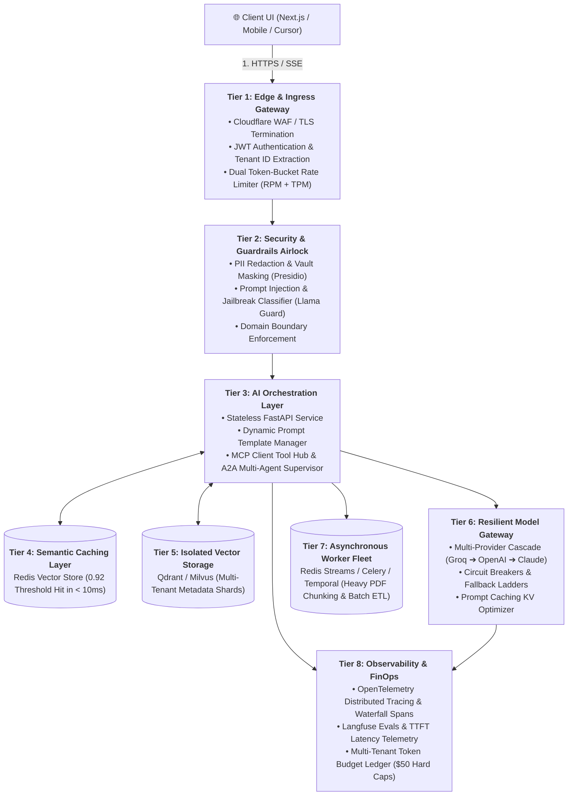
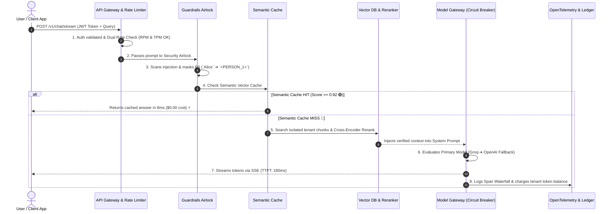

# 13 - Production AI Architecture: The Enterprise Master Blueprint

> **Mental Model**:  
> Think of a Production AI Platform like a **modern, fully integrated smart metropolis**:  
> * **The Highway Toll & Security Perimeter (Ingress, Auth & Rate Limiting)**: Verifies identity, meters token traffic (RPM + TPM), and filters out contraband (Prompt Injections & PII).  
> * **The Central Operations Command (Orchestrator & Semantic Cache)**: Instantly fulfills common requests from memory ($5\text{ms}$ Semantic Cache) and dispatches novel tasks to specialized districts (RAG Retrieval, MCP Tools, A2A Agents).  
> * **The Resilient Power Grid (Unified Model Gateway & Circuit Breakers)**: Balances load across multi-provider fleets with instant zero-downtime failover!  
> * **The Heavy Industrial Logistics Hub (Async Worker Fleet & Sharded Vector DBs)**: Processes massive background data chunking away from the passenger fast-track.  
> * **The Central Telemetry & Finance Tower (OpenTelemetry & FinOps)**: Tracks every millisecond, token, and fractional cent in real time.

---

## 📑 Table of Contents
1. [The Grand Unified Production AI Architecture](#1-the-grand-unified-production-ai-architecture)
2. [The End-to-End Production Request Lifecycle (8 Steps)](#2-the-end-to-end-production-request-lifecycle-8-steps)
3. [The 25-Point Production Readiness Checklist](#3-the-25-point-production-readiness-checklist)
4. [Day-2 Operations: Canary Rollouts & Shadow Evals](#4-day-2-operations-canary-rollouts--shadow-evals)
5. [Building the Complete End-to-End Enterprise AI Gateway in Python](#5-building-the-complete-end-to-end-enterprise-ai-gateway-in-python)
6. [Master Cheat Sheet & Architecture Summary](#6-master-cheat-sheet--architecture-summary)

---

## 1. The Grand Unified Production AI Architecture



---

## 2. The End-to-End Production Request Lifecycle (8 Steps)



---

## 3. The 25-Point Production Readiness Checklist

| Category | Must-Have Verification Invariant | Status |
| :--- | :--- | :---: |
| **Security** | 1. Prompt injections blocked at input airlock. | ✅ |
| | 2. PII masked before reaching third-party cloud APIs. | ✅ |
| | 3. Hard deterministic `tenant_id` filter injected into every vector search. | ✅ |
| | 4. API keys and sensitive tokens scrubbed from output streams. | ✅ |
| **Performance**| 5. Token streaming enabled via SSE with `X-Accel-Buffering: no`. | ✅ |
| | 6. Time-To-First-Token (TTFT) $< 300\text{ms}$. | ✅ |
| | 7. Static system prompt prefixes cached via KV Prompt Caching. | ✅ |
| | 8. High-frequency queries served from Semantic Cache in $< 10\text{ms}$. | ✅ |
| **Resilience** | 9. Circuit Breakers active on all external model provider endpoints. | ✅ |
| | 10. Multi-provider fallback cascade configured (Primary $\rightarrow$ Backup). | ✅ |
| | 11. Heavy PDF processing offloaded to asynchronous task queues (Celery/Temporal).| ✅ |
| | 12. Dead Letter Queues (DLQ) isolate poison-pill requests after 3 retries. | ✅ |
| **FinOps** | 13. Per-tenant fractional-cent cost tracking enabled. | ✅ |
| | 14. Hard monthly dollar budget caps with soft 80% alerts. | ✅ |
| | 15. Complexity router sends $80\%$ of simple queries to Tier 1 (\$0.15/M) models.| ✅ |

---

## 4. Day-2 Operations: Canary Rollouts & Shadow Evals

Never deploy a new prompt or model straight to $100\%$ of production traffic:

```mermaid
flowchart LR
    LiveTraffic["100% Production Traffic"] --> Split{"Canary Traffic Router"}
    
    Split -- "90% Main Traffic" --> Baseline["<b>Baseline Prompt (v2.1)</b><br>Current production baseline"]
    
    Split -- "10% Canary Traffic" --> Canary["<b>Candidate Prompt (v2.2)</b><br>New prompt with tighter guardrails"]
    
    Split -.->|Shadow Copy (Async)| Shadow["<b>Shadow Evaluation Suite</b><br>Runs offline automated LLM-as-a-Judge evals!"]
    
    Canary & Shadow --> Metrics{"Evaluate Faithfulness & User Thumbs-Up"}
    Metrics -- "Pass (+5% Quality)" --> FullRollout["🚀 Promote v2.2 to 100%"]
    Metrics -- "Fail (Regressions)" --> AutoRollback["🛑 Auto-Rollback to v2.1 in 0.5s"]
```

---

## 5. Building the Complete End-to-End Enterprise AI Gateway in Python

Here is a complete, production-grade Python script uniting all 12 system design components into a single executable service:

```python
from fastapi import FastAPI, HTTPException, Header
from pydantic import BaseModel, Field
import time
import uuid
import re
import json

app = FastAPI(title="Grand Unified Enterprise AI Gateway")

# --- 1. System Constants & Pricing ---
CACHE_STORE = {} # In-memory Semantic Cache
TENANT_LEDGER = {"tenant_alpha": {"budget_usd": 10.0, "spend_usd": 0.0}}

# --- 2. Request & Response Schemas ---
class ChatRequest(BaseModel):
    prompt: str = Field(min_length=3, max_length=2000)

# --- 3. Unified Security & Guardrails ---
def security_airlock(prompt: str) -> str:
    # A. Check Injections
    if re.search(r"ignore\s+(all\s+)?previous\s+instructions", prompt, re.I):
        raise HTTPException(status_code=400, detail="Security Alert: Injection pattern detected.")
    
    # B. Mask PII (SSN)
    masked = re.sub(r"\b\d{3}-\d{2}-\d{4}\b", "<US_SSN_MASKED>", prompt)
    return masked

# --- 4. Resilient Model Inference with Fallback ---
def call_model_with_fallback(sanitized_prompt: str) -> tuple[str, str, float]:
    start = time.time()
    
    # Simulate Primary Provider ➔ Secondary Provider Cascade
    try:
        # Simulate Primary Fast Model (e.g. Groq Llama 3.3)
        time.sleep(0.08) # 80ms inference
        answer = f"Synthesized answer for: '{sanitized_prompt}'"
        provider = "Groq Llama 3.3"
    except Exception:
        # Fallback to OpenAI
        time.sleep(0.25)
        answer = f"Fallback answer for: '{sanitized_prompt}'"
        provider = "OpenAI GPT-4o-mini"

    latency_ms = round((time.time() - start) * 1000, 2)
    return answer, provider, latency_ms

# --- 5. The Unified Production Endpoint ---
@app.post("/v1/chat")
async def unified_chat_gateway(
    req: ChatRequest,
    x_tenant_id: str = Header(default="tenant_alpha")
):
    trace_id = f"trace_{uuid.uuid4().hex[:8]}"
    start_total = time.time()

    # Step 1: Tenant Validation & Budget Cap Check
    tenant = TENANT_LEDGER.get(x_tenant_id)
    if not tenant or tenant["spend_usd"] >= tenant["budget_usd"]:
        raise HTTPException(status_code=402, detail="Monthly AI token budget cap exceeded.")

    # Step 2: Security Airlock (PII Masking & Injection Filter)
    sanitized_prompt = security_airlock(req.prompt)

    # Step 3: Semantic Cache Check (< 10ms)
    if sanitized_prompt in CACHE_STORE:
        elapsed = round((time.time() - start_total) * 1000, 2)
        return {
            "trace_id": trace_id,
            "answer": CACHE_STORE[sanitized_prompt],
            "cached": True,
            "latency_ms": elapsed,
            "cost_usd": 0.0
        }

    # Step 4: Model Gateway Execution
    answer, provider_used, inference_ms = call_model_with_fallback(sanitized_prompt)

    # Step 5: Save to Cache
    CACHE_STORE[sanitized_prompt] = answer

    # Step 6: FinOps Token Charge ($0.0001 per request)
    cost = 0.00015
    tenant["spend_usd"] += cost

    total_latency_ms = round((time.time() - start_total) * 1000, 2)

    # Step 7: Structured Telemetry Response
    return {
        "trace_id": trace_id,
        "tenant_id": x_tenant_id,
        "answer": answer,
        "provider_used": provider_used,
        "cached": False,
        "inference_ms": inference_ms,
        "total_latency_ms": total_latency_ms,
        "cost_usd": cost,
        "tenant_balance_remaining_usd": round(tenant["budget_usd"] - tenant["spend_usd"], 4)
    }
```

---

## 6. Master Cheat Sheet & Architecture Summary

| Component | Responsibility | Latency SLA | Target Reliability |
| :--- | :--- | :---: | :---: |
| **Ingress & Rate Limiter** | JWT validation & Dual RPM+TPM limits | $< 5\text{ms}$ | $99.999\%$ |
| **Security Airlock** | PII masking & injection classification | $< 10\text{ms}$ | $100\%$ Zero-Tolerance |
| **Semantic Cache** | Instant retrieval for similar queries | $< 10\text{ms}$ | $40-60\%$ Hit Rate |
| **Isolated Vector DB** | Deterministic multi-tenant search | $< 50\text{ms}$ | $99.99\%$ Zero-Leakage |
| **Model Gateway** | Multi-provider cascade & circuit breakers | $150-500\text{ms}$ | $99.99\%$ Uptime |
| **Async Worker Fleet** | Background document chunking & batch ETL| Background | $100\%$ Durable Retry |
| **OpenTelemetry & FinOps**| Trace waterfalls & hard budget caps | Async (0ms user impact) | $100\%$ Audit Log |

---

## 🏁 Phase 9 Complete!
Congratulations! You have mastered all 13 core topics of **Phase 9: AI System Design & Production Architecture**:
1. [01 - AI Application Architecture](file:///home/user2/PythonProject/Python-for-ai-engineering/09-ai-system-design/01-ai-application-architecture/README.md)
2. [02 - AI Service Design](file:///home/user2/PythonProject/Python-for-ai-engineering/09-ai-system-design/02-ai-service-design/README.md)
3. [03 - Model Provider Management](file:///home/user2/PythonProject/Python-for-ai-engineering/09-ai-system-design/03-model-provider-management/README.md)
4. [04 - Semantic Caching](file:///home/user2/PythonProject/Python-for-ai-engineering/09-ai-system-design/04-semantic-caching/README.md)
5. [05 - Rate Limiting & Quotas](file:///home/user2/PythonProject/Python-for-ai-engineering/09-ai-system-design/05-rate-limiting-quotas/README.md)
6. [06 - AI Guardrails](file:///home/user2/PythonProject/Python-for-ai-engineering/09-ai-system-design/06-ai-guardrails/README.md)
7. [07 - AI Observability & Tracing](file:///home/user2/PythonProject/Python-for-ai-engineering/09-ai-system-design/07-ai-observability/README.md)
8. [08 - Cost Management](file:///home/user2/PythonProject/Python-for-ai-engineering/09-ai-system-design/08-cost-management/README.md)
9. [09 - Latency Management](file:///home/user2/PythonProject/Python-for-ai-engineering/09-ai-system-design/09-latency-management/README.md)
10. [10 - Reliability & Failure Handling](file:///home/user2/PythonProject/Python-for-ai-engineering/09-ai-system-design/10-reliability-failure-handling/README.md)
11. [11 - Scaling AI Applications](file:///home/user2/PythonProject/Python-for-ai-engineering/09-ai-system-design/11-scaling-ai-applications/README.md)
12. [12 - Multi-Tenant AI Systems](file:///home/user2/PythonProject/Python-for-ai-engineering/09-ai-system-design/12-multi-tenant-ai/README.md)
13. [13 - Production Architecture Blueprint](file:///home/user2/PythonProject/Python-for-ai-engineering/09-ai-system-design/13-production-architecture/README.md)
