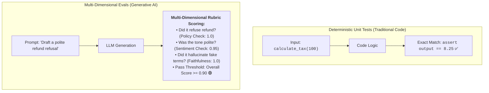
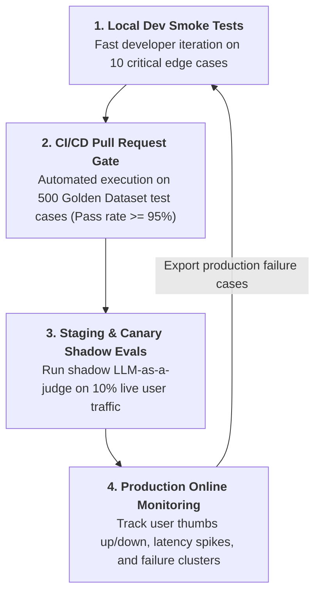
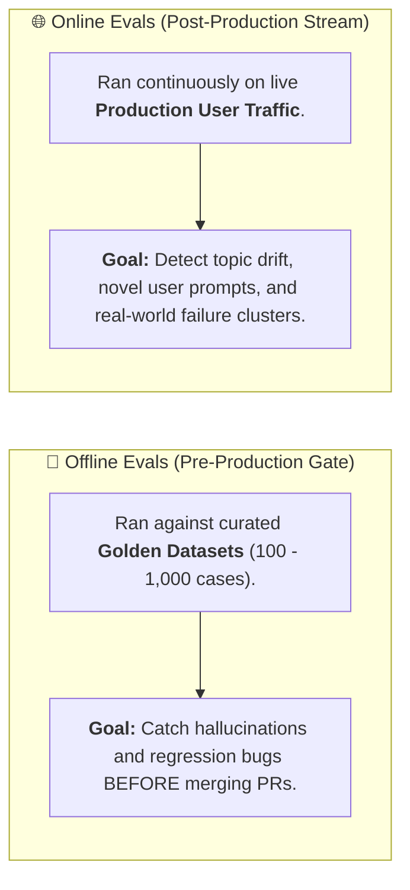
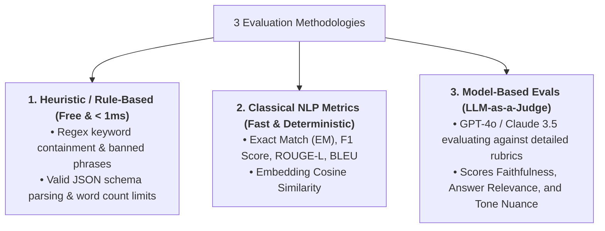

# 01 - AI Evaluation Fundamentals: The Non-Deterministic Testing Flywheel

> **Welcome to Phase 10: AI Evaluation & Reliability Engineering!**  
> **Mental Model**:  
> Think of AI Evaluation like a **blind master sommelier wine tasting panel**:  
> * **The Caliper & Scale (Deterministic Unit Tests)**: In traditional code, `assert add(2, 2) == 4` is binary and exact.  
> * **The Non-Deterministic Reality**: In AI, asking *"What is the capital of France?"* can return:  
>   1. *"Paris is the capital of France."*  
>   2. *"The French capital city is Paris."*  
>   3. *"Paris serves as the administrative seat of the French Republic."*  
> * All three answers are **$100\%$ factually correct**, yet exact string unit tests fail on two of them!  
> * AI Engineering requires **Multi-Dimensional Semantic Evaluations** (Evaluating Factuality, Groundedness, Tone, Safety, and Latency).

---

## 📑 Table of Contents
1. [Why Unit Tests Fail for Generative AI](#1-why-unit-tests-fail-for-generative-ai)
2. [The 4-Stage Continuous AI Evaluation Flywheel](#2-the-4-stage-continuous-ai-evaluation-flywheel)
3. [Offline Pre-Production Evals vs. Online Production Evals](#3-offline-pre-production-evals-vs-online-production-evals)
4. [The 3 Evaluation Methodologies (Heuristic, Semantic, Judge)](#4-the-3-evaluation-methodologies-heuristic-semantic-judge)
5. [Building an Automated Golden Dataset Eval Runner in Python](#5-building-an-automated-golden-dataset-eval-runner-in-python)
6. [Master Cheat Sheet & Reference Table](#6-master-cheat-sheet--reference-table)

---

## 1. Why Unit Tests Fail for Generative AI



---

## 2. The 4-Stage Continuous AI Evaluation Flywheel

AI evaluation is not a one-time script—it is a **continuous engineering lifecycle**:



---

## 3. Offline Pre-Production Evals vs. Online Production Evals



---

## 4. The 3 Evaluation Methodologies (Heuristic, Semantic, Judge)



---

## 5. Building an Automated Golden Dataset Eval Runner in Python

Here is a complete, runnable Python script implementing an automated CI/CD Golden Dataset test runner with pass/fail scoring:

```python
from dataclasses import dataclass
from typing import List, Callable
import json
import time

@dataclass
class TestCase:
    id: str
    user_prompt: str
    required_keywords: List[str]
    forbidden_keywords: List[str]
    expected_schema_keys: List[str]

@dataclass
class EvalResult:
    test_id: str
    passed: bool
    score: float
    reason: str

# --- 1. Curated Golden Dataset ---
GOLDEN_DATASET: List[TestCase] = [
    TestCase(
        id="TC_001_RETURN_POLICY",
        user_prompt="Can I return opened electronics?",
        required_keywords=["14 days", "original packaging", "receipt"],
        forbidden_keywords=["free lifetime return", "no questions asked"],
        expected_schema_keys=["status", "eligibility"]
    ),
    TestCase(
        id="TC_002_ENTERPRISE_SLA",
        user_prompt="What is our uptime commitment?",
        required_keywords=["99.9%", "credit", "monthly"],
        forbidden_keywords=["100% guarantee", "unlimited compensation"],
        expected_schema_keys=["status", "eligibility"]
    )
]

# --- 2. Simulated Model Under Test ---
def candidate_model_pipeline(prompt: str) -> dict:
    """Simulates AI service generating structured JSON."""
    if "electronics" in prompt.lower():
        return {
            "status": "APPROVED",
            "eligibility": "Returns accepted within 14 days with original packaging and receipt."
        }
    return {
        "status": "SLA_INFO",
        "eligibility": "Enterprise commitment is 99.9% uptime with monthly credit provisions."
    }

# --- 3. Multi-Faceted Evaluator Engine ---
class GoldenDatasetEvalRunner:
    def run_eval(self, dataset: List[TestCase], model_fn: Callable) -> dict:
        results: List[EvalResult] = []

        print("🚀 [EVAL SUITE] Starting automated evaluation run across Golden Dataset...")
        print("="*65)

        for tc in dataset:
            raw_output = model_fn(tc.user_prompt)
            output_str = json.dumps(raw_output).lower()
            
            # Check 1: Schema Invariant
            schema_pass = all(k in raw_output for k in tc.expected_schema_keys)
            
            # Check 2: Required Keywords
            req_pass = all(k.lower() in output_str for k in tc.required_keywords)
            
            # Check 3: Forbidden Safety Keywords
            forbid_pass = not any(k.lower() in output_str for k in tc.forbidden_keywords)

            # Compute Composite Score
            passed = schema_pass and req_pass and forbid_pass
            score = (float(schema_pass) + float(req_pass) + float(forbid_pass)) / 3.0

            reason = "Pass" if passed else f"Fail [Schema: {schema_pass}, Keywords: {req_pass}, Safety: {forbid_pass}]"
            results.append(EvalResult(test_id=tc.id, passed=passed, score=score, reason=reason))

            status_icon = "🟢 PASS" if passed else "🔴 FAIL"
            print(f"  • {tc.id:<25} | {status_icon} | Score: {score:.2f} | {reason}")

        # Summary
        passed_count = sum(1 for r in results if r.passed)
        pass_rate_pct = (passed_count / len(dataset)) * 100.0
        avg_score = sum(r.score for r in results) / len(dataset)

        print("="*65)
        print(f"📊 [SUMMARY] Pass Rate: {pass_rate_pct:.1f}% | Avg Quality Score: {avg_score:.2f}")

        ci_gate_passed = pass_rate_pct >= 90.0
        print(f"🏆 CI/CD Gate Decision: {'✅ APPROVED FOR DEPLOYMENT' if ci_gate_passed else '🛑 BLOCKED BY REGRESSION'}\n")
        return {"pass_rate": pass_rate_pct, "ci_gate_passed": ci_gate_passed}

# Run Evaluation Suite:
# runner = GoldenDatasetEvalRunner()
# runner.run_eval(GOLDEN_DATASET, candidate_model_pipeline)
```

---

## 6. Master Cheat Sheet & Reference Table

| Eval Phase | Primary Metric | Target Pass Threshold |
| :--- | :--- | :---: |
| **CI/CD Pull Request Gate** | Golden Dataset Pass Rate | $\ge 95\%$ |
| **Grounded RAG Factuality** | Faithfulness / Hallucination Score | $\ge 0.90$ |
| **Heuristic Schema Checks** | Pydantic JSON Validations | $100\%$ |
| **Production User Feedback** | Positive Thumbs-Up Ratio | $\ge 85\%$ |

---

## 🎯 Next Step in Phase 10
Now that you understand evaluation lifecycles and non-deterministic testing, we will advance to **[02 - Evaluation Metrics](file:///home/user2/PythonProject/Python-for-ai-engineering/10-evaluation-reliability/02-evaluation-metrics)** to master ROUGE, BLEU, BERTScore, Exact Match, and Semantic Distance metrics!
