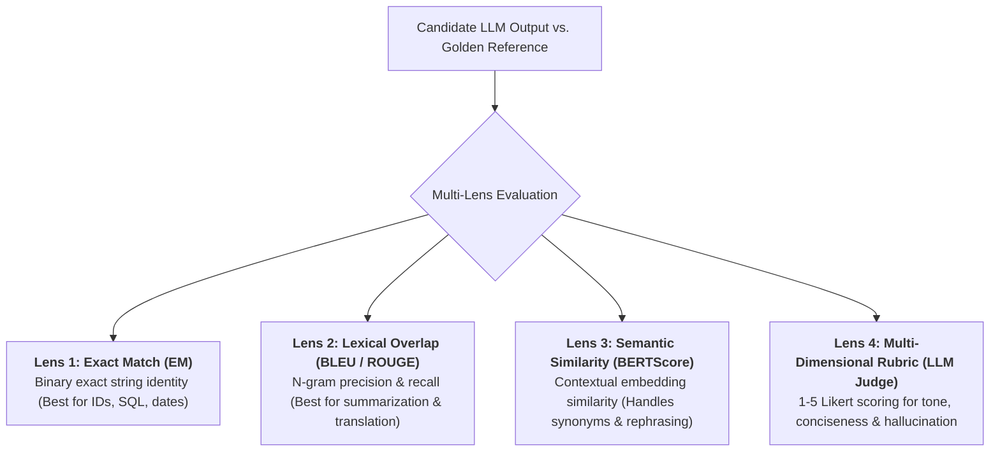
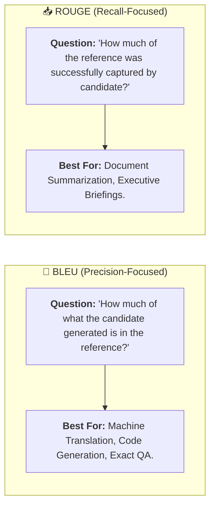
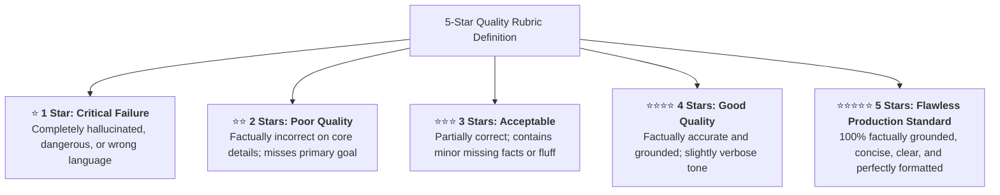

# 02 - AI Evaluation Metrics: From Overlap to Semantic Rubrics

> **Mental Model**:  
> Think of AI Evaluation Metrics like a **multi-lens quality inspection microscope**:  
> * **The Single-Metric Trap**: If you only use Exact Match, you fail valid synonyms. If you only use n-gram word overlap (BLEU/ROUGE), you can be tricked by word salads. If you only use embedding similarity, you miss dangerous negation flips (*"The drug is safe"* vs. *"The drug is NOT safe"* share high embedding similarity!).  
> * **The 4 Inspection Lenses**:  
>   * **Lens 1: Exact Geometry (Exact Match & Regex)**: Checks binary syntax and strict entity presence.  
>   * **Lens 2: Lexical Overlap (BLEU & ROUGE)**: Measures word and phrase retention.  
>   * **Lens 3: Semantic Alignment (BERTScore & Cosine Similarity)**: Measures conceptual meaning.  
>   * **Lens 4: Holistic Human Judgment (1-5 Likert Rubrics)**: Evaluates tone, conciseness, and groundedness!

---

## 📑 Table of Contents
1. [The 4 Lenses of AI Evaluation Metrics](#1-the-4-lenses-of-ai-evaluation-metrics)
2. [Lexical Overlap: BLEU (Precision) vs. ROUGE (Recall)](#2-lexical-overlap-bleu-precision-vs-rouge-recall)
3. [Semantic Similarity: Embedding Distance vs. BERTScore](#3-semantic-similarity-embedding-distance-vs-bertscore)
4. [Custom Qualitative Rubrics (1-to-5 Likert Scales)](#4-custom-qualitative-rubrics-1-to-5-likert-scales)
5. [Building a Multi-Metric Evaluation Suite in Python](#5-building-a-multi-metric-evaluation-suite-in-python)
6. [Master Cheat Sheet & Reference Table](#6-master-cheat-sheet--reference-table)

---

## 1. The 4 Lenses of AI Evaluation Metrics



---

## 2. Lexical Overlap: BLEU (Precision) vs. ROUGE (Recall)



### The 3 ROUGE Variants:
* **ROUGE-1**: Overlap of individual words (Unigrams).
* **ROUGE-2**: Overlap of two-word consecutive phrases (Bigrams).
* **ROUGE-L**: Longest Common Subsequence (Measures sentence-level structural flow without requiring consecutive matches).

---

## 3. Semantic Similarity: Embedding Distance vs. BERTScore

| Metric Type | How It Works | Strength | Critical Weakness |
| :--- | :--- | :--- | :--- |
| **Exact Match (EM)** | Binary $0$ or $1$ string equality. | 100% Deterministic & Instant. | Rejects valid synonyms & rephrasings. |
| **ROUGE-L** | Longest Common Subsequence overlap. | Fast, measures word ordering. | Penalizes paraphrasing. |
| **Cosine Similarity** | Vector angle between sentence embeddings. | High-level semantic equivalence. | Fails on negation (*"safe"* vs *"not safe"*). |
| **BERTScore** | Token-by-token contextual embedding alignment. | Evaluates nuanced word-level semantics. | Slower compute ($50\text{ms}$). |

---

## 4. Custom Qualitative Rubrics (1-to-5 Likert Scales)

When using an LLM Judge, define an **explicit, unambiguous 5-star rubric**:



---

## 5. Building a Multi-Metric Evaluation Suite in Python

Here is a complete, runnable script calculating Exact Match, Lexical ROUGE overlap, and Semantic Vector similarity:

```python
import numpy as np
from typing import List, Dict

class MultiMetricEvaluator:
    @staticmethod
    def exact_match(candidate: str, reference: str) -> float:
        """Returns 1.0 if normalized strings match exactly, else 0.0."""
        return 1.0 if candidate.strip().lower() == reference.strip().lower() else 0.0

    @staticmethod
    def rouge_1_overlap(candidate: str, reference: str) -> Dict[str, float]:
        """Calculates Unigram Precision, Recall, and F1 score."""
        cand_tokens = candidate.lower().split()
        ref_tokens = reference.lower().split()

        if not cand_tokens or not ref_tokens:
            return {"precision": 0.0, "recall": 0.0, "f1": 0.0}

        overlap_count = sum(1 for t in cand_tokens if t in ref_tokens)

        precision = overlap_count / len(cand_tokens)
        recall = overlap_count / len(ref_tokens)
        f1 = (2 * precision * recall) / (precision + recall) if (precision + recall) > 0 else 0.0

        return {
            "precision": round(precision, 4),
            "recall": round(recall, 4),
            "f1": round(f1, 4)
        }

    @staticmethod
    def _mock_embed(text: str) -> np.ndarray:
        np.random.seed(abs(hash(text)) % (2**32))
        v = np.random.randn(8)
        return v / np.linalg.norm(v)

    def semantic_similarity(self, candidate: str, reference: str) -> float:
        """Calculates cosine similarity between embedding vectors."""
        v_cand = self._mock_embed(candidate)
        v_ref = self._mock_embed(reference)
        return round(float(np.dot(v_cand, v_ref)), 4)

    def evaluate_all(self, candidate: str, reference: str) -> dict:
        em = self.exact_match(candidate, reference)
        rouge = self.rouge_1_overlap(candidate, reference)
        semantic = self.semantic_similarity(candidate, reference)

        # Composite Quality Index (40% ROUGE-F1 + 60% Semantic)
        composite = (0.40 * rouge["f1"]) + (0.60 * max(0.0, semantic))

        return {
            "exact_match": em,
            "rouge_1": rouge,
            "semantic_similarity": semantic,
            "composite_quality_score": round(composite, 4)
        }

# --- Test Multi-Metric Suite ---
def test_metrics():
    evaluator = MultiMetricEvaluator()

    ref = "Paris is the capital and largest city of France."
    cand1 = "Paris is the capital of France."
    cand2 = "Tokyo is the capital of Japan."

    print("🚀 [TEST 1] High-Quality Candidate Output:")
    print("Reference:", ref)
    print("Candidate:", cand1)
    res1 = evaluator.evaluate_all(cand1, ref)
    print("Scores:", res1, "\n")

    print("🚀 [TEST 2] Irrelevant Candidate Output:")
    print("Reference:", ref)
    print("Candidate:", cand2)
    res2 = evaluator.evaluate_all(cand2, ref)
    print("Scores:", res2)

# Run Test:
# test_metrics()
```

---

## 6. Master Cheat Sheet & Reference Table

| Metric | Target Optimal Score | Primary Engineering Domain |
| :--- | :---: | :--- |
| **Exact Match (EM)** | $1.0$ (Strict) | Classification tags, SQL generation, JSON keys. |
| **ROUGE-1 / ROUGE-L** | $> 0.65$ | Document summarization & extraction. |
| **BLEU** | $> 0.40$ | Machine translation & precise code generation. |
| **Semantic Similarity** | $> 0.90$ | Paraphrased customer support & conversational QA. |
| **5-Star Likert Judge** | $\ge 4.5\text{ Stars}$ | Holistic quality, groundedness, and brand tone. |

---

## 🎯 Next Step in Phase 10
Now that you have mastered evaluation metrics and scoring rubrics, we will advance to **[03 - Evaluation Datasets](file:///home/user2/PythonProject/Python-for-ai-engineering/10-evaluation-reliability/03-evaluation-datasets)** to master Golden Dataset curation, synthetic data generation, and edge-case hard-negative mining!
