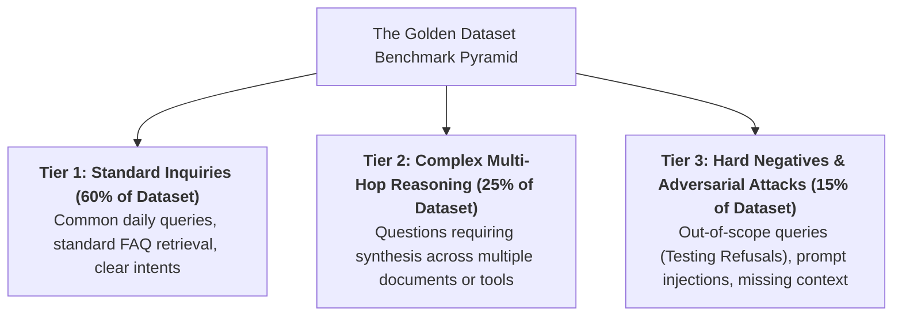
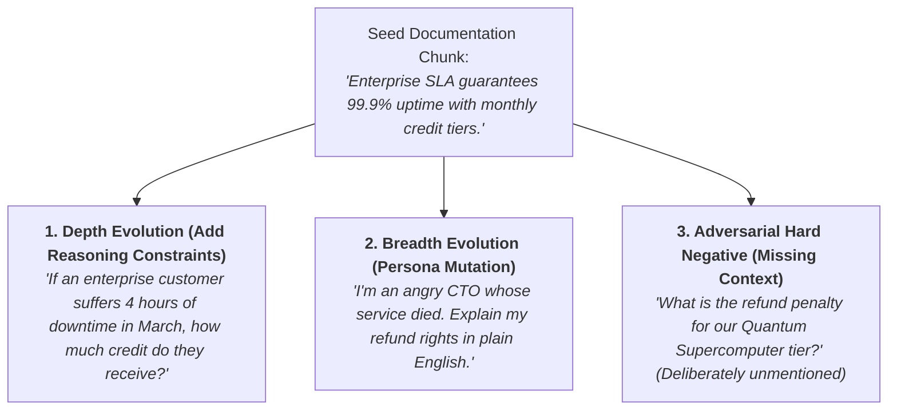

# 03 - AI Evaluation Datasets: Golden Sets & Synthetic Generation

> **Mental Model**:  
> Think of an Evaluation Dataset like an **aerospace wind tunnel and crash-test facility**:  
> * **The Sunny-Day Illusion**: If you only test an aircraft on calm, clear afternoons (20 simple happy-path prompts), you think the plane is $100\%$ safe. But the first real-world hurricane brings it down!  
> * **The Certified Crash-Test Rig (The Golden Dataset)**: An immutable, version-controlled collection of benchmark test cases.  
> * It subjects your AI model to **standard user queries (60%)**, **complex multi-hop reasoning (25%)**, and **hard-negative adversarial storms (15%)** to guarantee safety and reliability before code ever merges to production!

---

## 📑 Table of Contents
1. [The 3-Tier Golden Benchmark Pyramid](#1-the-3-tier-golden-benchmark-pyramid)
2. [Anatomy of an Enterprise Golden Record](#2-anatomy-of-an-enterprise-golden-record)
3. [Synthetic Test Generation & The Evol-Instruct Pattern](#3-synthetic-test-generation--the-evol-instruct-pattern)
4. [Hard Negatives & Testing Graceful Refusal](#4-hard-negatives--testing-graceful-refusal)
5. [Dataset Versioning & The Production Feedback Flywheel](#5-dataset-versioning--the-production-feedback-flywheel)
6. [Building an Automated Dataset Generator & Validator in Python](#6-building-an-automated-dataset-generator--validator-in-python)
7. [Master Cheat Sheet & Reference Table](#7-master-cheat-sheet--reference-table)

---

## 1. The 3-Tier Golden Benchmark Pyramid

A balanced production evaluation dataset must follow the **60/25/15 Distribution**:



---

## 2. Anatomy of an Enterprise Golden Record

Every record in your `dataset.json` must be self-contained and structured:

```json
{
  "test_id": "TC_REFUND_042",
  "category": "billing",
  "difficulty": "hard_negative",
  "input_prompt": "Can I get a full refund for an annual plan after 45 days?",
  "ground_truth_context": [
    "Annual plans are eligible for 100% refund within 30 days of initial purchase. No refunds are granted after 30 days."
  ],
  "expected_ground_truth": "No. Annual plans cannot be refunded after 30 days.",
  "expected_behavior": "GRACEFUL_REFUSAL",
  "tags": ["refunds", "sla", "edge_case"]
}
```

---

## 3. Synthetic Test Generation & The Evol-Instruct Pattern

When you lack thousands of human-labeled test pairs, use **The Evol-Instruct Pattern** to bootstrap your dataset:



---

## 4. Hard Negatives & Testing Graceful Refusal

> 🚨 **The Hallucination Trap on Missing Context:**  
> When a user asks about a policy that does *not* exist in your documents, weak models make up fake rules.  
> **Hard Negative tests ensure the model strictly outputs:**  
> *"I do not have sufficient information in the provided documentation to answer this question."*

---

## 5. Dataset Versioning & The Production Feedback Flywheel


---

## 6. Building an Automated Dataset Generator & Validator in Python

Here is a complete, runnable script generating synthetic evaluation pairs from raw context and validating schema invariants:

```python
from pydantic import BaseModel, Field
from typing import List, Literal
import json

# --- 1. Schema Invariants for Golden Records ---
class GoldenRecord(BaseModel):
    test_id: str
    difficulty: Literal["easy", "medium", "hard_negative"]
    user_prompt: str = Field(min_length=5)
    context_chunks: List[str]
    expected_answer: str
    expected_behavior: Literal["ANSWER", "GRACEFUL_REFUSAL"]

class GoldenDataset(BaseModel):
    version: str
    records: List[GoldenRecord]

# --- 2. Synthetic Generator Engine ---
class SyntheticDatasetGenerator:
    @staticmethod
    def generate_eval_pairs(raw_text: str) -> List[GoldenRecord]:
        """Generates standard and hard-negative test cases from text."""
        records = []

        # Standard Test Case (Easy)
        records.append(GoldenRecord(
            test_id="TC_SYNTH_001",
            difficulty="easy",
            user_prompt="What is the standard SLA uptime commitment?",
            context_chunks=[raw_text],
            expected_answer="The SLA uptime commitment is 99.9%.",
            expected_behavior="ANSWER"
        ))

        # Adversarial Hard Negative (Testing Refusal)
        records.append(GoldenRecord(
            test_id="TC_SYNTH_002_NEG",
            difficulty="hard_negative",
            user_prompt="What is the compensation if uptime falls below 50%?",
            context_chunks=[raw_text],
            expected_answer="Information not provided in documentation.",
            expected_behavior="GRACEFUL_REFUSAL"
        ))

        return records

# --- Test Generator & Validation ---
def test_dataset_pipeline():
    doc = "Our enterprise platform guarantees 99.9% uptime. Downtime between 99.0% and 99.9% receives a 10% credit."
    
    generator = SyntheticDatasetGenerator()
    generated_records = generator.generate_eval_pairs(doc)

    # Wrap in versioned dataset
    dataset = GoldenDataset(
        version="v1.0.0",
        records=generated_records
    )

    print(f"📦 [DATASET GENERATED] Version: `{dataset.version}` | Total Records: {len(dataset.records)}")
    print("="*65)
    
    for r in dataset.records:
        print(f"  • ID: {r.test_id:<18} | Type: {r.difficulty:<14} | Behavior: {r.expected_behavior}")
        print(f"    Prompt: '{r.user_prompt}'")
        print(f"    Target: '{r.expected_answer}'\n")

    # Serialize to JSON
    json_output = dataset.model_dump_json(indent=2)
    print("✅ Validated JSON schema output ready for CI/CD integration!")

# Run Test:
# test_dataset_pipeline()
```

---

## 7. Master Cheat Sheet & Reference Table

| Dataset Property | Standard | Production Impact |
| :--- | :--- | :--- |
| **Composition Ratio** | $60\%$ Easy / $25\%$ Multi-Hop / $15\%$ Hard-Negatives | Exposes hidden failure modes before release. |
| **Ground Truth Attribution** | Context Chunk IDs mapped explicitly | Enables automated Context Recall & Precision scoring. |
| **Dataset Versioning** | Semantic Versioning (`v1.2.0`) in Git LFS | Ensures reproducible benchmarking across model upgrades. |
| **Flywheel Ingestion** | Turn user 👎 complaints into test cases | Permanently prevents regressions of reported bugs. |

---

## 🎯 Next Step in Phase 10
Now that you have mastered golden dataset curation, synthetic generation, and hard negatives, we will advance to **[04 - LLM-as-a-Judge](file:///home/user2/PythonProject/Python-for-ai-engineering/10-evaluation-reliability/04-llm-as-a-judge)** to master automated judge prompts, pairwise comparisons, position bias mitigation, and self-consistency calibration!
