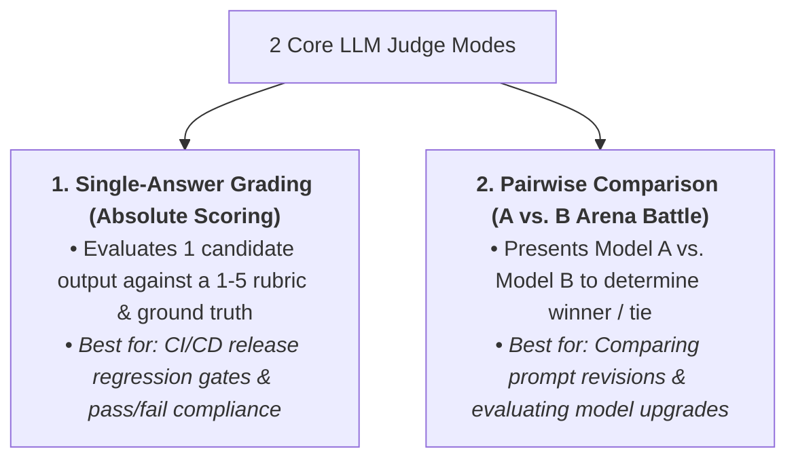
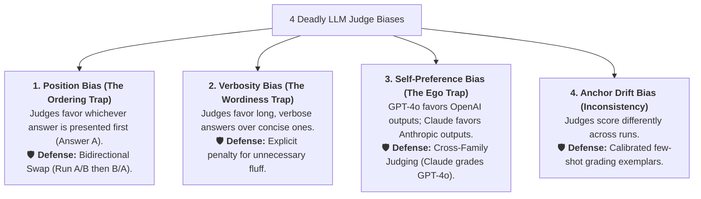
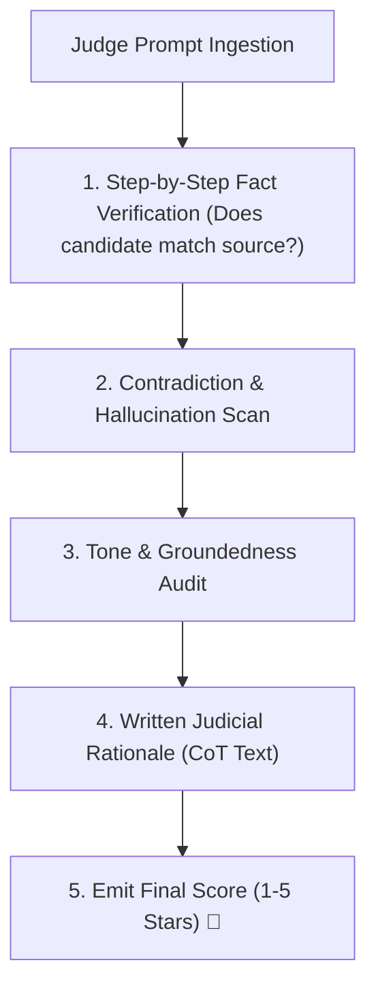
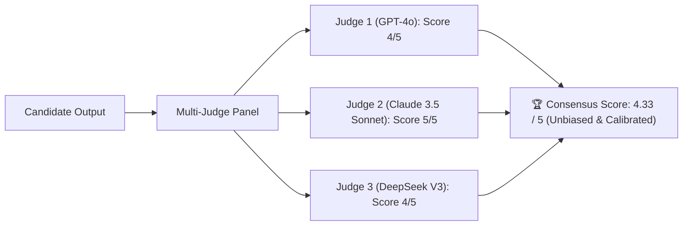

# 04 - LLM-as-a-Judge: Automated Scoring, Rubrics & Debiasing

> **Mental Model**:  
> Think of LLM-as-a-Judge like an **impartial Supreme Court Justice operating under a strict statutory code**:  
> * **The Human Evaluation Bottleneck**: Hiring humans to grade 5,000 model outputs costs \$25,000, takes 3 weeks, and graders suffer from fatigue and inconsistency.  
> * **The Automated High Court Justice (Frontier LLM Judge)**: A powerful reasoning model (GPT-4o / Claude 3.5 Sonnet) grades thousands of outputs in minutes against unambiguous, structured rubrics.  
> * **The Judicial Legal Opinion (Chain-of-Thought)**: The judge must write out its step-by-step factual analysis *first* before delivering the final quantitative verdict (Score / Pass / Fail)!

---

## 📑 Table of Contents
1. [Single-Answer Scoring vs. Pairwise Arena Comparisons](#1-single-answer-scoring-vs-pairwise-arena-comparisons)
2. [The 4 Deadly Judge Biases & How to Defeat Them](#2-the-4-deadly-judge-biases--how-to-defeat-them)
3. [The Chain-of-Thought (CoT) Judicial Rubric](#3-the-chain-of-thought-cot-judicial-rubric)
4. [Cross-Family Multi-Judge Panels (Consensus Arbitration)](#4-cross-family-multi-judge-panels-consensus-arbitration)
5. [Building a Debiased, Swap-Aware LLM Judge in Python](#5-building-a-debiased-swap-aware-llm-judge-in-python)
6. [Master Cheat Sheet & Reference Table](#6-master-cheat-sheet--reference-table)

---

## 1. Single-Answer Scoring vs. Pairwise Arena Comparisons



---

## 2. The 4 Deadly Judge Biases & How to Defeat Them



---

## 3. The Chain-of-Thought (CoT) Judicial Rubric

> 🚨 **The Cardinal Law of LLM Judges:**  
> **NEVER ask the model to output the score first!**  
> If the LLM generates `"Score: 3"` immediately, it hallucinates backwards rationalizations.  
> **Always force the model to output its `<reasoning>` analysis first, and the `<score>` at the very end!**



---

## 4. Cross-Family Multi-Judge Panels (Consensus Arbitration)

For high-stakes compliance or medical evaluations, deploy a **3-Judge Cross-Family Panel**:



---

## 5. Building a Debiased, Swap-Aware LLM Judge in Python

Here is a complete, runnable script implementing a debiased Pairwise LLM Judge with **Bidirectional Position Swapping**:

```python
from pydantic import BaseModel, Field
from typing import Literal
import json

# --- 1. Structured Judicial Verdict Schema ---
class JudgeVerdict(BaseModel):
    factual_analysis: str = Field(description="Step-by-step breakdown of facts in candidate vs reference.")
    conciseness_analysis: str = Field(description="Audit of whether candidate contains fluff.")
    winner: Literal["MODEL_A", "MODEL_B", "TIE"]
    confidence_score: float = Field(ge=0.0, le=1.0)

# --- 2. Debiased Pairwise Judge Engine ---
class PairwiseLLMJudge:
    def _mock_llm_judge_call(self, prompt_text: str, answer_a: str, answer_b: str) -> str:
        """Simulates judge evaluating two candidates."""
        # Simulated logic: Favor the more concise and accurate answer
        if "concise" in answer_a.lower() or len(answer_a) < len(answer_b):
            return json.dumps({
                "factual_analysis": "Answer A contains all core facts with zero unnecessary fluff.",
                "conciseness_analysis": "Answer A is direct. Answer B is overly wordy.",
                "winner": "MODEL_A",
                "confidence_score": 0.95
            })
        return json.dumps({
            "factual_analysis": "Answer B accurately conveys facts.",
            "conciseness_analysis": "Answer B is concise.",
            "winner": "MODEL_B",
            "confidence_score": 0.90
        })

    def evaluate_pairwise_with_swap(self, query: str, model_a_output: str, model_b_output: str) -> dict:
        print("⚖️ [JUDGE] Initiating Debiased Pairwise Arbitration...")

        # Round 1: Model A in Slot A, Model B in Slot B
        r1_raw = self._mock_llm_judge_call(query, model_a_output, model_b_output)
        v1 = JudgeVerdict.model_validate_json(r1_raw)
        print(f"  • Round 1 (A in Slot A, B in Slot B) ➔ Winner: `{v1.winner}`")

        # Round 2: SWAP POSITIONS (Model B in Slot A, Model A in Slot B)
        r2_raw = self._mock_llm_judge_call(query, model_b_output, model_a_output)
        v2 = JudgeVerdict.model_validate_json(r2_raw)
        print(f"  • Round 2 (B in Slot A, A in Slot B) ➔ Winner: `{v2.winner}`")

        # Check Position Consistency
        # If Round 1 picked MODEL_A and Round 2 picked MODEL_B (which is Model A in slot B), then Model A genuinely won!
        consistent_winner = None
        if v1.winner == "MODEL_A" and v2.winner == "MODEL_B":
            consistent_winner = "MODEL_A"
        elif v1.winner == "MODEL_B" and v2.winner == "MODEL_A":
            consistent_winner = "MODEL_B"
        elif v1.winner == "TIE" and v2.winner == "TIE":
            consistent_winner = "TIE"
        else:
            consistent_winner = "INCONCLUSIVE (Position Bias Detected ⚠️)"

        print(f"🏆 Final Debiased Decision: `{consistent_winner}`\n")
        return {
            "final_winner": consistent_winner,
            "round_1_analysis": v1.factual_analysis,
            "round_2_analysis": v2.factual_analysis
        }

# --- Test Pairwise Judge ---
def test_judge():
    judge = PairwiseLLMJudge()

    query = "What is the return window for enterprise software?"
    candidate_1 = "Enterprise software returns are accepted within 30 days." # Concise
    candidate_2 = "Thank you for asking! In accordance with our terms of service, customers who have purchased enterprise tier software may be permitted to request a return within thirty calendar days." # Verbose

    decision = judge.evaluate_pairwise_with_swap(query, candidate_1, candidate_2)
    print("Judge Report:", decision)

# Run Test:
# test_judge()
```

---

## 6. Master Cheat Sheet & Reference Table

| Bias Type | Manifestation | Mitigation Strategy |
| :--- | :--- | :--- |
| **Position Bias** | Higher win-rate for first presented option. | **Bidirectional Swapping** (Evaluate A/B and B/A). |
| **Verbosity Bias** | Higher scores awarded to long, verbose text. | Explicit prompt instruction penalizing fluff. |
| **Self-Preference**| Model favors outputs from its own model family.| Use cross-family judge or multi-model panel. |
| **Hallucination** | Giving scores without factual grounding. | Force `<reasoning>` Chain-of-Thought before score. |

---

## 🎯 Next Step in Phase 10
Now that you have mastered LLM-as-a-Judge, debiasing, and pairwise comparisons, we will advance to **[05 - RAG Evaluation](file:///home/user2/PythonProject/Python-for-ai-engineering/10-evaluation-reliability/05-rag-evaluation)** to master the Ragas Evaluation Triad: Faithfulness, Answer Relevance, Context Precision, and Context Recall!
