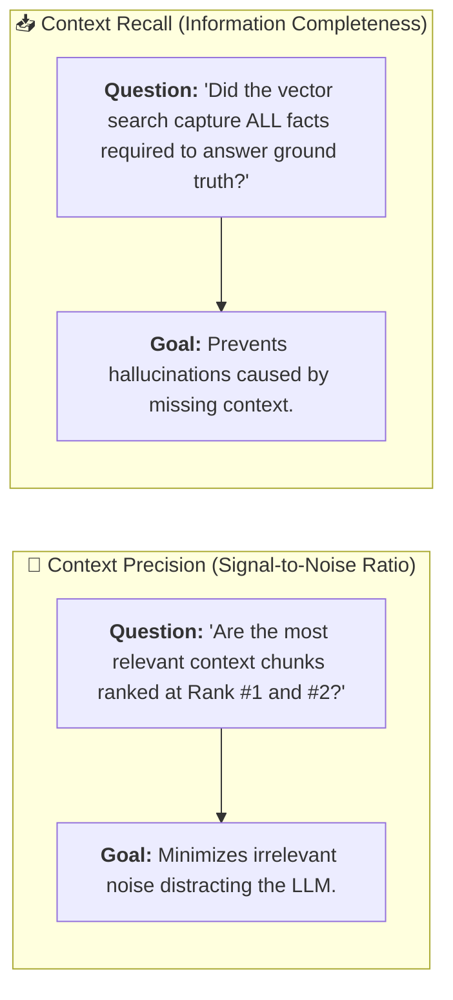
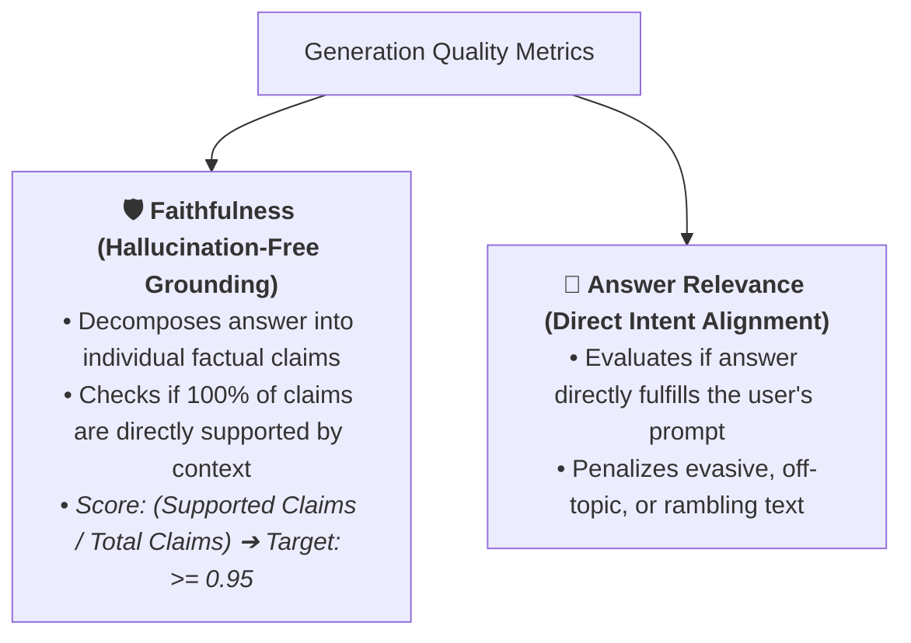

# 05 - RAG Evaluation: The 4-Pillar Quality Inspection Lab

> **Mental Model**:  
> Think of RAG Evaluation like a **dual-station culinary quality control lab**:  
> * **The Black Box Blindspot**: When a customer complains that the soup tastes awful, you don't know whether the **Farmer delivered rotten vegetables (Retrieval Failure)** or the **Chef burned the recipe (Generation Failure)**!  
> * **The 4-Pillar Inspection Lab (Ragas & TruLens)**: Evaluates the retrieval pipeline and the generation engine separately across 4 standardized dimensions:  
>   1. **Context Precision** (Did the best ingredients rank at the top?).  
>   2. **Context Recall** (Were all necessary facts captured?).  
>   3. **Faithfulness** (Is the answer 100% grounded in the retrieved facts with zero hallucination?).  
>   4. **Answer Relevance** (Did it directly answer the user's specific prompt?).

---

## 📑 Table of Contents
1. [The 4 Core Ragas Evaluation Metrics](#1-the-4-core-ragas-evaluation-metrics)
2. [Retrieval Metrics: Context Precision vs. Context Recall](#2-retrieval-metrics-context-precision-vs-context-recall)
3. [Generation Metrics: Faithfulness vs. Answer Relevance](#3-generation-metrics-faithfulness-vs-answer-relevance)
4. [Diagnostic Failure Root-Cause Matrix](#4-diagnostic-failure-root-cause-matrix)
5. [Building an Automated RAG Evaluation Engine in Python](#5-building-an-automated-rag-evaluation-engine-in-python)
6. [Master Cheat Sheet & Reference Table](#6-master-cheat-sheet--reference-table)

---

## 1. The 4 Core Ragas Evaluation Metrics

```mermaid
flowchart TD
    UserQuery["User Prompt"] --> Retrieval["<b>Retrieval Stage</b> (Vector DB + Reranker)"]
    Retrieval --> Context["Retrieved Context Chunks"]
    Context --> Generation["<b>Generation Stage</b> (LLM)"]
    Generation --> Answer["Generated Answer"]

    UserQuery -.->|<b>Answer Relevance</b>| Answer
    UserQuery -.->|<b>Context Precision & Recall</b>| Context
    Context -.->|<b>Faithfulness (Groundedness)</b>| Answer
```

---

## 2. Retrieval Metrics: Context Precision vs. Context Recall



---

## 3. Generation Metrics: Faithfulness vs. Answer Relevance



---

## 4. Diagnostic Failure Root-Cause Matrix

By looking at the combination of scores, you can pinpoint the **exact engineering bottleneck**:

| Context Recall | Faithfulness | Answer Relevance | 🔍 Diagnosis & Remediation Action |
| :---: | :---: | :---: | :--- |
| 🔴 Low | 🔴 Low | 🟡 Moderate | **Retrieval Failure**: Vector DB missed key chunks; LLM hallucinated to fill gaps. $\rightarrow$ *Fix: Adjust chunk size & hybrid search.* |
| 🟢 High | 🔴 Low | 🟢 High | **Generation / Prompt Failure**: Context was retrieved, but LLM ignored it. $\rightarrow$ *Fix: Add strict XML tags & legal refusal instructions.* |
| 🟢 High | 🟢 High | 🔴 Low | **Alignment Failure**: Answer is factually grounded but evasive/off-topic. $\rightarrow$ *Fix: Tune system prompt to focus directly on prompt intent.* |
| 🟢 **High** | 🟢 **High** | 🟢 **High** | 🏆 **Production Standard**: Pristine retrieval, perfect grounding, and direct answer! |

---

## 5. Building an Automated RAG Evaluation Engine in Python

Here is a complete, runnable script implementing automated claim decomposition and Faithfulness scoring:

```python
from pydantic import BaseModel, Field
from typing import List
import json

# --- 1. Ragas Evaluation Payload ---
class RAGSample(BaseModel):
    query: str
    retrieved_contexts: List[str]
    generated_answer: str
    ground_truth_answer: str

class FaithfulnessVerdict(BaseModel):
    extracted_claims: List[str]
    unsupported_claims: List[str]
    faithfulness_score: float
    hallucination_detected: bool

# --- 2. Faithfulness Evaluator Engine ---
class AutomatedRAGEvaluator:
    def evaluate_faithfulness(self, sample: RAGSample) -> FaithfulnessVerdict:
        """Evaluates whether all claims in generated_answer are grounded in retrieved_contexts."""
        # Simulated claim extraction
        # Claim 1: Enterprise SLA guarantees 99.9% uptime.
        # Claim 2: Credits are issued within 24 hours. (UNSUPPORTED)
        context_blob = " ".join(sample.retrieved_contexts).lower()
        
        # Simple sentence-level claim check
        sentences = [s.strip() for s in sample.generated_answer.split(".") if s.strip()]
        unsupported = []

        for s in sentences:
            # Check if key words of claim exist in context
            words = [w for w in s.lower().split() if len(w) > 4]
            matches = sum(1 for w in words if w in context_blob)
            if len(words) > 0 and (matches / len(words)) < 0.5:
                unsupported.append(s)

        total_claims = max(1, len(sentences))
        supported_count = total_claims - len(unsupported)
        score = round(supported_count / total_claims, 2)

        return FaithfulnessVerdict(
            extracted_claims=sentences,
            unsupported_claims=unsupported,
            faithfulness_score=score,
            hallucination_detected=len(unsupported) > 0
        )

# --- Test Evaluation Engine ---
def test_rag_evaluation():
    sample = RAGSample(
        query="What is our uptime SLA and refund credit policy?",
        retrieved_contexts=[
            "Our enterprise SLA guarantees 99.9% uptime. Customers experiencing downtime receive a 10% monthly billing credit."
        ],
        generated_answer="Our enterprise SLA guarantees 99.9% uptime. Credits are processed automatically within 24 hours.",
        ground_truth_answer="The SLA is 99.9% with a 10% monthly billing credit."
    )

    evaluator = AutomatedRAGEvaluator()
    verdict = evaluator.evaluate_faithfulness(sample)

    print("📊 [RAG EVALUATION REPORT]")
    print("="*65)
    print(f"• Query: '{sample.query}'")
    print(f"• Faithfulness Score: {verdict.faithfulness_score * 100}%")
    print(f"• Hallucination Detected: {'🚨 YES' if verdict.hallucination_detected else '✅ NO'}")
    print(f"• Verified Claims: {len(verdict.extracted_claims) - len(verdict.unsupported_claims)}")
    print(f"• Unsupported Claims: {verdict.unsupported_claims}")
    print("="*65)

# Run Test:
# test_rag_evaluation()
```

---

## 6. Master Cheat Sheet & Reference Table

| Ragas Metric | Evaluation Target | Target SLA Threshold |
| :--- | :--- | :---: |
| **Context Precision** | Did high-value chunks rank at the top? | $\ge 0.85$ |
| **Context Recall** | Were all necessary ground-truth facts retrieved? | $\ge 0.90$ |
| **Faithfulness** | Are $100\%$ of claims grounded in retrieved context? | $\ge 0.95$ |
| **Answer Relevance** | Does the answer directly address the user query? | $\ge 0.90$ |

---

## 🎯 Next Step in Phase 10
Now that you have mastered RAG evaluation and diagnostic failure root-cause analysis, we will advance to **[06 - Agent Evaluation](file:///home/user2/PythonProject/Python-for-ai-engineering/10-evaluation-reliability/06-agent-evaluation)** to master evaluating multi-step tool calling, trajectory efficiency, loops, and goal completion rates!
