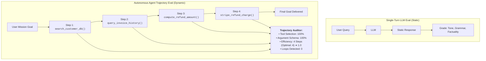
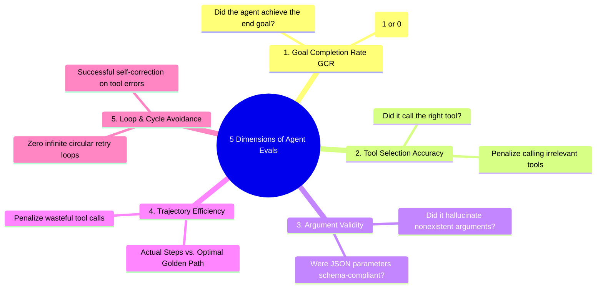
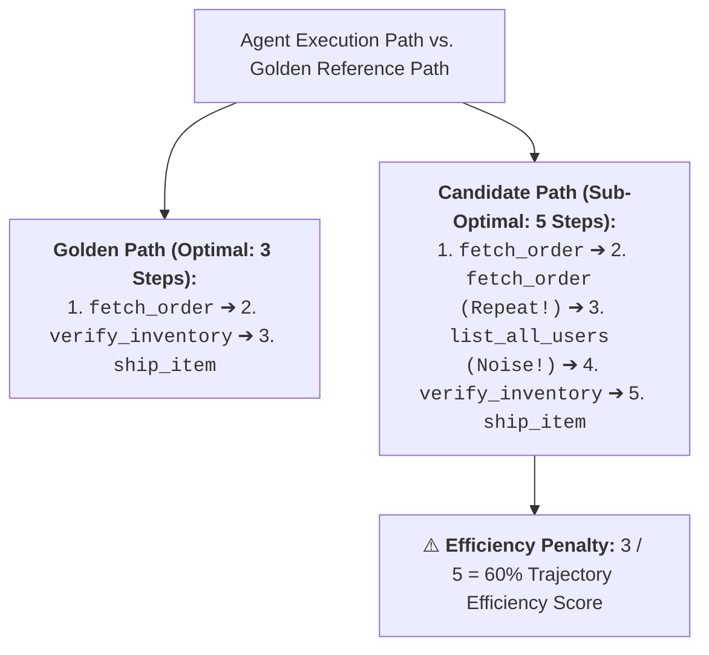
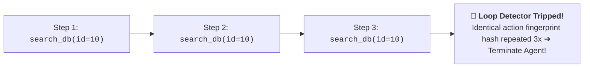

# 06 - Autonomous Agent Evaluation: Trajectory Scoring & Loop Detection

> **Mental Model**:  
> Think of Agent Evaluation like an **FAA flight simulator pilot checkride**:  
> * **The Single-Turn Illusion**: Grading a standard chatbot is like grading a written essay (Evaluating static text).  
> * **The Autonomous Pilot Checkride**: An agent executes an **extended 10-step mission trajectory** across multiple tools, databases, and APIs.  
> * You don't just check if the airplane made it to the destination (Goal Completion Rate). You grade the **entire flight trajectory**:  
>   * Did the pilot select the right navigational instruments (**Tool Selection Accuracy**)?  
>   * Did they fly in wasteful circular holding patterns (**Agent Loop Detection**)?  
>   * Did they burn unnecessary jet fuel (**Step-Count & Token Efficiency**)?

---

## 📑 Table of Contents
1. [Single-Turn Output vs. Multi-Step Trajectory Evaluation](#1-single-turn-output-vs-multi-step-trajectory-evaluation)
2. [The 5 Core Dimensions of Agent Performance](#2-the-5-core-dimensions-of-agent-performance)
3. [Evaluating Tool Selection, Arguments & Sequence Matching](#3-evaluating-tool-selection-arguments--sequence-matching)
4. [Detecting Wasteful Loops & Action Fingerprint Traps](#4-detecting-wasteful-loops--action-fingerprint-traps)
5. [The Pass@k Reliability Metric for Agents](#5-the-passk-reliability-metric-for-agents)
6. [Building an Automated Agent Trajectory Evaluator in Python](#6-building-an-automated-agent-trajectory-evaluator-in-python)
7. [Master Cheat Sheet & Reference Table](#7-master-cheat-sheet--reference-table)

---

## 1. Single-Turn Output vs. Multi-Step Trajectory Evaluation



---

## 2. The 5 Core Dimensions of Agent Performance



---

## 3. Evaluating Tool Selection, Arguments & Sequence Matching



---

## 4. Detecting Wasteful Loops & Action Fingerprint Traps

> 🚨 **The Infinite Agent Loop:**  
> When an agent calls `search_files(query="config")`, receives an empty result, and immediately calls `search_files(query="config")` again in an unbroken cycle!



---

## 5. The Pass@k Reliability Metric for Agents

In autonomous agent systems, a single run might fail due to tool network flakiness. We measure **Pass@k** ($k$ independent attempts):

| Metric | Definition | Target Production SLA |
| :--- | :--- | :---: |
| **Pass@1** | Probability of completing mission on the very first try. | $\ge 85\%$ |
| **Pass@3** | Probability of completing mission within 3 attempts. | $\ge 98\%$ |
| **Step Efficiency** | $\frac{\text{Optimal Steps}}{\text{Actual Steps Taken}}$ | $\ge 0.80$ |
| **Zero-Loop Rate** | Percentage of runs completing without repetitive cycles. | $100\%$ |

---

## 6. Building an Automated Agent Trajectory Evaluator in Python

Here is a complete, runnable script evaluating an agent's multi-step execution trace against optimal golden trajectories:

```python
from dataclasses import dataclass
from typing import List, Dict, Any
import hashlib

@dataclass
class ToolInvocation:
    tool_name: str
    arguments: Dict[str, Any]
    output_preview: str

@dataclass
class AgentTrajectory:
    task_id: str
    goal: str
    steps: List[ToolInvocation]
    final_answer: str
    goal_completed: bool

class AgentTrajectoryEvaluator:
    @staticmethod
    def _compute_action_hash(tool: ToolInvocation) -> str:
        raw = f"{tool.tool_name}:{sorted(tool.arguments.items())}"
        return hashlib.md5(raw.encode()).hexdigest()

    def evaluate_trajectory(
        self, 
        trajectory: AgentTrajectory, 
        optimal_tool_sequence: List[str]
    ) -> dict:
        actual_tool_names = [s.tool_name for s in trajectory.steps]
        
        # 1. Step Efficiency
        optimal_count = len(optimal_tool_sequence)
        actual_count = len(trajectory.steps)
        efficiency_score = min(1.0, optimal_count / max(1, actual_count))

        # 2. Tool Sequence Accuracy (Did it call all required tools in order?)
        sequence_matches = 0
        opt_idx = 0
        for name in actual_tool_names:
            if opt_idx < len(optimal_tool_sequence) and name == optimal_tool_sequence[opt_idx]:
                opt_idx += 1
                sequence_matches += 1
        sequence_score = sequence_matches / max(1, optimal_count)

        # 3. Loop & Cycle Detection
        seen_hashes = {}
        loops_detected = 0
        for step in trajectory.steps:
            h = self._compute_action_hash(step)
            seen_hashes[h] = seen_hashes.get(h, 0) + 1
            if seen_hashes[h] > 1:
                loops_detected += 1

        # 4. Composite Agent Score
        composite = (
            (0.40 * float(trajectory.goal_completed)) +
            (0.30 * sequence_score) +
            (0.20 * efficiency_score) -
            (0.10 * loops_detected)
        )
        composite = max(0.0, min(1.0, composite))

        return {
            "task_id": trajectory.task_id,
            "goal_completed": trajectory.goal_completed,
            "total_steps_taken": actual_count,
            "optimal_steps_target": optimal_count,
            "step_efficiency_score": round(efficiency_score, 2),
            "sequence_accuracy": round(sequence_score, 2),
            "repetitive_loops_detected": loops_detected,
            "composite_agent_score": round(composite, 2)
        }

# --- Test Agent Evaluator ---
def test_agent_eval():
    evaluator = AgentTrajectoryEvaluator()

    # Trajectory with a repetitive search loop
    trajectory = AgentTrajectory(
        task_id="TASK_REFUND_90",
        goal="Verify customer eligibility and process $50 refund.",
        steps=[
            ToolInvocation("search_user", {"email": "alice@corp.com"}, "User found: #1042"),
            ToolInvocation("search_user", {"email": "alice@corp.com"}, "User found: #1042 (LOOP!)"),
            ToolInvocation("check_balance", {"user_id": 1042}, "Eligible: True"),
            ToolInvocation("execute_refund", {"user_id": 1042, "amount": 50.0}, "Refund processed.")
        ],
        final_answer="Refund of $50 has been successfully processed for Alice.",
        goal_completed=True
    )

    optimal_plan = ["search_user", "check_balance", "execute_refund"]

    report = evaluator.evaluate_trajectory(trajectory, optimal_plan)
    print("📊 [AGENT TRAJECTORY AUDIT REPORT]")
    print("="*65)
    for k, v in report.items():
        print(f"  • {k:<28}: {v}")
    print("="*65)

# Run Test:
# test_agent_eval()
```

---

## 7. Master Cheat Sheet & Reference Table

| Evaluation Dimension | Core Question | Target SLA |
| :--- | :--- | :---: |
| **Goal Completion (GCR)** | Did the agent achieve the user's objective? | $\ge 90\%$ |
| **Step Efficiency** | Did it avoid wasteful exploratory wanderings? | $\ge 0.80$ |
| **Sequence Accuracy** | Were prerequisite tools invoked in logical order? | $\ge 0.95$ |
| **Loop Rate** | How often did it repeat identical action hashes? | **$0.0\%$ (Strict Zero)** |
| **Pass@3** | Multi-attempt success probability. | $\ge 98\%$ |

---

## 🎯 Next Step in Phase 10
Now that you have mastered agent trajectory evaluation, efficiency scoring, and loop detection, we will advance to **[07 - Regression Testing](file:///home/user2/PythonProject/Python-for-ai-engineering/10-evaluation-reliability/07-regression-testing)** to master CI/CD regression gates, prompt version diffing, and baseline drift prevention!
