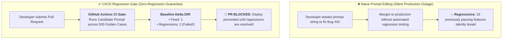
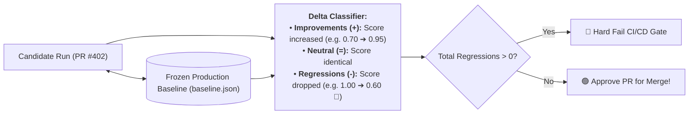
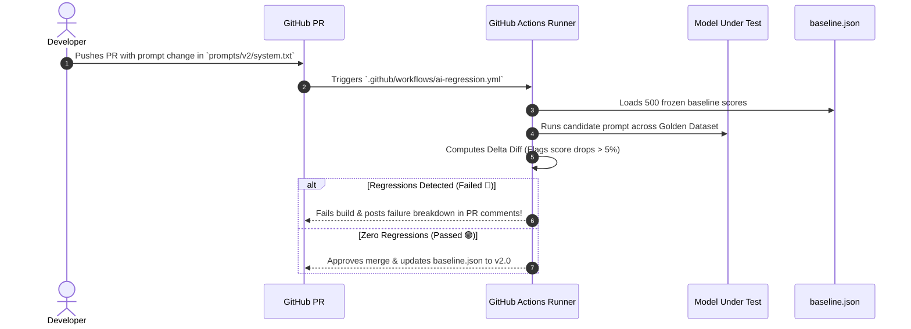

# 07 - AI Regression Testing: Baseline Diffing & CI/CD Quality Gates

> **Mental Model**:  
> Think of Prompt & Model Regression Testing like a **high-stakes arcade game of Whack-a-Mole**:  
> * **The Whack-a-Mole Trap**: A developer modifies a system prompt to fix one single customer complaint (e.g. *"Make our Spanish greeting more formal"*). In doing so, the prompt change silently degrades SQL formatting on **200 critical production workflows**!  
> * **The Automated Baseline Gate (CI/CD Regression Suite)**: Before any prompt edit or model upgrade merges to main, the CI/CD pipeline runs the candidate prompt across **all 500 Golden Benchmark test cases**.  
> * It compares the results against the **Frozen Production Baseline (`baseline.json`)**. If a single regression is detected (a test case that used to pass now fails), the build **hard-blocks deployment**!

---

## 📑 Table of Contents
1. [The Whack-a-Mole Prompt Regression Trap](#1-the-whack-a-mole-prompt-regression-trap)
2. [Baseline Snapshot Comparison & Delta Matrices](#2-baseline-snapshot-comparison--delta-matrices)
3. [Model Upgrade Regression Testing (Snapshot Migrations)](#3-model-upgrade-regression-testing-snapshot-migrations)
4. [GitHub Actions CI/CD Quality Gate Pipeline](#4-github-actions-cicd-quality-gate-pipeline)
5. [Building an Automated Prompt Regression Suite in Python](#5-building-an-automated-prompt-regression-suite-in-python)
6. [Master Cheat Sheet & Reference Table](#6-master-cheat-sheet--reference-table)

---

## 1. The Whack-a-Mole Prompt Regression Trap



---

## 2. Baseline Snapshot Comparison & Delta Matrices

Every test case in your Golden Suite is tracked against its **Historical Baseline**:



---

## 3. Model Upgrade Regression Testing (Snapshot Migrations)

When upgrading between model snapshots (e.g. `gpt-4o-2024-05-13` $\rightarrow$ `gpt-4o-2024-08-06`), always run a **4-Dimension Matrix**:

| Test Dimension | Metric Evaluated | Tolerance Allowed |
| :--- | :--- | :---: |
| **Quality & Grounding** | Faithfulness & Ragas Accuracy | **$0.0\%$ Drop Allowed (Zero Regression)** |
| **JSON Schema Invariants**| Valid Pydantic JSON Syntax | **$100\%$ Strict Compliance** |
| **Latency (TTFT)** | Time-To-First-Token | $\le +10\%$ Variance |
| **Token Cost** | Blended Dollar Cost per 1M Tokens | Must decrease or remain flat |

---

## 4. GitHub Actions CI/CD Quality Gate Pipeline



---

## 5. Building an Automated Prompt Regression Suite in Python

Here is a complete, runnable script comparing candidate model evaluation results against a frozen `baseline.json` and generating an actionable PR regression report:

```python
from dataclasses import dataclass
from typing import Dict, List
import json

@dataclass
class TestCaseResult:
    test_id: str
    score: float
    latency_ms: float

class AIRegressionAuditor:
    def __init__(self, baseline_data: Dict[str, dict]):
        self.baseline = baseline_data

    def audit_candidate_run(self, candidate_results: List[TestCaseResult]) -> dict:
        improvements = []
        regressions = []
        neutral = []

        print("🔍 [REGRESSION AUDIT] Comparing candidate scores against baseline...")
        print("="*65)

        for cand in candidate_results:
            base = self.baseline.get(cand.test_id)
            if not base:
                continue

            base_score = base["score"]
            delta = round(cand.score - base_score, 4)

            record = {
                "test_id": cand.test_id,
                "baseline_score": base_score,
                "candidate_score": cand.score,
                "delta": delta
            }

            if delta < -0.05: # Dropped by more than 5%
                regressions.append(record)
                print(f"  🔴 [REGRESSION] {cand.test_id:<20} | Base: {base_score:.2f} ➔ New: {cand.score:.2f} ({delta:+.2f})")
            elif delta > 0.05:
                improvements.append(record)
                print(f"  🟢 [IMPROVED]  {cand.test_id:<20} | Base: {base_score:.2f} ➔ New: {cand.score:.2f} ({delta:+.2f})")
            else:
                neutral.append(record)
                print(f"  ⚪ [NEUTRAL]   {cand.test_id:<20} | Base: {base_score:.2f} ➔ New: {cand.score:.2f} (Flat)")

        print("="*65)
        passed = len(regressions) == 0

        summary_markdown = (
            f"### 📊 CI/CD AI Regression Report\n"
            f"- **Gate Decision**: {'🟢 APPROVED' if passed else '🛑 BLOCKED BY REGRESSION'}\n"
            f"- **Total Tests Evaluated**: {len(candidate_results)}\n"
            f"- **Improvements**: {len(improvements)}\n"
            f"- **Regressions**: {len(regressions)}\n"
            f"- **Neutral / Flat**: {len(neutral)}\n"
        )
        print(summary_markdown)
        return {"passed": passed, "regressions": regressions, "improvements": improvements}

# --- Test Regression Runner ---
def test_regression_gate():
    # 1. Frozen Historical Baseline
    frozen_baseline = {
        "TC_001_AUTH": {"score": 1.0, "latency_ms": 110},
        "TC_002_SQL_GEN": {"score": 0.95, "latency_ms": 240},
        "TC_003_GERMAN_TONE": {"score": 0.60, "latency_ms": 180}
    }

    # 2. Candidate Run (Fixed German Tone, but accidentally broke SQL Gen!)
    candidate_run = [
        TestCaseResult(test_id="TC_001_AUTH", score=1.0, latency_ms=115),
        TestCaseResult(test_id="TC_002_SQL_GEN", score=0.65, latency_ms=250), # 🚨 REGRESSION!
        TestCaseResult(test_id="TC_003_GERMAN_TONE", score=0.95, latency_ms=175) # 🟢 IMPROVEMENT!
    ]

    auditor = AIRegressionAuditor(frozen_baseline)
    report = auditor.audit_candidate_run(candidate_run)

# Run Test:
# test_regression_gate()
```

---

## 6. Master Cheat Sheet & Reference Table

| Regression Metric | Maximum Tolerance Allowed | Engineering Action on Failure |
| :--- | :---: | :--- |
| **Score Drop Delta** | **$< -5\%$ on any individual test** | Hard block pull request; notify author with failure diff. |
| **Overall Suite Pass Rate**| $\ge 95\%$ | Prevent deployment to staging or production. |
| **Schema Validation Errors**| **$0.0\%$ (Zero Tolerance)** | Reject output format change immediately. |
| **Baseline Snapshot** | Update on every major approved release | Run `git commit baseline.json` on tagged releases. |

---

## 🎯 Next Step in Phase 10
Now that you have mastered regression testing, baseline diffing, and CI/CD quality gates, we will advance to **[08 - Observability & Tracing](file:///home/user2/PythonProject/Python-for-ai-engineering/10-evaluation-reliability/08-observability-tracing)** to master OpenTelemetry in evaluation pipelines, continuous score tracking, and automated anomaly alerting!
