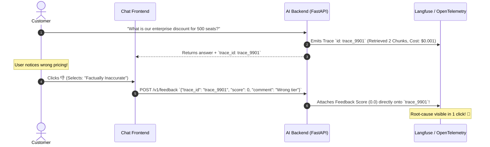
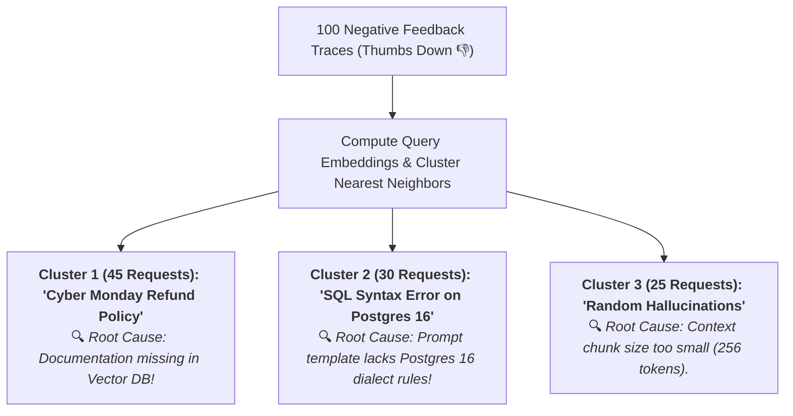

# 08 - AI Observability & Tracing: Continuous Quality Monitoring

> **Mental Model**:  
> Think of Production AI Observability like an **Air Traffic Radar and Flight Operations Telemetry Center**:  
> * **The Pre-Flight Illusion**: Passing 500 Golden benchmark tests in CI/CD is like certifying a plane on the ground. But once the aircraft takes flight, **50,000 real human passengers** introduce unexpected weather, strange requests, and edge-case turbulence!  
> * **Continuous Flight Telemetry (Real-Time AI Observability)**: You track every millisecond of altitude (Latency), fuel consumption (Token Costs), and passenger reactions (**User Thumbs Up / Down**) in real time.  
> * When a user clicks **`Thumbs Down 👎`**, the system instantly pulls the exact **Black Box Trace**, pinpointing the exact vector search or prompt span that failed!

---

## 📑 Table of Contents
1. [The Continuous Quality Monitoring Pipeline](#1-the-continuous-quality-monitoring-pipeline)
2. [Correlating User Feedback (Thumbs Up/Down) to Traces](#2-correlating-user-feedback-thumbs-updown-to-traces)
3. [Failure Clustering & Real-Time Topic Drift Detection](#3-failure-clustering--real-time-topic-drift-detection)
4. [Real-Time Operational Alerting & PagerDuty SLA Gates](#4-real-time-operational-alerting--pagerduty-sla-gates)
5. [Building a Production Telemetry & Feedback Engine in Python](#5-building-a-production-telemetry--feedback-engine-in-python)
6. [Master Cheat Sheet & Reference Table](#6-master-cheat-sheet--reference-table)

---

## 1. The Continuous Quality Monitoring Pipeline

```mermaid
flowchart TD
    User["Live Production User Traffic"] --> Gateway["FastAPI AI Gateway"]
    
    Gateway --> Tracing["<b>OpenTelemetry Instrumentation:</b><br>Generates Trace ID & Spans for Retrieval, LLM & Guardrails"]
    
    Gateway --> UI["User Receives Answer + Interactive Feedback Buttons 👍 👎"]
    
    UI -->|Feedback Event: 👎 (Reason: 'Wrong Price')| Ingest["<b>Feedback Ingestion Service</b><br>Correlates feedback directly with Trace ID!"]
    
    Ingest --> Cluster["<b>Failure Clustering Engine</b><br>Groups low-performing traces to detect topic blindspots"]
    
    Cluster --> Alert["🚨 PagerDuty Alert if failure rate > 5% / hour!"]
```

---

## 2. Correlating User Feedback (Thumbs Up/Down) to Traces

> 💡 **The Single-Click Root Cause:**  
> A user clicking `Thumbs Down 👎` is useless unless you can inspect the exact prompt, retrieved context chunks, and model generation that produced the error.



---

## 3. Failure Clustering & Real-Time Topic Drift Detection

When users start asking questions about an unannounced feature or updated company policy, individual failures group into **Semantic Failure Clusters**:



---

## 4. Real-Time Operational Alerting & PagerDuty SLA Gates

| Metric / Alert Trigger | Threshold Condition | Engineering Severity | Action Taken |
| :--- | :--- | :---: | :--- |
| **Negative Feedback Rate** | $> 8.0\%$ in trailing 60 mins | 🔴 **High (P1)** | Alert On-Call; investigate failure clusters. |
| **Time-To-First-Token (TTFT)** | P95 Latency $> 800\text{ms}$ | 🟡 **Medium (P2)** | Inspect regional edge caches & model API latency. |
| **Provider Fallback Spike** | Failover rate $> 5.0\%$ | 🔴 **High (P1)** | Primary provider outage detected; switch primary. |
| **Guardrail Block Spikes** | Injection blocks $> 15\%$ | 🟠 **Security (P1)**| Possible coordinated prompt injection attack. |

---

## 5. Building a Production Telemetry & Feedback Engine in Python

Here is a complete, runnable script implementing request tracing, user feedback ingestion, and real-time failure cluster tracking:

```python
from dataclasses import dataclass, field
from typing import Dict, List, Optional
import time
import uuid

@dataclass
class ProductionTrace:
    trace_id: str
    user_query: str
    model_name: str
    latency_ms: float
    token_cost_usd: float
    user_feedback_score: Optional[int] = None # 1 = 👍, 0 = 👎
    feedback_comment: Optional[str] = None
    created_at: float = field(default_factory=time.time)

class ProductionObservabilityHub:
    def __init__(self):
        self.traces: Dict[str, ProductionTrace] = {}

    def log_request(self, user_query: str, model_name: str, latency_ms: float, cost: float) -> str:
        """Logs initial request telemetry and returns trace_id."""
        trace_id = f"trace_{uuid.uuid4().hex[:8]}"
        trace = ProductionTrace(
            trace_id=trace_id,
            user_query=user_query,
            model_name=model_name,
            latency_ms=latency_ms,
            token_cost_usd=cost
        )
        self.traces[trace_id] = trace
        print(f"📡 [TELEMETRY] Logged `{trace_id}` | Query: '{user_query}' | Latency: {latency_ms}ms")
        return trace_id

    def ingest_user_feedback(self, trace_id: str, score: int, comment: str = ""):
        """Correlates user thumbs up/down directly with the execution trace."""
        trace = self.traces.get(trace_id)
        if not trace:
            print(f"⚠️ Trace `{trace_id}` not found!")
            return

        trace.user_feedback_score = score
        trace.feedback_comment = comment
        icon = "👍 Positive" if score == 1 else "👎 Negative"
        print(f"🗳️ [FEEDBACK ATTACHED] `{trace_id}` ➔ {icon} | Comment: '{comment}'")

        # Check for Alert Condition (Negative feedback trigger)
        if score == 0:
            print(f"  🚨 [OPS ALERT] Negative feedback logged for trace `{trace_id}`! Query: '{trace.user_query}'")

    def generate_health_summary(self) -> dict:
        total = len(self.traces)
        if total == 0:
            return {"total_requests": 0}

        rated_traces = [t for t in self.traces.values() if t.user_feedback_score is not None]
        positive_count = sum(1 for t in rated_traces if t.user_feedback_score == 1)
        satisfaction_pct = (positive_count / max(1, len(rated_traces))) * 100.0

        avg_latency = sum(t.latency_ms for t in self.traces.values()) / total
        total_cost = sum(t.token_cost_usd for t in self.traces.values())

        return {
            "total_requests": total,
            "rated_requests": len(rated_traces),
            "user_satisfaction_rate": f"{satisfaction_pct:.1f}%",
            "avg_latency_ms": round(avg_latency, 2),
            "total_spend_usd": f"${total_cost:.5f}"
        }

# --- Test Observability Engine ---
def test_observability():
    hub = ProductionObservabilityHub()

    # 1. Normal Request
    t1 = hub.log_request("How do I reset password?", "gpt-4o-mini", 180.0, 0.00012)
    hub.ingest_user_feedback(t1, score=1, comment="Worked instantly!")

    # 2. Problematic Request (Hallucinated pricing)
    t2 = hub.log_request("What is the Black Friday discount rate?", "gpt-4o-mini", 310.0, 0.00018)
    hub.ingest_user_feedback(t2, score=0, comment="Gave 2022 pricing instead of current!")

    # 3. Print Live Health Dashboard
    print("\n" + "="*65)
    print("📊 [LIVE AI SYSTEM HEALTH DASHBOARD]")
    print(hub.generate_health_summary())
    print("="*65)

# Run Test:
# test_observability()
```

---

## 6. Master Cheat Sheet & Reference Table

| Telemetry Element | Standard Key | Purpose |
| :--- | :--- | :--- |
| **Trace Identifier** | `trace_id` | Uniquely tracks the full request lifecycle from client to DB. |
| **User Feedback** | `feedback.score` ($1$ or $0$) | Ground truth human signal for detecting production regressions. |
| **Negative Alert SLA** | $> 8\%$ Negative per hour | Triggers PagerDuty to inspect failing vector/prompt clusters. |
| **Failure Clustering** | Nearest Neighbor Groups | Uncovers missing documentation topics in real time. |

---

## 🎯 Next Step in Phase 10
Now that you have mastered continuous AI observability, feedback ingestion, and failure clustering, we will advance to **[09 - Reliability Engineering](file:///home/user2/PythonProject/Python-for-ai-engineering/10-evaluation-reliability/09-reliability-engineering)** to master Chaos Engineering for AI, simulated provider outages, and stress testing!
