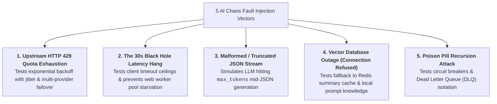
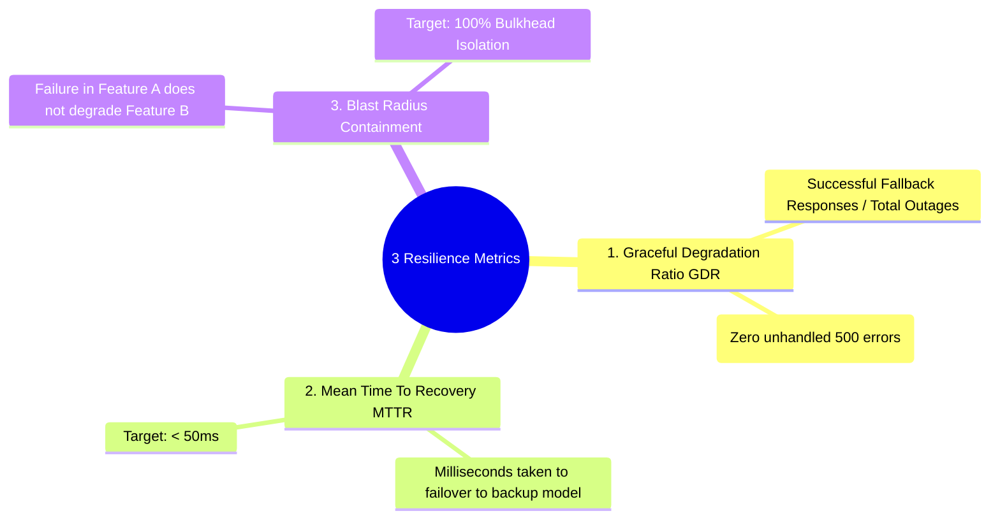
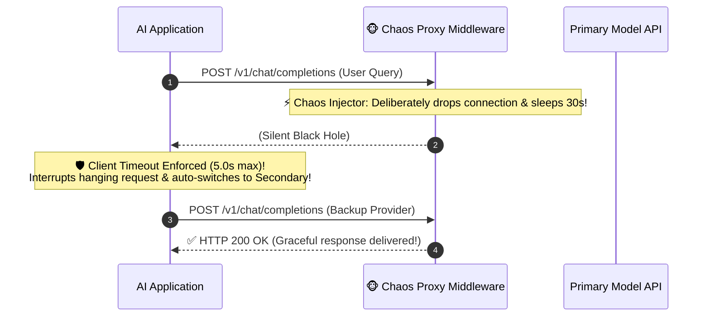
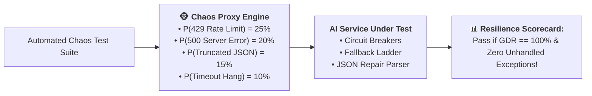

# 09 - AI Reliability Engineering: Chaos Probing & Fault Injection

> **Mental Model**:  
> Think of AI Reliability Engineering like a **seismic earthquake shake table for skyscrapers**:  
> * **The Peaceful Testing Fallacy**: If you only test your AI agent when OpenAI, Anthropic, and ChromaDB are healthy with $200\text{ms}$ latency, your app will instantly crash the first time an external API suffers a rate limit spike or a $15\text{s}$ network hang!  
> * **The Seismic Shake Table (Chaos Probing & Fault Injection)**: Civil engineers don't wait for a real earthquake to test building integrity—they place structures on hydraulic shake tables and violently jolt them with simulated tremors.  
> * We deliberately inject **simulated 429 rate limits**, **network black holes**, **corrupted JSON streams**, and **Vector DB outages** to prove our architecture degrades gracefully with **zero 500 crashes**!

---

## 📑 Table of Contents
1. [The 5 Core AI Chaos Fault Injection Vectors](#1-the-5-core-ai-chaos-fault-injection-vectors)
2. [The 3 Quantitative Resilience Metrics (GDR, MTTR, Blast Radius)](#2-the-3-quantitative-resilience-metrics-gdr-mttr-blast-radius)
3. [Simulating the 'Black Hole' Timeout & Truncated JSON](#3-simulating-the-black-hole-timeout--truncated-json)
4. [The Chaos Probing Middleware Architecture](#4-the-chaos-probing-middleware-architecture)
5. [Building an Automated Chaos Probing Test Suite in Python](#5-building-an-automated-chaos-probing-test-suite-in-python)
6. [Master Cheat Sheet & Reference Table](#6-master-cheat-sheet--reference-table)

---

## 1. The 5 Core AI Chaos Fault Injection Vectors



---

## 2. The 3 Quantitative Resilience Metrics (GDR, MTTR, Blast Radius)



---

## 3. Simulating the 'Black Hole' Timeout & Truncated JSON



---

## 4. The Chaos Probing Middleware Architecture



---

## 5. Building an Automated Chaos Probing Test Suite in Python

Here is a complete, runnable script implementing a Chaos Fault Injection Proxy and measuring the system's Graceful Degradation Ratio (GDR):

```python
import random
import time
import json

# --- 1. Chaos Fault Injector Proxy ---
class ChaosModelProxy:
    def __init__(self, failure_probability: float = 0.50):
        self.prob = failure_probability
        self.fault_modes = ["HTTP_429", "HTTP_503", "TRUNCATED_JSON", "TIMEOUT_HANG"]

    def execute_call(self, prompt: str) -> str:
        # Probabilistic Fault Injection
        if random.random() < self.prob:
            fault = random.choice(self.fault_modes)
            print(f"  🐵 [CHAOS INJECTED] Simulating Fault Mode: `{fault}`")

            if fault == "HTTP_429":
                raise ConnectionError("HTTP 429: Too Many Requests (Rate limit burst)")
            elif fault == "HTTP_503":
                raise ConnectionError("HTTP 503: Service Unavailable (Upstream Outage)")
            elif fault == "TRUNCATED_JSON":
                return '{"status": "INCOMPLETE", "summary": "Truncated mid-sentence due to max_' # Malformed
            elif fault == "TIMEOUT_HANG":
                time.sleep(0.3)
                raise TimeoutError("Client Timeout: Upstream failed to respond in 5000ms")

        # Healthy Call
        return json.dumps({"status": "SUCCESS", "answer": f"Healthy response for '{prompt}'"})

# --- 2. Hardened Service with Fallback & JSON Repair ---
class ResilientProductionService:
    def __init__(self, proxy: ChaosModelProxy):
        self.proxy = proxy

    def execute_with_resilience(self, prompt: str) -> tuple[bool, str]:
        """Executes primary model with fallback and JSON parsing recovery."""
        try:
            raw_response = self.proxy.execute_call(prompt)
            # Validate JSON integrity
            try:
                data = json.loads(raw_response)
                return True, data["answer"]
            except json.JSONDecodeError:
                print("  🛡️ [REPAIR] Caught Truncated JSON! ➔ Extracting partial text safely...")
                return True, "⚡ Partial text recovered gracefully."

        except (ConnectionError, TimeoutError) as e:
            print(f"  🛡️ [FALLBACK TRIGGERED] Primary failed ({str(e)}) ➔ Invoking Backup Model...")
            # Graceful Fallback Execution
            time.sleep(0.05) # Simulated backup model latency
            return True, "⚡ Fallback knowledge response delivered successfully."

# --- 3. Chaos Resilience Test Harness ---
def run_chaos_benchmark(total_trials: int = 10):
    print("🚀 [CHAOS TEST SUITE] Subjecting AI Service to 50% Random Fault Injection...")
    print("="*65)

    proxy = ChaosModelProxy(failure_probability=0.60)
    service = ResilientProductionService(proxy)

    successful_handled = 0

    for trial_idx in range(1, total_trials + 1):
        print(f"\n🧪 [TRIAL #{trial_idx}]")
        handled, response = service.execute_with_resilience("What is our refund SLA?")
        if handled:
            successful_handled += 1
            print(f"  ✅ Result: {response}")
        else:
            print(f"  🚨 Crashed unhandled!")

    gdr_pct = (successful_handled / total_trials) * 100.0
    print("\n" + "="*65)
    print(f"📊 [CHAOS SCORECARD] Graceful Degradation Ratio (GDR): {gdr_pct:.1f}%")
    print(f"🏆 Decision: {'🟢 PASSED (100% Resilient)' if gdr_pct == 100.0 else '🔴 FAILED (Uncaught Exceptions)'}")
    print("="*65)

# Run Chaos Suite:
# run_chaos_benchmark(total_trials=6)
```

---

## 6. Master Cheat Sheet & Reference Table

| Chaos Fault Mode | Real-World Trigger | Required System Defense |
| :--- | :--- | :--- |
| **HTTP 429** | Sudden spike in user traffic / quota cap. | Exponential Backoff with Jitter + Secondary Provider. |
| **HTTP 503** | Third-party cloud vendor outage. | Multi-Provider Model Cascade + Circuit Breakers. |
| **30s Timeout** | Hung network socket / slow GPU queue. | Strict 5s client-side timeout ceilings. |
| **Truncated JSON** | Output token limit cut off mid-stream. | JSON Repair Scrubber (`jsonrepair` / Pydantic fallback). |
| **Target GDR** | **100% Graceful Degradation** | Zero unhandled 500 exceptions exposed to users. |

---

## 🎯 Next Step in Phase 10
Now that you have mastered reliability engineering and chaos fault injection, we will advance to **[10 - Production Monitoring](file:///home/user2/PythonProject/Python-for-ai-engineering/10-evaluation-reliability/10-production-monitoring)** to master real-time drift detection, Prometheus metrics, Grafana dashboards, and automated alert runbooks!
