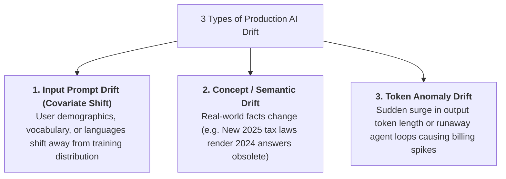
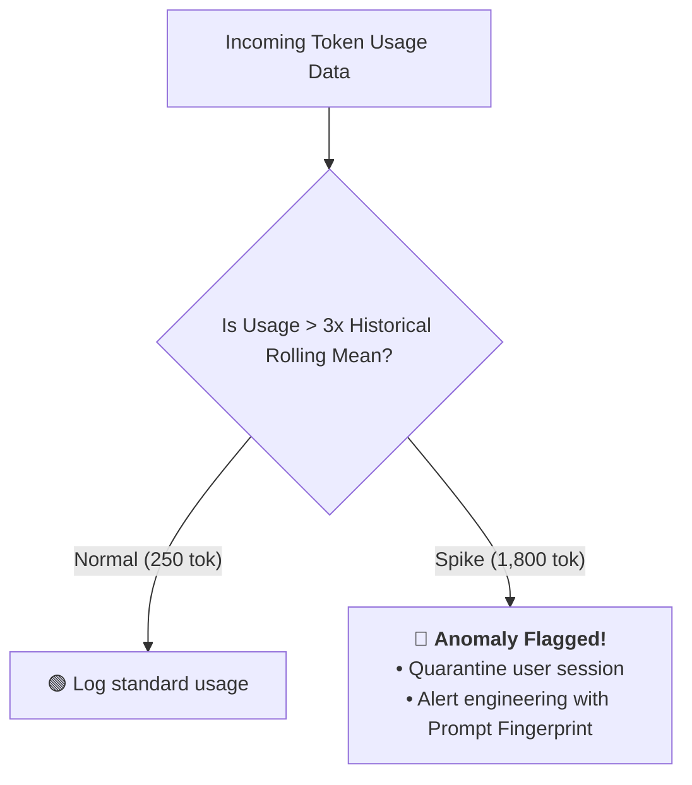
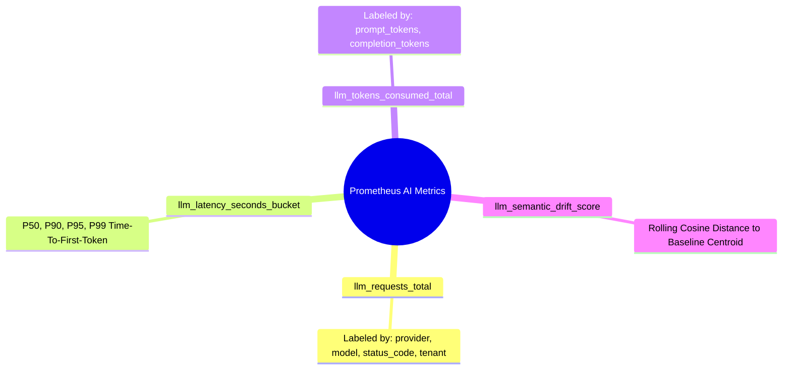

# 10 - AI Production Monitoring: Semantic Drift & Token Anomalies

> **Mental Model**:  
> Think of Production AI Monitoring like a **submarine's deep-sea sonar and oceanic current navigation radar**:  
> * **The Traditional Server Blindspot**: Monitoring *only* CPU usage and HTTP 500 error rates. Everything shows green (`CPU: 18%`, `HTTP 200 OK`), yet the AI system is quietly failing because the **underlying meaning of user conversations has drifted into dangerous territory**!  
> * **The Deep-Sea Current Radar (Semantic Drift & Token Telemetry)**: You track the invisible currents:  
>   * Are users suddenly asking about a completely new competitor (**Input Prompt Drift**)?  
>   * Are answers becoming 3x longer and burning 5x more tokens (**Token Anomaly Drift**)?  
>   * Has the embedding center point drifted by $>15\%$ (**Semantic Centroid Drift**)?

---

## 📑 Table of Contents
1. [The 3 Types of AI Drift: Input, Concept & Token](#1-the-3-types-of-ai-drift-input-concept--token)
2. [Tracking Semantic Drift with Embedding Centroids](#2-tracking-semantic-drift-with-embedding-centroids)
3. [Token Consumption Anomaly Detection (Runaway Loop Alarms)](#3-token-consumption-anomaly-detection-runaway-loop-alarms)
4. [The 4 Golden AI Metrics for Prometheus & Grafana](#4-the-4-golden-ai-metrics-for-prometheus--grafana)
5. [Building a Production Drift & Token Monitor in Python](#5-building-a-production-drift--token-monitor-in-python)
6. [Master Cheat Sheet & Reference Table](#6-master-cheat-sheet--reference-table)

---

## 1. The 3 Types of AI Drift: Input, Concept & Token



---

## 2. Tracking Semantic Drift with Embedding Centroids

How do you detect topic shifts across millions of unstructured text prompts without manual labeling?

```mermaid
flowchart LR
    Baseline["<b>Baseline Distribution (10,000 Prompts)</b><br>• Average Centroid $\vec{C}_{\text{base}}$<br>(Topics: Passwords, Login, Billing)"] 
    <-->|Cosine Distance Comparison| 
    Live["<b>Rolling Window (Last 1,000 Prompts)</b><br>• Current Centroid $\vec{C}_{\text{live}}$<br>(Topics: Cyber Monday Outage, Refunds)"]
    
    Live --> Delta{"Distance > 0.15?"}
    Delta -- Yes --> Alert["🚨 <b>Semantic Drift Alert:</b> New topic cluster detected!"]
    Delta -- No --> Normal["🟢 Normal Topical Stability"]
```

---

## 3. Token Consumption Anomaly Detection (Runaway Loop Alarms)

> 🚨 **The 3x Token Surging Alarm:**  
> If an AI feature normally consumes $250$ completion tokens, but suddenly spikes to $1,800$ tokens across 500 users, an agent is stuck in an exploratory loop or the prompt template lost its conciseness instructions!



---

## 4. The 4 Golden AI Metrics for Prometheus & Grafana



---

## 5. Building a Production Drift & Token Monitor in Python

Here is a complete, runnable script tracking embedding centroid drift and flagging token consumption anomalies in real time:

```python
import numpy as np
from dataclasses import dataclass
from typing import List, Dict

@dataclass
class PromptRecord:
    prompt_text: str
    tokens_consumed: int
    vector: np.ndarray

class ProductionAIMonitor:
    def __init__(self, historical_baseline_vectors: List[np.ndarray], expected_avg_tokens: int = 250):
        # 1. Compute Historical Baseline Centroid
        self.baseline_centroid = np.mean(historical_baseline_vectors, axis=0)
        self.baseline_centroid /= np.linalg.norm(self.baseline_centroid)
        
        self.expected_avg_tokens = expected_avg_tokens
        self.recent_records: List[PromptRecord] = []

    def _mock_embed(self, text: str) -> np.ndarray:
        np.random.seed(abs(hash(text)) % (2**32))
        v = np.random.randn(8)
        return v / np.linalg.norm(v)

    def record_inference(self, prompt: str, tokens_used: int) -> dict:
        vec = self._mock_embed(prompt)
        record = PromptRecord(prompt_text=prompt, tokens_consumed=tokens_used, vector=vec)
        self.recent_records.append(record)

        # 1. Token Anomaly Check (Usage > 3x mean)
        is_token_anomaly = tokens_used > (self.expected_avg_tokens * 3)

        # 2. Compute Rolling Semantic Drift (If >= 3 samples)
        drift_distance = 0.0
        drift_alert = False
        if len(self.recent_records) >= 3:
            recent_vectors = [r.vector for r in self.recent_records[-10:]]
            current_centroid = np.mean(recent_vectors, axis=0)
            current_centroid /= np.linalg.norm(current_centroid)

            # Cosine distance: 1.0 - (dot product)
            similarity = float(np.dot(self.baseline_centroid, current_centroid))
            drift_distance = round(1.0 - similarity, 4)
            drift_alert = drift_distance > 0.20

        return {
            "prompt": prompt,
            "tokens_used": tokens_used,
            "is_token_anomaly": is_token_anomaly,
            "drift_distance": drift_distance,
            "drift_alert": drift_alert
        }

# --- Test Production Monitor ---
def test_monitoring():
    # 1. Baseline Vectors (Normal topics)
    baseline_vecs = [np.random.randn(8) for _ in range(20)]
    for v in baseline_vecs:
        v /= np.linalg.norm(v)

    monitor = ProductionAIMonitor(baseline_vecs, expected_avg_tokens=200)

    print("🚀 [TEST 1] Normal Request:")
    res1 = monitor.record_inference("How to update billing credit card?", tokens_used=180)
    print("Result:", res1, "\n")

    print("🚀 [TEST 2] Runaway Token Anomaly Request (1,200 tokens):")
    res2 = monitor.record_inference("Generate extensive SQL report with 50 joins", tokens_used=1200)
    print("Result:", res2)
    if res2["is_token_anomaly"]:
        print("  🚨 [ALERT] Runaway token consumption detected (>3x baseline)!")

# Run Test:
# test_monitoring()
```

---

## 6. Master Cheat Sheet & Reference Table

| Monitoring Domain | Telemetry Indicator | Action Threshold |
| :--- | :--- | :--- |
| **Semantic Drift** | Centroid Cosine Distance | Alert if distance $> 0.15$ compared to baseline centroid. |
| **Token Anomalies** | Single request token usage | Flag if $> 3\times$ historical moving average. |
| **Latency Degradation** | P99 Time-To-First-Token | Alert if P99 $> 1,200\text{ms}$ in 15-minute window. |
| **Error Burst** | Upstream 429/503 status count| Alert if $> 2\%$ of total requests fail. |

---

## 🎯 Next Step in Phase 10
Now that you have mastered production monitoring and semantic drift detection, we will advance to the final topic of Phase 10: **[11 - Evaluation & Release Pipeline](file:///home/user2/PythonProject/Python-for-ai-engineering/10-evaluation-reliability/11-evaluation-release-pipeline)** to master building automated pre-merge evaluation gates and continuous deployment pipelines!
