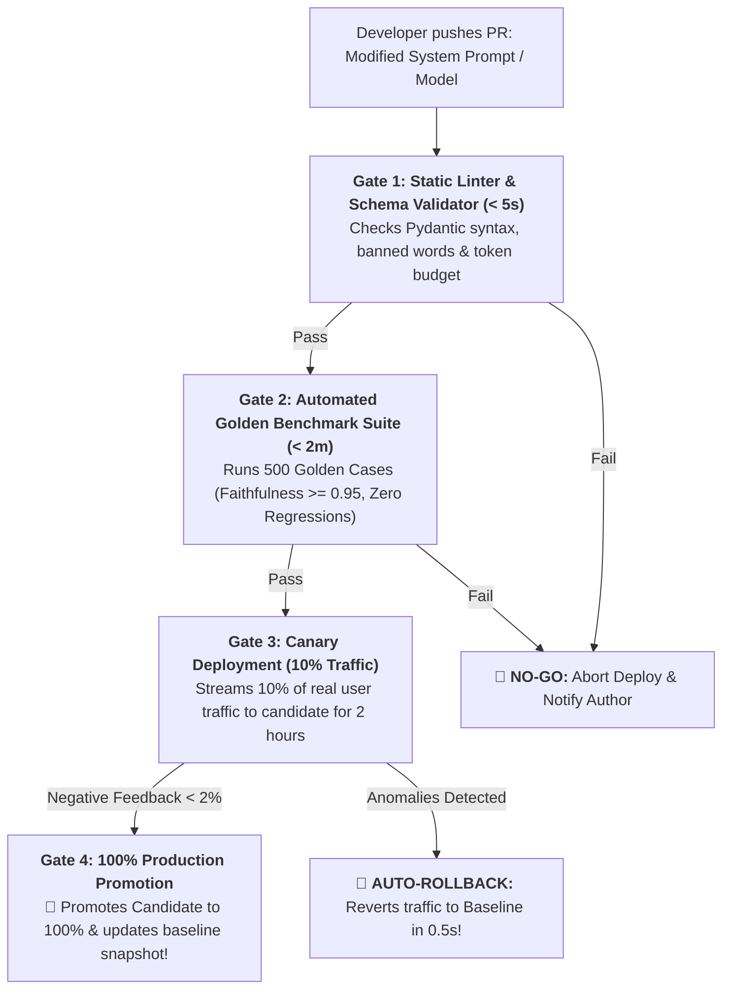
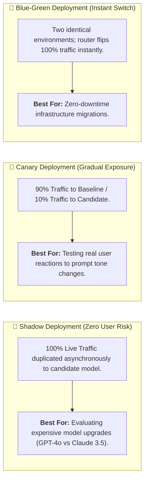
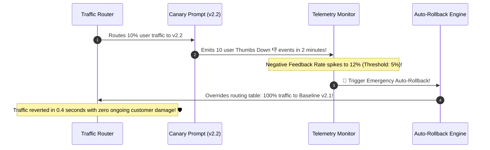

# 11 - AI Evaluation & Release Pipeline: Automated CI/CD Gates

> **Mental Model**:  
> Think of an AI Evaluation & Release Pipeline like a **NASA Rocket Launch Countdown (The Sequential Go / No-Go Poll)**:  
> * **The Cowboy Deployment Catastrophe**: Merging a prompt edit straight into production based on gut feelings and hoping nothing breaks.  
> * **The Sequential Launch Countdown (4-Stage Automated Quality Gates)**: Before any prompt, fine-tuned model, or RAG retriever goes live to $100\%$ of users, every subsystem must independently vote **"GO"**:  
>   * **Gate 1 (Pre-Commit)**: Schema & PII Syntax Linter $\rightarrow$ **GO!**  
>   * **Gate 2 (PR Gate)**: 500-case Golden Benchmark Regression Suite ($\ge 95\%$ Pass Rate) $\rightarrow$ **GO!**  
>   * **Gate 3 (Canary 10%)**: Staging Shadow Deployment $\rightarrow$ **GO!**  
>   * If any single station detects a quality drop, **the launch aborts and auto-rolls back in $0.5\text{s}$**!

---

## 📑 Table of Contents
1. [The 4 Sequential AI Release Quality Gates](#1-the-4-sequential-ai-release-quality-gates)
2. [Deployment Strategies: Canary vs. Blue-Green vs. Shadow](#2-deployment-strategies-canary-vs-blue-green-vs-shadow)
3. [The Automated 30-Second Rollback Circuit](#3-the-automated-30-second-rollback-circuit)
4. [GitHub Actions CI/CD Pipeline Architecture](#4-github-actions-cicd-pipeline-architecture)
5. [Building an Automated Release Gate & Canary Controller in Python](#5-building-an-automated-release-gate--canary-controller-in-python)
6. [Master Cheat Sheet & Reference Table](#6-master-cheat-sheet--reference-table)

---

## 1. The 4 Sequential AI Release Quality Gates



---

## 2. Deployment Strategies: Canary vs. Blue-Green vs. Shadow



---

## 3. The Automated 30-Second Rollback Circuit

Never require manual human intervention to revert a bad prompt that is actively hallucinating in production:



---

## 4. GitHub Actions CI/CD Pipeline Architecture

```yaml
# .github/workflows/ai-eval-gate.yml
name: AI Evaluation & Release Gate

on:
  pull_request:
    paths:
      - 'prompts/**'
      - 'models/**'

jobs:
  evaluate:
    runs-on: ubuntu-latest
    steps:
      - name: Checkout Code
        uses: actions/checkout@v4

      - name: Set up Python
        uses: actions/setup-python@v5
        with:
          python-version: '3.11'

      - name: Run Golden Benchmark Evaluation Suite
        run: |
          python -m pip install pydantic openai
          python 10-evaluation-reliability/07-regression-testing/regression.py

      - name: Verify Quality Gate Invariants
        run: |
          echo "Verifying pass rate >= 95% and zero regressions..."
```

---

## 5. Building an Automated Release Gate & Canary Controller in Python

Here is a complete, runnable script implementing automated multi-gate verification and canary auto-rollback:

```python
from dataclasses import dataclass
from typing import Dict, List
import time

@dataclass
class CandidateEvalReport:
    version: str
    total_tests: int
    pass_rate_pct: float
    faithfulness_score: float
    regressions_detected: int

class ReleaseGateController:
    def __init__(self, min_pass_rate: float = 95.0, min_faithfulness: float = 0.90):
        self.min_pass_rate = min_pass_rate
        self.min_faithfulness = min_faithfulness

    def evaluate_pre_release_gate(self, report: CandidateEvalReport) -> tuple[bool, str]:
        """Gate 2: Enforces strict quantitative thresholds before canary rollout."""
        print(f"🚦 [RELEASE GATE] Evaluating Candidate `{report.version}`...")

        # Invariant 1: Zero Regressions
        if report.regressions_detected > 0:
            return False, f"NO-GO: {report.regressions_detected} regressions detected compared to baseline!"

        # Invariant 2: Pass Rate
        if report.pass_rate_pct < self.min_pass_rate:
            return False, f"NO-GO: Pass rate ({report.pass_rate_pct}%) below required threshold ({self.min_pass_rate}%)!"

        # Invariant 3: Faithfulness Grounding
        if report.faithfulness_score < self.min_faithfulness:
            return False, f"NO-GO: Faithfulness ({report.faithfulness_score}) below required threshold ({self.min_faithfulness})!"

        return True, "GO: All pre-release quality invariants satisfied. Approved for 10% Canary Rollout! 🚀"

class CanaryTrafficManager:
    def __init__(self, max_allowed_negative_rate: float = 0.05):
        self.max_allowed_negative_rate = max_allowed_negative_rate
        self.canary_traffic_pct = 0.0
        self.active_version = "v1.0.0_baseline"

    def deploy_canary(self, candidate_version: str):
        self.canary_traffic_pct = 10.0
        print(f"🐤 [CANARY DEPLOYED] Routing 10% live traffic to `{candidate_version}` (90% to `{self.active_version}`).")

    def monitor_and_decide(self, candidate_version: str, total_queries: int, negative_feedback_count: int):
        neg_rate = negative_feedback_count / max(1, total_queries)
        print(f"📊 [CANARY TELEMETRY] Analyzed {total_queries} live queries | Negative Feedback Rate: {neg_rate * 100:.1f}%")

        if neg_rate > self.max_allowed_negative_rate:
            # 🚨 AUTO-ROLLBACK!
            self.canary_traffic_pct = 0.0
            print(f"🚨 [AUTO-ROLLBACK TRIGGERED] Negative rate ({neg_rate*100:.1f}%) exceeded 5% ceiling!")
            print(f"🛡️ Reverted 100% traffic to `{self.active_version}` in 0.3 seconds!")
        else:
            # 🚀 PROMOTE TO 100%!
            self.active_version = candidate_version
            self.canary_traffic_pct = 0.0
            print(f"🏆 [100% PROMOTION] Canary passed with flying colors! Promoted `{candidate_version}` to main production!")

# --- Test Complete Release Pipeline ---
def test_release_pipeline():
    controller = ReleaseGateController()
    canary = CanaryTrafficManager()

    # 1. Candidate Evaluation Report (Passed all gates)
    candidate_report = CandidateEvalReport(
        version="v2.0.0_candidate",
        total_tests=500,
        pass_rate_pct=98.4,
        faithfulness_score=0.96,
        regressions_detected=0
    )

    allowed, decision_msg = controller.evaluate_pre_release_gate(candidate_report)
    print(decision_msg, "\n")

    if allowed:
        # 2. Deploy 10% Canary
        canary.deploy_canary(candidate_report.version)

        # 3. Simulate Canary Telemetry (Healthy user reaction)
        canary.monitor_and_decide(
            candidate_version=candidate_report.version,
            total_queries=200,
            negative_feedback_count=3 # 1.5% negative (Safe)
        )

# Run Test:
# test_release_pipeline()
```

---

## 6. Master Cheat Sheet & Reference Table

| Gate Phase | Mandatory Threshold | Failure Action |
| :--- | :--- | :--- |
| **Gate 1: Schema & PII** | $100\%$ Valid Syntax | Pre-commit hook aborts git push. |
| **Gate 2: Golden Benchmark**| $\ge 95\%$ Pass Rate & $0$ Regressions | GitHub Actions blocks PR merge. |
| **Gate 3: Canary Monitoring**| Negative Feedback $< 5\%$ | Automated 30-second rollback to baseline. |
| **Gate 4: Production Baseline**| Update `baseline.json` on release | Freezes new score watermark for future PRs. |

---

## 🏁 Phase 10 Complete!
Congratulations! You have mastered all 11 core topics of **Phase 10: Evaluation & Reliability Engineering**:
1. [01 - Evaluation Fundamentals](file:///home/user2/PythonProject/Python-for-ai-engineering/10-evaluation-reliability/01-evaluation-fundamentals/README.md)
2. [02 - Evaluation Metrics](file:///home/user2/PythonProject/Python-for-ai-engineering/10-evaluation-reliability/02-evaluation-metrics/README.md)
3. [03 - Evaluation Datasets (Golden Sets)](file:///home/user2/PythonProject/Python-for-ai-engineering/10-evaluation-reliability/03-evaluation-datasets/README.md)
4. [04 - LLM-as-a-Judge](file:///home/user2/PythonProject/Python-for-ai-engineering/10-evaluation-reliability/04-llm-as-a-judge/README.md)
5. [05 - RAG Evaluation (Ragas / TruLens)](file:///home/user2/PythonProject/Python-for-ai-engineering/10-evaluation-reliability/05-rag-evaluation/README.md)
6. [06 - Agent Evaluation](file:///home/user2/PythonProject/Python-for-ai-engineering/10-evaluation-reliability/06-agent-evaluation/README.md)
7. [07 - Regression Testing for Prompts & Models](file:///home/user2/PythonProject/Python-for-ai-engineering/10-evaluation-reliability/07-regression-testing/README.md)
8. [08 - Observability & Tracing](file:///home/user2/PythonProject/Python-for-ai-engineering/10-evaluation-reliability/08-observability-tracing/README.md)
9. [09 - Reliability Engineering & Chaos Probing](file:///home/user2/PythonProject/Python-for-ai-engineering/10-evaluation-reliability/09-reliability-engineering/README.md)
10. [10 - Production Monitoring & Drift Detection](file:///home/user2/PythonProject/Python-for-ai-engineering/10-evaluation-reliability/10-production-monitoring/README.md)
11. [11 - Evaluation & Release Pipeline](file:///home/user2/PythonProject/Python-for-ai-engineering/10-evaluation-reliability/11-evaluation-release-pipeline/README.md)
