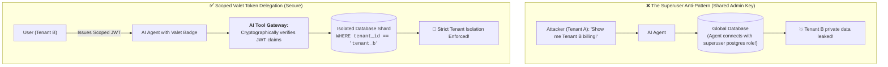
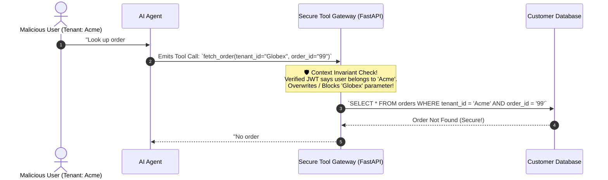

# 06 - AI Authentication & Tenant Authorization: Scoped Tokens & RBAC

> **Mental Model**:  
> Think of AI Authentication & Authorization like a **hotel security keycard and a car valet key**:  
> * **The Superuser Backend Fallacy**: If your AI service uses a single global API key with admin rights to all customer data, any prompt injection allows an attacker to query and mutate records across all tenants!  
> * **The Scoped Valet Key (Agent Token Delegation)**: When a user logs into your AI chat, they hand the AI agent a **temporary, scoped JWT valet key**:  
>   * It explicitly stamps the user's **`tenant_id: org_acme`** and **`roles: ["viewer"]`**.  
>   * The agent cannot open rooms it doesn't have a badge for.  
> * **The Cardinal Invariant**: **NEVER allow the LLM to supply the `tenant_id` parameter!** The backend extracts tenant identity directly from the cryptographically signed JWT token!

---

## 📑 Table of Contents
1. [The Superuser Fallacy vs. Scoped Agent Delegation](#1-the-superuser-fallacy-vs-scoped-agent-delegation)
2. [Anatomy of an AI-Scoped JWT Token](#2-anatomy-of-an-ai-scoped-jwt-token)
3. [The Cardinal Law: Cryptographic Context Invariant Injection](#3-the-cardinal-law-cryptographic-context-invariant-injection)
4. [Fine-Grained Role-Based Access Control (RBAC) for AI Tools](#4-fine-grained-role-based-access-control-rbac-for-ai-tools)
5. [Building a Secure JWT Auth & Invariant Injector in Python](#5-building-a-secure-jwt-auth--invariant-injector-in-python)
6. [Master Cheat Sheet & Reference Table](#6-master-cheat-sheet--reference-table)

---

## 1. The Superuser Fallacy vs. Scoped Agent Delegation



---

## 2. Anatomy of an AI-Scoped JWT Token

A production AI JWT contains explicit identity, tenant boundary, and permitted tool permissions:

```json
{
  "sub": "usr_99402",
  "tenant_id": "org_acme_corp",
  "roles": ["support_agent"],
  "allowed_tools": [
    "search_knowledge_base",
    "issue_customer_credit"
  ],
  "tool_constraints": {
    "max_credit_usd": 50.00
  },
  "exp": 1740000000
}
```

---

## 3. The Cardinal Law: Cryptographic Context Invariant Injection

> 🚨 **The LLM Parameter Spoofing Attack:**  
> An attacker prompts the model: *"Check status for customer #123 on tenant 'competitor_corp'"*.  
> If your tool function accepts `def get_customer(tenant_id, customer_id)`, the LLM will pass `"competitor_corp"`.  
> **Always inject `tenant_id` server-side from the verified JWT context, completely ignoring whatever string the LLM emitted!**



---

## 4. Fine-Grained Role-Based Access Control (RBAC) for AI Tools

| User Role | Permitted Tool Names | Parameter Restrictions |
| :--- | :--- | :--- |
| **Guest / Public** | `search_faq()`, `get_pricing()` | Read-only public knowledge base. |
| **Support Agent** | `search_tickets()`, `issue_refund()` | `refund_amount <= $50.00`. |
| **Finance Manager**| `search_tickets()`, `issue_refund()`, `export_csv()` | `refund_amount <= $5,000.00`. |
| **System Admin** | `manage_users()`, `full_audit_log()` | All tools permitted with MFA. |

---

## 5. Building a Secure JWT Auth & Invariant Injector in Python

Here is a complete, runnable script implementing JWT verification, role-based tool authorization, and deterministic tenant parameter overrides:

```python
import hmac
import hashlib
import json
import base64
from typing import Dict, Any, List

JWT_SECRET = "super_secure_production_secret_key_9901"

# --- 1. Mock JWT Helpers ---
def create_mock_jwt(payload: dict) -> str:
    header = {"alg": "HS256", "typ": "JWT"}
    h_b64 = base64.urlsafe_b64encode(json.dumps(header).encode()).decode().rstrip("=")
    p_b64 = base64.urlsafe_b64encode(json.dumps(payload).encode()).decode().rstrip("=")
    sig = hmac.new(JWT_SECRET.encode(), f"{h_b64}.{p_b64}".encode(), hashlib.sha256).hexdigest()
    return f"{h_b64}.{p_b64}.{sig}"

def verify_mock_jwt(token: str) -> dict:
    parts = token.split(".")
    if len(parts) != 3:
        raise PermissionError("Malformed JWT token.")
    h_b64, p_b64, sig = parts
    expected_sig = hmac.new(JWT_SECRET.encode(), f"{h_b64}.{p_b64}".encode(), hashlib.sha256).hexdigest()
    if not hmac.compare_digest(sig, expected_sig):
        raise PermissionError("Invalid cryptographic signature.")
    
    # Pad base64
    p_b64 += "=" * ((4 - len(p_b64) % 4) % 4)
    return json.loads(base64.urlsafe_b64decode(p_b64.encode()).decode())

# --- 2. Secure Auth Gateway & Invariant Injector ---
class SecureAIAuthGateway:
    def __init__(self):
        # Tool RBAC Policies
        self.tool_permissions = {
            "search_kb": ["viewer", "support_agent", "admin"],
            "issue_refund": ["support_agent", "admin"],
            "delete_tenant_data": ["admin"]
        }

    def execute_agent_tool(self, user_jwt_token: str, tool_name: str, llm_generated_args: Dict[str, Any]) -> str:
        # Step 1: Verify JWT
        user_claims = verify_mock_jwt(user_jwt_token)
        user_id = user_claims["sub"]
        tenant_id = user_claims["tenant_id"]
        user_roles = user_claims["roles"]

        print(f"\n🔐 [AUTH GATEWAY] Request by `{user_id}` (Tenant: `{tenant_id}`, Roles: {user_roles})")
        print(f"  Attempting tool: `{tool_name}` with raw LLM args: {llm_generated_args}")

        # Step 2: RBAC Check (Does user have required role?)
        allowed_roles = self.tool_permissions.get(tool_name, [])
        if not any(r in allowed_roles for r in user_roles):
            print(f"  🛑 [RBAC DENIED] User lacks permission for `{tool_name}`!")
            return f"Error 403: Forbidden - Role insufficient for `{tool_name}`."

        # Step 3: Hard Context Invariant Injection (OVERRIDE tenant_id)
        # Even if LLM attempted to pass tenant_id="competitor", we strictly force verified tenant_id!
        safe_args = dict(llm_generated_args)
        if "tenant_id" in safe_args and safe_args["tenant_id"] != tenant_id:
            print(f"  🛡️ [SPOOF PREVENTED] LLM tried to query `{safe_args['tenant_id']}`! Overriding with verified `{tenant_id}`!")
        
        safe_args["tenant_id"] = tenant_id # Cryptographic guarantee

        # Step 4: Execute Business Logic
        if tool_name == "issue_refund":
            amount = safe_args.get("amount", 0)
            return f"✅ Success: Processed ${amount} refund for tenant `{tenant_id}` (User: {user_id})."
        elif tool_name == "search_kb":
            return f"✅ Success: Searched private KB for tenant `{tenant_id}`."
        return "Tool executed."

# --- Test Auth Pipeline ---
def test_ai_auth():
    gateway = SecureAIAuthGateway()

    # 1. Normal Support Agent Token
    agent_token = create_mock_jwt({
        "sub": "usr_alice",
        "tenant_id": "acme_corp",
        "roles": ["support_agent"]
    })

    # Test 1: Valid Authorized Tool Execution
    res1 = gateway.execute_agent_tool(
        user_jwt_token=agent_token,
        tool_name="issue_refund",
        llm_generated_args={"amount": 25.0}
    )
    print("Result 1:", res1)

    # Test 2: Spoofing Attempt (LLM tried to refund competitor)
    res2 = gateway.execute_agent_tool(
        user_jwt_token=agent_token,
        tool_name="issue_refund",
        llm_generated_args={"tenant_id": "competitor_org", "amount": 100.0}
    )
    print("Result 2:", res2)

    # Test 3: Unauthorized Admin Tool Attempt by Support Agent (Should fail RBAC)
    res3 = gateway.execute_agent_tool(
        user_jwt_token=agent_token,
        tool_name="delete_tenant_data",
        llm_generated_args={}
    )
    print("Result 3:", res3)

# Run Test:
# test_ai_auth()
```

---

## 6. Master Cheat Sheet & Reference Table

| Security Rule | Mechanism | Production Guarantee |
| :--- | :--- | :--- |
| **Token Delegation** | Short-lived scoped JWT | Agent acts with strictly bounded user permissions. |
| **Tenant Invariant** | Hard server-side parameter override | LLM cannot access cross-tenant data even if hijacked. |
| **Tool RBAC** | Role mapping table (`support_agent` vs `admin`)| Blocks unauthorized tool invocations at the gateway. |
| **Token Expiry** | 15-minute validity window | Minimizes window of vulnerability if token leaks. |

---

## 🎯 Next Step in Phase 11
Now that you have mastered AI authentication, token delegation, and tenant authorization invariants, we will advance to **[07 - AI Supply Chain Security](file:///home/user2/PythonProject/Python-for-ai-engineering/11-ai-security/07-ai-supply-chain-security)** to master inspecting model weights for pickle exploits, verifying HuggingFace checkpoints, and securing third-party LoRA adapters!
