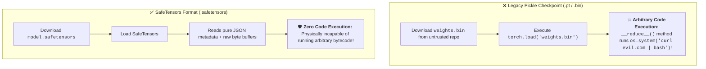
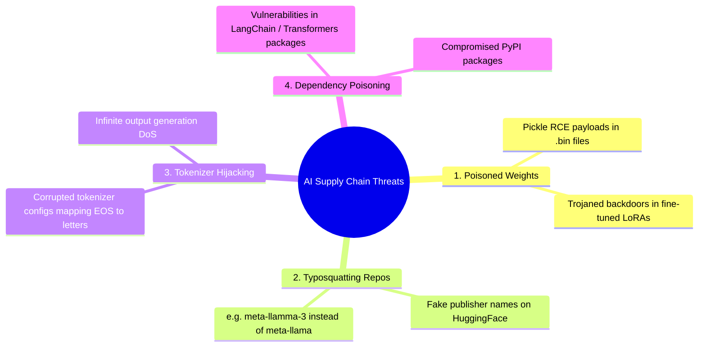
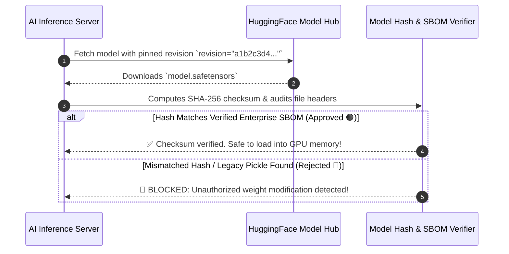

# 07 - AI Supply Chain Security: Pickle Exploits, SafeTensors & Provenance

> **Mental Model**:  
> Think of AI Supply Chain Security like **customs inspection for unverified international cargo crates**:  
> * **The Download-and-Run Trap**: Developers often treat downloading an open-weight model or LoRA adapter from HuggingFace like downloading a harmless image.  
> * **The Pickle Bomb (`.pt` / `.bin` / `.pkl`)**: Legacy PyTorch checkpoints rely on Python's `pickle` module. The moment you execute `torch.load("model.bin")`, **hidden malicious Python code inside the file executes with full server permissions**—spawning a reverse shell before the weights even hit GPU memory!  
> * **Supply Chain Verification**:  
>   1. **Mandatory SafeTensors Migration** (Pure tensor data with zero executable code capability).  
>   2. **Pinned Commit Hashes & SHA-256 Provenance**.  
>   3. **AI Software Bill of Materials (SBOM)** auditing base weights, tokenizers, and dependencies.

---

## 📑 Table of Contents
1. [The Pickle Deserialization Trap (`torch.load` RCE)](#1-the-pickle-deserialization-trap-torchload-rce)
2. [SafeTensors vs. Pickle: The Zero-Execution Invariant](#2-safetensors-vs-pickle-the-zero-execution-invariant)
3. [The 4 AI Supply Chain Attack Vectors](#3-the-4-ai-supply-chain-attack-vectors)
4. [Model Provenance, Pinned Commit SHAs & AI SBOMs](#4-model-provenance-pinned-commit-shas--ai-sboms)
5. [Building an AI Model Supply Chain Scanner in Python](#5-building-an-ai-model-supply-chain-scanner-in-python)
6. [Master Cheat Sheet & Reference Table](#6-master-cheat-sheet--reference-table)

---

## 1. The Pickle Deserialization Trap (`torch.load` RCE)



---

## 2. SafeTensors vs. Pickle: The Zero-Execution Invariant

| Feature | Legacy PyTorch Pickle (`.pt`, `.bin`) | SafeTensors (`.safetensors`) | ONNX (`.onnx`) |
| :--- | :--- | :--- | :--- |
| **Security Risk** | 🔴 **Critical (Arbitrary Code Execution)** | 🟢 **Zero Code Execution (Pure Data)** | 🟢 Safe Graph Format |
| **Load Mechanism** | Deserializes arbitrary Python objects | Memory-mapped (`mmap`) byte buffers | Protocol Buffers parser |
| **Loading Speed** | Slow CPU unpickling | ⚡ **$2\times - 5\times$ faster (Zero-copy)** | Fast compiled graph |
| **Industry Status** | Deprecated / High-Risk | **HuggingFace & Enterprise Standard** | Production cross-platform standard |

---

## 3. The 4 AI Supply Chain Attack Vectors



---

## 4. Model Provenance, Pinned Commit SHAs & AI SBOMs

> 🚨 **The 'Floating Main Branch' Vulnerability:**  
> If your code loads `AutoModel.from_pretrained("org/repo")`, an attacker who compromises the model repo can push malicious changes to `main` at midnight.  
> **Always pin the exact, immutable Git commit hash:**



---

## 5. Building an AI Model Supply Chain Scanner in Python

Here is a complete, runnable script inspecting model files for legacy pickle hazards, verifying SafeTensors headers, and computing SHA-256 provenance checksums:

```python
import hashlib
import json
import os
from typing import Dict, List, Tuple

class AISupplyChainScanner:
    def __init__(self, authorized_hashes: Dict[str, str]):
        self.authorized_hashes = authorized_hashes
        self.banned_extensions = [".bin", ".pt", ".pkl", ".pickle", ".pth"]

    def compute_sha256(self, filepath: str) -> str:
        """Computes SHA-256 hash of model file."""
        sha256 = hashlib.sha256()
        with open(filepath, "rb") as f:
            while chunk := f.read(65536):
                sha256.update(chunk)
        return sha256.hexdigest()

    def audit_model_file(self, filepath: str) -> Tuple[bool, List[str]]:
        violations = []
        filename = os.path.basename(filepath)
        ext = os.path.splitext(filename)[1].lower()

        print(f"📦 [SUPPLY CHAIN AUDIT] Inspecting `{filename}`...")

        # Check 1: Format Safety (Reject unsafe pickle files)
        if ext in self.banned_extensions:
            violations.append(f"CRITICAL: Unsafe legacy pickle format detected (`{ext}`). Convert to `.safetensors` immediately!")

        # Check 2: SafeTensors Header Verification
        if ext == ".safetensors":
            try:
                with open(filepath, "rb") as f:
                    # In SafeTensors, first 8 bytes specify the length of JSON header
                    header_len_bytes = f.read(8)
                    if len(header_len_bytes) == 8:
                        header_len = int.from_bytes(header_len_bytes, byteorder="little")
                        header_json = f.read(header_len).decode("utf-8")
                        header_data = json.loads(header_json)
                        print(f"  ✅ [VALID HEADER] SafeTensors verified ({len(header_data)} tensors).")
            except Exception as e:
                violations.append(f"Corrupted or invalid SafeTensors header: {str(e)}")

        # Check 3: Cryptographic Provenance Hash Matching
        if os.path.exists(filepath):
            file_hash = self.compute_sha256(filepath)
            expected_hash = self.authorized_hashes.get(filename)
            if expected_hash and file_hash != expected_hash:
                violations.append(f"HASH MISMATCH: Model file was altered! Expected {expected_hash[:10]}..., got {file_hash[:10]}...")
            elif expected_hash:
                print("  ✅ [PROVENANCE VERIFIED] SHA-256 checksum matches authorized enterprise SBOM.")

        passed = len(violations) == 0
        return passed, violations

# --- Test Supply Chain Scanner ---
def test_supply_chain():
    # Simulated model files
    os.makedirs("/tmp/mock_model_vault", exist_ok=True)
    
    # 1. Unsafe Pickle File
    pickle_path = "/tmp/mock_model_vault/pytorch_model.bin"
    with open(pickle_path, "wb") as f:
        f.write(b"MOCK_PICKLE_DATA_WITH_POSSIBLE_EXPLOIT")

    # 2. Safe SafeTensors File
    safe_path = "/tmp/mock_model_vault/model.safetensors"
    mock_header = json.dumps({"weight_1": {"dtype": "F32", "shape": [10, 10], "data_offsets": [0, 400]}}).encode("utf-8")
    header_length = len(mock_header).to_bytes(8, byteorder="little")
    with open(safe_path, "wb") as f:
        f.write(header_length + mock_header + b"\x00" * 400)

    # Compute expected hash for safe model
    scanner = AISupplyChainScanner(authorized_hashes={
        "model.safetensors": hashlib.sha256(open(safe_path, "rb").read()).hexdigest()
    })

    print("="*65)
    # Test Unsafe Model
    pass1, issues1 = scanner.audit_model_file(pickle_path)
    print(f"Decision: {'🟢 ALLOWED' if pass1 else '🛑 REJECTED'} | Issues: {issues1}\n")

    # Test Safe Model
    pass2, issues2 = scanner.audit_model_file(safe_path)
    print(f"Decision: {'🟢 ALLOWED' if pass2 else '🛑 REJECTED'} | Issues: {issues2}")
    print("="*65)

# Run Test:
# test_supply_chain()
```

---

## 6. Master Cheat Sheet & Reference Table

| Supply Chain Rule | Target Standard | Security Benefit |
| :--- | :--- | :--- |
| **Model Weight Format** | **Strictly `.safetensors`** | Eliminates Python pickle RCE vulnerabilities. |
| **HuggingFace Ingestion** | Pinned `revision="commit_sha"` | Prevents silent upstream model backdoors. |
| **Provenance Check** | SHA-256 checksum in AI SBOM | Guarantees weight integrity against man-in-the-middle attacks. |
| **LoRA Adapter Auditing** | Test trigger words on test suites | Detects backdoored fine-tuning triggers. |

---

## 🎯 Next Step in Phase 11
Now that you have mastered AI supply chain security, SafeTensors migration, and model provenance verification, we will advance to **[08 - Output Security](file:///home/user2/PythonProject/Python-for-ai-engineering/11-ai-security/08-output-security)** to master XSS sanitization in markdown, SSRF egress scrubbing, and structured output parsing security!
